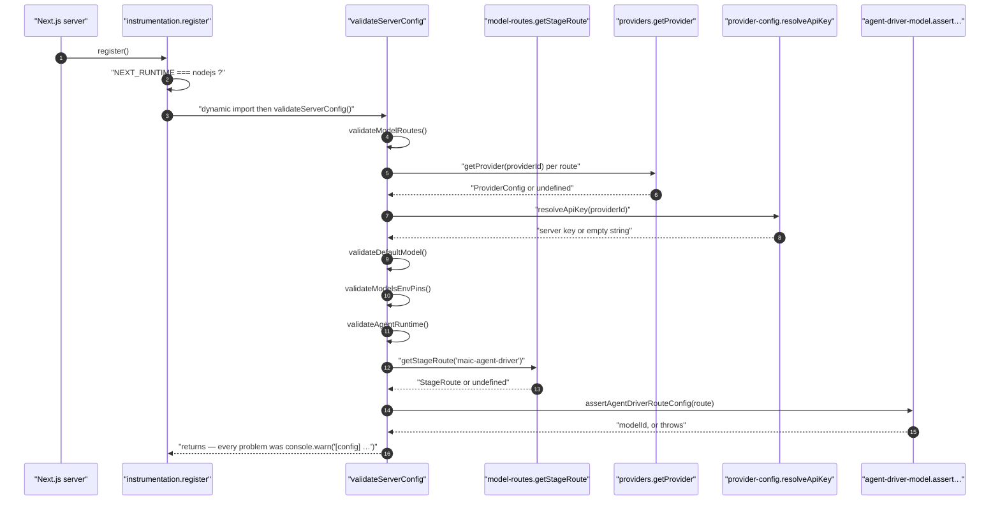
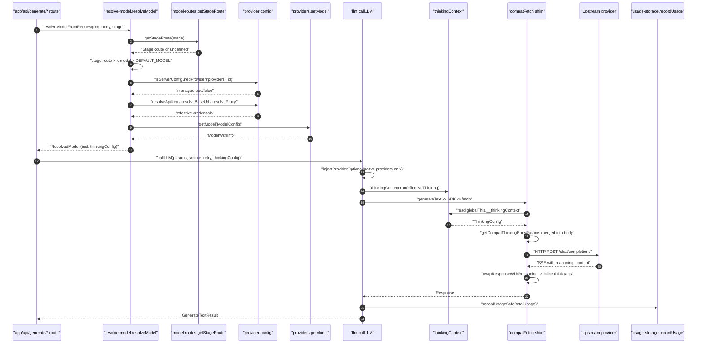
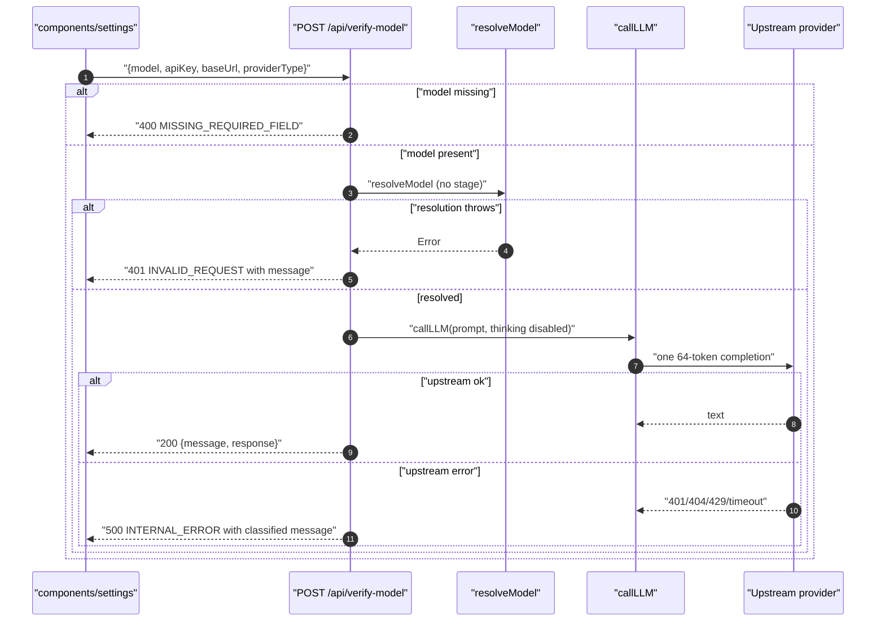
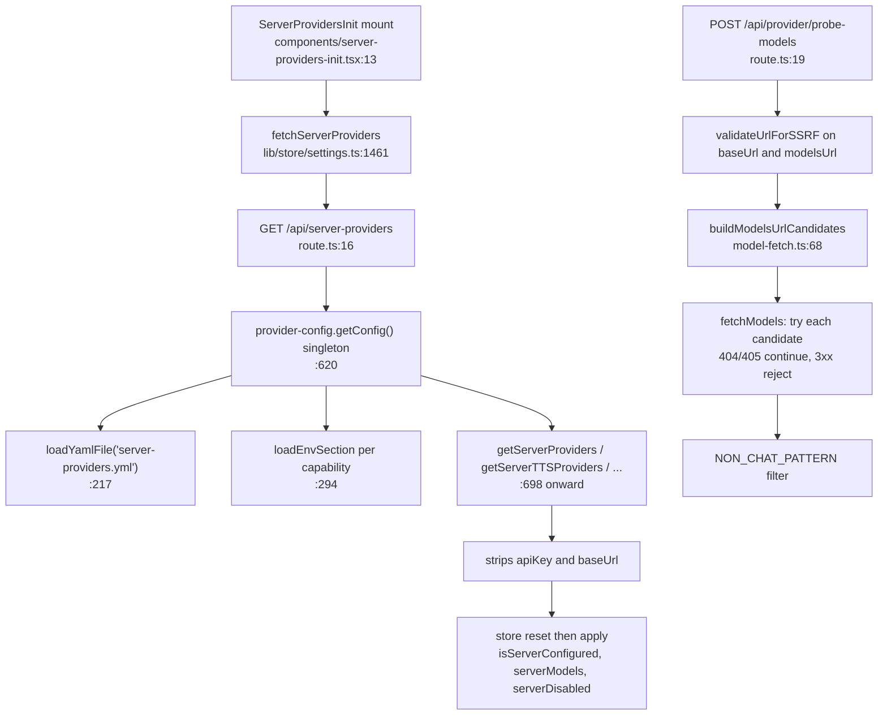

# Traced End-to-End Flows

Four flows, each traced by reading the call sites in order. Function names are
real; line numbers cite the definition or the call.

---

## Flow A — Boot-time config validation

Runs once per server instance, before the first request.

| # | Hop | Where |
| --- | --- | --- |
| 1 | Next calls `register()` | [`instrumentation.ts:13`](instrumentation.ts#L13) |
| 2 | Bail out unless `NEXT_RUNTIME === 'nodejs'` | [`instrumentation.ts:16`](instrumentation.ts#L16) |
| 3 | `startAssetCollectorSchedule()` (not this subsystem) | [`instrumentation.ts:21`](instrumentation.ts#L21) |
| 4 | Dynamic `import('@/lib/server/config-validation')` — kept dynamic so the Edge bundle never pulls in `fs`/`js-yaml` | [`instrumentation.ts:26`](instrumentation.ts#L26)–[`:28`](instrumentation.ts#L28) |
| 5 | `validateServerConfig()` | [`lib/server/config-validation.ts:202`](lib/server/config-validation.ts#L202) |
| 6 | `validateModelRoutes()` — `JSON.parse(process.env.MODEL_ROUTES)`; non-JSON → one warning and return | [`config-validation.ts:102`](lib/server/config-validation.ts#L102), [`:109`](lib/server/config-validation.ts#L109) |
| 7 | per key: reject keys not in `LLM_STAGES` | [`config-validation.ts:121`](lib/server/config-validation.ts#L121) |
| 8 | `routeModel(value)` extracts the model string from `"x"` or `{model:"x"}` | [`config-validation.ts:49`](lib/server/config-validation.ts#L49) |
| 9 | `checkModelString(model, …, routed=true)` → `getProvider()` + `resolveApiKey()` | [`config-validation.ts:72`](lib/server/config-validation.ts#L72), [`:84`](lib/server/config-validation.ts#L84), [`:89`](lib/server/config-validation.ts#L89) |
| 10 | `validateDefaultModel()` — same checks, `routed=false` (softer message) | [`config-validation.ts:137`](lib/server/config-validation.ts#L137) |
| 11 | `validateModelsEnvPins()` — for each of the 21 `LLM_ENV_MAP` prefixes, `<PREFIX>_MODELS` set with no key/base URL → warning | [`config-validation.ts:148`](lib/server/config-validation.ts#L148) |
| 12 | `validateAgentRuntime()` — flag off + public workbench flag on → warning; flag on + no `DATABASE_URL` → warning | [`config-validation.ts:177`](lib/server/config-validation.ts#L177), [`:186`](lib/server/config-validation.ts#L186) |
| 13 | `assertAgentDriverRouteConfig(getStageRoute('maic-agent-driver'))` inside try/catch; the thrown message becomes a `[config]` warning | [`config-validation.ts:191`](lib/server/config-validation.ts#L191)–[`:195`](lib/server/config-validation.ts#L195) |
| 14 | Outer try/catch guarantees boot never fails on validation | [`config-validation.ts:208`](lib/server/config-validation.ts#L208) |

---

## Flow B — A generation request resolves a model and calls it

The canonical request path. `stage` is supplied by the route; `x-model` etc. come
from the browser.

| # | Hop | Where |
| --- | --- | --- |
| 1 | Route handler calls `resolveModelFromRequest(req, body, stage)` | [`lib/server/resolve-model.ts:183`](lib/server/resolve-model.ts#L183) |
| 2 | → `resolveModelFromHeaders` reads `x-model`, `x-api-key`, `x-base-url`, `x-provider-type` | [`resolve-model.ts:162`](lib/server/resolve-model.ts#L162)–`:174` |
| 3 | `getThinkingConfigFromBody(body)` picks `thinkingConfig` or legacy `thinking` | [`resolve-model.ts:148`](lib/server/resolve-model.ts#L148) |
| 4 | `resolveModel()`: `getStageRoute(stage)` | [`resolve-model.ts:63`](lib/server/resolve-model.ts#L63) → [`model-routes.ts:253`](lib/server/model-routes.ts#L253) |
| 5 | `loadRoutes()` parses `MODEL_ROUTES` once per process | [`model-routes.ts:214`](lib/server/model-routes.ts#L214) |
| 6 | Precedence: `stageModel \|\| params.modelString \|\| DEFAULT_MODEL`; nothing → throw | [`resolve-model.ts:65`](lib/server/resolve-model.ts#L65)–`:69` |
| 7 | `parseModelString(modelString)` → `{providerId, modelId}`; bare id defaults to `openai` | [`providers.ts:2370`](lib/ai/providers.ts#L2370) |
| 8 | `routed = Boolean(stageModel)`; if routed, client `apiKey`/`baseUrl`/`providerType` are all set to `undefined` | [`resolve-model.ts:78`](lib/server/resolve-model.ts#L78)–`:81` |
| 9 | `isServerConfiguredProvider('providers', providerId)` → `managed` | [`provider-config.ts:646`](lib/server/provider-config.ts#L646) |
| 10 | `getProvider(providerId)?.type` vs client `providerType`; mismatch → throw | [`resolve-model.ts:88`](lib/server/resolve-model.ts#L88)–`:97` |
| 11 | Bedrock guard: `providerType === 'bedrock'` requires `providerId === 'bedrock'` **and** `managed` | [`resolve-model.ts:101`](lib/server/resolve-model.ts#L101) |
| 12 | `clientBaseUrl = managed ? undefined : …`; if present and `NODE_ENV === 'production'`, `validateUrlForSSRF` | [`resolve-model.ts:104`](lib/server/resolve-model.ts#L104)–`:110` |
| 13 | `resolveApiKey` / `resolveBaseUrl` / `resolveProxy` | [`provider-config.ts:725`](lib/server/provider-config.ts#L725), [`:730`](lib/server/provider-config.ts#L730), [`:735`](lib/server/provider-config.ts#L735) |
| 14 | `getServerModelInfo(providerId, modelId)` — operator-declared capabilities | [`provider-config.ts:709`](lib/server/provider-config.ts#L709) |
| 15 | `getModel({providerId, modelId, apiKey, baseUrl, proxy, providerType, modelInfo})` | [`providers.ts:2033`](lib/ai/providers.ts#L2033) |
| 16 | key check, base-URL resolution, `switch(providerType)` → SDK client | [`providers.ts:2054`](lib/ai/providers.ts#L2054), [`:2062`](lib/ai/providers.ts#L2062), [`:2069`](lib/ai/providers.ts#L2069) |
| 17 | For compat transports, install `compatFetch` and wrap in `extractReasoningMiddleware` | [`providers.ts:2206`](lib/ai/providers.ts#L2206), [`:2225`](lib/ai/providers.ts#L2225) |
| 18 | Merge operator `modelInfo` over the catalog entry | [`providers.ts:2322`](lib/ai/providers.ts#L2322) |
| 19 | Thinking arbitration: routed → `stageRoute.thinking`; unrouted → client `thinkingConfig` | [`resolve-model.ts:132`](lib/server/resolve-model.ts#L132) |
| 20 | Route calls `callLLM(params, source, retryOptions, thinkingConfig)` | [`lib/ai/llm.ts:325`](lib/ai/llm.ts#L325) |
| 21 | `effectiveThinking = thinking ?? getGlobalThinkingConfig()` (`LLM_THINKING_DISABLED`) | [`llm.ts:342`](lib/ai/llm.ts#L342), [`:99`](lib/ai/llm.ts#L99) |
| 22 | `injectProviderOptions` → `buildThinkingProviderOptions` for native providers only | [`llm.ts:247`](lib/ai/llm.ts#L247), [`:140`](lib/ai/llm.ts#L140) |
| 23 | `thinkingContext.run(effectiveThinking, () => generateText(...))` | [`llm.ts:348`](lib/ai/llm.ts#L348) |
| 24 | Inside the SDK's fetch, `compatFetch` reads `globalThis.__thinkingContext` and merges vendor body params | [`providers.ts:2103`](lib/ai/providers.ts#L2103), [`:2113`](lib/ai/providers.ts#L2113) |
| 25 | Response passes through `wrapResponseWithReasoning` (streaming) | [`providers.ts:2164`](lib/ai/providers.ts#L2164) → [`reasoning-sse.ts:164`](lib/ai/reasoning-sse.ts#L164) |
| 26 | `recordUsageSafe(result.totalUsage ?? result.usage, buildUsageMeta(...))` — before validation | [`llm.ts:361`](lib/ai/llm.ts#L361), [`:287`](lib/ai/llm.ts#L287) |
| 27 | `normalizeUsage` + `recordUsage` append one JSONL line | [`usage/normalize.ts:30`](lib/usage/normalize.ts#L30), [`usage-storage.ts:89`](lib/server/usage-storage.ts#L89) |

---

## Flow C — `verify-model` handshake from the settings UI

| # | Hop | Where |
| --- | --- | --- |
| 1 | Browser POSTs `{model, apiKey, baseUrl, providerType}` | [`app/api/verify-model/route.ts:11`](app/api/verify-model/route.ts#L11)–[`:13`](app/api/verify-model/route.ts#L13) |
| 2 | Missing `model` → `apiError('MISSING_REQUIRED_FIELD', 400, …)` | [`verify-model/route.ts:16`](app/api/verify-model/route.ts#L16) |
| 3 | `resolveModel({modelString: model, apiKey, baseUrl, providerType})` — **no `stage`**, so no route can shadow the user's choice | [`verify-model/route.ts:22`](app/api/verify-model/route.ts#L22) |
| 4 | Any resolution error → HTTP **401** with the raw message | [`verify-model/route.ts:30`](app/api/verify-model/route.ts#L30)–[`:34`](app/api/verify-model/route.ts#L34) |
| 5 | `callLLM({model, prompt: 'Say "OK" if you can hear me.', maxOutputTokens: 64}, 'verify-model', undefined, {mode:'disabled', enabled:false})` | [`verify-model/route.ts:39`](app/api/verify-model/route.ts#L39)–[`:48`](app/api/verify-model/route.ts#L48) |
| 6 | Thinking forced off, so `getCompatThinkingBodyParams` emits the disable shape for the model's adapter | [`providers.ts:1618`](lib/ai/providers.ts#L1618) onward |
| 7 | Success → `apiSuccess({message:'Connection successful', response: text})` | [`verify-model/route.ts:50`](app/api/verify-model/route.ts#L50) |
| 8 | Failure → string-matched classification: `401`/`Unauthorized`, `404`/`not found`, `429`, `ENOTFOUND`/`ECONNREFUSED`, `timeout`, else raw message | [`verify-model/route.ts:60`](app/api/verify-model/route.ts#L60)–[`:72`](app/api/verify-model/route.ts#L72) |
| 9 | Always HTTP 500 on the failure branch, regardless of the classified cause | [`verify-model/route.ts:75`](app/api/verify-model/route.ts#L75) |

Note the asymmetry: a *resolution* failure is 401, an *upstream* failure is 500
even when the classified cause is "API key is invalid".

---

## Flow D — Model discovery (`probe-models`) and the server-providers merge

Two related flows the settings UI runs together: discover what a gateway serves,
and learn what the operator manages.

### D1 — `probe-models`

| # | Hop | Where |
| --- | --- | --- |
| 1 | POST `{baseUrl, apiKey?, modelsUrl?}` | [`app/api/provider/probe-models/route.ts:22`](app/api/provider/probe-models/route.ts#L22) |
| 2 | Missing `baseUrl` → 400 | [`probe-models/route.ts:28`](app/api/provider/probe-models/route.ts#L28) |
| 3 | `validateUrlForSSRF` on **both** `baseUrl` and `modelsUrl` | [`probe-models/route.ts:33`](app/api/provider/probe-models/route.ts#L33)–[`:36`](app/api/provider/probe-models/route.ts#L36) |
| 4 | `fetchModels(baseUrl, apiKey, {modelsUrlOverride})` | [`lib/server/model-fetch.ts:114`](lib/server/model-fetch.ts#L114) |
| 5 | `buildModelsUrlCandidates` — override, or version-segment/compat-suffix candidates, deduped | [`model-fetch.ts:68`](lib/server/model-fetch.ts#L68) |
| 6 | Per candidate: 15 s-timeout GET with `redirect: 'manual'`; 3xx → throw; 404/405 → next candidate; other non-2xx → throw with body prefix | [`model-fetch.ts:121`](lib/server/model-fetch.ts#L121)–[`:149`](lib/server/model-fetch.ts#L149) |
| 7 | 2xx → map `data[].id`/`owned_by`, sort by id | [`model-fetch.ts:136`](lib/server/model-fetch.ts#L136)–[`:141`](lib/server/model-fetch.ts#L141) |
| 8 | All candidates exhausted → `ModelFetchError(404, 'No /models endpoint found (tried: …)')` | [`model-fetch.ts:152`](lib/server/model-fetch.ts#L152) |
| 9 | Route filters ids through `NON_CHAT_PATTERN` (tts/asr/whisper/embedding/rerank/mineru/image/video/voxcpm/moderation) | [`probe-models/route.ts:10`](app/api/provider/probe-models/route.ts#L10), [`:39`](app/api/provider/probe-models/route.ts#L39) |
| 10 | Returns `{models, total, filtered}`; `ModelFetchError` mapped 3xx→403, 401/403→401, 404→404, else 502 | [`probe-models/route.ts:41`](app/api/provider/probe-models/route.ts#L41)–[`:58`](app/api/provider/probe-models/route.ts#L58) |

The 404 mapping is a deliberate protocol: the UI reads it as "this provider has
no model list, fall back to manual entry" ([`probe-models/route.ts:55`](app/api/provider/probe-models/route.ts#L55)).

### D2 — server-providers merge into the client store

| # | Hop | Where |
| --- | --- | --- |
| 1 | `ServerProvidersInit` fires on mount | [`components/server-providers-init.tsx:13`](components/server-providers-init.tsx#L13) |
| 2 | `fetchServerProviders()` GETs `/api/server-providers` | [`lib/store/settings.ts:1461`](lib/store/settings.ts#L1461), [`:1463`](lib/store/settings.ts#L1463) |
| 3 | Route calls the seven `getServer*Providers()` plus `getParallelSceneConcurrency()` | [`app/api/server-providers/route.ts:18`](app/api/server-providers/route.ts#L18)–[`:28`](app/api/server-providers/route.ts#L28) |
| 4 | Response carries **only** provider ids, allowed model lists, and `disabled` flags — no keys, no base URLs | [`provider-config.ts:698`](lib/server/provider-config.ts#L698), and the client-side type at [`settings.ts:1469`](lib/store/settings.ts#L1469)–`:1478` |
| 5 | Store resets `isServerConfigured: false` / `serverModels: undefined` on every provider first | [`settings.ts:1484`](lib/store/settings.ts#L1484)–`:1493` |
| 6 | For each server provider, sets `isServerConfigured: true`, `serverModels`, and filters the visible model list to the server's allowlist while preserving names/capabilities from the built-in catalog | [`settings.ts:1495`](lib/store/settings.ts#L1495)–`:1529` |
| 7 | Same reset-then-apply for TTS/ASR/PDF/image/video/webSearch, where a `disabled` entry sets `serverDisabled` and is **not** treated as managed | [`settings.ts:1532`](lib/store/settings.ts#L1532)–`:1545` |

---

## Flow E — Agent driver model resolution (the strict path)

Included because it is the one caller that refuses to fall back.

| # | Hop | Where |
| --- | --- | --- |
| 1 | `resolveAgentDriverModel()` | [`lib/server/agent-runtime/agent-driver-model.ts:83`](lib/server/agent-runtime/agent-driver-model.ts#L83) |
| 2 | `getStageRoute('maic-agent-driver')` | [`agent-driver-model.ts:91`](lib/server/agent-runtime/agent-driver-model.ts#L91) |
| 3 | `assertAgentDriverRouteConfig(route)` — throws on missing route, bare model id, `thinking.effort` set, or non-OpenAI pi api | [`agent-driver-model.ts:92`](lib/server/agent-runtime/agent-driver-model.ts#L92), contract at [`:14`](lib/server/agent-runtime/agent-driver-model.ts#L14)–[`:45`](lib/server/agent-runtime/agent-driver-model.ts#L45) |
| 4 | `resolveModel({stage: AGENT_DRIVER_STAGE})` — no `modelString`, so `DEFAULT_MODEL` is never consulted for this stage because the route always wins | [`agent-driver-model.ts:93`](lib/server/agent-runtime/agent-driver-model.ts#L93) |
| 5 | `buildPiDriverModel(connection, route.api, route.contextWindow)` | [`agent-driver-model.ts:97`](lib/server/agent-runtime/agent-driver-model.ts#L97) → [`:48`](lib/server/agent-runtime/agent-driver-model.ts#L48) |
| 6 | `contextWindow = route.contextWindow ?? modelInfo.contextWindow ?? 128_000` | [`agent-driver-model.ts:73`](lib/server/agent-runtime/agent-driver-model.ts#L73) |
| 7 | `maxTokens = modelInfo.outputWindow ?? 8192`; `wireMaxOutputTokens` stays `undefined` when the catalog has no output window so 8192 never becomes an API cap | [`agent-driver-model.ts:78`](lib/server/agent-runtime/agent-driver-model.ts#L78), [`:94`](lib/server/agent-runtime/agent-driver-model.ts#L94), [`:99`](lib/server/agent-runtime/agent-driver-model.ts#L99) |
