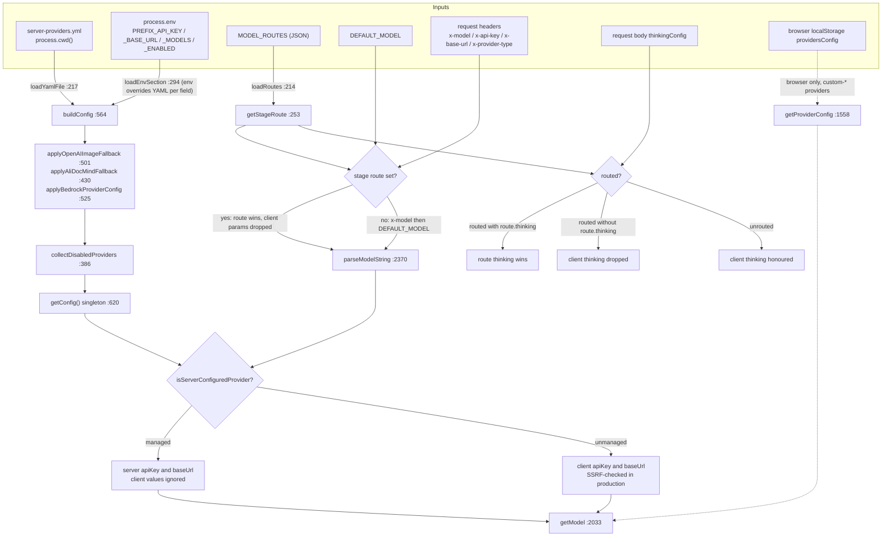
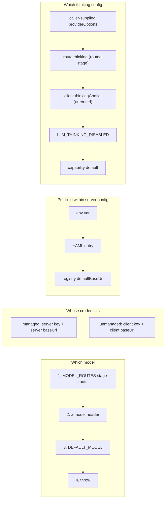

# Dependencies and Configuration

## External npm dependencies

Versions read from `package.json` at the cited line.

| Package | Version | Used for | Evidence |
| --- | --- | --- | --- |
| `ai` | `^6.0.168` | `generateText`, `streamText`, `wrapLanguageModel`, `extractReasoningMiddleware`, `APICallError`, `RetryError`, `LanguageModelUsage` | [`package.json:89`](package.json#L89); imports at [`lib/ai/llm.ts:7`](lib/ai/llm.ts#L7), [`lib/ai/providers.ts:34`](lib/ai/providers.ts#L34), [`lib/server/llm-error-response.ts:1`](lib/server/llm-error-response.ts#L1) |
| `@ai-sdk/openai` | `^3.0.84` | `createOpenAI` — 15 of 19 providers | [`package.json:40`](package.json#L40); [`lib/ai/providers.ts:29`](lib/ai/providers.ts#L29) |
| `@ai-sdk/anthropic` | `^3.0.71` | `createAnthropic` — `anthropic`, `minimax` | [`package.json:37`](package.json#L37); [`lib/ai/providers.ts:31`](lib/ai/providers.ts#L31) |
| `@ai-sdk/google` | `^3.0.64` | `createGoogleGenerativeAI` | [`package.json:39`](package.json#L39); [`lib/ai/providers.ts:33`](lib/ai/providers.ts#L33) |
| `@ai-sdk/azure` | `^3.0.88` | `createAzure` | [`package.json:38`](package.json#L38); [`lib/ai/providers.ts:30`](lib/ai/providers.ts#L30) |
| `@ai-sdk/amazon-bedrock` | `^4.0.103` | `createAmazonBedrock` | [`package.json:36`](package.json#L36); [`lib/ai/providers.ts:32`](lib/ai/providers.ts#L32) |
| `@aws-sdk/credential-providers` | `^3.1045.0` | `fromNodeProviderChain()` for Bedrock; **dynamically imported** so it stays out of the client bundle | [`package.json:47`](package.json#L47); [`lib/ai/providers.ts:1794`](lib/ai/providers.ts#L1794) |
| `undici` | `7.29.0` | `ProxyAgent` + `fetch` for the Google proxy path; dynamically imported with `webpackIgnore` | [`package.json:162`](package.json#L162); [`lib/ai/providers.ts:2295`](lib/ai/providers.ts#L2295)–[`:2296`](lib/ai/providers.ts#L2296) |
| `js-yaml` | `4.3.0` | parse `server-providers.yml` | [`package.json:107`](package.json#L107); [`lib/server/provider-config.ts:10`](lib/server/provider-config.ts#L10) |
| `zod` | `^4.3.5` | operator-declared model-capability schema | [`package.json:165`](package.json#L165); [`lib/server/provider-capability-schema.ts:1`](lib/server/provider-capability-schema.ts#L1) |
| `@earendil-works/pi-ai` | `0.78.0` (pinned) | `Api` / `Model` types for the agent driver | [`package.json:53`](package.json#L53); [`lib/server/agent-runtime/agent-driver-model.ts:1`](lib/server/agent-runtime/agent-driver-model.ts#L1) |

Node builtins used: `fs` + `path` ([`lib/server/provider-config.ts:8`](lib/server/provider-config.ts#L8)–[`:9`](lib/server/provider-config.ts#L9),
[`lib/server/usage-storage.ts:1`](lib/server/usage-storage.ts#L1)–[`:2`](lib/server/usage-storage.ts#L2)), `node:async_hooks`
([`lib/ai/thinking-context.ts:15`](lib/ai/thinking-context.ts#L15)).

## SaaS / infrastructure dependencies

| Dependency | Kind | Reached from |
| --- | --- | --- |
| OpenAI API (`https://api.openai.com/v1`) | saas-api | [`lib/ai/providers.ts:80`](lib/ai/providers.ts#L80) |
| Anthropic API (`https://api.anthropic.com/v1`) | saas-api | [`lib/ai/providers.ts:268`](lib/ai/providers.ts#L268) |
| Google Generative Language API (`https://generativelanguage.googleapis.com/v1beta`) | saas-api | [`lib/ai/providers.ts:488`](lib/ai/providers.ts#L488) |
| Amazon Bedrock (region-resolved) | infrastructure | [`lib/ai/providers.ts:2276`](lib/ai/providers.ts#L2276), region at [`:1773`](lib/ai/providers.ts#L1773) |
| Azure OpenAI / Azure AI Foundry | saas-api | [`lib/ai/providers.ts:219`](lib/ai/providers.ts#L219), URL normalization [`lib/ai/azure.ts:9`](lib/ai/azure.ts#L9) |
| Atlas Cloud (`https://api.atlascloud.ai/v1`) | saas-api | [`lib/ai/providers.ts:231`](lib/ai/providers.ts#L231) |
| Zhipu GLM (`open.bigmodel.cn` / `api.z.ai`) | saas-api | [`lib/ai/providers.ts:626`](lib/ai/providers.ts#L626)–[`:630`](lib/ai/providers.ts#L630) |
| Tencent Hunyuan (`tokenhub.tencentmaas.com`) | saas-api | [`lib/ai/providers.ts:1376`](lib/ai/providers.ts#L1376) |
| MiniMax Anthropic-compat (`api.minimaxi.com/anthropic/v1`) | saas-api | [`lib/config/token-plan-presets.ts:89`](lib/config/token-plan-presets.ts#L89); suffix forced at [`lib/ai/providers.ts:1755`](lib/ai/providers.ts#L1755) |
| Volcengine Ark Agent Plan (`ark.cn-beijing.volces.com/api/plan/v3`) | saas-api | [`lib/config/token-plan-presets.ts:148`](lib/config/token-plan-presets.ts#L148) |
| Ollama (`http://localhost:11434/v1`) | infrastructure | [`lib/ai/providers.ts:1508`](lib/ai/providers.ts#L1508) |
| Lemonade (`http://localhost:13305/v1`) | infrastructure | [`lib/ai/providers.ts:1540`](lib/ai/providers.ts#L1540) |
| Local filesystem `data/usage/*.jsonl` | infrastructure | [`lib/server/usage-storage.ts:10`](lib/server/usage-storage.ts#L10) |
| `server-providers.yml` in `process.cwd()` | infrastructure | [`lib/server/provider-config.ts:219`](lib/server/provider-config.ts#L219), [`:417`](lib/server/provider-config.ts#L417) |

Qwen/DeepSeek/Kimi/SiliconFlow/Doubao/OpenRouter/Grok/Xiaomi base URLs are also
in the registry between [`lib/ai/providers.ts:622`](lib/ai/providers.ts#L622) and [`:1550`](lib/ai/providers.ts#L1550); they are omitted
from the table for length.

## Configuration resolution



## Environment variables

### Static, named in code

| Variable | Required | Effect | Evidence |
| --- | --- | --- | --- |
| `DEFAULT_MODEL` | no (but see note) | Last-resort model string. Without it *and* without a stage route *and* without `x-model`, `resolveModel` throws. | [`lib/server/resolve-model.ts:65`](lib/server/resolve-model.ts#L65); validated [`lib/server/config-validation.ts:138`](lib/server/config-validation.ts#L138) |
| `MODEL_ROUTES` | no | JSON object mapping one of the 20 `LLM_STAGES` to `"provider:model"` or `{model, api?, dialect?, contextWindow?, thinking?}`. Invalid JSON is logged and ignored. | [`lib/server/model-routes.ts:218`](lib/server/model-routes.ts#L218); example in the header [`:15`](lib/server/model-routes.ts#L15) |
| `LLM_THINKING_DISABLED` | no | Exactly `'true'` forces `{mode:'disabled', enabled:false}` on every call that does not pass its own thinking config. | [`lib/ai/llm.ts:100`](lib/ai/llm.ts#L100) |
| `OPENAI_COMPAT_USE_STREAMING_CHAT` | no | Exactly `'true'` makes the `openai` slot with a custom base URL route non-streaming requests through `fetchCustomOpenAIChat`. | [`lib/ai/providers.ts:1842`](lib/ai/providers.ts#L1842) |
| `BEDROCK_REGION` | no | First choice for the Bedrock region. | [`lib/ai/providers.ts:1775`](lib/ai/providers.ts#L1775) |
| `AWS_REGION` | no | Second choice for the Bedrock region. | [`lib/ai/providers.ts:1776`](lib/ai/providers.ts#L1776) |
| `AWS_DEFAULT_REGION` | no | Third choice; final fallback is the literal `us-east-1`. | [`lib/ai/providers.ts:1777`](lib/ai/providers.ts#L1777)–[`:1778`](lib/ai/providers.ts#L1778) |
| `AWS_BEARER_TOKEN_BEDROCK` | no | Its mere presence activates the `bedrock` server-provider entry. | [`lib/server/provider-config.ts:543`](lib/server/provider-config.ts#L543) |
| `BEDROCK_API_KEY` / `BEDROCK_BASE_URL` / `BEDROCK_MODELS` | no | Same as any `<PREFIX>_*` but also trigger Bedrock activation. | [`lib/server/provider-config.ts:534`](lib/server/provider-config.ts#L534)–[`:537`](lib/server/provider-config.ts#L537) |
| `OPENAI_API_KEY` | no | Also used as a standalone fallback to light up the `openai-image` provider. | [`lib/server/provider-config.ts:507`](lib/server/provider-config.ts#L507) |
| `OPENAI_BASE_URL` | no | Fallback base URL for the `openai-image` provider. | [`lib/server/provider-config.ts:514`](lib/server/provider-config.ts#L514) |
| `IMAGE_OPENAI_BASE_URL` | no | Preferred base URL for `openai-image` before `OPENAI_BASE_URL`. | [`lib/server/provider-config.ts:514`](lib/server/provider-config.ts#L514) |
| `ALIDOCMIND_ACCESS_KEY_ID` / `ALIDOCMIND_ACCESS_KEY_SECRET` | no | AK/SK pair; both required for AliDocMind to count as server-managed. | [`lib/server/provider-config.ts:435`](lib/server/provider-config.ts#L435)–[`:437`](lib/server/provider-config.ts#L437) |
| `ALIDOCMIND_BASE_URL` | no | Endpoint fallback for AliDocMind. | [`lib/server/provider-config.ts:457`](lib/server/provider-config.ts#L457) |
| `TTS_QWEN_VOICE_CLONE_MODEL` | no | Server-only override of the Qwen voice-clone model. | [`lib/server/provider-config.ts:786`](lib/server/provider-config.ts#L786) |
| `PARALLEL_SCENE_CONCURRENCY` | no | Integer clamped to `[0,10]`; `0` keeps serial generation. Published to the client via `/api/server-providers`. | [`lib/server/provider-config.ts:1113`](lib/server/provider-config.ts#L1113)–[`:1115`](lib/server/provider-config.ts#L1115) |
| `DATABASE_URL` | no | Not consumed by this layer, but boot validation warns when the agent runtime flag is on without it. | [`lib/server/config-validation.ts:186`](lib/server/config-validation.ts#L186); [`lib/config/feature-flags.ts:24`](lib/config/feature-flags.ts#L24) |
| `OPENMAIC_AGENT_RUNTIME_ENABLED` | no | Server-only agent-runtime gate; when on, the `maic-agent-driver` route contract is enforced at boot. | [`lib/config/feature-flags.ts:19`](lib/config/feature-flags.ts#L19); [`lib/server/config-validation.ts:178`](lib/server/config-validation.ts#L178) |
| `NEXT_PUBLIC_PRO_WORKBENCH_ENABLED` | no | Build-time workbench flag; on without the server flag produces a boot warning. | [`lib/config/feature-flags.ts:33`](lib/config/feature-flags.ts#L33); [`lib/server/config-validation.ts:180`](lib/server/config-validation.ts#L180) |
| `NODE_ENV` | set by Next | `'production'` enables SSRF validation of client base URLs; `'test'` suppresses usage writes. | [`lib/server/resolve-model.ts:105`](lib/server/resolve-model.ts#L105); [`lib/server/usage-storage.ts:100`](lib/server/usage-storage.ts#L100) |
| `NEXT_RUNTIME` | set by Next | `register()` returns early unless `'nodejs'`, so boot validation never runs on Edge. | [`instrumentation.ts:16`](instrumentation.ts#L16) |
| `VITEST` | set by Vitest | Suppresses usage-log writes unless an explicit `baseDir` is passed. | [`lib/server/usage-storage.ts:100`](lib/server/usage-storage.ts#L100) |

### Dynamic, built from a prefix

`loadEnvSection` reads three variables per prefix
([`lib/server/provider-config.ts:336`](lib/server/provider-config.ts#L336)–[`:338`](lib/server/provider-config.ts#L338)) and
`collectDisabledProviders` reads a fourth (`:402`):

- `<PREFIX>_API_KEY` — activates the provider (managed).
- `<PREFIX>_BASE_URL` — overrides the base URL; for keyless providers it alone
  activates the provider (`:360`).
- `<PREFIX>_MODELS` — comma-separated allowlist; **first entry is the managed
  default** for TTS/ASR/image/video/web-search model resolution.
- `<CAP>_<PREFIX>_ENABLED` — force-off switch, only for `tts`, `asr`, `image`,
  `video`, `webSearch` (`DISABLE_ENV_MAPS`, `:175`). LLM and PDF are excluded by
  design (`:162`).

LLM prefixes (`LLM_ENV_MAP`, [`lib/server/provider-config.ts:73`](lib/server/provider-config.ts#L73)) — 21 prefixes
for 19 provider ids:

```
OPENAI → openai              AZURE_OPENAI → azure
ATLASCLOUD → atlascloud      ANTHROPIC → anthropic
GOOGLE → google              DEEPSEEK → deepseek
QWEN → qwen                  KIMI → kimi
MINIMAX → minimax            GLM → glm
SILICONFLOW → siliconflow    DOUBAO → doubao
OPENROUTER → openrouter      GROK → grok
TENCENT → tencent-hunyuan    TENCENT_HUNYUAN → tencent-hunyuan
XIAOMI → xiaomi              MIMO → xiaomi
OLLAMA → ollama              LEMONADE → lemonade
BEDROCK → bedrock
```

Other sections' prefixes (same `_API_KEY`/`_BASE_URL`/`_MODELS`/`_ENABLED`
grammar): TTS [`lib/server/provider-config.ts:97`](lib/server/provider-config.ts#L97), ASR [`:109`](lib/server/provider-config.ts#L109), PDF [`:117`](lib/server/provider-config.ts#L117),
image `:123`, video `:133`, web search `:142`. Two of those carry a
collision-avoidance note in the source: `WEB_SEARCH_CLAUDE` exists so it does not
clash with `ANTHROPIC_*` (`:148`), and `WEB_SEARCH_DOUBAO` so it does not clash
with the Doubao LLM vars (`:151`).

## `server-providers.yml`

Not present in the repo — `ls .env.example server-providers.yml` returns nothing.
The schema is inferable only from the loader:

```yaml
providers:
  <providerId>:
    apiKey: string
    baseUrl: string
    proxy: string
    models:
      - "plain-model-id"
      - id: "model-with-capabilities"
        vision: true
        thinking: { control: effort, requestAdapter: openai, effortValues: [low, high], defaultEffort: high }
tts:   { <providerId>: { apiKey, baseUrl, models, enabled } }
asr:   { <providerId>: { ... } }
pdf:   { <providerId>: { ..., accessKeyId, accessKeySecret } }
image: { <providerId>: { ... } }
video: { <providerId>: { ... } }
web-search: { <providerId>: { ... } }
```

Evidence: `YamlData` ([`lib/server/provider-config.ts:207`](lib/server/provider-config.ts#L207)), `YAML_SECTION_KEY`
(`:195` — note web search is hyphenated in YAML but camelCase in the config
object), `ServerProviderEntry` (`:30`), and the capability schema
([`lib/server/provider-capability-schema.ts:90`](lib/server/provider-capability-schema.ts#L90)). Only the `providers` section
allows per-model capability objects — `allowModelCapabilities: true` is passed
only there ([`lib/server/provider-config.ts:574`](lib/server/provider-config.ts#L574)).

## Precedence summary



Note on the thinking chain: `injectProviderOptions` returns early if the caller
already set `providerOptions` ([`lib/ai/llm.ts:251`](lib/ai/llm.ts#L251)), and
`effectiveThinking = thinking ?? getGlobalThinkingConfig()`
([`lib/ai/llm.ts:342`](lib/ai/llm.ts#L342)) — so an explicit per-call thinking config *overrides* the
`LLM_THINKING_DISABLED` kill switch rather than being overridden by it.
[`app/api/verify-model/route.ts:47`](app/api/verify-model/route.ts#L47) relies on that.
