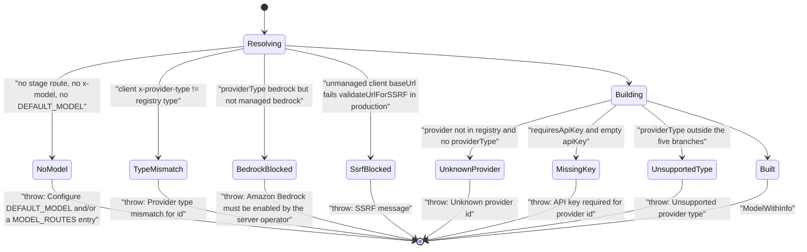
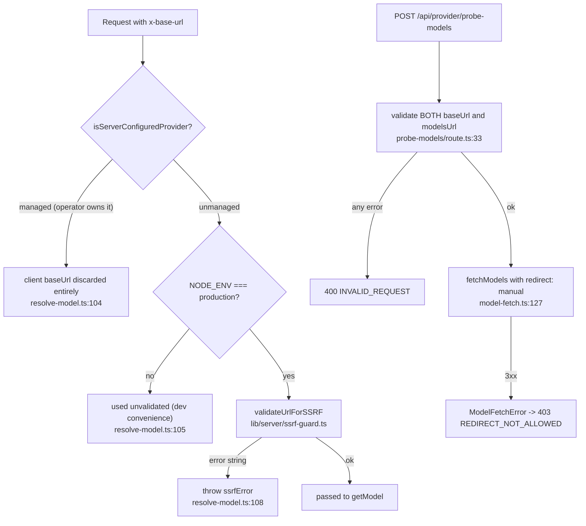

# Failure Modes and Error Handling

## Two distinct error philosophies

The layer applies opposite policies on either side of the request boundary, and
the split is deliberate.

**Boot / config time: warn, never throw.** `validateServerConfig()` wraps every
check in a try/catch and only `console.warn`s
([`lib/server/config-validation.ts:44`](lib/server/config-validation.ts#L44), outer catch at [`:208`](lib/server/config-validation.ts#L208)). The header states
the intent: *"operators with partial config still get a running app, and the
warnings name exactly what is broken"* (`:22`–`:24`). `loadRoutes` similarly logs
and continues on invalid `MODEL_ROUTES` JSON
([`lib/server/model-routes.ts:236`](lib/server/model-routes.ts#L236)–[`:238`](lib/server/model-routes.ts#L238)), `parseThinking` drops individual bad
fields (`:77`), and `loadYamlFile` returns `{}` on any read/parse error
([`lib/server/provider-config.ts:225`](lib/server/provider-config.ts#L225)–[`:228`](lib/server/provider-config.ts#L228)).

**Request time: throw loud, no vendor default.** `resolveModel` throws when
nothing resolves rather than silently picking a model
([`lib/server/resolve-model.ts:66`](lib/server/resolve-model.ts#L66), with the comment at [`:60`](lib/server/resolve-model.ts#L60)–[`:62`](lib/server/resolve-model.ts#L62): *"There is
intentionally no hardcoded model fallback — if nothing resolves we fail loud
rather than silently pick a vendor default."*).

The single exception to "boot warns" is the agent driver:
`assertAgentDriverRouteConfig` throws ([`agent-driver-model.ts:26`](lib/server/agent-runtime/agent-driver-model.ts#L26), [`:37`](lib/server/agent-runtime/agent-driver-model.ts#L37), [`:44`](lib/server/agent-runtime/agent-driver-model.ts#L44),
`:51`), and boot validation catches that throw and downgrades it to a warning
([`config-validation.ts:191`](lib/server/config-validation.ts#L191)–[`:195`](lib/server/config-validation.ts#L195)). At runtime the same assertion is re-run and
*not* caught ([`agent-driver-model.ts:101`](lib/server/agent-runtime/agent-driver-model.ts#L101)), so a bad driver route fails the
request.

## Failure state machine — model resolution

Exact messages and lines:

| Condition | Message | Where |
| --- | --- | --- |
| nothing resolvable | `No model could be resolved. Configure DEFAULT_MODEL (and/or a MODEL_ROUTES entry for this stage), or send a model via x-model.` | [`lib/server/resolve-model.ts:67`](lib/server/resolve-model.ts#L67) |
| provider-type mismatch (resolver) | `Provider type mismatch for ${providerId}: expected ${registeredProviderType}, received ${clientProviderType}.` | [`lib/server/resolve-model.ts:94`](lib/server/resolve-model.ts#L94) |
| provider-type mismatch (factory) | `Provider type mismatch for ${config.providerId}: expected ${provider.type}, received ${providerType}.` | [`lib/ai/providers.ts:2040`](lib/ai/providers.ts#L2040) |
| Bedrock not operator-enabled | `Amazon Bedrock must be enabled by the server operator before it can be used.` | [`lib/server/resolve-model.ts:102`](lib/server/resolve-model.ts#L102) |
| unknown provider, no type hint | `Unknown provider: ${config.providerId}. Please provide providerType.` | [`lib/ai/providers.ts:2049`](lib/ai/providers.ts#L2049) |
| missing key | `API key required for provider: ${config.providerId}` | [`lib/ai/providers.ts:2055`](lib/ai/providers.ts#L2055) |
| unsupported type | `Unsupported provider type: ${providerType}` | [`lib/ai/providers.ts:2318`](lib/ai/providers.ts#L2318) |
| driver route absent | `MODEL_ROUTES must explicitly configure stage "maic-agent-driver" …` | [`agent-driver-model.ts:27`](lib/server/agent-runtime/agent-driver-model.ts#L27) |
| driver bare model id | `… must use a model id with an explicit provider prefix; received …` | [`agent-driver-model.ts:38`](lib/server/agent-runtime/agent-driver-model.ts#L38) |
| driver thinking.effort set | `… must not set thinking.effort because ${modelId} cannot combine reasoning_effort with function tools on this transport.` | [`agent-driver-model.ts:45`](lib/server/agent-runtime/agent-driver-model.ts#L45) |
| driver bad pi api | `… has unsupported pi api/dialect … for model id …` | [`agent-driver-model.ts:51`](lib/server/agent-runtime/agent-driver-model.ts#L51), repeated [`:64`](lib/server/agent-runtime/agent-driver-model.ts#L64) |

## Upstream provider failures

`lib/server/llm-error-response.ts` is the sanitizing translator.
`statusFromError` (`:24`) walks `APICallError.statusCode`, then `RetryError`'s
`lastError` and `errors[]`, then generic `statusCode`/`status`/`status_code`,
then `cause` — with a `seen` set to survive cyclic error graphs (`:25`).
`messageForStatus` (`:49`) emits fixed strings, never the provider's body:

| Upstream status | Client sees |
| --- | --- |
| 401 / 403 | `Upstream authentication or authorization failed.` |
| 404 | `Upstream endpoint not found.` |
| 429 | code `RATE_LIMITED`, `Upstream rate limit reached. Please try again shortly.` |
| ≥ 500 | `Upstream model provider is temporarily unavailable. Please try again.` |
| other 4xx | `Upstream provider rejected the request.` |
| unrecognisable | HTTP 500 `Scene generation failed. Please try again.` |

The docstring is explicit about why (`:59`–`:62`): preserve HTTP semantics for
client retry classification *without* exposing provider response bodies, URLs, or
credential-adjacent details.

`/api/verify-model` deliberately does **not** use this helper. It string-matches
the error message into a friendlier hint ([`app/api/verify-model/route.ts:60`](app/api/verify-model/route.ts#L60)–[`:72`](app/api/verify-model/route.ts#L72))
and returns HTTP 500 in every upstream-failure case (`:75`) — including the
"API key is invalid or expired" case, which a caller might reasonably expect as
401. The resolution-failure branch, by contrast, returns 401 with the raw
message (`:30`–`:34`).

## Retry behaviour

Two independent retry layers:

1. **SDK-level**, `maxRetries`, handled inside `ai` for network/5xx. Not
   configured by this layer; noted in [`lib/ai/llm.ts:266`](lib/ai/llm.ts#L266).
2. **Validation-level**, `LLMRetryOptions` ([`lib/ai/llm.ts:268`](lib/ai/llm.ts#L268)). Default
   `retries: 0` means no retry at all. When `retries > 0` the default validator
   is `text.trim().length > 0` (`:276`). Every attempt that reaches a response is
   recorded to the usage log **before** validation (`:361`), with the explicit
   comment that recording only on success would drop billed-but-rejected
   attempts. After exhausting attempts it returns the last result if there was
   one, else re-throws the last error (`:384`–`:385`).

`streamLLM` has no retry loop.

## Silent-degradation paths

These are the ones to know about because nothing surfaces to the user.

```mermaid
flowchart TD
  a["Invalid MODEL_ROUTES JSON"] -->|"log.error, routes = {}"| a2["silently falls back to DEFAULT_MODEL<br/>model-routes.ts:237"]
  b["Unknown stage key in MODEL_ROUTES"] -->|log.warn| b2["route ignored; stage uses DEFAULT_MODEL<br/>model-routes.ts:225"]
  c["Bad thinking field in a route"] -->|log.warn| c2["field dropped, rest of route kept<br/>model-routes.ts:85"]
  d["server-providers.yml unreadable"] -->|log.warn| d2["treated as absent; every provider becomes unmanaged<br/>provider-config.ts:226"]
  e["Invalid model capability declaration"] -->|log.warn| e2["that declaration dropped<br/>provider-config.ts:269"]
  f["Capability declared for a model not in PREFIX_MODELS"] -->|log.warn| f2["declaration discarded<br/>provider-config.ts:286"]
  g["compatFetch body JSON.parse fails"] -->|"empty catch"| g2["thinking params silently not injected<br/>providers.ts:2127"]
  h["Kimi reasoning restore JSON.parse fails"] -->|"empty catch"| h2["reasoning markers stay in the text<br/>providers.ts:2143"]
  i["MiniMax disable-thinking JSON.parse fails"] -->|"empty catch"| i2["thinking stays enabled<br/>providers.ts:2261"]
  j["Non-JSON SSE line in fetchCustomOpenAIChat"] -->|"comment: ignore and continue"| j2["that chunk's content is lost<br/>providers.ts:1995"]
  k["Unparseable SSE line in wrapResponseWithReasoning"] -->|"catch, pass through"| k2["line forwarded verbatim<br/>reasoning-sse.ts:178"]
  l["recordUsage throws (disk full, EACCES)"] -->|log.warn| l2["usage row lost, generation unaffected<br/>usage-storage.ts:133"]
  m["Usage capture import fails"] -->|log.warn| m2["'Usage capture failed (ignored)'<br/>llm.ts:312"]
  n["Malformed line in usage jsonl"] -->|"silent skip"| n2["row excluded from aggregation<br/>usage-storage.ts:205"]
  o["Provider registry lookup misses on client"] -->|"log.error"| o2["getProviderConfig returns null<br/>providers.ts:1584"]
```

The three empty `catch { /* leave body as-is */ }` blocks in `getModel`'s fetch
shims ([`lib/ai/providers.ts:2127`](lib/ai/providers.ts#L2127), [`:2143`](lib/ai/providers.ts#L2143), [`:2261`](lib/ai/providers.ts#L2261)) are the most consequential:
if the request body were ever not valid JSON, thinking control would be silently
dropped and the model would reason (or not) against the operator's intent with no
log line at all. In practice the body is produced by the AI SDK and is always
JSON, so this is a latent rather than live failure.

## SSRF and credential-boundary failures

Two asymmetries worth flagging:

- [`resolve-model.ts:105`](lib/server/resolve-model.ts#L105) gates SSRF validation on `NODE_ENV === 'production'`.
  The same gate appears in [`verify-image-provider/route.ts:57`](app/api/verify-image-provider/route.ts#L57),
  [`verify-video-provider/route.ts:52`](app/api/verify-video-provider/route.ts#L52) and [`verify-pdf-provider/route.ts:58`](app/api/verify-pdf-provider/route.ts#L58).
  [`probe-models/route.ts:33`](app/api/provider/probe-models/route.ts#L33) validates **unconditionally** — the only route in
  this layer that does.
- `probe-models` sets `redirect: 'manual'` and rejects any 3xx
  ([`lib/server/model-fetch.ts:127`](lib/server/model-fetch.ts#L127), [`:132`](lib/server/model-fetch.ts#L132)). `getModel`'s provider fetches do not
  set `redirect`, so they follow the platform default.

## Failure modes with no handling

| Situation | Consequence | Evidence |
| --- | --- | --- |
| `MODEL_ROUTES` names a valid stage with a model whose provider has no key | Boot warns; the request throws `API key required for provider` at `getModel` time | [`config-validation.ts:91`](lib/server/config-validation.ts#L91); [`providers.ts:2055`](lib/ai/providers.ts#L2055) |
| A `probed` model id no longer exists upstream | 404 from the provider surfaces as `Upstream endpoint not found.`; the stale id stays in the store until the next probe replaces the list wholesale | [`lib/types/provider.ts:152`](lib/types/provider.ts#L152); [`llm-error-response.ts:53`](lib/server/llm-error-response.ts#L53) |
| `data/usage/` not writable | Every usage row silently lost; `/api/usage` reports zeros | [`usage-storage.ts:131`](lib/server/usage-storage.ts#L131)–[`:135`](lib/server/usage-storage.ts#L135) |
| Two providers expose the same bare model id and a caller passes a bare id | `UNIQUE_MODEL_THINKING_MAP` deliberately omits duplicated ids, so thinking capability is not found and no `providerOptions` are injected | [`lib/ai/llm.ts:88`](lib/ai/llm.ts#L88) |
| `custom-*` provider referenced server-side | `getProviderConfig` returns `null` (localStorage is browser-only), so `getModel` requires an explicit `providerType` from the client | [`providers.ts:1565`](lib/ai/providers.ts#L1565), [`:2045`](lib/ai/providers.ts#L2045) |
| Azure deployment name not in any catalog | `azure.models` is `[]` by design, so `modelInfo` is `null` and no capability gating applies | [`providers.ts:224`](lib/ai/providers.ts#L224); [`providers.ts:2335`](lib/ai/providers.ts#L2335) |
| `fetchModels` gets 2xx with a non-`data` body | `body.data ?? []` yields an empty model list, reported as `total: 0` rather than an error | [`model-fetch.ts:138`](lib/server/model-fetch.ts#L138) |
