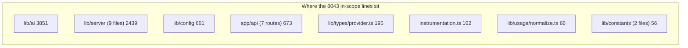
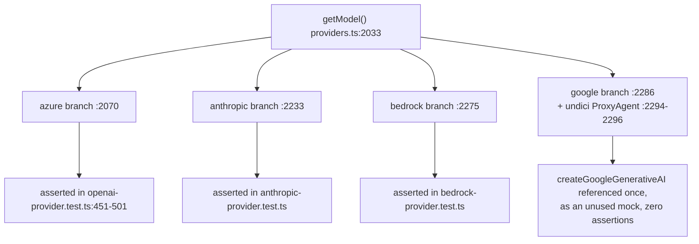

# Quality observations and measured metrics

## Measured metrics

Every number below was produced by the command shown next to it, run from the
repo root at commit `c2c9553a`. The 32-file set is exactly the file inventory in
`00-overview.md`.

| Metric | Value | Command |
| --- | --- | --- |
| Lines across the whole subsystem (32 files) | 8043 | `wc -l lib/ai/*.ts lib/types/provider.ts lib/server/provider-config.ts lib/server/model-routes.ts lib/server/resolve-model.ts lib/server/config-validation.ts lib/server/usage-storage.ts lib/server/model-fetch.ts lib/server/provider-capability-schema.ts lib/server/llm-error-response.ts lib/server/agent-runtime/agent-driver-model.ts lib/config/*.ts lib/usage/normalize.ts lib/constants/agent-defaults.ts lib/constants/generation.ts app/api/server-providers/route.ts app/api/verify-model/route.ts app/api/provider/probe-models/route.ts app/api/usage/route.ts app/api/verify-pdf-provider/route.ts app/api/verify-image-provider/route.ts app/api/verify-video-provider/route.ts instrumentation.ts \| tail -1` |
| Largest module | `lib/ai/providers.ts`, 2420 lines (30.1 % of the layer) | `wc -l lib/ai/providers.ts` |
| Per-directory lines | see mermaid below | same file list, subtotaled per directory with `wc -l <dir's files> \| tail -1` |
| Registered providers in `PROVIDERS` | **19** | node walk of `lib/ai/providers.ts`: slice the `PROVIDERS` object literal by brace-matching, count top-level `key:` lines |
| Model catalog entries across all 19 providers | **104** | same walk, counting lines matching `/^\s{6,8}id:\s*'/` inside the sliced block |
| `THINKING_CAPABILITIES` entries | **104** | node walk of `lib/ai/model-metadata.ts`, counting `getModelMetadataKey(` calls inside the object literal — exact 1:1 with the model count above |
| Explicit `any` (`<any, any>` generic args) | **3**, all in `lib/ai/llm.ts` (`:331`, `:336`, `:402`) | node walk over the 32 files, regex `/:\s*any\b\|as any\b\|<any\|,\s*any>/` |
| `@ts-ignore` / `@ts-expect-error` | **0** | same walk |
| `eslint-disable` lines | **3**, all in `lib/ai/llm.ts`, each immediately above one of the three `any` uses | same walk, `/eslint-disable/` |
| `TODO` / `FIXME` / `XXX` / `HACK` markers | **0** | same walk, `/\bTODO\b\|\bFIXME\b\|\bXXX\b\|\bHACK\b/` |
| Comment lines | 1242 (**15.4 %**) | same walk, `/^(\/\/\|\/\*\|\*)/` on the trimmed line |
| `log.warn` / `log.error` call sites (wrapped logger) | **31** | same walk, `/\blog\.(warn\|error)\(/` |
| Direct `console.warn` / `console.error` call sites | 2 / 6 (**8** total) | same walk, `/console\.(warn\|error)\(/` |
| Test files covering this layer | **30** | see file list below; `wc -l <30 files> \| tail -1` |
| Lines in those test files | **7794** | same command |
| `it(...)` cases in those test files | **388** | node walk of the same 30 files, `/^\s*it(\.skip\|\.only\|\.todo)?\(/m` |
| `LLM_STAGES` routable stages | 20 | verbatim array at [`lib/server/model-routes.ts:131`](lib/server/model-routes.ts#L131) (transcribed in `02b-interfaces-server-and-usage.md`) |

The 30 test files: `tests/lint-llm-entry-guard.test.ts`, `tests/providers/provider-neutrality-guard.test.ts`,
the 13 files under `tests/ai/`, `tests/config/{apply-token-plan,feature-flags,token-plan-apply-persist}.test.ts`,
`tests/server/{provider-config,model-fetch,model-routes,resolve-model,usage-storage,config-validation}.test.ts`,
`tests/usage/{normalize,route}.test.ts`, `tests/api/{probe-models,verify-model,verify-pdf-provider}.test.ts`,
and `tests/agent-runtime/agent-driver-model.test.ts` — the last one lives outside every directory named above
because it tests `lib/server/agent-runtime/agent-driver-model.ts`, which is filed under the agent-runtime pack's
test tree even though the module belongs to this layer.

## Genuine strengths

**A static-analysis test enforces the registry as the single source of vocabulary.**
`tests/providers/provider-neutrality-guard.test.ts` (543 lines) loads the real
TypeScript compiler API and scans every source file for a hardcoded vendor-id
string literal that falls outside seven declared "composition root" registries,
`PROVIDERS` in [`lib/ai/providers.ts:36`](lib/ai/providers.ts#L36) among them. A new call site that writes
`'openai'` directly instead of routing through the catalog fails this test rather
than drifting silently into a second, informal vocabulary.

**The single-LLM-entry-point rule is enforced by ESLint and the rule has an
executable contract test that names its own past failures.** `eslint.config.mjs`
bans `generateText`/`streamText` imports from `ai` outside `lib/ai/llm.ts`,
`eval/**` and `tests/**` (issue #1003). `tests/lint-llm-entry-guard.test.ts` runs
the real ESLint config against in-memory fixtures across 5 bypass forms (named,
namespace, dynamic, dynamic-template, `require`) × 6 extensions, specifically
because review found three real holes in the rule's *scope* — two `@openmaic`
package directories excluded from the dynamic-import ban, and both blocks
matching only `ts,tsx` so a `.js`/`.mjs` file could import the SDK freely. Both
holes were closed and the matrix now pins every combination so narrowing `files`
or adding an `ignores` entry fails the suite instead of quietly reopening the
door.

**The model catalog and the thinking-capability table are declared independently
and land in exact 1:1 correspondence.** 104 model entries in `PROVIDERS`, 104
`THINKING_CAPABILITIES` keys, measured by two unrelated parsers. This is backed
by a second, compile-time mechanism noted in `01b-modules-server.md`: two
`satisfies`-style assertions pin the Zod schema in
`provider-capability-schema.ts` to the hand-written `ThinkingCapability`
interface in both directions, so a field added to one without the other fails
typecheck rather than silently drifting out of sync.

**`any` usage is nearly zero, and the three instances that exist are each
individually justified.** All three are `GenerateTextResult<any, any>` /
`StreamTextResult<any, any>` — the AI SDK's own generic return shape, not a
local type escape — and each is preceded by its own
`eslint-disable-next-line @typescript-eslint/no-explicit-any` rather than a
blanket file-level suppression. Zero `@ts-ignore`, zero `@ts-expect-error`, zero
`TODO`/`FIXME`/`XXX`/`HACK` markers across all 8043 lines.

**The warn-vs-throw philosophy documented in `05-failure-modes.md` is backed by
a real logging footprint, not just a header comment.** 31 `log.warn`/`log.error`
call sites plus 8 direct `console.warn`/`console.error` sites, 39 in total.
`lib/server/model-routes.ts` alone accounts for 14 of the 31 wrapped-logger
calls — the single most defensive-logging-dense file in the layer, which is the
right place for it: it is the module that parses an untrusted `MODEL_ROUTES`
JSON env var and is contractually required to degrade instead of crashing boot.

**Test investment is proportionate to the production code, not token-count
theater.** 388 `it()` cases across 30 files and 7794 lines — a line-for-line
ratio of roughly 0.97:1 against the 8043 production lines. `provider-config.ts`
(1116 lines, the second-largest module) gets the single largest test file in the
set: `provider-config.test.ts` at 1228 lines and 116 `it()` cases, more than a
third of the layer's total test cases for one file that owns YAML+env merge
precedence for seven capability sections.

## Real problems

**1. The `google` transport branch has zero behavioural test coverage — including
the layer's only outbound-proxy code path.** Severity: medium.
`getModel()`'s `google` case ([`lib/ai/providers.ts:2286`](lib/ai/providers.ts#L2286)) calls
`createGoogleGenerativeAI` and, when `config.proxy` is set, wires an `undici`
`ProxyAgent` through a dynamically-imported `fetch` (`:2294`–`:2296`) — this is
the only proxy-egress code in the entire layer. Across all 30 test files
identified above, `createGoogleGenerativeAI` appears exactly once: as an unused
`vi.fn()` inside `tests/ai/atlascloud-provider.test.ts`'s module-mock
boilerplate, needed only so `providers.ts`'s top-level SDK imports resolve
without hitting a real network call. No test constructs a `google` model, and
none exercises the proxy branch at all. Contrast the other three non-`openai`
`ProviderType` branches: `azure` is asserted directly in
[`openai-provider.test.ts:451`](tests/ai/openai-provider.test.ts#L451)–[`:501`](tests/ai/openai-provider.test.ts#L501) (mocked `createAzure`, deployment-name
resolution, base-URL normalization), `anthropic` has its own
`anthropic-provider.test.ts`, and `bedrock` has its own
`bedrock-provider.test.ts`.

**2. `resolveModelFromHeaders` is a dead export.** Severity: low.
Declared and exported at [`lib/server/resolve-model.ts:162`](lib/server/resolve-model.ts#L162), it is one of the
three functions transcribed in `02b-interfaces-server-and-usage.md`. A repo-wide
search (`lib/`, `app/`, `components/`, `tests/`, `packages/`, `scripts/`,
`eval/`) for the identifier `resolveModelFromHeaders` returns exactly one hit —
its own declaration. Every real caller goes through
`resolveModelFromRequest` (`:183`), which wraps it. This was already flagged in
`02b-interfaces-server-and-usage.md` and `14-code-quality/10-duplication-and-dead-code.md`;
this pass re-verified it against the current tree rather than assuming it still
holds.

**3. `verify-image-provider` and `verify-video-provider` each have exactly one
test, and it is the same branch.** Severity: medium — these are user-facing
connectivity checks with real SSRF exposure in the untested paths (see the SSRF
asymmetry note in `05-failure-modes.md`).
`tests/server/capability-force-off-routes.test.ts` is the *only* file in the
repo that imports either route's `POST` handler, and it imports each exactly
once: `"POST /api/verify-image-provider returns 403 for a force-disabled
provider"` (`:194`) and `"POST /api/verify-video-provider returns 403 for a
force-disabled provider"` (`:249`). Neither route has a test for the managed-vs-
unmanaged credential split, the SSRF check in production, a missing-key/model
400, or a successful/failed upstream probe. Compare the sibling routes in the
same family: `verify-model` has 2 cases (`tests/api/verify-model.test.ts`) and
`verify-pdf-provider` has 3, including its managed/unmanaged AK-SK separation
(`tests/api/verify-pdf-provider.test.ts`).

**4. `GET /api/server-providers` — the route every client bootstraps against —
has no test that calls its handler.** Severity: low-medium.
The underlying functions it composes (`getServerProviders`,
`getServerTTSProviders`, …, `getParallelSceneConcurrency`) are extensively
covered by `provider-config.test.ts` (116 `it()` cases). But
`app/api/server-providers/route.ts` itself — which calls all eight of those
functions and assembles one JSON response ([`route.ts:16`](app/api/server-providers/route.ts#L16)–`:28`) — is imported by
zero test files in the repo. A regression in the composition itself (a dropped
section, a renamed key in the response shape) would only surface through manual
QA or the browser settings UI, not the test suite.

**5. The eslint-disable-driven `any` pair in `callLLM`/`streamLLM` is the
layer's only type escape, and it sits at the one boundary every route depends
on.** Severity: low, and arguably the right trade — `GenerateTextResult<T, TOOLS>`
and `StreamTextResult<T, TOOLS>` are generic over tool-call shapes that this
layer's callers do not know statically (`source` is a free-text log label, not a
tool schema). Noted here rather than as a strength because it means the two
functions every generation route calls return a type that TypeScript cannot
narrow for the caller — a caller that destructures `result.toolCalls` gets no
compile-time shape at all, only what `generateText`'s own runtime shape happens
to provide.
