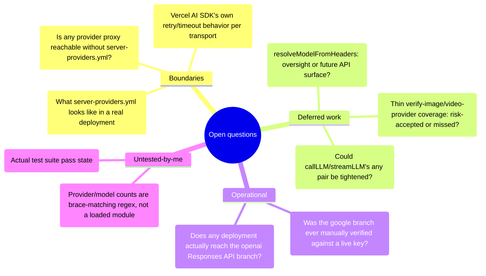

# Open questions

Things this survey could not determine from the code in the working tree, with
what was tried and why it did not resolve.

## Boundary questions (deliberately out of scope, but they gate real answers)

1. **Is the `google` provider's `ProxyAgent` branch reachable in any deployment
   this repo can actually produce?** `getModel()`'s `google` case only sets up
   `undici.ProxyAgent` when `config.proxy` is truthy (`lib/ai/providers.ts:2294`–`:2296`),
   and `config.proxy` traces to exactly one source: `resolveProxy(providerId)`
   (`lib/server/provider-config.ts:735`), which reads
   `getConfig().providers[providerId]?.proxy` — a field that can only be set in
   `server-providers.yml`. That file is confirmed absent from this repo
   (`04-dependencies-and-config.md`), and no component under `components/settings/`
   exposes a per-provider proxy field to the browser (`ModelConfig.proxy` has no
   client-facing setter I could find). So the branch is real code, reachable in
   principle, but this survey cannot show a path that actually reaches it without
   an operator hand-writing YAML this repo does not ship an example of. That same
   YAML gap is why `06-quality-and-metrics.md`'s finding that the branch has zero
   test coverage cannot be separated from "this is genuinely unused" without
   asking an operator whether any real deployment sets `providers.google.proxy`.
2. **The Vercel AI SDK's own retry/timeout/error-shape behavior per transport was
   not read.** `05-failure-modes.md` documents this layer's *handling* of
   `APICallError`/`RetryError` (`llm-error-response.ts`), but not what the `ai`
   package (`^6.0.168`) itself guarantees about retries, backoff, or abort
   semantics across the five `createOpenAI`/`createAzure`/`createAnthropic`/
   `createAmazonBedrock`/`createGoogleGenerativeAI` factories. Whether all five
   share identical retry behavior, or whether (for instance) Bedrock's SDK client
   retries differently from the OpenAI-compatible fetch path, is a question about
   a dependency this survey did not open.
3. **What a real `server-providers.yml` looks like end to end.** `04-dependencies-and-config.md`
   already flags that the file does not exist in this tree and reconstructs its
   shape purely from the loader code and the Zod schema. Every claim in this pack
   about YAML-sourced behavior (managed-provider detection, per-model capability
   overrides, the `proxy` field above) is therefore verified against the *parser*,
   never against a real example. A production example, even a redacted one, would
   let a future pass check the loader against real data instead of only against
   its own contract.

## Deferred-work-shaped questions

4. **Is `resolveModelFromHeaders` (`lib/server/resolve-model.ts:162`) a leftover
   from before `resolveModelFromRequest` existed, or deliberately-kept public API
   for a caller that does not exist yet?** It is exported, documented with a full
   JSDoc block, and referenced nowhere else in the tree (re-verified by a fresh
   repo-wide search in `06-quality-and-metrics.md`, problem 2). Both readings fit
   the evidence: a function this fully documented reads like it was meant to be
   called directly by something, but the only real caller
   (`resolveModelFromRequest`) wraps it immediately and unconditionally. Git
   history would show whether a caller was ever removed; that history was not
   read.
5. **Is the one-test-each coverage on `verify-image-provider` and
   `verify-video-provider` (`06-quality-and-metrics.md`, problem 3) a deliberate
   risk call — these two probes matter less than `verify-model` because image/video
   generation is a smaller fraction of usage — or simply missed when
   `capability-force-off-routes.test.ts` was written for the force-disable case
   and never revisited for the success/SSRF paths?** Nothing in either route file
   or its test states a rationale either way.
6. **Could the `GenerateTextResult<any, any>` / `StreamTextResult<any, any>` pair
   in `lib/ai/llm.ts` (`:331`, `:336`, `:402`) be tightened without breaking every
   caller?** The AI SDK types `GenerateTextResult<TOOLS, OUTPUT>` generically over
   the caller's tool set, and `callLLM`/`streamLLM` are the one funnel every
   route uses regardless of which tools (if any) it passes. Whether a caller-supplied
   generic parameter would propagate cleanly through the retry loop and the
   `providerOptions` injection, or whether the AI SDK's own generic constraints
   make `any` the least-bad option here, requires reading the SDK's type
   definitions, not just this layer's call sites — not attempted in this pass.

## Operational questions

7. **Has the `google` transport branch ever been exercised against a live Gemini
   key in this codebase's history, or is it maintained purely against the SDK's
   published types?** Given zero test coverage (question 1 and
   `06-quality-and-metrics.md` problem 1) and no CI step that would call a real
   Google endpoint, there is no artifact in the tree that would answer this.
8. **Does any real deployment's traffic actually reach the OpenAI Responses-API
   branch (`shouldUseOpenAIResponsesApi`, `providers.ts:1813`) versus the
   chat-completions compat path?** The regex gate (`gpt-5.N-pro`, `gpt-5.6*`,
   `gpt-5.5*`, `gpt-5.[3-9]-codex*`) is precise about *which* model ids route
   there, but nothing in the config or the tests indicates whether operators in
   practice pin `DEFAULT_MODEL`/`MODEL_ROUTES` to those ids often enough for this
   to be a load-bearing path versus a rarely-hit one.

## Questions about my own measurements

9. **I did not run the test suite.** Every "N test files" / "N `it()` cases"
   figure in `06-quality-and-metrics.md` comes from static analysis of test file
   *names, imports, and case titles* — not a green `vitest run`. Baseline
   pass/fail state for this layer's 388 identified cases: **unknown**.
10. **The 19-provider and 104-model counts are brace-matching regex over source
    text, not a loaded module.** The script slices `PROVIDERS`'s object literal
    by counting `{`/`}` depth and regex-matches top-level keys and `id:` lines;
    it never `import()`s `lib/ai/providers.ts` (doing so would require a
    TypeScript loader this survey did not set up). The count matches the
    per-provider model table hand-built in `01a-modules-catalog.md` and the
    104-key count of `THINKING_CAPABILITIES` derived by an independent regex over
    a different file, which is a consistency check across two methods, not a
    proof against the compiled shape.
11. **The "13 of 19 providers have no dedicated `*-provider.test.ts`" observation
    in an earlier draft of this chapter turned out to be misleading and was
    corrected before publishing.** String-searching each provider id across the
    30 test files initially looked like broad undertesting; reading the actual
    matches showed `azure`, `lemonade`, and `ollama` all have real behavioral
    assertions scattered into `openai-provider.test.ts`,
    `config-validation.test.ts` and `bedrock-provider.test.ts` respectively, just
    not under a same-named file. Only `google` turned out to have zero
    assertions anywhere. This is recorded as a caution about this pack's own
    method: a string-literal grep across test files measures *mentions*, not
    coverage, and the gap between the two was large enough to produce a false
    finding on the first pass.
