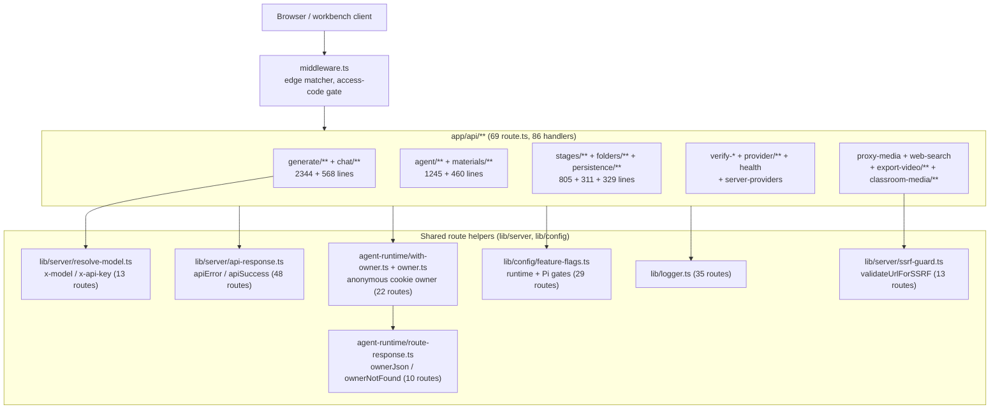
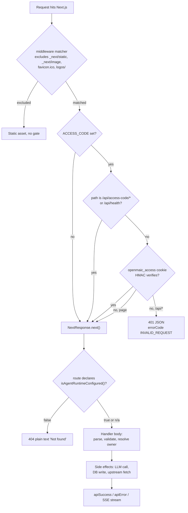

# HTTP API surface (`app/api/**`) — overview

Survey date: 2026-09-03. Branch `main`, HEAD `c2c9553a`.

## Charter

`app/api/**` is the **only** HTTP surface OpenMAIC exposes. It is a Next.js App
Router route-handler tree (69 `route.ts` files, 86 exported method handlers)
that fronts five otherwise-independent subsystems:

1. **Generation** — outline/content/action/media/TTS generation, all driven by an
   LLM resolved per request (`app/api/generate/**`, `app/api/chat/**`).
2. **Agent runtime control plane** — durable agent sessions, their SSE event
   log, skills, materials (`app/api/agent/**`, `app/api/materials/**`).
3. **Document/course persistence** — the owner-scoped course document store and
   the embedded `@openmaic/storage` HTTP handler
   (`app/api/stages/**`, `app/api/folders/**`, `app/api/persistence/[...path]`).
4. **Provider administration and probes** — credential verification, model
   discovery, capability reporting (`app/api/verify-*`, `app/api/provider/**`,
   `app/api/server-providers`, `app/api/health`).
5. **Egress proxies** — server-side fetches of user-supplied URLs and relays to
   the standalone render service (`app/api/proxy-media`, `app/api/web-search`,
   `app/api/export-video/**`, `app/api/classroom-media/**`).

There is no OpenAPI/spec artifact and no versioned contract other than
`app/api/pbl/v2/**`. The routes are the contract.

### Scope correction

`lib/api/*` (9 files, `stage-api*.ts`) is **not** part of the HTTP surface
despite the directory name. It is an in-process toolkit that mutates a
Zustand-style stage store for AI agents — `createStageAPI(stageStore)` with
`api.scene.create`, `api.element.add`, `api.canvas.highlight`
([`lib/api/stage-api.ts:14-34`](lib/api/stage-api.ts#L14-L34), [`lib/api/stage-api-types.ts:71-82`](lib/api/stage-api-types.ts#L71-L82)). No route
file imports it. Documented here only so a reader does not go looking.

## Where the cross-cutting behaviour lives

Measured with `git ls-files 'app/api/*' | grep -c 'route.ts$'` (69) and an
import-frequency scan over the same file list; see `06-quality-and-metrics.md`
for every command.

## Request lifecycle, in order

Access-code enforcement is entirely in [`middleware.ts:60-85`](middleware.ts#L60-L85); **no route file
re-checks it**. The allowlist is exactly two paths ([`middleware.ts:66`](middleware.ts#L66)).

## Family inventory

Line counts from `wc -l` over the 69 route files, aggregated per top-level
segment. Total: 9435 lines.

| Family | Route files | Lines | Runtime | Auth / gate | Streaming |
| --- | --- | --- | --- | --- | --- |
| `generate/**` | 8 | 2344 | default (node) | none beyond middleware | 1 SSE (`scene-outlines-stream`) |
| `agent/**` | 10 | 1245 | `nodejs` (all 10) | anon-cookie owner + runtime gate | 2 SSE |
| `stages/**` | 9 | 805 | `nodejs` (all 9) | anon-cookie owner + runtime gate | 1 SSE (`freshness`) |
| `extract-document` | 1 | 659 | `nodejs` | none / persistence dev token on JSON form | no |
| `chat/**` | 3 | 568 | 1 × `nodejs` | Pi flag on `chat/pi`; dev token on whiteboard-visibility | 2 SSE |
| `pbl/v2/**` | 5 | 536 | default | none | 4 SSE via `createSSEResponse` |
| `materials/**` | 2 | 460 | `nodejs` | anon-cookie owner + runtime gate | no |
| `persistence/[...path]` | 1 | 329 | `nodejs` | `PERSISTENCE_DEV_TOKEN` + anon owner for `/documents` | no (buffered) |
| `folders/**` | 3 | 311 | `nodejs` | anon-cookie owner + runtime gate | no |
| `export-video/**` | 4 | 252 | default | none | body stream in, MP4 stream out |
| `web-search` | 1 | 218 | default | none | no |
| `verify-pdf-provider` | 1 | 185 | default | none | no |
| `classroom-media/[classroomId]/[...path]` | 1 | 131 | default | none (public media) | `ReadableStream` + Range |
| `generate-classroom/**` | 2 | 127 | default | none | no (job + poll) |
| `usage` | 1 | 116 | default | none | no |
| `quiz-grade` | 1 | 113 | default | none | no |
| `verify-image-provider` | 1 | 99 | default | none | no |
| `transcription` | 1 | 94 | default | none | no |
| `parse-pdf` | 1 | 93 | default | none | no |
| `verify-video-provider` | 1 | 91 | default | none | no |
| `proxy-media` | 1 | 89 | default | none | no (blob buffered) |
| `classroom` | 1 | 85 | default | none | no |
| `stage-meta/[stageId]` | 1 | 80 | `nodejs` | anon owner (read-only tenancy) | no |
| `verify-model` | 1 | 77 | default | none | no |
| `azure-voices` | 1 | 69 | default | none | no |
| `provider/probe-models` | 1 | 67 | default | none | no |
| `access-code/**` | 2 | 58 | default | middleware allowlisted | no |
| `skills/[id]` | 1 | 49 | `nodejs` | anon owner + runtime gate | no |
| `server-providers` | 1 | 38 | default | none | no |
| `health` | 1 | 24 | default | middleware allowlisted | no |
| `comfyui-workflows` | 1 | 23 | default | none | no |

"default" runtime means the file declares no `export const runtime`; Next.js
uses the Node.js server runtime for App Router handlers unless `'edge'` is
declared. **No route in the repo declares `runtime = 'edge'`** — only
`middleware.ts` runs on the edge, and it explicitly branches on
`process.env.NEXT_RUNTIME !== 'edge'` ([`middleware.ts:53`](middleware.ts#L53)) because it cannot
trust server-only variables there.

## Notes pack index

Twelve files. Every row links, so this table is the pack's navigation as well as its
manifest.

| File | Contents |
| --- | --- |
| `00-overview.md` | this file |
| [`01a-modules-shared-helpers.md`](docs/appendix/research/api-surface/01a-modules-shared-helpers.md) | the cross-cutting helper modules with path:line anchors |
| [`01b-modules-routes-a-to-e.md`](docs/appendix/research/api-surface/01b-modules-routes-a-to-e.md) | per-route reference: `access-code` → `extract-document` |
| [`01c-modules-routes-f-to-p.md`](docs/appendix/research/api-surface/01c-modules-routes-f-to-p.md) | per-route reference: `folders` → `pbl/v2` |
| [`01d-modules-routes-p-to-w.md`](docs/appendix/research/api-surface/01d-modules-routes-p-to-w.md) | per-route reference: `persistence` → `web-search` |
| [`02a-interfaces-envelope-identity-model.md`](docs/appendix/research/api-surface/02a-interfaces-envelope-identity-model.md) | verbatim signatures: envelope, identity, model resolution, request bodies |
| [`02b-interfaces-egress-body-sse.md`](docs/appendix/research/api-surface/02b-interfaces-egress-body-sse.md) | verbatim signatures: egress guards, body helpers, tenancy, SSE contracts |
| [`03-flows.md`](docs/appendix/research/api-surface/03-flows.md) | five traced end-to-end flows, hop tables + sequence/state diagrams |
| [`04-dependencies-and-config.md`](docs/appendix/research/api-surface/04-dependencies-and-config.md) | env vars, npm deps, `MODEL_ROUTES` stage map, config resolution |
| [`05-failure-modes.md`](docs/appendix/research/api-surface/05-failure-modes.md) | error handling and failure behaviour |
| [`06-quality-and-metrics.md`](docs/appendix/research/api-surface/06-quality-and-metrics.md) | quality observations, every metric with its command |
| [`07-open-questions.md`](docs/appendix/research/api-surface/07-open-questions.md) | what could not be determined |

No section is omitted; every deliverable file has real content. `01` and `02` are
split because each exceeded the 350-line ceiling. Pack→topic mapping:
[`../index.md`](docs/appendix/research/index.md).
