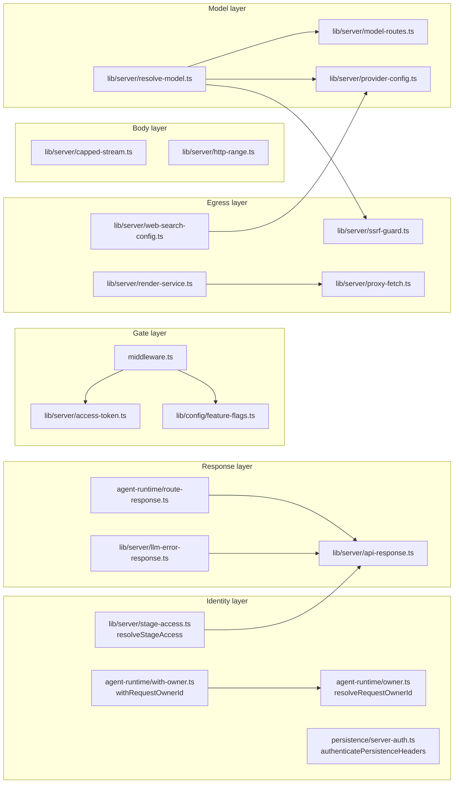
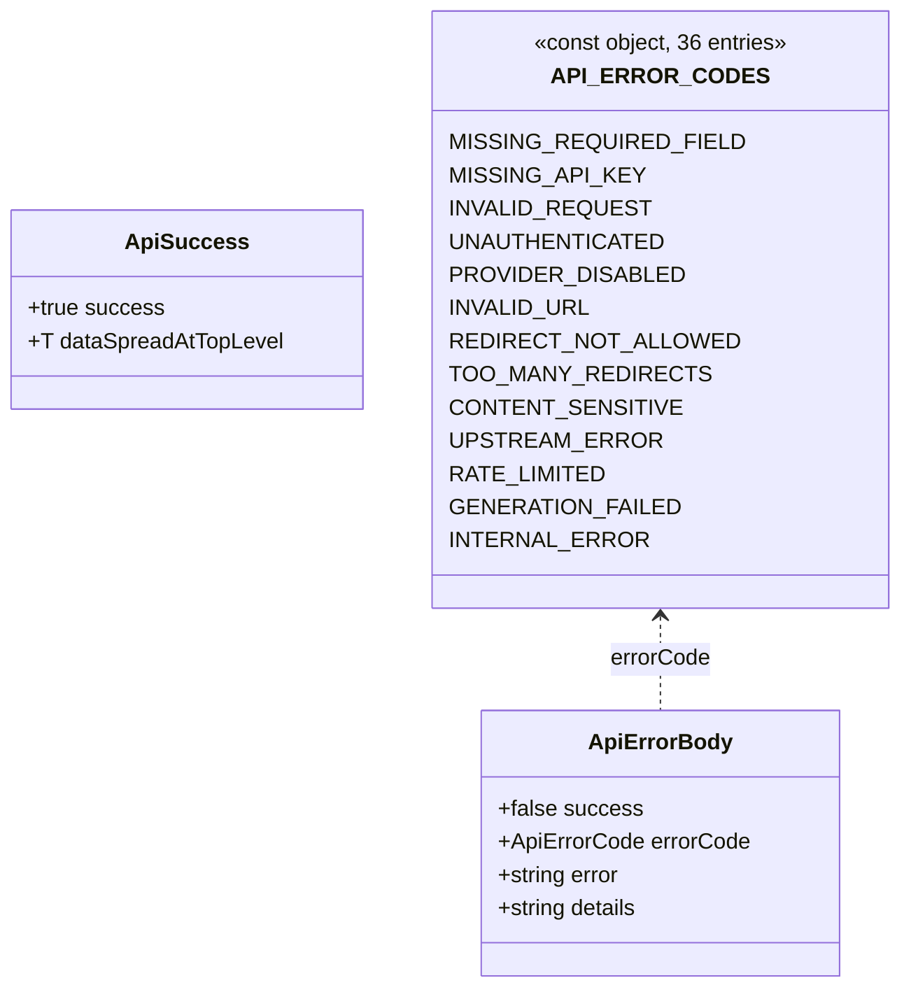

# Shared route helpers

Everything in this file lives outside `app/api/**` but is imported by route
files and is what makes the routes behave consistently (or reveals where they
do not). Import counts are per-route-file, measured over the 69 route files.

## `middleware.ts` — the only auth gate

- `middleware(request)` at [`middleware.ts:46`](middleware.ts#L46). Matcher
  `['/((?!_next/static|_next/image|favicon.ico|logos/).*)']` ([`middleware.ts:89`](middleware.ts#L89))
  so it runs for every API path.
- Workbench 404: `isProWorkbenchEnabled() && (!canInspectServerRuntime || isAgentRuntimeConfigured())`
  gates `/workbench*` only — not `/api/*` ([`middleware.ts:53-58`](middleware.ts#L53-L58)).
- Access code: when `ACCESS_CODE` is unset the middleware is a pass-through
  ([`middleware.ts:60-63`](middleware.ts#L60-L63)). When set, the allowlist is `/api/access-code/` prefix
  and the exact path `/api/health` ([`middleware.ts:66`](middleware.ts#L66)).
- Cookie verification is a Web-Crypto HMAC-SHA256 over the token's timestamp
  half (`verifyToken`, [`middleware.ts:18-44`](middleware.ts#L18-L44)). **The timestamp is never checked
  for age** — the signature proves only that the holder once had the access code.
- API requests failing the gate get `401 {success:false, errorCode:'INVALID_REQUEST', error:'Access code required'}`
  ([`middleware.ts:78-81`](middleware.ts#L78-L81)); page requests pass through so the client can render a
  modal ([`middleware.ts:85`](middleware.ts#L85)).
- Comparison in the edge path is length-then-XOR over char codes, explicitly
  documented as "not truly constant-time in JS" ([`middleware.ts:37-43`](middleware.ts#L37-L43)).

## `lib/server/access-token.ts` — the access-code token

- `createAccessToken(accessCode)` → `` `${timestamp}.${hmacSha256(accessCode, timestamp)}` ``
  ([`lib/server/access-token.ts:4-8`](lib/server/access-token.ts#L4-L8)).
- `verifyAccessToken(token, accessCode)` uses `crypto.timingSafeEqual` on the hex
  buffers ([`lib/server/access-token.ts:11-25`](lib/server/access-token.ts#L11-L25)). This is the Node-side twin of the
  edge `verifyToken`; `/api/access-code/status` uses it ([`app/api/access-code/status/route.ts:13`](app/api/access-code/status/route.ts#L13)).
- The HMAC **key is the access code itself**, so the token is a self-signed
  bearer proof with no server secret and no expiry field.

## `lib/config/feature-flags.ts` — 29 routes gate on this

`readBoolean` accepts only `'true'` or `'1'` ([`lib/config/feature-flags.ts:10-12`](lib/config/feature-flags.ts#L10-L12)).

| Function | Env var | Used by routes |
| --- | --- | --- |
| `isAgentRuntimeEnabled` (`:18`) | `OPENMAIC_AGENT_RUNTIME_ENABLED` | `agent/runtime` only |
| `isAgentRuntimeConfigured` (`:23`) | above **and** non-empty `DATABASE_URL` | all `agent/**`, `stages/**`, `folders/**`, `materials/**`, `skills/[id]`, `stage-meta/[stageId]` |
| `isProWorkbenchEnabled` (`:32`) | `NEXT_PUBLIC_PRO_WORKBENCH_ENABLED` | middleware only |
| `isPiChatEnabled` (`:72`) | `NEXT_PUBLIC_PI_CHAT_ENABLED` | `chat/pi` (404 when off) |
| `isPiNativeChildRuntimeEnabled` (`:80`) | `OPENMAIC_ENABLE_PI_NATIVE_CHILD_RUNTIME` | `chat/pi` (selects harness) |
| `isPiNativeChildSpotlightEnabled` (`:88`) | `OPENMAIC_ENABLE_PI_NATIVE_CHILD_SPOTLIGHT` | `chat/pi` |
| `resolveVocationalActive` (`:101`) | `OPENMAIC_ENABLE_VOCATIONAL` | `generate/scene-content`, `generate/scene-outlines-stream` |

## Identity: anonymous cookie owners

`resolveRequestOwnerId(req, responseHeaders, authenticatedOwnerId?)` at
[`lib/server/agent-runtime/owner.ts:52`](lib/server/agent-runtime/owner.ts#L52):

- Returns `authenticatedOwnerId` verbatim when supplied.
- Otherwise reads the `anonymous_id` cookie, validates it against a UUIDv4
  regex, and returns `` `anon:${uuid}` `` ([`owner.ts:59-60`](lib/server/agent-runtime/owner.ts#L59-L60)).
- On miss it mints `randomUUID()` and appends
  `anonymous_id=<uuid>; Path=/; HttpOnly; SameSite=Lax; Max-Age=2592000` plus
  `; Secure` in production ([`owner.ts:22-28`](lib/server/agent-runtime/owner.ts#L22-L28), [`:62-64`](lib/server/agent-runtime/owner.ts#L62-L64)).

`withRequestOwnerId(req, handler)` at
[`lib/server/agent-runtime/with-owner.ts:12`](lib/server/agent-runtime/with-owner.ts#L12) wraps a handler so the minted
`Set-Cookie` rides **every** response including the catch-all 500
([`with-owner.ts:20-23`](lib/server/agent-runtime/with-owner.ts#L20-L23)). 22 route files use it; three routes call
`resolveRequestOwnerId` directly because they build streaming responses:
`agent/owner-events` (`:49`), `agent/sessions/[id]/events` (`:77`),
`stages/[id]/freshness` (`:50`).

**No call site anywhere passes `authenticatedOwnerId`** — verified by grepping
`resolveRequestOwnerId` across `app/` and `lib/`. Consequence: every owner id in
production starts with `anon:`, so `stages/[id]/publish` and
`stages/[id]/unpublish` — which reject `ownerId.startsWith('anon:')` with
`401 {error:'login_required'}` ([`app/api/stages/[id]/publish/route.ts:26-31`](app/api/stages/[id]/publish/route.ts#L26-L31),
[`unpublish/route.ts:25-30`](app/api/stages/[id]/unpublish/route.ts#L25-L30)) — are unreachable in the current build.

## `lib/persistence/server-auth.ts` — the development bearer token

- `authenticatePersistenceHeaders(headers)` (`:56`) and
  `authenticatePersistenceRequest(req)` (`:63`) both compare
  `Authorization: Bearer <PERSISTENCE_DEV_TOKEN>` via sha256 + `timingSafeEqual`
  (`:32-36`, `:43`) and take the partition key straight from the client's
  `x-learner-key` header (`:53`).
- The file header states outright that `NEXT_PUBLIC_PERSISTENCE_TOKEN` is
  compiled into the browser bundle and that the scheme "provides no
  confidentiality and no user isolation" ([`lib/persistence/server-auth.ts:1-13`](lib/persistence/server-auth.ts#L1-L13)).
  Assets collapse to one `'shared'` principal (`:26`).
- Used by `app/api/persistence/[...path]` (runtime + asset requests only) and
  `app/api/chat/pi/whiteboard-visibility` (`:32-35`), plus `chat/pi`'s native
  whiteboard path ([`app/api/chat/pi/route.ts:173`](app/api/chat/pi/route.ts#L173)).

## `lib/server/api-response.ts` — the dominant envelope (48 routes)

- `apiError(code, status, error, details?)` ([`lib/server/api-response.ts:51`](lib/server/api-response.ts#L51))
  emits `{success:false, errorCode, error, details?}`.
- `apiSuccess(data, status = 200)` (`:68`) spreads the payload at the top level
  next to `success:true` — there is no `data` wrapper, so field names collide
  with the envelope by design.
- 36 codes in `API_ERROR_CODES` (`:3-40`), a mix of generic
  (`INVALID_REQUEST`) and vendor-specific (`QWEN_VC_AUDIO_TOO_LARGE`).

## `lib/server/agent-runtime/route-response.ts` — owner-scoped responses

- `withOwnerResponseHeaders(response, headers)` (`:15`) appends the owner
  headers onto an existing `NextResponse`.
- `ownerJson(body, status, headers)` (`:21`), `ownerApiError(...)` (`:26`).
- `ownerNotFound(headers)` (`:41`) returns a plain-text `404 'Not found'` and
  the file states the invariant explicitly: foreign and missing resources must be
  byte-identical so the id is not an existence oracle (`:36-40`). 25 route files
  return a plain-text `'Not found'` body.

## `lib/server/ssrf-guard.ts` — 13 routes

Two distinct entry points with different strictness:

| Function | Line | Behaviour |
| --- | --- | --- |
| `validateUrlForSSRF(url)` | `:253` | async; parses URL, requires http(s), **short-circuits to `null` when `ALLOW_LOCAL_NETWORKS` is `true`/`1`** (`:266-269`), blocks `localhost`/`*.local`/`0.0.0.0`/`::1`/private IPs, then DNS-resolves and rejects if any A/AAAA record is private. Returns an error **string** or `null`. |
| `normalizeUrlForStrictFetch(value)` | `:55` | sync; throws `UnsafeNetworkTargetError`; additionally rejects userinfo in the URL and any port other than 80/443, and rejects `metadata.google.internal`. Used only by [`lib/server/agent-runtime/fetch-url.ts:50`](lib/server/agent-runtime/fetch-url.ts#L50), not by any route. |
| `assertSafeIp(value)` | `:33` | classifies via `ipaddr.js`, unwraps IPv4-mapped IPv6, rejects non-`unicast` ranges and the cloud metadata addresses `169.254.169.254`, `100.100.100.200`, `fd00:ec2::254` (`:12`). |
| `isPrivateIP(ip)` | `:178` | hand-rolled; covers RFC1918, loopback, link-local, IPv6 ULA/link-local/site-local, **plus 6to4 (`2002::/16`), Teredo (`2001:0::/32`) and ISATAP embedded-IPv4 unwrapping** (`:216-241`). |

The guard is genuinely thorough at the address-classification layer. Its
weakness is the check-then-fetch gap: `validateUrlForSSRF` resolves DNS itself
(`:288`) and the subsequent `fetch` resolves again, so a rebinding record can
differ between the two. Only `proxy-media` re-validates per redirect hop
([`app/api/proxy-media/route.ts:55-56`](app/api/proxy-media/route.ts#L55-L56)).

## `lib/server/resolve-model.ts` — 13 routes

`resolveModel(params)` (`:41`) and the header wrappers
`resolveModelFromHeaders(req, stage?, thinkingConfig?)` (`:162`) /
`resolveModelFromRequest(req, body, stage?)` (`:183`).

- Header contract: `x-model`, `x-api-key`, `x-base-url`, `x-provider-type`
  (`:168-172`). Body contract: `thinkingConfig` or legacy `thinking` (`:148-153`).
- Precedence: `MODEL_ROUTES[stage]` > `x-model` > `DEFAULT_MODEL`, and a routed
  stage **discards** the client's key/baseUrl/providerType so a routed provider
  cannot be built with another provider's credentials (`:56-81`).
- Refuses to invent a model: throws when nothing resolves (`:66-70`).
- Provider-type mismatch against the registry throws (`:89-97`); `bedrock`
  requires server management (`:101-103`).
- **SSRF on the client base URL is gated on `process.env.NODE_ENV === 'production'`**
  (`:105-110`) — a deliberate dev affordance, and the reason `verify-model` has
  no guard of its own.

## `lib/server/model-routes.ts` — per-stage model pinning

- Single JSON env var `MODEL_ROUTES`; example at [`lib/server/model-routes.ts:14-15`](lib/server/model-routes.ts#L14-L15).
- `LLM_STAGES` (`:131-152`) is the closed set of 20 routable stage keys, including
  composite keys `scene-content:{slide,quiz,interactive,pbl}` and
  `pbl-v2-runtime:{instructor,open-task,evaluate,simulator}` that fall back to
  their base key.
- `StageRoute` carries `model`, optional `api`/`contextWindow` (consumed only by
  the `maic-agent-driver` stage, inert elsewhere — `:52-65`) and a full
  `ThinkingConfig` validated field-by-field with warn-and-drop semantics
  (`parseThinking`, `:75-116`).

## Egress and body helpers

- `lib/server/proxy-fetch.ts` — `proxyFetch(input, init)` (`:114`) routes through
  undici's `ProxyAgent` when `https_proxy`/`HTTPS_PROXY`/`http_proxy`/`HTTP_PROXY`
  is set (`:30-38`), bypassing for loopback (`:48-55`) and `no_proxy`/`NO_PROXY`
  entries with curl-style suffix matching (`:57-75`). Agent is cached per URL
  (`:92-107`). Used by `export-video/**` and `render-service.ts`.
  **`proxy-media` and every `verify-*` route use bare `fetch` instead.**
- `lib/server/capped-stream.ts` — `capBodyStream(body, capBytes)` (`:19`) wraps a
  request body so the *actual* bytes are counted and the stream errors the moment
  it exceeds the cap, plus an `exceeded()` probe so the caller can tell a cap trip
  from a malformed body (`:14-17`, `:45`). Used only by `export-video/render`.
- `lib/server/http-range.ts` — `parseRangeHeader(header, size)` (`:18`) returns
  `{kind:'range'|'unsatisfiable'|'ignored'}`; single byte ranges only, multi-range
  deliberately unsupported (`:1-8`). Used only by `classroom-media`.
- `lib/server/render-service.ts` — `resolveRenderServiceUrl()` (`:36`) returns
  `{url}` or `{error:'not_configured'}`; `checkRenderServiceHealth()` (`:47`)
  probes `GET /health` with a 3 s timeout. The file documents why
  `RENDER_SERVICE_URL` is deliberately **not** SSRF-guarded (`:25-35`).
- `lib/server/web-search-config.ts` — `resolveSafeClientWebSearchBaseUrl` (`:56`)
  enforces an exact-match allowlist of official provider base URLs
  (`OFFICIAL_CLIENT_BASE_URLS`, `:12-44`); SearXNG's list is empty so a client can
  never supply one.

## `lib/server/llm-error-response.ts`

`llmApiError(error)` (`:63`) walks `APICallError` / `RetryError` / `cause` /
`lastError` chains for an HTTP status (`statusFromError`, `:24-47`), maps it to a
fixed message (`messageForStatus`, `:49-57`) and returns `RATE_LIMITED` for 429
else `UPSTREAM_ERROR`, falling back to a generic 500. Used by
`generate/scene-content` and `generate/scene-actions` only — the deliberate point
is preserving retry semantics without leaking provider bodies (`:59-62`).

## Limits

| Constant | Value | Source |
| --- | --- | --- |
| `MAX_SESSION_TEXT_LENGTH` | 100 000 chars | [`lib/server/agent-runtime/limits.ts:9`](lib/server/agent-runtime/limits.ts#L9) |
| `STAGE_NAME_MAX_LENGTH` | 120 chars | [`lib/server/agent-runtime/stage-limits.ts:9`](lib/server/agent-runtime/stage-limits.ts#L9) |
| `MAX_MATERIAL_LIST_LIMIT` | 200 | [`app/api/materials/route.ts:77`](app/api/materials/route.ts#L77) |
| `MAX_BATCH_SCENE_IDS` | 200 | [`app/api/stages/[id]/scenes/route.ts:33`](app/api/stages/[id]/scenes/route.ts#L33) |
| `MAX_PROXY_BYTES` | 25 MiB | [`app/api/proxy-media/route.ts:67`](app/api/proxy-media/route.ts#L67) |
| `MAX_UPLOAD_BYTES` (render) | 300 MiB | [`app/api/export-video/render/route.ts:18`](app/api/export-video/render/route.ts#L18) |
| `maxUploadBytes` / `maxDocumentBytes` | 50 MiB each (env-overridable) | [`lib/server/agent-runtime/config.ts:46-48`](lib/server/agent-runtime/config.ts#L46-L48) |
| `maxMaterialsPerOwner` | 100 | [`lib/server/agent-runtime/config.ts:50`](lib/server/agent-runtime/config.ts#L50) |
| `maxMaterialBytesPerOwner` | 2 GiB | [`lib/server/agent-runtime/config.ts:52-55`](lib/server/agent-runtime/config.ts#L52-L55) |
| `MAX_OUTLINE_STREAM_BYTES` | 512 KiB | [`app/api/generate/scene-outlines-stream/route.ts:486`](app/api/generate/scene-outlines-stream/route.ts#L486) |
| skill upload cap | 1 048 576 bytes | [`app/api/agent/skills/route.ts:63`](app/api/agent/skills/route.ts#L63) |
