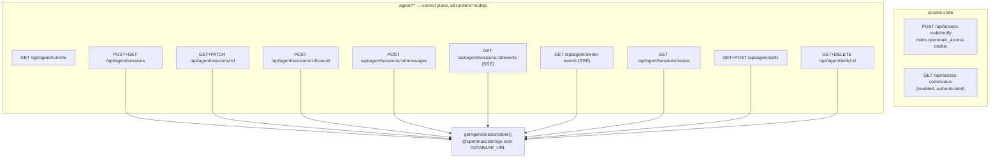

# Per-route reference, part 1: `access-code` → `extract-document`

Line references are to the route file named in each heading. "Runtime: default"
means no `export const runtime`.

## `access-code/verify` — `POST /api/access-code/verify`

- Runtime default. `POST` at `:6`.
- Request: `{code?: string}`; malformed JSON → `400 INVALID_REQUEST` (`:16`).
- When `ACCESS_CODE` is unset the route **succeeds unconditionally** with
  `{valid:true}` (`:8-10`) — matching the middleware pass-through.
- Constant-time compare via `TextEncoder` + `crypto.timingSafeEqual`, with a
  length pre-check (`:23-28`). Missing/blank code → `401 INVALID_REQUEST`.
- Side effect: sets cookie `openmaic_access` = `createAccessToken(accessCode)`,
  `httpOnly`, `sameSite:'lax'`, `path:'/'`, `maxAge` 7 days, `secure` in
  production (`:32-38`).
- Response: `{success:true, valid:true}`.

## `access-code/status` — `GET /api/access-code/status`

- Runtime default. `GET` at `:5`. No body.
- Response `{success:true, enabled, authenticated}` where `enabled` is
  `!!ACCESS_CODE` and `authenticated` verifies the cookie with
  `verifyAccessToken` (`:6-16`). No side effects.

## `agent/runtime` — `GET /api/agent/runtime`

- `runtime='nodejs'` (`:16`). Returns
  `{enabled: isAgentRuntimeConfigured(), runtimeEnabled: isAgentRuntimeEnabled()}`
  (`:21-24`) — the two-field split lets a client distinguish "off by choice" from
  "on but missing `DATABASE_URL`" (`:8-12`). The **only** `agent/**` route with no
  runtime gate, by necessity.

## `agent/sessions` — `POST` + `GET /api/agent/sessions`

- `runtime='nodejs'` (`:23`). Gate: `isAgentRuntimeConfigured()` → plain 404
  (`:38-40`, `:187-189`).
- `POST` body `CreateSessionBody` (`:25-35`): `prompt?`, `stageId?`, `skill?`,
  `existingCourse?`, `materialIds?`, `courseRefs?`.
- Validation, all before owner resolution so a rejected request never mints a
  cookie partition: `existingCourse` requires `stageId` (`:51`) and a valid
  classroom id (`:54`); `prompt` required and ≤ `MAX_SESSION_TEXT_LENGTH`
  (`:60-69`); `materialIds` must be a string array, deduped, ≤ 20, no blanks
  (`:70-79`); `existingCourse` rejects attachments (`:80-86`);
  `decodeCourseRefs` must succeed (`:87-90`).
- Inside `withRequestOwnerId`: an explicit `?skill=`/`body.skill` is resolved via
  `findSkill(id, ownerId)` and a miss returns 400 listing installed skill ids
  (`:99-116`); otherwise `inferSkillIdFromPrompt` reads a `/handle` out of the
  prompt text and is deliberately forgiving (`:117-131`).
- Side effects: `store.createSession({...})` (`:139`), then when opening context
  exists `bindOwnerMaterialsToSession` + `store.postUserMessage` (`:156-167`);
  on failure `store.softDeleteSession` compensates (`:177`).
- Responses: `202` with the session meta (`:152`, `:168`);
  `404 'Not found'` on `SessionMaterialBindingError` (`:179`).
- `GET` returns `store.listSessionsByOwner(ownerId)` as a bare JSON array
  (`:193-194`) — no envelope.

## `agent/sessions/status` — `GET`

- `runtime='nodejs'`. Returns a sparse `{sessionId: status}` map derived from
  `listSessionsByOwner` (`:16-18`). Runtime-gated (`:12`).

## `agent/sessions/[id]` — `GET` + `PATCH`

- `GET` (`:13`): owner-scoped `store.getSession(id)`; `!meta || meta.ownerId !== ownerId`
  → identical plain 404 (`:22-24`).
- `PATCH` (`:29`): body must be an object **with an own `title` property**
  (`Object.hasOwn`, `:46`); `title` must be `string | null` (`:51`);
  `normalizeSessionTitleOverride` then `store.setManualSessionTitle` (`:56-57`).
  Response `{title}`. Every error response manually re-appends the owner headers
  (`:43`, `:48`, `:53`).

## `agent/sessions/[id]/cancel` — `POST`

- Ownership check first, then a terminal-state check returning
  `409 {code:'SESSION_ALREADY_TERMINAL', status, error}` (`:28-37`).
- Side effect: `store.requestCancel(id)` only — the route makes the *request*
  durable and the lease holder writes the terminal event, keeping the log
  single-writer (`:1-6`, `:39`). Response `202 {id, cancelRequested:true}`.

## `agent/sessions/[id]/messages` — `POST`

- Body `{text?, materialIds?, elementRefs?, courseRefs?}` (`:33-38`).
- Validation mirrors session creation: string-array `materialIds` ≤ 20 (`:48-61`),
  `decodeElementRefs` (`:62`), `decodeCourseRefs` (`:68`), at least text or a
  material (`:74`), `text` ≤ 100 000 chars (`:79`).
- Side effects: `bindOwnerMaterialsToSession` then
  `store.postUserMessage(id, {...}, {expectedOwnerId})` (`:90-102`).
- Responses: `202 {id, message:{seq,text,delivery}, elementRefsAccepted, courseRefsAccepted}`;
  `404` on `SessionMaterialBindingError`; **`403 'Forbidden'`** on
  `AgentSessionAccessError` (`:113-118`) — the one place in the agent family that
  breaks the no-existence-oracle rule, though it is only reachable after the
  ownership pre-check has already passed.

## `agent/sessions/[id]/events` — `GET`, SSE

- `runtime='nodejs'`, `maxDuration=300` (`:43-47`). Constants: `POLL_INTERVAL_MS`
  5 000, `TERMINAL_POLL_INTERVAL_MS` 10 000, heartbeat 25 000, `BACKLOG_PAGE` 500
  (`:52-60`).
- Cursor from `Last-Event-ID` header or `?lastEventId=` (`:88-89`).
- Owner is resolved **before** the session lookup so a missing session and a
  foreign one produce byte-identical 404s including cookie headers (`:68-85`).
- Stream mechanics: `drainBacklog` pages `store.readEventsAfterForReplay` and
  judges exhaustion on the **raw** `page.scanned` rather than the compacted length
  (`:189-208`); `writePage` emits `id:`/`event:`/`data:` frames tagged
  `phase: 'live' | 'backlog'` (`:157-187`); a named `caught_up` event marks
  backlog drain, with `degraded:true` after three consecutive read failures
  (`:140-155`, `:197`).
- Concurrency control: `requestPoll` serialises polls behind `pollInFlight` and
  coalesces wakeups into exactly one follow-up run (`:234-253`); `tick`
  reschedules only after the previous poll settles (`:260-272`).
- Wakeups come from `subscribeAgentEventWakeup({kind:'session', sessionId})`
  registered *before* the first read to close the race window (`:282-284`).
- Never closes on `session_end`; terminal state only slows polling (`:174-185`).
- Headers: `text/event-stream; charset=utf-8`, `no-cache, no-transform`,
  `keep-alive` (`:296-298`).

## `agent/owner-events` — `GET`, SSE

- Same shape as above with `OWNER_EVENT_POLL_INTERVAL_MS` 30 000, heartbeat
  25 000, `OWNER_EVENT_REPLAY_LIMIT` 1 000 (`:25-28`). Cursor is a `BigInt`
  (`parseLastEventId`, `:30-37`).
- `checkAttachCursor` (`:129`) compares the client cursor against
  `store.readMaxId(ownerId)` and emits a `resync_required` event with reason
  `cursor_ahead` or `too_far_behind` instead of replaying (`:142-161`).
- The heartbeat also polls `store.readRetirement(ownerId)`; on an owner merge it
  emits `owner_moved {newOwnerId, action:'reconnect'}` and closes the stream
  (`:271-300`).

## `agent/skills` — `GET` + `POST`

- `GET` (`:26`) projects `{id, name, title?, description, hasConstraints, source}`
  from `listSkills(ownerId)` (`:32-42`).
- `POST` (`:47`) reads `multipart/form-data` field `file`; rejects non-file
  (`400`, `:53-58`), bounds the compressed upload at 1 048 576 bytes → `413`
  (`:63-68`), then branches on a `.zip` suffix to `parseUserSkillZip` vs
  `parseUserSkillMarkdown` (`:69-71`) and calls `createUserSkill(ownerId, input)`.
- Errors: `UserSkillError` with code `duplicate`/`quota` → 409, else 400
  (`:85-91`); `UserSkillUploadError` → `400 {error:'invalid-upload'}` (`:92-97`).
- Response `201` with the skill projection.

## `agent/skills/[id]` — `GET` + `DELETE`

- `GET` (`:17`) returns `{id, content}` for an owner skill; note the 404 at `:22`
  is built **without** `responseHeaders`, so a minted cookie is dropped on that
  path (the only such slip in the family).
- `DELETE` (`:30`) refuses ids not prefixed `usk_` with
  `405 'Built-in skills cannot be deleted.'` (`:34-39`); success is `204`.

## `azure-voices` — `POST /api/azure-voices`

- Runtime default, `maxDuration=30` (`:7`). Body `{apiKey, baseUrl}`.
- Requires both fields (`:20-26`), then `validateUrlForSSRF(baseUrl)` → `403 INVALID_URL`
  (`:29-32`). **No `NODE_ENV` gate here** — the call is unconditional, unlike the
  production-only siblings. The guard's own `ALLOW_LOCAL_NETWORKS` short-circuit
  still applies inside it, so "unconditional call" is not "unconditional block".
- Upstream: bare `fetch(`${baseUrl}/cognitiveservices/voices/list`)` with
  `Ocp-Apim-Subscription-Key` and `redirect:'manual'`; a 3xx becomes
  `403 REDIRECT_NOT_ALLOWED` (`:35-45`).
- Non-OK upstream is forwarded with the upstream status (`:47-55`) — the raw
  upstream body rides in `details`.

## `chat` — `POST /api/chat`, SSE

- Runtime default, `maxDuration=60` (`:26`).
- Body `StatelessChatRequest`; requires `messages` array, `storeState`, and a
  non-empty `config.agentIds` (`:55-65`).
- `resolveModel({modelString: body.model, stage:'chat-adapter', apiKey, baseUrl, providerType, thinkingConfig})`
  (`:72-81`); `isProviderKeyRequired(providerId) && !resolvedApiKey` → `401 MISSING_API_KEY`.
- Streaming: a `TransformStream`; the async producer runs `statelessGenerate`,
  writes `data: <json>\n\n` per event, and keeps a 15 s `:heartbeat\n\n`
  (`:100-153`). Abort is `req.signal`, checked per event (`:143`).
- On mid-stream failure it writes a `{type:'error'}` SSE event then closes
  (`:174-185`) — the HTTP status is already 200 by then.

## `chat/pi` — `POST /api/chat/pi`, SSE

- Runtime default, `maxDuration=300` (`:40`). `isPiChatEnabled()` false →
  `404 INVALID_REQUEST` (`:43-45`).
- Extra validation beyond `/api/chat`: `resolveSlideElementReference(body)` with a
  typed `ElementReferenceValidationError` → 400 (`:68-76`); `agentIds` must be a
  non-empty array of unique, trimmed, non-empty strings (`:79-90`); every id must
  resolve through `resolveAgentConfigs` or the route names the unresolved ones
  (`:113-129`).
- Native whiteboard capability is enabled only when **six** conditions hold —
  native child runtime, whiteboard tools requested, an agent declaring the native
  action, a valid `stage.id`, `NEXT_PUBLIC_PERSISTENCE === '1'`, `DATABASE_URL`
  and `PERSISTENCE_DEV_TOKEN` — plus a valid `x-learner-key` principal
  (`:164-187`). A persistence failure downgrades with a warn, never a 500.
- Web-search config for the native harness goes through
  `resolveClassroomWebSearchConfig`; a throw becomes `400 INVALID_REQUEST` (`:188-203`).
- Response headers add `ELEMENT_REFERENCE_ACCEPTED_HEADER: '1'` when a slide
  element reference was accepted (`:291`).

## `chat/pi/whiteboard-visibility` — `POST`

- `runtime='nodejs'` (`:7`). The only route whose **first** action is an auth
  check: `authenticatePersistenceHeaders(req.headers)` → `401 INVALID_CREDENTIALS`
  (`:32-35`).
- `validBody` is an exact-shape validator: it rejects any key outside
  `{queryId, stageId, visibility}` using `Reflect.ownKeys`, requires all three
  present, and constrains `visibility` to `'open' | 'closed'` (`:11-29`). This is
  the strictest hand-written body validator in the surface.
- Side effect `settleWhiteboardVisibility({...body, learnerKey})`; a non-pending
  query returns `404` carried in an `apiError` (`:47-54`). Success is `204`.

## `classroom` — `POST` + `GET /api/classroom`

- Runtime default. `POST` (`:14`) requires `stage` and `scenes` (`:23-29`), mints
  `stage.id || randomUUID()`, and calls
  `persistClassroom({id, stage, scenes}, buildRequestOrigin(request))` (`:34`) —
  a filesystem write under `CLASSROOMS_DIR`. Response `201 {id, url}`.
- `GET` (`:51`) requires `?id`, validates it with `isValidClassroomId` (`:63`),
  and returns `{classroom}` or `404 INVALID_REQUEST 'Classroom not found'`.
- No owner scoping at all: any caller who knows an id can read the classroom.

## `classroom-media/[classroomId]/[...path]` — `GET`

- Runtime default. Serves files off disk with a four-layer path defence:
  1. `isValidClassroomId(classroomId)` → 400 (`:47-49`);
  2. joined path may not contain `..` and no segment may contain `\0` (`:52-55`);
  3. the first segment must be exactly `media` or `audio` (`:58-61`);
  4. after `fs.realpath`, the resolved path must start with
     `resolve(CLASSROOMS_DIR, classroomId) + sep` (`:68-71`) — this is what
     actually stops symlink escape.
- MIME comes from a fixed 11-entry extension map, else `application/octet-stream`
  (`:10-22`, `:79`).
- Range support via `parseRangeHeader`: `unsatisfiable` → `416` with
  `Cache-Control: no-store` and `Content-Range: bytes */size` (deliberately
  uncached so a 416 cannot poison a shared cache, `:85-95`); `range` → `206`;
  otherwise a full `200`. Both stream through `toWebStream(createReadStream(...))`
  (`:27-38`) so large videos never enter memory.
- Caching: `public, max-age=86400, immutable` on 200/206 (`:24`).
- `ENOENT` → 404, everything else → 500 (`:121-130`).

## `comfyui-workflows` — `GET`

- Runtime default. `{workflows: await listComfyuiWorkflows()}` (`:18`). On any
  error it logs and returns `{workflows: []}` with status 200 (`:19-22`) — a
  deliberate silent degrade, and the only route in the surface that converts a
  failure into an empty success.

## `export-video/capability` — `GET`

- `dynamic='force-dynamic'` (`:4`). `{success:true, enabled}` where `enabled` is
  `checkRenderServiceHealth()` — configured **and** `/health` responding
  (`:13-16`). Never leaks the service URL.

## `export-video/render` — `POST`

- Runtime default, `maxDuration=300` sized for the *upload*, not the render
  (`:10-15`).
- Unconfigured service → `501 PROVIDER_DISABLED` (`:47-50`).
- Declared `Content-Length` over 300 MiB → `413` as a courtesy; the real bound is
  `capBodyStream(req.body, MAX_UPLOAD_BYTES)` on actual bytes (`:56-70`).
- Requires `multipart/form-data` and a body (`:61-64`) and deliberately does
  **not** parse the multipart, forwarding it verbatim with `duplex:'half'`
  (`:66-84`).
- Identity for the render service's own guard: `x-openmaic-client` set from
  `clientIdentity(req)`, which only trusts `x-forwarded-for`/`x-real-ip` when
  `TRUST_PROXY_HEADERS === 'true'` and otherwise collapses everyone into a single
  `'direct'` bucket (`:33-38`). This is the closest thing to rate limiting in the
  whole surface, and it is enforced downstream.
- Upstream status mapping: 429→429 `RATE_LIMITED`, 413→413 `INVALID_REQUEST`,
  anything else→502 `UPSTREAM_ERROR` (`:88-96`). Success `202 {jobId, pollIntervalMs:3000}`.
- A cap trip surfaces as a fetch error and is disambiguated by `capped.exceeded()`
  (`:102-104`).

## `export-video/render/[jobId]` — `GET` + `DELETE`

- `dynamic='force-dynamic'`. Both relay through `proxyFetch` with
  `AbortSignal.timeout(15_000)` and `encodeURIComponent(jobId)` (`:20`, `:45`).
- `GET` maps upstream 404→404 else 502 (`:26-28`) and returns
  `{...upstreamJson, pollIntervalMs:3000}`.
- `DELETE` treats upstream 404 as success (idempotent cancel, `:49-52`).

## `export-video/render/[jobId]/download` — `GET`

- `dynamic='force-dynamic'`. Uses a 30 s timeout that bounds **only the header
  fetch**, cleared once headers arrive, so a slow large MP4 is not truncated
  (`:27-37`).
- `redirect:'manual'`: a 301/302 from a presigned artifact store is handed
  straight to the browser via `NextResponse.redirect(location, 302)` (`:39-43`).
- Otherwise streams `upstream.body` with `Content-Type: video/mp4`,
  `Content-Disposition: attachment; filename="${jobId}.mp4"` and
  `Cache-Control: private, no-store` (`:50-60`). `jobId` is interpolated into that
  header unescaped — see `05-failure-modes.md`.

## `extract-document` — `POST`

- `runtime='nodejs'` (`:31`) because the asset-id form reads from PostgreSQL.
- Two request forms discriminated on `content-type` (`:451`, `:497`), anything
  else → `400` echoing the received content type (`:625-631`).
- **Multipart form**: field `file` or legacy `pdf` (`:456`); MIME normalised by
  `normalizeDocumentMimeType({mimeType, fileName})` and an unsupported type is a
  400 naming the file (`:470-480`); size over
  `MAX_EXTRACT_DOCUMENT_FILE_SIZE_BYTES` → `413` (`:481-489`). Behaviour is
  explicitly frozen for backward compatibility.
- **JSON asset-id form**: non-object body → generic 400 (`:514-516`); `assetId`
  must be a non-empty string (`:521`); all seven optional fields are type-checked
  against `ASSET_ID_EXTRACT_STRING_FIELDS` with a generic message that never
  echoes the value (`:64-73`, `:524-529`).
- `resolveServerAsset(assetId, req.headers, cap)` returns a status union mapped
  to `503` unconfigured, `401 UNAUTHENTICATED`, `404 ASSET_NOT_FOUND`, `413`
  too-large-before-materialising (`:549-580`); a throw is logged and answered with
  a fixed generic 500 (`:538-548`).
- `validateJsonPathProvider` pre-blocks unknown/media-incompatible providers with
  a static message so the shared path's echoing 400s are unreachable from the JSON
  form (`:103-130`, `:600`).
- Error surface is asymmetric on purpose: the JSON form returns a fixed
  `500 PARSE_FAILED` message, multipart still returns `error.message` (`:642-652`).
- `sanitizeLogValue` strips CR/LF from caller-controlled log values (`:657-659`) —
  log-injection defence not present in any other route.
