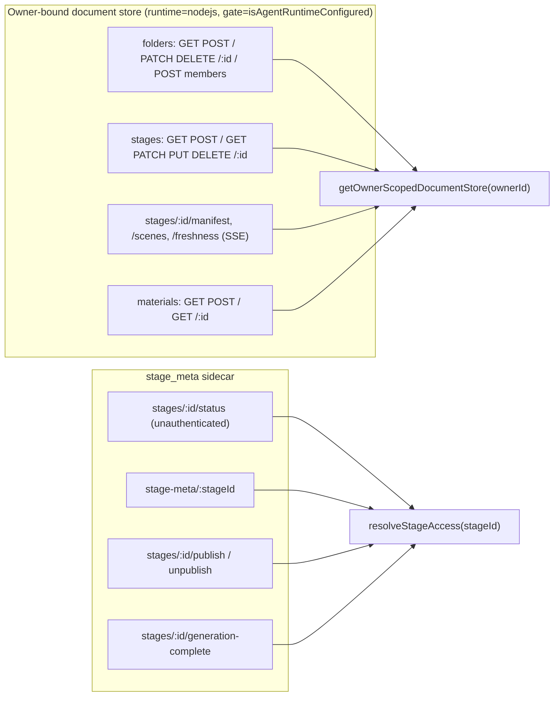
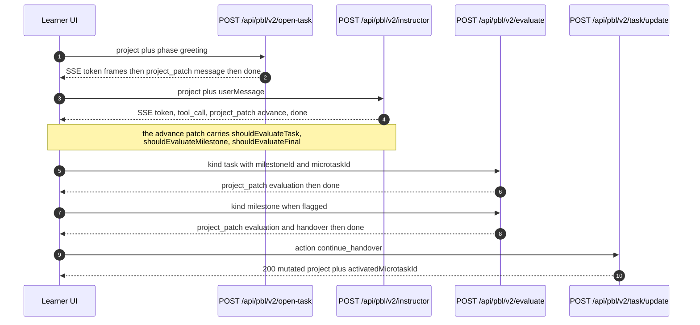

# Per-route reference, part 2: `folders` → `pbl/v2`

Continues from `01b-modules-routes-a-to-e.md`; continued in
`01d-modules-routes-p-to-w.md`.

## `folders` family — all `runtime='nodejs'`, all runtime-gated

Distinct envelope: these four files use `{error:{code,message}}`, not `apiError`
([`app/api/folders/route.ts:47`](app/api/folders/route.ts#L47), [`folders/[id]/route.ts:35`](app/api/folders/[id]/route.ts#L35),
[`folders/members/route.ts:30`](app/api/folders/members/route.ts#L30), and [`persistence/[...path]/route.ts:31`](app/api/persistence/[...path]/route.ts#L31)).

| Route | Method | Body / query | Validation | Response |
| --- | --- | --- | --- | --- |
| `/api/folders` | `GET` | — | — | `{folders:[{...row, userKey: ownerId}]}` ([`route.ts:59`](app/api/folders/route.ts#L59)) |
| `/api/folders` | `POST` | `{name}` | JSON parse, `typeof name === 'string'`, `validateFolderName` display-width ≤ 40 (`:79-97`) | `{folder}`; store-level duplicate/limit refusals remapped by `folderNameErrorResponse` (`:108-112`) |
| `/api/folders/[id]` | `PATCH` | `{name}` | same name rules; explicit case-insensitive clash pre-check excluding self → `409 FOLDER_NAME_DUPLICATE` ([`[id]/route.ts:68-79`](app/api/folders/[id]/route.ts#L68-L79)) | `{folder}`; `404 FOLDER_NOT_FOUND` |
| `/api/folders/[id]` | `DELETE` | `?mode=ungroup\|remove` | anything but `remove` falls back to `ungroup` ([`[id]/route.ts:104-105`](app/api/folders/[id]/route.ts#L104-L105)) | `{ok:true, removedStageIds}` |
| `/api/folders/members` | `POST` | `{stageId, folderId\|null}` | `stageId` non-empty string; `folderId` non-empty string or explicit `null` ([`members/route.ts:45-50`](app/api/folders/members/route.ts#L45-L50)) | `{ok:true}`; `404 FOLDER_NOT_FOUND` |

Body validation for `POST`/`PATCH` runs **before** `withRequestOwnerId` on
purpose: a malformed request must not mint an anonymous cookie partition
([`folders/route.ts:72-75`](app/api/folders/route.ts#L72-L75)).

## `generate/agent-profiles` — `POST`

- Runtime default, `maxDuration=120` (`:20`).
- Body `RequestBody` (`:22-41`): `stageInfo{name,description?}`,
  `sceneOutlines?`, `languageDirective`, `availableAvatars`,
  `avatarDescriptions?`, `availableVoices?`, `narratorVoice?`.
- Requires `stageInfo.name`, `languageDirective`, non-empty `availableAvatars`
  (`:147-159`). Stage `'agent-profiles'`.
- The teacher's voice is pinned to the user's global narrator voice when usable;
  the JSON schema example is always an *advertised* token so a ghost clone cannot
  poison the example (`:176-215`). `stripCodeFences` unwraps markdown fences from
  the model output (`:121-128`).

## `generate/image` — `POST`

- `maxDuration=300`, justified against the ComfyUI 5-minute poll budget (`:37-42`).
- Provider from `x-image-provider` header else `resolveServerImageProviderId()`;
  neither → `400 MISSING_PROVIDER` (`:54-58`).
- `isServerProviderDisabled('image', providerId)` → `403 PROVIDER_DISABLED` (`:61`).
- Managed providers discard client `x-api-key`/`x-base-url` (`:65-67`).
- Client base URL SSRF-checked **only when `NODE_ENV === 'production'`** (`:70-75`).
- `resolveImageModel` allowlists a client `x-image-model` against server pins;
  workflow providers with no catalog skip the model requirement (`:93-102`).
- Side effects: `generateImage(...)` and a fire-and-forget
  `recordGenerationUsage({kind:'image', unit:'image', quantity:1})` (`:113-119`).
- `SensitiveContent`/`sensitive information` in the message → `400 CONTENT_SENSITIVE`
  (`:125-128`).

## `generate/video` — `POST`

Same structure as `generate/image` with `x-video-provider`/`x-video-model`, an
unconditional `MISSING_API_KEY` requirement (`:73-79`), `normalizeVideoOptions`
against provider capabilities (`:97`), and usage recorded in seconds
(`:111-117`).

## `generate/tts` — `POST`

- `maxDuration=30` (`:32`). Body requires `text`, `audioId`, `ttsProviderId`,
  `ttsVoice` (`:56-62`); `browser-native-tts` is rejected as client-side-only
  (`:65-67`).
- `isServerTTSProviderDisabled` → `403` (`:71`). VoxCPM auto-voice without a
  prompt or registered voice → `400 VOXCPM_AUTO_VOICE_REQUIRES_CONTEXT` (`:81-92`).
- **Client base URL is SSRF-checked unconditionally** (`:97-102`) — no `NODE_ENV`
  gate, unlike image/video/asr/pdf. This is the surface's one inconsistency in
  SSRF strictness.
- Rich typed error mapping: `TTSRateLimitError`→429 `RATE_LIMITED`,
  `QwenVoiceCloneError`→its own code/status (default 502), `QwenTTSError`,
  `TTSModelNotAllowedError` (`:167-178`).
- Response `{audioId, base64, format}` — audio is base64 in JSON, not streamed.

## `generate/voice` — `POST`

- `maxDuration=30` with an internal `ROUTE_DEADLINE_MS` of 29 000 and a 5 000 ms
  slice for the existence lookup (`:39-41`). `childSignal` composes a parent abort
  with a timeout and cleans up its listener (`:43-62`).
- Provider-neutral: dispatches to `getVoiceRegistrationAdapter(providerId)`;
  unknown adapter → 400 (`:113-120`).
- `action:'delete'` refuses to use a managed server key — deletion requires a
  caller-supplied `ttsApiKey`, otherwise it returns a *success* body with
  `{deleted:false, localOnly:true}` (`:147-165`). Explicit reasoning: possession
  of a vendor voice id is not ownership.
- Idempotency ladder: `voiceExists` → no-op; cached `referenceAudioBase64` →
  re-register; else `bootstrapReferenceClip` → register and return the clip
  (`:170-231`).
- Deadline abort → `504 QWEN_VC_TIMEOUT` (`:243-245`).

## `generate/scene-outlines-stream` — `POST`, SSE

Largest route in the surface (716 lines). `maxDuration=300` (`:45`).

- Model resolution happens **before** the `requirements` check (`:293-304`), so a
  bad model config beats a missing field to the 500.
- Incremental parsing: `extractLanguageDirective` and `extractCourseTitle` scan
  only the first 8192 bytes to stay O(1) per chunk (`:52-65`, `:90-94`);
  `extractNewOutlines(buffer, scanFrom)` resumes from a cursor so the growing
  buffer is scanned once, O(n) total (`:117-120`).
- SSE event types: `languageDirective`, `courseTitle`, `outline` (with `index`),
  `retry` (with `attempt`/`maxAttempts`), `done` (full outline array +
  `languageDirective` + `courseTitle` + `taskEngineMode`), `error` (`:8-13`,
  `:554-682`). Frames are `data:`-only — no `event:` field, so `EventSource`
  consumers read them as default-typed messages.
- Retry loop: up to `MAX_STREAM_RETRIES + 1` = 3 attempts, resetting all parse
  state each time (`:482`, `:519-526`).
- Hard buffer ceiling `MAX_OUTLINE_STREAM_BYTES` 512 KiB stops the read and
  finalises with whatever parsed (`:486`, `:543-548`).
- Abort propagation: `abortSignal: req.signal` is passed to `streamLLM` and
  re-checked per chunk and per retry so a disconnect does not burn retries
  (`:504`, `:536-539`, `:636-639`).
- Vision path resolves asset ids to bytes before prompt assembly and rebuilds the
  placeholder text from the resolved set, so a `[see attached]` mention can never
  outlive its attachment (`:336-402`).

## `generate/scene-content` — `POST`

- `maxDuration=300`. Requires `outline`, non-empty `allOutlines`, `stageId`
  (`:91-103`). Stage key is composite: `scene-content:<outline.type>` falling back
  to `scene-content` (`:110-116`).
- Vision resolve-with-refill is bounded twice: a 15 s aggregate
  `VISION_RESOLUTION_BUDGET_MS` raced against every probe, and a
  three-consecutive-failure fuse `MAX_CONSECUTIVE_UNRESOLVABLE_VISION_IMAGES`
  (`:49-57`, `:231-283`). Either stop degrades to fewer images with one summary
  warn — never a failed request (`:301-309`).
- Every dropped id is stripped from `imageMapping` *and* `assignedImages` so the
  generator's re-slice cannot admit an unresolved id (`:290-300`).
- Errors go through `llmApiError(error)` (`:361`) so provider status codes survive
  without leaking bodies.

## `generate/scene-actions` — `POST`

`maxDuration=60`. Requires `outline`, `allOutlines`, `content`, `stageId`
(`:68-83`). Stage `'scene-actions'`. Builds `SceneGenerationContext` from the
outline's index within `allOutlines` (`:140-147`), normalises legacy PBL content
(`:152-158`), assembles the scene with `buildCompleteScene`, and returns
`{scene, previousSpeeches}` for cross-scene coherence (`:179-187`). Errors via
`llmApiError`.

## `generate-classroom` — `POST`, and `generate-classroom/[jobId]` — `GET`

- `POST` (`maxDuration=30`) whitelists the fields it copies out of the raw body
  into `GenerateClassroomInput` field-by-field (`:19-36`) — an allowlist, not a
  spread. Requires `requirement` (`:39-41`).
- Job pattern: `nanoid(10)` id, `createClassroomGenerationJob`, then
  `after(() => runClassroomGenerationJob(jobId, body, baseUrl))` so the work
  continues after the response (`:44-48`). Response
  `202 {jobId, status, step, message, pollUrl, pollIntervalMs:5000}`.
- `[jobId]` `GET` is `dynamic='force-dynamic'`, validates the id with
  `isValidClassroomJobId` (`:20`), and returns the full job projection plus
  `done: status === 'succeeded' || 'failed'` (`:31-44`). No owner scoping — the
  10-char nanoid is the only capability.

## `health` — `GET`

Middleware-allowlisted. `{success:true, status:'ok', version, capabilities:{webSearch, imageGeneration, videoGeneration, tts}}`
where each capability is true only if at least one non-`disabled` provider exists
([`app/api/health/route.ts:12-23`](app/api/health/route.ts#L12-L23)). `version` comes from `npm_package_version`
with a `'0.1.0'` fallback read once at module load (`:9`).

## `materials` — `GET` + `POST`

- `runtime='nodejs'`, runtime-gated. `GET` requires `?sessionId`, accepts
  `?limit` (integer 1…200, anything else → 400) and `?before` for keyset paging
  (`:100-133`).
- `POST` is a **raw-body** upload, not multipart: `content-type` is the MIME type
  and `x-material-filename` the display name.
  - MIME normalised then allowlisted → `415` (`:176-188`).
  - Per-class caps: media MIMEs get `maxUploadBytes`, everything else
    `min(maxDocumentBytes, maxUploadBytes)` (`:70-73`, `:189-191`).
  - Declared `content-length` over the cap → 413 (`:193-200`); missing body → 400.
  - `materialFilename` decodes percent escapes, normalises `\` to `/`, takes
    `basename`, and truncates to 512 chars (`:82-93`).
  - `materialUploadRequestId` echoes a client `x-request-id` only if it matches
    `/^[A-Za-z0-9._:-]{1,128}$/`, else mints a UUID (`:95-98`). Every response
    carries it (`:167`, `:363`, `:392`).
  - Lifecycle: reclaim leftovers older than 24 h → reserve a quota-checked
    `uploading` row (`MaterialQuotaExceededError` → **429**) → read the body
    through `readMeteredBody` enforcing the cap on real bytes → sha256 → put bytes
    → `finalizeOwnerMaterial` (`:235-351`, `:400-416`).
  - Compensation on every failure branch: `abandonOwnerMaterial`, and byte
    deletion before reservation removal so a crash leaves a durable pointer for
    the next sweep (`:296-336`, `:367-388`).
  - A body larger than its declared length → `413 'upload body exceeds its declared content length'`
    (`:326-336`).
- Structured logging: `context()` emits `requestId`, `phase`, `materialId`,
  `mime`, `declaredBytes`, `receivedBytes`, `durationMs` (`:154-163`).
- `materials/[id]` `GET` requires `?sessionId`, resolves the owned session, then
  the material; every miss is the same `ownerNotFound` (`:36-42`). Deletion is
  deliberately not exposed (`:10-13`).

## `parse-pdf` — `POST`

Runtime default, no `maxDuration`. Requires `multipart/form-data` (checked on the
header, `:19-27`) and a `pdf` field (`:35-37`). Provider defaults to `'unpdf'`
when the client omits it (`:40`). Client base URL SSRF-checked only in production
(`:47-52`). Buffers the whole file with `arrayBuffer()` — **no size cap on this
route** — then calls `extractDocument` and returns
`{data: ParsedPdfContent}` with `fileName`/`fileSize` merged into metadata
(`:61-85`).

## `pbl/v2/**` — five routes, all `maxDuration=300` except `task/update` (60)

All four LLM routes share one shape: parse JSON → validate → `resolveModelFromRequest(req, body, '<stage>')`
→ `createSSEResponse(generator, {signal: req.signal})`.

| Route | Stage key | Required body | Notes |
| --- | --- | --- | --- |
| `POST /api/pbl/v2/instructor` | `pbl-v2-runtime:instructor` | `project`, non-blank `userMessage` (`:46-51`) | `applyRequestLocaleToProject(req, project)` mutates the client's project in place (`:63`) |
| `POST /api/pbl/v2/open-task` | `pbl-v2-runtime:open-task` | `project`, `phase ∈ {greeting,setup}` (`:48-53`) | folds `priorQuizResults` into the adaptive engine on `greeting` only (`:71-80`) |
| `POST /api/pbl/v2/evaluate` | `pbl-v2-runtime:evaluate` | `project`, `kind ∈ {task,milestone,final}` plus `milestoneId`/`microtaskId` per kind (`:65-80`) | kind-as-body rather than kind-as-URL, rationale at `:22-26` |
| `POST /api/pbl/v2/simulator` | `pbl-v2-runtime:simulator` | `project` | scenario-only; `runSimulatorTurn` gates and errors otherwise (`:12-13`) |
| `POST /api/pbl/v2/task/update` | — (no LLM) | `project`, `action` | pure mutation switch over 5 actions; unknown action → 400 (`:159-160`) |

`createSSEResponse` ([`lib/pbl/v2/api/sse.ts:211`](lib/pbl/v2/api/sse.ts#L211)) adds
`X-Accel-Buffering: no` alongside the usual SSE headers (`:280-288`), keeps a
15 s `: keepalive` heartbeat (`:192`, `:258`), converts a generator throw into an
`error` + `done` frame pair (`:265-273`), and wires `signal` so an abort closes
the controller once (`:225-246`). Frames use `event: <type>` + `data: <payload>`
(`:185-188`).

`task/update` is fully stateless and returns the mutated project verbatim; the
scenario-only actions `enter_scenario` and `complete_act` are hard-gated on
`project.scenario` and the active milestone's `scenarioStage` (`:120-158`).

