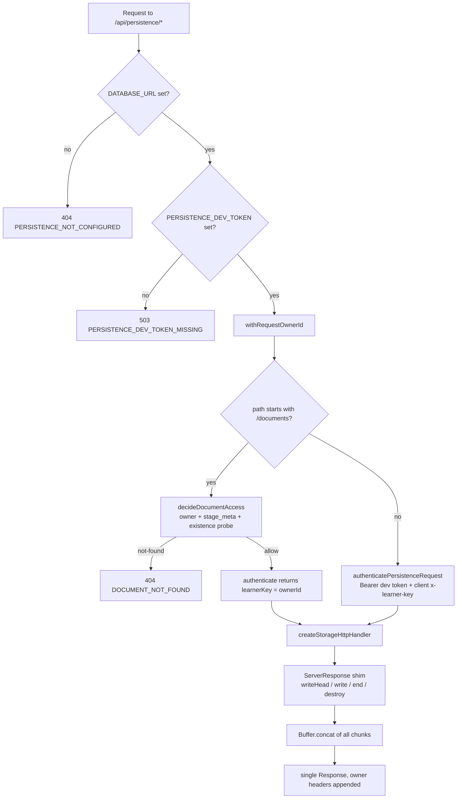
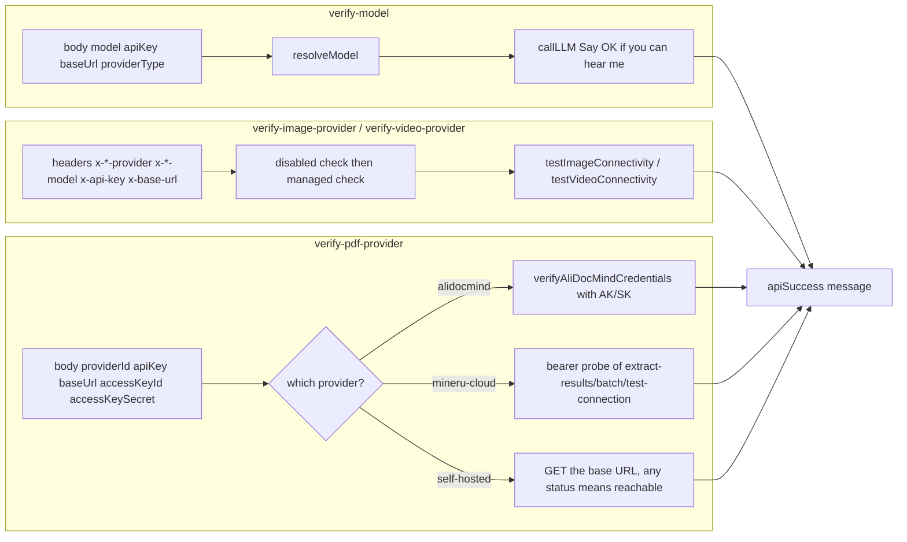

# Per-route reference, part 3: `persistence` → `web-search`

Continues `01c-modules-routes-f-to-p.md`.

## `persistence/[...path]` — `GET POST PUT PATCH DELETE`

- `runtime='nodejs'`. All five methods are thin consts delegating to
  `handlePersistenceRequest` (`:325-329`).
- Configuration gates: no `DATABASE_URL` → `404 PERSISTENCE_NOT_CONFIGURED`;
  no `PERSISTENCE_DEV_TOKEN` → `503 PERSISTENCE_DEV_TOKEN_MISSING` (`:271-281`).
- Split authorization: `/documents*` uses the server-resolved anonymous owner as
  `learnerKey`; every other path uses `authenticatePersistenceRequest` (the
  client-supplied `x-learner-key` + dev bearer token) (`:108-112`). The comment at
  `:96-99` states the runtime/asset authenticator must be replaced before
  production data.
- `authorizeMerge` and `authorizeAdmin` are hard-wired to `false` (`:113-114`).
- Document access decided by `decideDocumentAccess(action, ownerId, readStageMeta, existsProbe, readStageMeta)`
  with a raw `SELECT 1 FROM document_stages WHERE id = $1` existence probe
  (`:286-301`); `'not-found'` → `404 DOCUMENT_NOT_FOUND`.
- `ASSET_BYTE_EGRESS=redirect` opts into 302-to-signed-URL asset reads, but only
  if `ASSET_COLLECTION_GRACE_MS` is at least 10× the signed-URL lifetime;
  otherwise it warns and degrades to direct bytes (`:43-77`).
- A hand-written `ServerResponse` shim adapts the Node-style
  `createStorageHttpHandler` to the Fetch API: `writeHead`/`write`/`end`/`destroy`,
  buffering chunks as `Buffer` (never a string) so non-UTF-8 bytes survive
  (`:178-261`). `suppressesResponseBody` drops bodies for HEAD/204/205/304 (`:174-176`).
  **The entire response is buffered in memory** — there is no streaming here.

## `provider/probe-models` — `POST`

Requires `baseUrl`; SSRF-validates **both** `baseUrl` and an explicit
`modelsUrl` override (`:33-36`). Filters non-chat ids with a single regex
covering tts/asr/whisper/embedding/rerank/mineru/image/video/voxcpm/moderation
(`:10`). `ModelFetchError` maps 3xx→`403 REDIRECT_NOT_ALLOWED`, 401/403→401,
404→`404 'does not expose a model list'` (a deliberate UI signal to fall back to
manual entry), else 502 (`:47-59`). Returns `{models:[{id,ownedBy}], total, filtered}`.

## `proxy-media` — `POST`

- `maxDuration=60`. Body `{url}`; non-string → 400 (`:28-30`).
- `validateUrlForSSRF(url)` → `403 INVALID_URL` (`:33-36`), then a manual redirect
  loop of at most 5 hops that **re-validates every hop** (`:38-58`) — the only
  route that does. Missing `Location` → 502; unresolvable → `502` /
  `403 INVALID_URL`.
- Uses bare `fetch`, not `proxyFetch` (`:42`).
- Upstream 4xx is forwarded as-is so callers treat it as permanent; 5xx collapses
  to 502 (`:60-65`).
- Size cap 25 MiB checked on `content-length` *and* on the materialised blob
  (`:67-75`) — the blob is fully buffered, so a lying `content-length` still costs
  memory up to the real size.
- Response: raw bytes with the upstream `Content-Type`, explicit `Content-Length`,
  and `Cache-Control: private, max-age=3600` (`:78-84`).

## `quiz-grade` — `POST`

Requires `question` and `userAnswer`; `points` must be a positive finite number
(`:37-44`). Stage `'quiz-grade'`. The LLM is asked for JSON, extracted with a
`/\{[\s\S]*\}/` match, and the score is clamped to `[0, points]` (`:88-94`).
A parse failure silently awards 50 % with a canned comment (`:95-103`) — a real
grading-fidelity decision, not an error path.

## `server-providers` — `GET`

Returns the full server provider inventory: `providers`, `tts`, `asr`, `pdf`,
`image`, `video`, `webSearch`, and `generation.parallelSceneConcurrency`
(`:18-29`). Unauthenticated beyond the access-code middleware.

## `skills/[id]` — `GET`

`runtime='nodejs'`, runtime-gated. `isSafeSkillId(id)` → 400 (`:26`). Resolution
order: the literal id `'openmaic'` → `buildOpenClawSkillZip()`; a builtin →
`buildBuiltinSkillZip(id)`; otherwise an owner skill inside `withRequestOwnerId`
(`:28-48`). Response is `application/zip` with
`Content-Disposition: attachment; filename="${id}-skill.zip"` and
`Cache-Control: no-store` (`:16-21`). The `id` is validated before interpolation.

## `stage-meta/[stageId]` — `GET`

`dynamic='force-dynamic'` **and** `runtime='nodejs'` (`:33-34`). Returns
`{isOwner, isPublic, publishedAt, generationComplete, source}` (`:57-67`). Two
documented invariants: the tombstone is fail-closed (deleted and never-existed
are the same 404, `:47-49`) and `ownerId` is never returned because it would be a
stable cross-course identifier for the author (`:19-23`).

## `stages` family

| Route | Method | Notes |
| --- | --- | --- |
| `/api/stages` | `GET` | `{stages: store.listDocuments()}` ([`route.ts:38-42`](app/api/stages/route.ts#L38-L42)) |
| `/api/stages` | `POST` | `{name, description?}`; `name` required and ≤ 120 chars; validated before owner resolution; id minted as `` `stage-${randomBytes(9).toString('base64url')}` `` (`:30-32`, `:59-77`); returns `201 {stage:{...,sceneCount:0}}` |
| `/api/stages/[id]` | `GET` | full `{stage, scenes, outline}` document or `ownerNotFound` |
| `/api/stages/[id]` | `PATCH` | rename; `name` non-empty ≤ 120 ([`[id]/route.ts:87-98`](app/api/stages/[id]/route.ts#L87-L98)) |
| `/api/stages/[id]` | `PUT` | whole-document save; requires `stage.id` string + `scenes` array (`:127-144`); `stage.id` must equal the path id (`:148-155`); existence-gated so a PUT cannot resurrect a deleted course or mint one under a client id (`:157-162`); server overwrites `stage.updatedAt` (`:170`) |
| `/api/stages/[id]` | `DELETE` | `store.deleteDocument(id)` then `{ok:true}` — idempotent *over existence*, so no 404 for an unknown id (`:180-188`). Not unconditional: the runtime gate answers plain-text 404 first (`:184`), and a throw from the store becomes a 500 in `withRequestOwnerId`'s catch ([`with-owner.ts:20-23`](lib/server/agent-runtime/with-owner.ts#L20-L23)) |
| `/api/stages/[id]/manifest` | `GET` | `{rev, scenes:[{id,order,rev}]}` from DB triggers ([`manifest/route.ts:1-16`](app/api/stages/[id]/manifest/route.ts#L1-L16)) |
| `/api/stages/[id]/scenes` | `GET` | `?ids=a,b,c`; trims, dedupes, drops ids containing `\0` or a lone surrogate ([`scenes/route.ts:41-59`](app/api/stages/[id]/scenes/route.ts#L41-L59)), empty → `400 empty_scene_ids`, over 200 → `400 too_many_scene_ids` (no silent truncation) |
| `/api/stages/[id]/freshness` | `GET` | SSE; see below |
| `/api/stages/[id]/status` | `GET` | explicitly unauthenticated: `{isPublic, publishedAt}` or `404 {error:'not_found'}` ([`status/route.ts:21-44`](app/api/stages/[id]/status/route.ts#L21-L44)) |
| `/api/stages/[id]/publish` | `POST` | anon owner → `401 {error:'login_required'}`; foreign owner → `403 {error:'forbidden'}`; already public → idempotent 200 ([`publish/route.ts:26-46`](app/api/stages/[id]/publish/route.ts#L26-L46)) |
| `/api/stages/[id]/unpublish` | `POST` | same gates, then `setStagePublished(db, id, false, null)` |
| `/api/stages/[id]/generation-complete` | `POST` | owner-only narrow UPDATE via `markStageGenerationComplete`; an untouched row → 404 ([`generation-complete/route.ts:41-45`](app/api/stages/[id]/generation-complete/route.ts#L41-L45)) |

`mapSaveError` in `stages/[id]` translates store failures:
`DocumentNotFoundError`→404, `DocumentVersionError`→`400 'document was written by a newer client; reload before saving'`,
any other `@openmaic/storage:`-prefixed error→`400 'invalid stage document'`,
anything else rethrows to the `withRequestOwnerId` 500 (`:36-62`).

`stages/[id]/freshness` (SSE): existence-gated on
`store.readFreshnessManifest(stageId)` before the stream opens (`:56-58`), then
emits `event: stage_freshness` with `{type, stageId, rev}` **only when `rev`
changes** (`:95-113`), poll 5 000 ms, heartbeat 25 000 ms, and an explicit
`retry: 3000` reconnect hint as the first frame (`:38-42`, `:129`). A read
failure emits `rev: 0` rather than a terminal state (`:94`).

## `transcription` — `POST`

`maxDuration=60`. `multipart/form-data` with fields `audio`, `providerId`,
`modelId`, `language`, `apiKey`, `baseUrl` (`:23-32`). Missing `audio` → 400.
Provider falls back to `resolveServerASRProviderId()`; none enabled →
`400 MISSING_PROVIDER` (`:40-44`). Disabled → 403. Client base URL SSRF-checked
only in production (`:57-62`). No size cap on this route. Returns `{text}`.

## `usage` — `GET`

Runtime default. `?months=YYYY-MM,...` is split on commas and trimmed with no
format validation (`:73-74`) before reaching `readUsageRecords({months})`.
Aggregates `data/usage/*.jsonl` into `byModel`, `byDay`, `byKind` and totals
(`:78-107`). `totalTokens` deliberately excludes cache read/write counts because
`inputTokens` already includes cached input for OpenAI-compatible providers
(`:53-57`). Deployment-wide — not owner-scoped.

## The four `verify-*` probes, side by side

### `verify-image-provider` / `verify-video-provider` — `POST`

Header-driven (`x-image-provider`/`x-video-provider`, `x-*-model`, `x-api-key`,
`x-base-url`), identical gate ladder to the matching `generate/*` route, then
`testImageConnectivity` / `testVideoConnectivity`. A failed probe is reported as
`500 UPSTREAM_ERROR` with the probe's own message. `verify-image-provider`
declares `maxDuration=30`; `verify-video-provider` declares none.

### `verify-model` — `POST`

Body `{model, apiKey?, baseUrl?, providerType?}`. `model` required (`:15-17`).
A `resolveModel` throw becomes `401 INVALID_REQUEST` carrying the raw message
(`:29-35`). Then a real `callLLM` with prompt `'Say "OK" if you can hear me.'`,
`maxOutputTokens: 64`, thinking forced off (`:39-48`). The catch block
string-matches the error message for `401`/`Unauthorized`, `404`/`not found`,
`429`, `ENOTFOUND`/`ECONNREFUSED`, `timeout` and rewrites it to a friendly
message, falling through to the raw message otherwise (`:57-73`). No SSRF guard
of its own — it relies on `resolveModel`'s production-only check.

### `verify-pdf-provider` — `POST`

Three branches, each with its own credential story (`:30-128`, `:130-166`):
`alidocmind` (managed → server AK/SK/endpoint, unmanaged → client AK/SK with a
production-only SSRF check on a bare host coerced to `https://`),
`mineru-cloud` (bearer probe of `/extract-results/batch/test-connection` with a
10 s timeout, treating any non-401/403 as success), and self-hosted providers
(GET the base URL, treating even a 404 as reachable). All three set
`redirect:'manual'` and answer `403 REDIRECT_NOT_ALLOWED` on a 3xx.

## `web-search` — `POST`

- Runtime default, no `maxDuration`. Requires a non-blank `query` (`:55-57`).
- Provider precedence: a client `providerId` that exists in `WEB_SEARCH_PROVIDERS`
  wins, else the server default, else `'tavily'` (`:59-63`); but an
  operator-configured backend overrides a client choice that has no server config
  (`:67-77`). A force-disabled provider is then a hard `403 PROVIDER_DISABLED`
  (`:83-89`).
- Managed providers drop client key/baseUrl silently rather than erroring;
  **SearXNG base URLs are always operator-only** (`:95-98`).
- `resolveWebSearchRouteBaseUrl` enforces the exact-match allowlist; a throw
  becomes `400 INVALID_REQUEST` (`:107-113`).
- `pdfText` is clamped to `SEARCH_QUERY_REWRITE_EXCERPT_LENGTH` at the boundary
  (`:123`).
- The query-rewrite LLM is best-effort: a model-resolution failure logs a warn
  and the raw requirement is used (`:125-152`).
- `WEB_SEARCH_CLAUDE_MODELS` pins the Claude model over the client's choice
  (`:167-171`). Errors name the exact env var to set via `getWebSearchEnvKey`
  (`:196-218`).
- Response `{answer, sources, context, query, responseTime}`.
