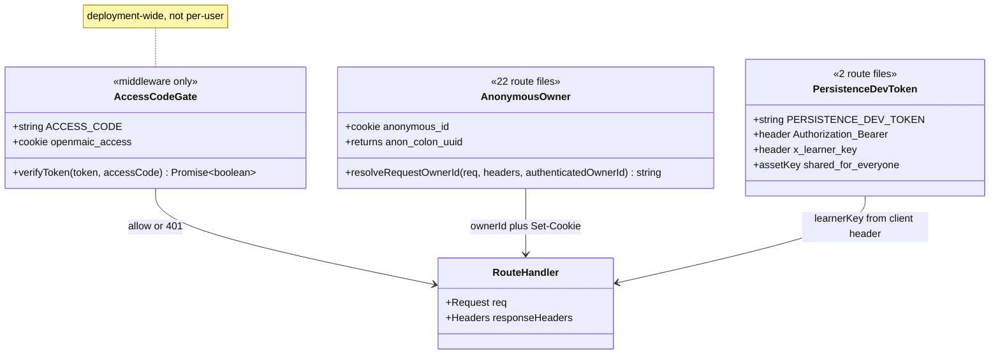
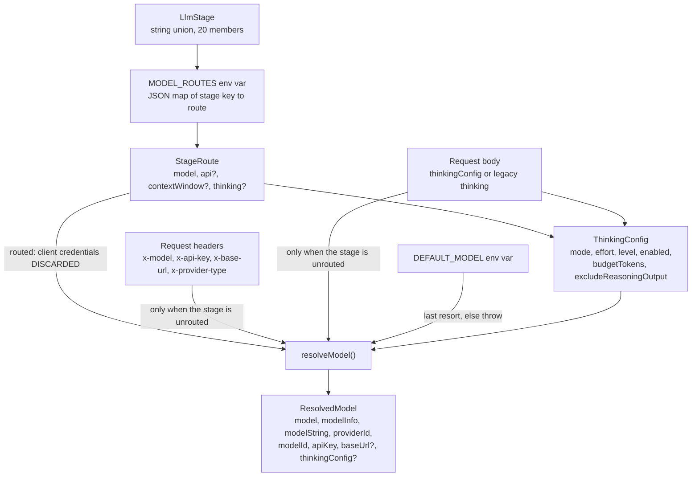

# Interfaces part 1: response envelope, identity, model resolution

Everything below is copied from the source at the cited line. Nothing here is
paraphrased. Continued in `02b-interfaces-egress-body-sse.md`.

## The response envelope

`lib/server/api-response.ts:42-70`

```ts
export type ApiErrorCode = (typeof API_ERROR_CODES)[keyof typeof API_ERROR_CODES];

export interface ApiErrorBody {
  success: false;
  errorCode: ApiErrorCode;
  error: string;
  details?: string;
}

export function apiError(
  code: ApiErrorCode,
  status: number,
  error: string,
  details?: string,
): NextResponse<ApiErrorBody>;

export function apiSuccess<T extends Record<string, unknown>>(data: T, status = 200): NextResponse;
```

`apiSuccess` spreads `data` next to `success: true`, so the success body has no
`data` envelope. The `T extends Record<string, unknown>` bound is what forces
callers to pass an object.

## Owner-scoped response builders

`lib/server/agent-runtime/route-response.ts:15-43`

```ts
export function withOwnerResponseHeaders(response: NextResponse, headers: Headers): NextResponse;
export function ownerJson(body: unknown, status: number, headers: Headers): NextResponse;
export function ownerApiError(
  code: ApiErrorCode,
  status: number,
  message: string,
  headers: Headers,
  details?: string,
): NextResponse;
export function ownerNotFound(headers: Headers): NextResponse;
```

## Identity

`lib/server/agent-runtime/owner.ts:52-56` and
`lib/server/agent-runtime/with-owner.ts:12-15`

```ts
export function resolveRequestOwnerId(
  req: Pick<Request, 'headers'>,
  responseHeaders: Headers,
  authenticatedOwnerId?: string,
): string;

export async function withRequestOwnerId(
  req: Pick<Request, 'headers'>,
  handler: (ownerId: string, responseHeaders: Headers) => Promise<Response>,
): Promise<Response>;
```

`lib/persistence/server-auth.ts:20` and `:56-69`

```ts
type PersistencePrincipal = RuntimeHttpPrincipal & Partial<Pick<AssetPrincipal, 'key'>>;

export function authenticatePersistenceHeaders(headers: Headers): PersistencePrincipal | undefined;
export async function authenticatePersistenceRequest(
  req: IncomingMessage,
): Promise<PersistencePrincipal | undefined>;
```

`lib/server/access-token.ts:4-11`

```ts
export function createAccessToken(accessCode: string): string;
export function verifyAccessToken(token: string, accessCode: string): boolean;
```

The three identity mechanisms are independent and do not compose:



`AnonymousOwner.authenticatedOwnerId` is never supplied by any caller, so the
returned id always carries the `anon:` prefix.

## Model resolution

`lib/server/resolve-model.ts:21-34`

```ts
export interface ResolvedModel extends ModelWithInfo {
  /** Original model string (e.g. "openai/gpt-4o-mini") */
  modelString: string;
  /** Resolved provider ID (e.g. "openai", "ollama") */
  providerId: string;
  /** Resolved model ID (e.g. "gpt-4o-mini") */
  modelId: string;
  /** Effective API key after server-side fallback resolution */
  apiKey: string;
  /** Effective base URL after server/client resolution */
  baseUrl?: string;
  /** Optional per-request thinking configuration from the client. */
  thinkingConfig?: ThinkingConfig;
}
```

`lib/server/resolve-model.ts:41-55`, `:162-166`, `:183-187`

```ts
export async function resolveModel(params: {
  modelString?: string;
  stage?: LlmStage;
  apiKey?: string;
  baseUrl?: string;
  providerType?: string;
  thinkingConfig?: ThinkingConfig;
}): Promise<ResolvedModel>;

export async function resolveModelFromHeaders(
  req: NextRequest,
  stage?: LlmStage,
  thinkingConfig?: ThinkingConfig,
): Promise<ResolvedModel>;

export async function resolveModelFromRequest(
  req: NextRequest,
  body: unknown,
  stage?: LlmStage,
): Promise<ResolvedModel>;
```

`lib/server/model-routes.ts:52-72` and `:131-154`

```ts
export interface StageRoute {
  model: string;
  api?: string;
  contextWindow?: number;
  thinking?: ThinkingConfig;
}

export const LLM_STAGES = [
  'scene-outlines-stream', 'scene-content', 'scene-content:slide',
  'scene-content:quiz', 'scene-content:interactive', 'scene-content:pbl',
  'scene-actions', 'agent-profiles', 'quiz-grade', 'pbl-chat',
  'pbl-v2-runtime', 'pbl-v2-runtime:instructor', 'pbl-v2-runtime:open-task',
  'pbl-v2-runtime:evaluate', 'pbl-v2-runtime:simulator', 'chat-adapter',
  'generate-classroom', 'web-search-query-rewrite', 'maic-agent',
  'maic-agent-driver',
] as const;

export type LlmStage = (typeof LLM_STAGES)[number];
```



The mapping from each `LlmStage` key to the route that passes it is tabulated in
`04-dependencies-and-config.md`.

## Request body shapes declared inline in route files

`app/api/agent/sessions/route.ts:25-35`

```ts
interface CreateSessionBody {
  prompt?: string;
  stageId?: string;
  skill?: string;
  /** Attach to an already-built classroom instead of starting a new course. */
  existingCourse?: boolean;
  /** Existing owner-library uploads to bind before the first run is queued. */
  materialIds?: unknown;
  /** Classrooms named on the opening message. */
  courseRefs?: unknown;
}
```

`app/api/extract-document/route.ts:40-73`

```ts
interface ExtractSource {
  fileName: string;
  fileSize: number;
  mimeType: string;
  buffer: Buffer;
}

interface ExtractRequestConfig {
  providerId?: string;
  apiKey?: string;
  baseUrl?: string;
  accessKeyId?: string;
  accessKeySecret?: string;
}

interface AssetIdExtractRequest extends ExtractRequestConfig {
  assetId?: string;
  fileName?: string;
  mimeType?: string;
}

const ASSET_ID_EXTRACT_STRING_FIELDS = [
  'fileName', 'mimeType', 'providerId', 'apiKey', 'baseUrl',
  'accessKeyId', 'accessKeySecret',
] as const;
```

`app/api/pbl/v2/task/update/route.ts:37-46`

```ts
interface UpdateRequest {
  project: PBLProjectV2;
  action:
    | 'start'
    | 'continue_handover'
    | 'enter_scenario'
    | 'complete_act'
    | 'complete_pending_task';
  microtaskId?: string;
}
```

`app/api/quiz-grade/route.ts:15-26`

```ts
interface GradeRequest {
  question: string;
  userAnswer: string;
  points: number;
  commentPrompt?: string;
  language?: string;
}

interface GradeResponse {
  score: number;
  comment: string;
}
```

`app/api/generate/agent-profiles/route.ts:22-50`

```ts
interface RequestBody {
  stageInfo: { name: string; description?: string };
  sceneOutlines?: { title: string; description?: string }[];
  languageDirective: string;
  availableAvatars: string[];
  avatarDescriptions?: Array<{ path: string; desc: string }>;
  availableVoices?: Array<{
    providerId: string;
    modelId?: string;
    voiceId: string;
    voiceName: string;
    voiceLanguage?: string;
  }>;
  /** The user's globally selected TTS voice; the teacher/narrator must use it. */
  narratorVoice?: {
    providerId: string;
    voiceId: string;
    modelId?: string;
  };
}
```

These are declaration-only: none of them is enforced at runtime by a schema. The
routes cast (`await req.json() as RequestBody`) and then hand-check the fields
they care about.
