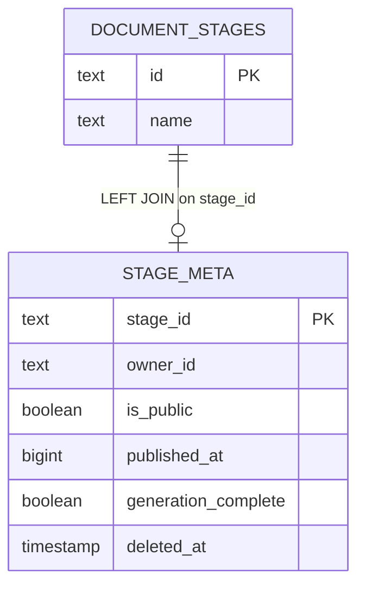
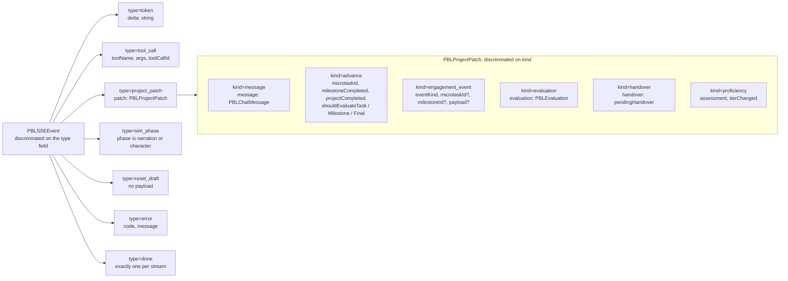
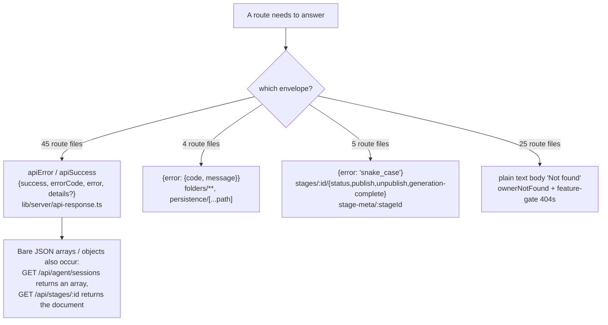

# Interfaces part 2: egress guards, body helpers, tenancy, SSE contracts

Continues `02a-interfaces-envelope-identity-model.md`. Everything below is copied
from the source at the cited line.

## Egress guards

[`lib/server/ssrf-guard.ts:14-19`](lib/server/ssrf-guard.ts#L14-L19), [`:33`](lib/server/ssrf-guard.ts#L33), [`:55`](lib/server/ssrf-guard.ts#L55), [`:178`](lib/server/ssrf-guard.ts#L178), [`:253`](lib/server/ssrf-guard.ts#L253)

```ts
export class UnsafeNetworkTargetError extends Error {
  constructor(message: string) { super(message); this.name = 'UnsafeNetworkTargetError'; }
}

export function assertSafeIp(value: string): void;
export function normalizeUrlForStrictFetch(value: string): URL;
export function isPrivateIP(ip: string): boolean;
export async function validateUrlForSSRF(url: string): Promise<string | null>;
```

[`lib/server/proxy-fetch.ts:81-114`](lib/server/proxy-fetch.ts#L81-L114)

```ts
export function shouldBypassProxy(url: URL): boolean;
export async function proxyFetch(input: string | URL, init?: RequestInit): Promise<Response>;
```

[`lib/server/render-service.ts:15-47`](lib/server/render-service.ts#L15-L47)

```ts
export function getRenderServiceUrl(): string | null;
export function isRenderServiceConfigured(): boolean;
export function resolveRenderServiceUrl(): { url: string } | { error: 'not_configured' };
export async function checkRenderServiceHealth(): Promise<boolean>;
```

[`lib/server/web-search-config.ts:56-87`](lib/server/web-search-config.ts#L56-L87)

```ts
export function resolveSafeClientWebSearchBaseUrl(
  providerId: WebSearchProviderId,
  clientBaseUrl?: string,
): string | undefined;

export function resolveWebSearchRouteBaseUrl(
  providerId: WebSearchProviderId,
  clientBaseUrl?: string,
): string | undefined;
```

Note the two different failure conventions in one subsystem:
`validateUrlForSSRF` returns an error **string** or `null`;
`normalizeUrlForStrictFetch` and `resolveSafeClientWebSearchBaseUrl` **throw**.
Route code therefore reads `if (ssrfError) return apiError(...)` in one place and
`try { ... } catch { return apiError(...) }` in another
([`app/api/proxy-media/route.ts:33-36`](app/api/proxy-media/route.ts#L33-L36) vs [`app/api/web-search/route.ts:107-113`](app/api/web-search/route.ts#L107-L113)).

## Body and range helpers

[`lib/server/capped-stream.ts:14-19`](lib/server/capped-stream.ts#L14-L19)

```ts
export interface CappedBody {
  stream: ReadableStream<Uint8Array>;
  exceeded: () => boolean;
}

export function capBodyStream(body: ReadableStream<Uint8Array>, capBytes: number): CappedBody;
```

[`lib/server/http-range.ts:10-18`](lib/server/http-range.ts#L10-L18)

```ts
export type RangeParseResult =
  | { readonly kind: 'range'; readonly start: number; readonly end: number }
  | { readonly kind: 'unsatisfiable' }
  | { readonly kind: 'ignored' };

export function parseRangeHeader(header: string | null, size: number): RangeParseResult;
```

[`lib/server/llm-error-response.ts:63`](lib/server/llm-error-response.ts#L63)

```ts
export function llmApiError(error: unknown);
```

The return type is inferred (`NextResponse<ApiErrorBody>` via `apiError`) rather
than annotated — the one exported helper in the shared set without an explicit
return type.

## Tenancy resolution

[`lib/server/stage-access.ts:15-31`](lib/server/stage-access.ts#L15-L31), [`:96-101`](lib/server/stage-access.ts#L96-L101), [`:127-131`](lib/server/stage-access.ts#L127-L131)

```ts
export interface StageAccessQueryable {
  query<TRow extends Record<string, unknown>>(
    text: string,
    params?: unknown[],
  ): Promise<{ rows: TRow[] }>;
}

export interface StageAccess {
  stageId: string;
  ownerId: string;
  name: string;
  isPublic: boolean;
  publishedAt: number | null;
  generationComplete: boolean;
  source: 'document';
  deletedAt: Date | null;
}

export async function readStageAccessIncludingDeleted(
  stageId: string,
  queryable?: StageAccessQueryable,
): Promise<StageAccess | null>;

export async function resolveStageAccess(
  stageId: string,
  queryable?: StageAccessQueryable,
): Promise<StageAccess | null>;
```



The join is a `LEFT JOIN` off a synthetic single-row key so a missing stage and a
missing meta row are both representable
([`lib/server/stage-access.ts:42-52`](lib/server/stage-access.ts#L42-L52)); the resolver returns `null` unless **both**
`meta_owner_id` and `document_name` are present (`:104`), and
`resolveStageAccess` additionally returns `null` when `deletedAt !== null`
(`:132`). Four routes read it: `stage-meta/[stageId]`, `stages/[id]/status`,
`stages/[id]/publish`, `stages/[id]/unpublish`, plus
`stages/[id]/generation-complete`.

## SSE event unions

[`lib/pbl/v2/api/sse.ts:168-178`](lib/pbl/v2/api/sse.ts#L168-L178) and [`:211-214`](lib/pbl/v2/api/sse.ts#L211-L214) — the only formally typed
streaming contract in the surface.

```ts
export type PBLSSEEvent =
  | SSETokenEvent
  | SSEToolCallEvent
  | SSEProjectPatchEvent
  | SSESimPhaseEvent
  | SSEResetDraftEvent
  | SSEErrorEvent
  | SSEDoneEvent;

export type PBLProjectPatch = SSEProjectPatchEvent['patch'];
export type PBLAdvanceProjectPatch = Extract<PBLProjectPatch, { kind: 'advance' }>;

export function createSSEResponse(
  generator: AsyncGenerator<PBLSSEEvent, void, void>,
  options: { heartbeatMs?: number; signal?: AbortSignal } = {},
): Response;
```



The other six streaming routes build their frames with string templates and have
no shared type. Frame format per route, read off the code:

| Route | Frame format | Named events | Heartbeat |
| --- | --- | --- | --- |
| `pbl/v2/*` (4 routes) | `event: <type>` + `data: <json>` ([`sse.ts:187`](lib/pbl/v2/api/sse.ts#L187)) | 7 typed kinds | `: keepalive` / 15 s ([`sse.ts:192`](lib/pbl/v2/api/sse.ts#L192)) |
| `chat` | `data: <json>` only ([`chat/route.ts:148`](app/api/chat/route.ts#L148)) | none — the type is inside the JSON | `:heartbeat` / 15 s ([`:109`](app/api/chat/route.ts#L109)) |
| `chat/pi` | `data: <json>` only ([`chat/pi/route.ts:139`](app/api/chat/pi/route.ts#L139)) | none | `:heartbeat` / 15 s ([`:213`](app/api/chat/pi/route.ts#L213)) |
| `generate/scene-outlines-stream` | `data: <json>` only (`:558`, `:598`, `:672`) | none | `:heartbeat` / 15 s (`:469`) |
| `agent/sessions/[id]/events` | `id:` + `event:` + `data:` (`:161`) | `caught_up` + every store event type | `: ping` / 25 s (`:277`) |
| `agent/owner-events` | `id:` + `event:` + `data:` (`:168`) | `caught_up`, `resync_required`, `owner_moved` | `: ping` / 25 s (`:273`) |
| `stages/[id]/freshness` | `retry:` then `event: stage_freshness` + `data:` (`:107-112`, `:129`) | `stage_freshness` | `: ping` / 25 s (`:134`) |

Only the two agent streams and `freshness` are consumable by a native
`EventSource` with typed listeners; the three `data:`-only streams require a
default `onmessage` handler plus a discriminator read from the JSON.

## The four wire envelopes in use

Measured by scanning the 69 route files for each shape.



The three envelopes plus the plain-text 404 plus the bare-JSON cases mean a
generic client cannot rely on a single error shape. The plain-text 404 is
intentional (no existence oracle); the `{error:{code,message}}` and
`{error:'snake_case'}` shapes exist to match a reference implementation the
routes were ported from ([`app/api/folders/route.ts:46`](app/api/folders/route.ts#L46),
[`app/api/stages/[id]/status/route.ts:9`](app/api/stages/[id]/status/route.ts#L9)).
