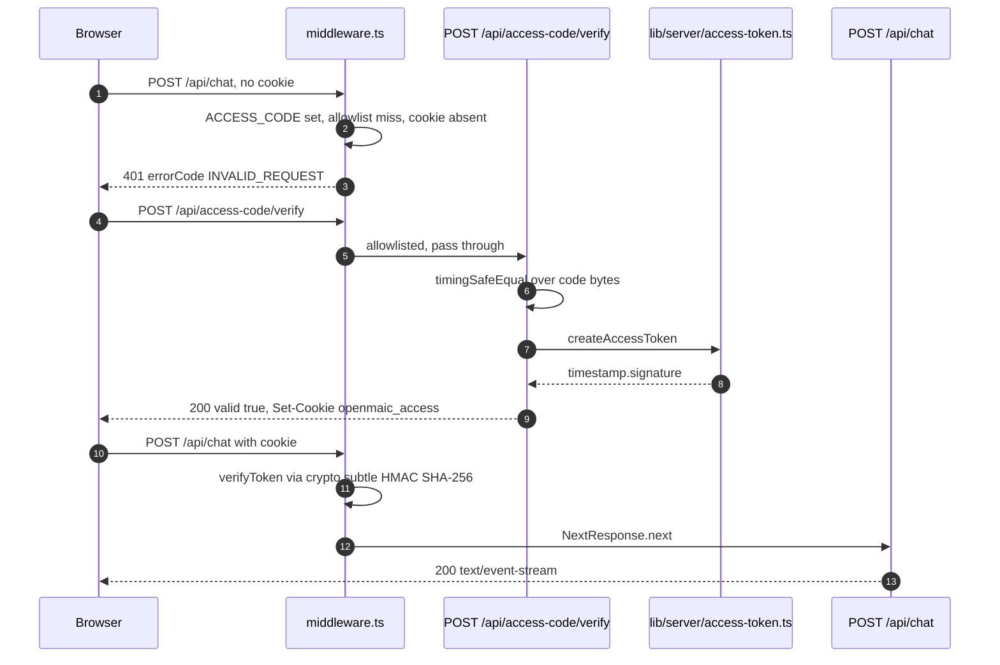
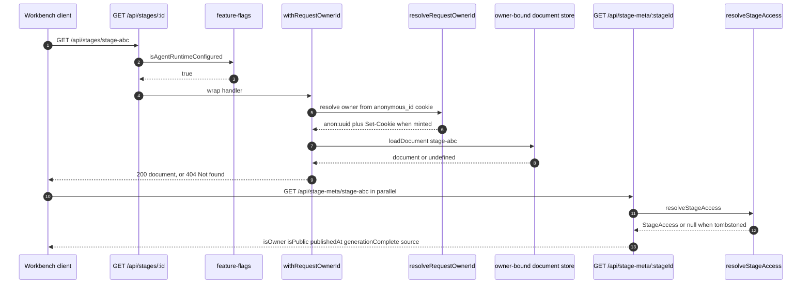
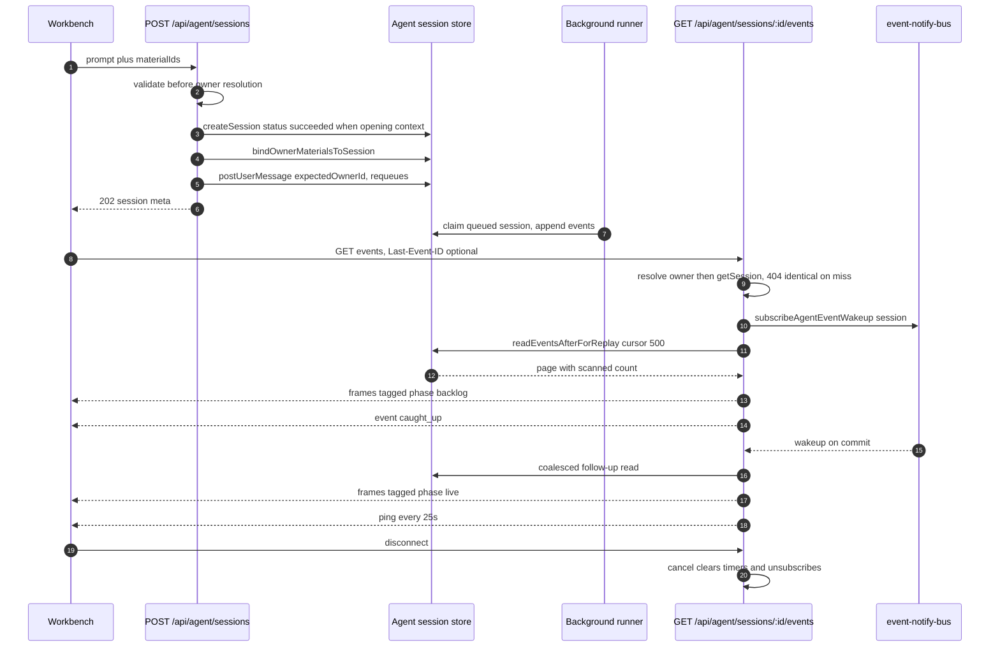
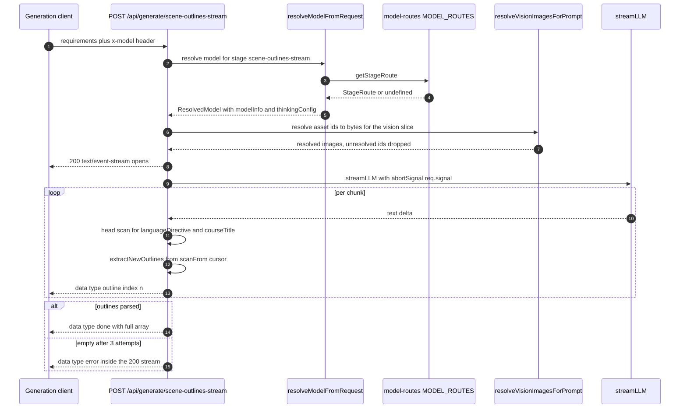
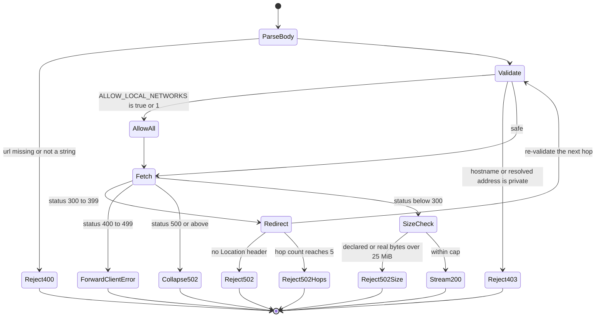

# Traced end-to-end flows

Five flows, each traced by reading the code in order. Every hop names the real
function and its file:line.

## Flow 1 — access-code gate, then a gated API call

Trigger: a browser with no `openmaic_access` cookie posts to `/api/chat` on a
deployment where `ACCESS_CODE` is set.

| # | Hop | Where |
| --- | --- | --- |
| 1 | `middleware(request)` runs (matcher admits `/api/chat`) | [`middleware.ts:46`](middleware.ts#L46), [`:89`](middleware.ts#L89) |
| 2 | workbench gate skipped — path is not `/workbench*` | [`middleware.ts:56`](middleware.ts#L56) |
| 3 | `process.env.ACCESS_CODE` is set, so no early `next()` | [`middleware.ts:60-63`](middleware.ts#L60-L63) |
| 4 | allowlist miss — path is neither `/api/access-code/*` nor `/api/health` | [`middleware.ts:66`](middleware.ts#L66) |
| 5 | `request.cookies.get('openmaic_access')` is undefined | [`middleware.ts:71`](middleware.ts#L71) |
| 6 | path starts with `/api/` → `401 {success:false, errorCode:'INVALID_REQUEST', error:'Access code required'}` | [`middleware.ts:77-81`](middleware.ts#L77-L81) |
| 7 | client posts `{code}` to `/api/access-code/verify`; middleware allowlists it | [`middleware.ts:66`](middleware.ts#L66) |
| 8 | `POST` reads `ACCESS_CODE`; it is set, so no unconditional success | [`app/api/access-code/verify/route.ts:7-10`](app/api/access-code/verify/route.ts#L7-L10) |
| 9 | `request.json()` → `{code}`; a parse failure would be `400 INVALID_REQUEST` | [`verify/route.ts:12-17`](app/api/access-code/verify/route.ts#L12-L17) |
| 10 | length check then `timingSafeEqual` over `TextEncoder` output | [`verify/route.ts:23-28`](app/api/access-code/verify/route.ts#L23-L28) |
| 11 | `createAccessToken(accessCode)` → `` `${Date.now()}.${hmac}` `` | [`lib/server/access-token.ts:4-8`](lib/server/access-token.ts#L4-L8) |
| 12 | `cookieStore.set('openmaic_access', token, {httpOnly, sameSite:'lax', path:'/', maxAge:604800, secure})` | [`verify/route.ts:32-38`](app/api/access-code/verify/route.ts#L32-L38) |
| 13 | retry of `/api/chat`; middleware `verifyToken` imports the HMAC key from the access code and compares hex | [`middleware.ts:18-44`](middleware.ts#L18-L44) |
| 14 | `NextResponse.next()` → the route handler finally runs | [`middleware.ts:72-74`](middleware.ts#L72-L74) |

Note hop 13: `verifyToken` never inspects the timestamp, so the token does not
expire server-side. Only the cookie's own 7-day `maxAge` bounds it.

## Flow 2 — owner-scoped course read: `GET /api/stages/[id]`

Trigger: the workbench canvas loads a course document.

| # | Hop | Where |
| --- | --- | --- |
| 1 | middleware passes (no `ACCESS_CODE`, or a valid cookie) | [`middleware.ts:61`](middleware.ts#L61) |
| 2 | `GET(req, {params})` — `isAgentRuntimeConfigured()` false → plain `404 'Not found'` | [`app/api/stages/[id]/route.ts:66`](app/api/stages/[id]/route.ts#L66) |
| 3 | gate reads `OPENMAIC_AGENT_RUNTIME_ENABLED` **and** a non-empty `DATABASE_URL` | [`lib/config/feature-flags.ts:23-25`](lib/config/feature-flags.ts#L23-L25) |
| 4 | `withRequestOwnerId(req, handler)` allocates a fresh `Headers` | [`lib/server/agent-runtime/with-owner.ts:16`](lib/server/agent-runtime/with-owner.ts#L16) |
| 5 | `resolveRequestOwnerId(req, responseHeaders)` — no `authenticatedOwnerId` is ever passed | [`lib/server/agent-runtime/owner.ts:52-64`](lib/server/agent-runtime/owner.ts#L52-L64) |
| 6 | reads the `anonymous_id` cookie, validates UUIDv4, returns `anon:<uuid>`; on miss mints one and appends `Set-Cookie` | [`owner.ts:59-64`](lib/server/agent-runtime/owner.ts#L59-L64) |
| 7 | `await params` resolves the dynamic segment | [`stages/[id]/route.ts:69`](app/api/stages/[id]/route.ts#L69) |
| 8 | `getOwnerScopedDocumentStore(ownerId)` binds a store partitioned by `owner_id` | [`stages/[id]/route.ts:70`](app/api/stages/[id]/route.ts#L70) |
| 9 | `store.loadDocument(id)` — a foreign document reads as absent | [`stages/[id]/route.ts:71`](app/api/stages/[id]/route.ts#L71) |
| 10 | absent → `ownerNotFound(responseHeaders)`: plain-text `404 'Not found'` **with** the owner headers | [`lib/server/agent-runtime/route-response.ts:41-43`](lib/server/agent-runtime/route-response.ts#L41-L43) |
| 11 | present → `ownerJson(document, 200, responseHeaders)` — the whole `{stage, scenes, outline}` document, no envelope | [`route-response.ts:21-23`](lib/server/agent-runtime/route-response.ts#L21-L23) |
| 12 | any throw inside the handler is caught by `withRequestOwnerId` → `500 'Internal Server Error'` **still carrying the cookie** | [`with-owner.ts:20-23`](lib/server/agent-runtime/with-owner.ts#L20-L23) |

The tenancy sidecar is a separate, parallel call the client makes:
`GET /api/stage-meta/[stageId]` → `resolveStageAccess(stageId)` →
`readStageAccessIncludingDeleted` LEFT JOINs `stage_meta` against
`document_stages` ([`lib/server/stage-access.ts:42-52`](lib/server/stage-access.ts#L42-L52)), returns `null` for a
tombstoned row (`:132`), and the route derives `isOwner` by comparing
`access.ownerId === ownerId` without ever emitting `ownerId`
([`app/api/stage-meta/[stageId]/route.ts:55-67`](app/api/stage-meta/[stageId]/route.ts#L55-L67)).

## Flow 3 — create an agent session, then attach to its event stream

| # | Hop | Where |
| --- | --- | --- |
| 1 | `POST /api/agent/sessions`; runtime gate | [`app/api/agent/sessions/route.ts:38`](app/api/agent/sessions/route.ts#L38) |
| 2 | `req.json()`; parse failure → `400 INVALID_REQUEST 'invalid JSON body'` | [`sessions/route.ts:42-47`](app/api/agent/sessions/route.ts#L42-L47) |
| 3 | `existingCourse`/`stageId` coherence, `isValidClassroomId` format check | [`sessions/route.ts:49-56`](app/api/agent/sessions/route.ts#L49-L56) |
| 4 | `prompt` required, capped at `MAX_SESSION_TEXT_LENGTH` = 100 000 | [`sessions/route.ts:58-69`](app/api/agent/sessions/route.ts#L58-L69), [`lib/server/agent-runtime/limits.ts:9`](lib/server/agent-runtime/limits.ts#L9) |
| 5 | `materialIds` shape, dedupe, ≤ 20, no blanks | [`sessions/route.ts:70-79`](app/api/agent/sessions/route.ts#L70-L79) |
| 6 | `decodeCourseRefs(body.courseRefs ?? [])` | [`sessions/route.ts:87-90`](app/api/agent/sessions/route.ts#L87-L90) |
| 7 | `withRequestOwnerId` → owner resolution (same as Flow 2 hops 4-6) | [`sessions/route.ts:92`](app/api/agent/sessions/route.ts#L92) |
| 8 | explicit `body.skill` → `findSkill(id, ownerId)`; a miss returns 400 listing installed ids | [`sessions/route.ts:99-116`](app/api/agent/sessions/route.ts#L99-L116) |
| 9 | otherwise `inferSkillIdFromPrompt(prompt, ownerId)` reads a `/handle` out of the text; an unknown handle is silently "no skill" | [`sessions/route.ts:117-131`](app/api/agent/sessions/route.ts#L117-L131) |
| 10 | `store.createSession({ownerId, prompt, stageId?, skillId?, existingCourse, origin: buildRequestOrigin(req), status?})` | [`sessions/route.ts:139-149`](app/api/agent/sessions/route.ts#L139-L149) |
| 11 | with no opening context → `202` with the meta and the runner claims it | [`sessions/route.ts:151-153`](app/api/agent/sessions/route.ts#L151-L153) |
| 12 | with opening context the row is created `succeeded` so the runner cannot claim it early, then `bindOwnerMaterialsToSession` + `store.postUserMessage(..., {expectedOwnerId})` atomically requeue it | [`sessions/route.ts:146-167`](app/api/agent/sessions/route.ts#L146-L167) |
| 13 | on `SessionMaterialBindingError` → `store.softDeleteSession` then `404 'Not found'` | [`sessions/route.ts:177-180`](app/api/agent/sessions/route.ts#L177-L180) |
| 14 | client opens `GET /api/agent/sessions/:id/events`, optionally with `Last-Event-ID` | [`app/api/agent/sessions/[id]/events/route.ts:88-89`](app/api/agent/sessions/[id]/events/route.ts#L88-L89) |
| 15 | owner resolved **before** the session lookup, so missing and foreign are byte-identical 404s | [`events/route.ts:68-85`](app/api/agent/sessions/[id]/events/route.ts#L68-L85) |
| 16 | `subscribeAgentEventWakeup({kind:'session', sessionId: id}, cb)` registered **before** the first read | [`events/route.ts:282-284`](app/api/agent/sessions/[id]/events/route.ts#L282-L284) |
| 17 | `drainBacklog()` pages `store.readEventsAfterForReplay(id, cursor, 500)`; exhaustion judged on raw `page.scanned` | [`events/route.ts:189-208`](app/api/agent/sessions/[id]/events/route.ts#L189-L208) |
| 18 | `writePage` emits `id:`/`event:`/`data:` frames tagged `phase:'backlog'` | [`events/route.ts:157-187`](app/api/agent/sessions/[id]/events/route.ts#L157-L187) |
| 19 | `markCaughtUp()` emits a named `caught_up` event; three consecutive read failures emit `caught_up {degraded:true}` | [`events/route.ts:140-155`](app/api/agent/sessions/[id]/events/route.ts#L140-L155), [`:197`](app/api/agent/sessions/[id]/events/route.ts#L197) |
| 20 | `tick()` reschedules a poll only after the previous one settles; interval 5 000 ms, 10 000 ms once terminal | [`events/route.ts:260-272`](app/api/agent/sessions/[id]/events/route.ts#L260-L272) |
| 21 | heartbeat writes `: ping` every 25 000 ms | [`events/route.ts:275-278`](app/api/agent/sessions/[id]/events/route.ts#L275-L278) |
| 22 | client disconnect → `cancel()` sets `closed` and clears both timers and the wakeup subscription | [`events/route.ts:290-293`](app/api/agent/sessions/[id]/events/route.ts#L290-L293), [`:100-107`](app/api/agent/sessions/[id]/events/route.ts#L100-L107) |

## Flow 4 — streamed outline generation

Trigger: `POST /api/generate/scene-outlines-stream` with `x-model` and a
`requirements` body.

| # | Hop | Where |
| --- | --- | --- |
| 1 | `POST(req)`; `req.json()` | [`app/api/generate/scene-outlines-stream/route.ts:291`](app/api/generate/scene-outlines-stream/route.ts#L291) |
| 2 | `resolveModelFromRequest(req, body, 'scene-outlines-stream')` runs **before** the `requirements` check | [`route.ts:293-304`](app/api/generate/scene-outlines-stream/route.ts#L293-L304) |
| 3 | `resolveModelFromHeaders` reads `x-model`, `x-api-key`, `x-base-url`, `x-provider-type`; `getThinkingConfigFromBody` reads `thinkingConfig` or `thinking` | [`lib/server/resolve-model.ts:148-175`](lib/server/resolve-model.ts#L148-L175) |
| 4 | `getStageRoute('scene-outlines-stream')` — a `MODEL_ROUTES` entry wins over `x-model` and discards the client key/baseUrl/providerType | [`lib/server/resolve-model.ts:63-81`](lib/server/resolve-model.ts#L63-L81), [`lib/server/model-routes.ts:131`](lib/server/model-routes.ts#L131) |
| 5 | nothing resolves → throw, caught by the outer try → `500 INTERNAL_ERROR` | [`resolve-model.ts:66-70`](lib/server/resolve-model.ts#L66-L70), [`route.ts:709-715`](app/api/generate/scene-outlines-stream/route.ts#L709-L715) |
| 6 | provider-type mismatch or unmanaged `bedrock` → throw | [`resolve-model.ts:89-103`](lib/server/resolve-model.ts#L89-L103) |
| 7 | client base URL SSRF-checked only when `NODE_ENV === 'production'` | [`resolve-model.ts:105-110`](lib/server/resolve-model.ts#L105-L110) |
| 8 | `resolveApiKey` / `resolveBaseUrl` / `resolveProxy` / `getModel` | [`resolve-model.ts:112-123`](lib/server/resolve-model.ts#L112-L123) |
| 9 | vision slice: `sortDocumentImagesForVision` → first `MAX_VISION_IMAGES` → `resolveVisionImagesForPrompt(slice, req.headers)`; unresolved ids are dropped from the mapping so the prompt text matches the attachments | [`route.ts:339-397`](app/api/generate/scene-outlines-stream/route.ts#L339-L397) |
| 10 | `buildOutlinePrompt(requirements, {...})`, or `buildPrompt(TASK_ENGINE_OUTLINES / INTERACTIVE_OUTLINES, ...)` when either mode is on | [`route.ts:421-448`](app/api/generate/scene-outlines-stream/route.ts#L421-L448) |
| 11 | `new ReadableStream({start})` opens; heartbeat every 15 000 ms writes `:heartbeat` | [`route.ts:461-480`](app/api/generate/scene-outlines-stream/route.ts#L461-L480) |
| 12 | attempt loop, up to 3 attempts, resetting all parse state each time | [`route.ts:519-526`](app/api/generate/scene-outlines-stream/route.ts#L519-L526) |
| 13 | `streamLLM(streamParams, 'scene-outlines-stream', thinkingConfig).textStream` with `abortSignal: req.signal` | [`route.ts:504`](app/api/generate/scene-outlines-stream/route.ts#L504), `:527-531` |
| 14 | per chunk: `req.signal.aborted` short-circuits; buffer over 512 KiB breaks the read | [`route.ts:536-548`](app/api/generate/scene-outlines-stream/route.ts#L536-L548) |
| 15 | `extractLanguageDirective` and `extractCourseTitle` scan the first 8 KiB only, each emitted once | [`route.ts:551-572`](app/api/generate/scene-outlines-stream/route.ts#L551-L572) |
| 16 | `extractNewOutlines(fullText, scanFrom)` resumes from the cursor; each new outline is ordered, normalised, id-uniquified, and emitted as `{type:'outline', data, index}` | [`route.ts:576-599`](app/api/generate/scene-outlines-stream/route.ts#L576-L599) |
| 17 | empty result with attempts left → `{type:'retry', attempt, maxAttempts}` then loop | [`route.ts:613-632`](app/api/generate/scene-outlines-stream/route.ts#L613-L632) |
| 18 | success → `uniquifyMediaElementIds(parsedOutlines)` then `{type:'done', outlines, languageDirective, courseTitle, taskEngineMode}` | [`route.ts:661-672`](app/api/generate/scene-outlines-stream/route.ts#L661-L672) |
| 19 | exhausted → `{type:'error', error}` **inside a 200 response** | [`route.ts:673-683`](app/api/generate/scene-outlines-stream/route.ts#L673-L683) |
| 20 | `finally` stops the heartbeat and closes the controller, swallowing an already-closed error | [`route.ts:690-698`](app/api/generate/scene-outlines-stream/route.ts#L690-L698) |

## Flow 5 — SSRF-guarded media proxy with a redirect

| # | Hop | Where |
| --- | --- | --- |
| 1 | `POST /api/proxy-media` with `{url}` | [`app/api/proxy-media/route.ts:23-30`](app/api/proxy-media/route.ts#L23-L30) |
| 2 | `validateUrlForSSRF(url)` — URL parse, http(s) only | [`lib/server/ssrf-guard.ts:255-263`](lib/server/ssrf-guard.ts#L255-L263) |
| 3 | `ALLOW_LOCAL_NETWORKS` truthy → **returns `null` at `:267-269`**, after the `new URL()` parse and the http/https check (which still reject) and before the hostname, private-IP and DNS checks, which are all skipped | [`ssrf-guard.ts:266-269`](lib/server/ssrf-guard.ts#L266-L269) |
| 4 | hostname checks: `localhost`, `*.local`, `0.0.0.0`, `::1`, `isPrivateIP` | [`ssrf-guard.ts:271-280`](lib/server/ssrf-guard.ts#L271-L280) |
| 5 | an IP literal short-circuits as safe after step 4; a name is `dns.lookup(hostname, {all:true, verbatim:true})` and rejected if **any** record is private | [`ssrf-guard.ts:282-299`](lib/server/ssrf-guard.ts#L282-L299) |
| 6 | non-null result → `403 INVALID_URL` carrying the guard's own message | [`proxy-media/route.ts:33-36`](app/api/proxy-media/route.ts#L33-L36) |
| 7 | `fetch(currentUrl, {redirect:'manual'})` — bare `fetch`, not `proxyFetch` | [`proxy-media/route.ts:42`](app/api/proxy-media/route.ts#L42) |
| 8 | 3xx: read `Location`; absent → `502`; hop count ≥ 5 → `502 TOO_MANY_REDIRECTS` | [`proxy-media/route.ts:44-47`](app/api/proxy-media/route.ts#L44-L47) |
| 9 | `new URL(location, currentUrl).href` resolves relative redirects; unparseable → `502 INVALID_URL` | [`proxy-media/route.ts:48-53`](app/api/proxy-media/route.ts#L48-L53) |
| 10 | **re-validate the hop** with `validateUrlForSSRF(nextUrl)` → `403` on failure | [`proxy-media/route.ts:54-57`](app/api/proxy-media/route.ts#L54-L57) |
| 11 | final non-OK: 4xx forwarded verbatim, 5xx collapsed to 502 | [`proxy-media/route.ts:60-65`](app/api/proxy-media/route.ts#L60-L65) |
| 12 | `content-length` over 25 MiB → `502`; then `response.blob()` and the same check on the real size | [`proxy-media/route.ts:67-75`](app/api/proxy-media/route.ts#L67-L75) |
| 13 | success: raw blob with upstream `Content-Type`, exact `Content-Length`, `Cache-Control: private, max-age=3600` | [`proxy-media/route.ts:78-84`](app/api/proxy-media/route.ts#L78-L84) |
| 14 | any throw → `500 INTERNAL_ERROR` with `error.message`, and the URL truncated to 100 chars in the log | [`proxy-media/route.ts:85-88`](app/api/proxy-media/route.ts#L85-L88) |

Step 3 is the sharp edge: `ALLOW_LOCAL_NETWORKS=true` is a single global switch
that disables the guard for **all thirteen** routes that call
`validateUrlForSSRF`, not just the one an operator was thinking about. The block
message advertises the switch to the caller
([`ssrf-guard.ts:246-247`](lib/server/ssrf-guard.ts#L246-L247)).
