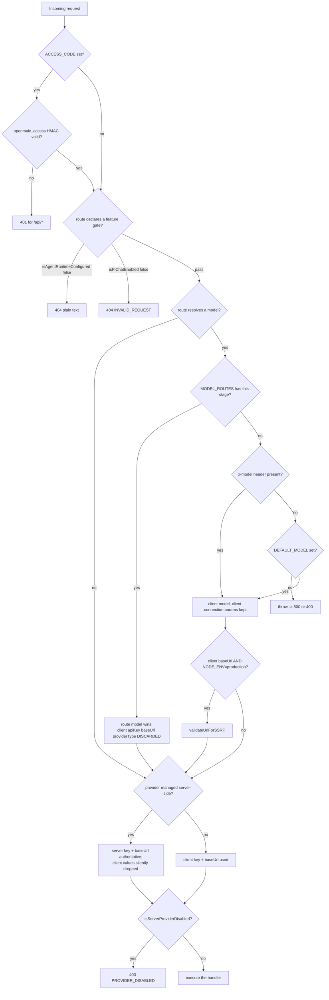
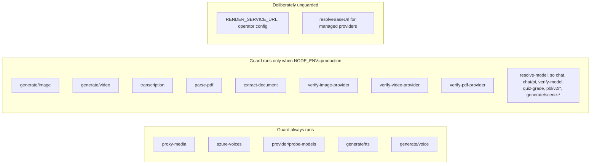

# Dependencies and configuration

## Direct npm/runtime dependencies reachable from route files

Route files import very little third-party code directly; almost everything
arrives through `lib/**`. Versions from the root `package.json` (132 runtime
dependencies, 32 dev).

| Package | Version | Reached from | Purpose |
| --- | --- | --- | --- |
| `next` | `16.2.11` | 62 route files import `next/server`; 2 import `next/headers` | `NextRequest`/`NextResponse`, `cookies()`, `after()` |
| `nanoid` | `5.1.16` | `generate-classroom`, `generate/scene-outlines-stream`, `agent-profiles` | job ids and outline id uniquification |
| `node:crypto` / `crypto` | stdlib | `access-code/verify`, `classroom`, `materials`, `stages`, `access-token`, `owner`, `server-auth` | `timingSafeEqual`, `randomUUID`, `randomBytes`, `createHash`, `createHmac` |
| `node:fs` / `node:path` | stdlib | `classroom-media/[classroomId]/[...path]` | `realpath`, `createReadStream`, `extname` |
| `node:http` / `node:stream` | stdlib | `persistence/[...path]` | the `IncomingMessage`/`ServerResponse` shim |
| `ipaddr.js` | `^2.5.0` | via `lib/server/ssrf-guard.ts` | address classification for `assertSafeIp` |
| `undici` | `7.29.0` | via `lib/server/proxy-fetch.ts` | `ProxyAgent` for `*_proxy` env support |
| `ai` | `^6.0.168` | via `lib/ai/llm` and `lib/server/llm-error-response.ts` | `APICallError`/`RetryError` status extraction |
| `jszip` | `^3.10.1` | via `lib/server/skill-export` | skill zip parse/build for `agent/skills`, `skills/[id]` |
| `pg` | `^8.16.3` | via `lib/persistence/server-provider` | the pool behind every owner-scoped store |
| `@openmaic/storage` | `workspace:*` | 8 route files | session store, document store, `createStorageHttpHandler` |
| `@openmaic/generation` | `workspace:*` | 4 route files | outline/content/action generators, `AICallFn` |

`zod` is a dependency (`^4.3.5`) but **no route file and nothing in
`lib/server/` except `lib/server/provider-capability-schema.ts` uses it** — all
request validation across the 69 routes is hand-written. Verified by
`grep -rln "from 'zod'" app/api lib/server`.

## Infrastructure the surface depends on

| Dependency | Kind | Required by |
| --- | --- | --- |
| PostgreSQL via `DATABASE_URL` | infrastructure | every `agent/**`, `stages/**`, `folders/**`, `materials/**`, `persistence/**`, `skills/[id]`, `stage-meta/**` route; absence makes them all 404 |
| Local filesystem `CLASSROOMS_DIR` | infrastructure | `classroom` (write), `classroom-media` (read) |
| Local filesystem `data/usage/*.jsonl` | infrastructure | `usage` aggregation, `recordGenerationUsage` writes |
| Standalone `render-service` over `RENDER_SERVICE_URL` | infrastructure | all four `export-video/**` routes |
| LLM/image/video/TTS/ASR/PDF/web-search SaaS APIs | saas-api | `generate/**`, `chat/**`, `pbl/v2/**`, `quiz-grade`, `web-search`, `verify-*`, `transcription`, `parse-pdf`, `extract-document` |
| Optional HTTP(S) forward proxy via `*_proxy` | infrastructure | `export-video/**` and `render-service` health checks |

## Environment variables read *directly* inside route files

Nine, measured by scanning `process.env.X` in the 69 route files.

| Var | Route(s) | Effect |
| --- | --- | --- |
| `ACCESS_CODE` | `access-code/verify`, `access-code/status` | unset ⇒ `verify` returns `{valid:true}` unconditionally and `status` reports `enabled:false` |
| `NODE_ENV` | `access-code/verify` and 8 others | `production` turns on `secure` cookies and the client-base-URL SSRF checks |
| `DATABASE_URL` | `chat/pi`, `materials`, `persistence/[...path]` | connection string; also the second half of `isAgentRuntimeConfigured()` |
| `PERSISTENCE_DEV_TOKEN` | `chat/pi`, `persistence/[...path]` | missing ⇒ `persistence` returns `503 PERSISTENCE_DEV_TOKEN_MISSING`; also required for the Pi native whiteboard |
| `NEXT_PUBLIC_PERSISTENCE` | `chat/pi` | must equal `'1'` for the native whiteboard service |
| `ASSET_BYTE_EGRESS` | `persistence/[...path]` | `redirect` opts into 302-to-signed-URL asset reads; unrecognised values warn and fall back |
| `ALLOW_MINERU_CLOUD_FALLBACK` | `extract-document` | operator opt-in before a self-hosted MinerU falls back to the cloud |
| `TRUST_PROXY_HEADERS` | `export-video/render` | only `'true'` makes `x-forwarded-for`/`x-real-ip` trusted for the render-service identity bucket |
| `npm_package_version` | `health` | reported `version`, default `'0.1.0'` |

## Environment variables read by the shared helpers the routes depend on

| Var | Read at | Effect on the HTTP surface |
| --- | --- | --- |
| `OPENMAIC_AGENT_RUNTIME_ENABLED` | `lib/config/feature-flags.ts:19` | with `DATABASE_URL`, un-404s 29 routes |
| `NEXT_PUBLIC_PRO_WORKBENCH_ENABLED` | `feature-flags.ts:33` | `/workbench*` page gate in middleware only |
| `NEXT_PUBLIC_PI_CHAT_ENABLED` | `feature-flags.ts:73` | `chat/pi` 404s when off |
| `OPENMAIC_ENABLE_PI_NATIVE_CHILD_RUNTIME` | `feature-flags.ts:81` | selects the native vs legacy Pi child harness |
| `OPENMAIC_ENABLE_PI_NATIVE_CHILD_SPOTLIGHT` | `feature-flags.ts:89` | native spotlight capability |
| `OPENMAIC_ENABLE_VOCATIONAL` | `feature-flags.ts:98` | server-authoritative gate for `taskEngineMode` in the two outline/content routes |
| `ALLOW_LOCAL_NETWORKS` | `lib/server/ssrf-guard.ts:266` | `true`/`1` disables the SSRF guard for all 13 calling routes |
| `DEFAULT_MODEL` | `lib/server/resolve-model.ts:65` | last-resort model; no hardcoded vendor fallback exists |
| `MODEL_ROUTES` | `lib/server/model-routes.ts` | JSON map of the 20 `LLM_STAGES` keys to a model plus optional thinking config |
| `RENDER_SERVICE_URL` | `lib/server/render-service.ts:16` | unset ⇒ all four `export-video` routes report `501` / `enabled:false`; deliberately not SSRF-guarded |
| `ASSET_COLLECTION_GRACE_MS` | via `resolveAssetCollectionGraceMs` in `persistence/[...path]:67` | must be ≥ 10× the signed-URL TTL for `ASSET_BYTE_EGRESS=redirect` to take effect |
| `https_proxy`, `HTTPS_PROXY`, `http_proxy`, `HTTP_PROXY` | `lib/server/proxy-fetch.ts:30-38` | forward proxy for render-service traffic |
| `no_proxy`, `NO_PROXY` | `proxy-fetch.ts:41` | proxy bypass list, curl-style suffix matching |
| `OPENMAIC_AGENT_MAX_UPLOAD_BYTES` | `agent-runtime/config.ts:46` | media material cap, default 50 MiB |
| `MATERIALS_MAX_DOCUMENT_BYTES` | `config.ts:48` | document/image material cap, default 50 MiB |
| `MATERIALS_MAX_COUNT_PER_OWNER` | `config.ts:50` | 429 threshold, default 100 |
| `MATERIALS_MAX_TOTAL_BYTES_PER_OWNER` | `config.ts:52` | 429 threshold, default 2 GiB |
| `OPENMAIC_AGENT_SKILLS_DIR` | `config.ts:44` | where `listSkills`/`buildBuiltinSkillZip` read from |
| `SEARXNG_BASE_URL` | named by `web-search` error text (`route.ts:191`) | the only way to point at SearXNG; client values are always discarded |
| `TAVILY_API_KEY`, `EXA_API_KEY`, `BAIDU_API_KEY`, `BOCHA_API_KEY`, `BRAVE_API_KEY`, `WEB_SEARCH_CLAUDE_API_KEY`, `WEB_SEARCH_MINIMAX_API_KEY`, `WEB_SEARCH_DOUBAO_API_KEY` | named by `getWebSearchEnvKey` (`web-search/route.ts:196-218`) | per-provider web-search keys |
| `WEB_SEARCH_CLAUDE_MODELS` | referenced in `web-search/route.ts:167-171` via `resolveWebSearchModel` | server-pinned Claude model wins over the client's |
| `ALIDOCMIND_ACCESS_KEY_ID`, `ALIDOCMIND_ACCESS_KEY_SECRET`, `ALIDOCMIND_BASE_URL`, `OPENAI_API_KEY`, `OPENAI_BASE_URL`, `IMAGE_OPENAI_BASE_URL`, `BEDROCK_API_KEY`, `BEDROCK_BASE_URL`, `BEDROCK_MODELS`, `BEDROCK_REGION`, `AWS_BEARER_TOKEN_BEDROCK`, `PARALLEL_SCENE_CONCURRENCY`, `TTS_QWEN_VOICE_CLONE_MODEL` | `lib/server/provider-config.ts` (13 direct `process.env` reads in a 1117-line module) | provider credentials and pins surfaced through `server-providers` and every `verify-*` route |

`provider-config.ts` resolves most provider settings from a YAML/env layer
rather than direct `process.env` reads, so the table above is the *direct* set,
not the full provider configuration surface. That module belongs to the provider
subsystem and is out of scope here.

## `MODEL_ROUTES` stage keys and the route that passes each one

From the route files' own `resolveModelFromRequest` / `resolveModel` call sites.

| Stage key | Route and line |
| --- | --- |
| `scene-outlines-stream` | `app/api/generate/scene-outlines-stream/route.ts:299` |
| `scene-content`, `scene-content:<type>` | `app/api/generate/scene-content/route.ts:110-116` |
| `scene-actions` | `app/api/generate/scene-actions/route.ts:91` |
| `agent-profiles` | `app/api/generate/agent-profiles/route.ts:166` |
| `quiz-grade` | `app/api/quiz-grade/route.ts:47-51` |
| `chat-adapter` | `app/api/chat/route.ts:74` and `app/api/chat/pi/route.ts:100` |
| `web-search-query-rewrite` | `app/api/web-search/route.ts:127-131` |
| `pbl-v2-runtime:instructor` | `app/api/pbl/v2/instructor/route.ts:55` |
| `pbl-v2-runtime:open-task` | `app/api/pbl/v2/open-task/route.ts:57` |
| `pbl-v2-runtime:evaluate` | `app/api/pbl/v2/evaluate/route.ts:84` |
| `pbl-v2-runtime:simulator` | `app/api/pbl/v2/simulator/route.ts:53` |
| (no stage) | `app/api/verify-model/route.ts:22-27` — passes only `modelString`/`apiKey`/`baseUrl`/`providerType`, so `MODEL_ROUTES` cannot pin it |

`pbl-chat`, the bare `pbl-v2-runtime`, `generate-classroom`, `maic-agent` and
`maic-agent-driver` are declared routable in `LLM_STAGES` but have no
`app/api/**` call site — they are reached from `lib/**` (the classroom job runner
and the agent runtime), outside this subsystem.

## Configuration resolution order

Two precedence rules matter most and are consistently applied:

1. **A force-disabled provider is off for everyone**, regardless of any
   client-supplied key — implemented identically in `generate/image:61`,
   `generate/video:56`, `generate/tts:71`, `generate/voice:109`,
   `transcription:50`, `web-search:83`, `verify-image-provider:48`,
   `verify-video-provider:43`. Every one of those sites cites issue `#665`.
2. **Managed providers are admin-owned**: client `apiKey`/`baseUrl` are dropped
   rather than rejected, so a stale client config degrades to the operator's
   backend instead of failing (`generate/image:64-67`, `web-search:92-98`,
   `resolve-model.ts:82-87`).

## Where the SSRF guard is and is not gated on `NODE_ENV`

The `generate/tts` and `generate/voice` asymmetry against `generate/image` and
`generate/video` looks like drift rather than a decision — the TTS routes carry
no comment explaining why they are stricter, whereas the image/video routes carry
no comment explaining why they are looser.
