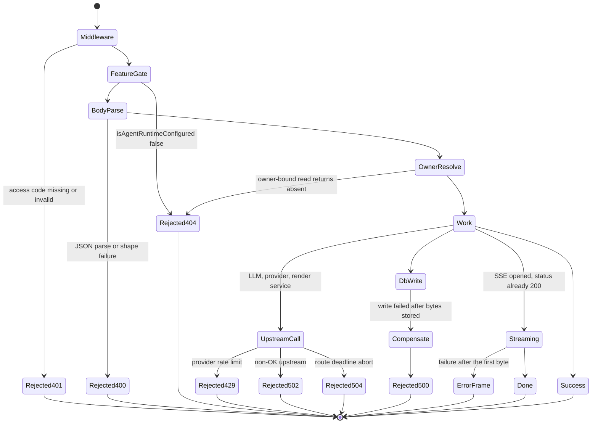
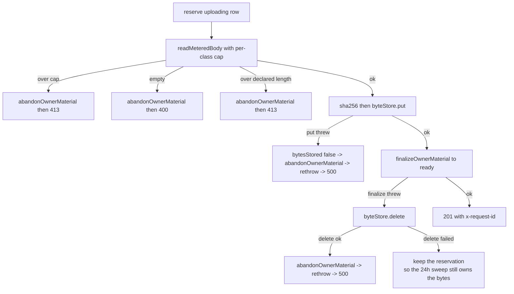

# Error handling and failure modes

## The status-code vocabulary actually in use

| Status | Where it comes from | Notes |
| --- | --- | --- |
| 200 | `apiSuccess`, `ownerJson`, bare `NextResponse.json` | includes streams that later carry an `error` frame |
| 201 | `classroom` POST, `stages` POST, `agent/skills` POST | |
| 202 | `agent/sessions` POST, `agent/sessions/:id/cancel`, `agent/sessions/:id/messages`, `generate-classroom` POST, `export-video/render` POST | every async-work handoff |
| 204 | `agent/skills/:id` DELETE, `chat/pi/whiteboard-visibility` POST | |
| 206 / 416 | `classroom-media` Range handling | 416 is explicitly `no-store` |
| 302 | `export-video/render/:jobId/download` presigned passthrough | |
| 400 | pervasive; `INVALID_REQUEST`, `MISSING_REQUIRED_FIELD`, `MISSING_MODEL` | |
| 401 | middleware access-code, `MISSING_API_KEY`, `INVALID_CREDENTIALS`, `UNAUTHENTICATED`, `{error:'login_required'}` | four different shapes |
| 403 | `PROVIDER_DISABLED`, `INVALID_URL`, `REDIRECT_NOT_ALLOWED`, `{error:'forbidden'}`, plain `'Forbidden'` | |
| 404 | feature gates, `ownerNotFound`, `{error:'not_found'}`, `ASSET_NOT_FOUND`, `chat/pi` when the Pi flag is off | the same status means "not configured", "not yours", and "not there" |
| 405 | `agent/skills/:id` DELETE on a builtin | |
| 409 | `SESSION_ALREADY_TERMINAL`, `FOLDER_NAME_DUPLICATE`, `UserSkillError` duplicate/quota | |
| 413 | `materials`, `agent/skills`, `export-video/render`, `extract-document` | |
| 415 | `materials` POST on an unsupported MIME | only route using 415 |
| 429 | `RATE_LIMITED` from a TTS provider, from the render service, and `MaterialQuotaExceededError` | **no route rate-limits by itself** |
| 501 | `PROVIDER_DISABLED` when `RENDER_SERVICE_URL` is unset | |
| 502 | `UPSTREAM_ERROR`, `TOO_MANY_REDIRECTS` | |
| 503 | `PERSISTENCE_DEV_TOKEN_MISSING`, `extract-document` unconfigured asset store | |
| 504 | `generate/voice` deadline abort → `QWEN_VC_TIMEOUT` | only route with an explicit 504 |
| 500 | `INTERNAL_ERROR`, `GENERATION_FAILED`, `PARSE_FAILED`, `TRANSCRIPTION_FAILED`, `{error:'internal_error'}`, plain `'Internal Server Error'` | |



## Failure mode 1: a failure after the stream has opened

Six routes emit `text/event-stream` directly and four more do so through
`createSSEResponse`. In all ten the HTTP status is committed to 200 before any
work happens, so every downstream failure is an in-band frame:

- `chat` writes `data: {"type":"error","data":{"message":...}}` then closes
  (`app/api/chat/route.ts:174-185`).
- `chat/pi` does the same via `send({type:'error', ...})`
  (`app/api/chat/pi/route.ts:274-282`).
- `generate/scene-outlines-stream` writes `{type:'error', error}` after three
  failed attempts (`route.ts:673-683`) and also from the outer catch (`:684-689`).
- `createSSEResponse` converts a generator throw into an `error` frame with code
  `STREAM_ERROR` followed by a `done` frame (`lib/pbl/v2/api/sse.ts:265-273`).
- The agent event streams never emit an error frame; a read failure degrades to
  `caught_up {degraded:true}` after three consecutive failures and the client is
  expected to schedule a full reconciliation
  (`app/api/agent/sessions/[id]/events/route.ts:195-199`, `owner-events:134-137`).

Consequence for callers: `res.ok` is not a success signal for any streaming
route. A client that only checks the status will treat a total generation failure
as a success with zero outlines.

## Failure mode 2: client disconnect

| Route | Disconnect handling |
| --- | --- |
| `chat` | `signal.aborted` checked per event; writer closed silently (`:143-146`, `:157-166`) |
| `chat/pi` | a child `AbortController` mirrors `req.signal` into the director loop (`:131-133`) |
| `generate/scene-outlines-stream` | `abortSignal: req.signal` passed to `streamLLM`; per-chunk and per-retry checks so a disconnect does not burn retries (`:504`, `:536-539`, `:636-639`) |
| `agent/sessions/:id/events`, `owner-events`, `stages/:id/freshness` | `cancel()` sets `closed` and clears the poll timer, the heartbeat, and the NOTIFY subscription; `write()` also self-closes when `enqueue` throws because some runtimes never call `cancel()` (`events:122-134`, `:290-293`) |
| `createSSEResponse` | `signal.addEventListener('abort', onAbort, {once:true})`, and the listener is removed in `safeClose` (`sse.ts:229-246`) |
| `export-video/render/:jobId/download` | the 30 s timer bounds only the header fetch and is cleared once headers arrive, so a slow MP4 is not truncated (`:27-37`) |

Non-streaming routes generally do **not** check `req.signal`; an abandoned
`POST /api/generate/image` runs its provider call to completion.

## Failure mode 3: partial writes and compensation

`materials` POST is the only route with real compensation logic:



The ordering invariant is stated in the code: the object key is recorded by the
reservation *before* the bytes are written, so a crash after the write leaves a
durable pointer for the 24-hour reclaim
(`app/api/materials/route.ts:338-340`), and the stale sweep deletes bytes before
removing reservations (`:232-257`).

`agent/sessions` POST compensates the other direction: if
`bindOwnerMaterialsToSession` or `postUserMessage` fails after
`createSession` succeeded, it soft-deletes the session
(`app/api/agent/sessions/route.ts:177`).

No other route compensates. `classroom` POST writes to disk with
`persistClassroom` and simply 500s on failure; a partially written classroom
directory is not cleaned up (`app/api/classroom/route.ts:34-48`).

## Failure mode 4: silent degradation

Places where a failure produces a **success** response:

| Route | Behaviour | Line |
| --- | --- | --- |
| `comfyui-workflows` | any listing error → `200 {workflows: []}` | `route.ts:19-22` |
| `quiz-grade` | unparseable LLM output → 50 % of the available points with a canned comment | `route.ts:95-103` |
| `web-search` | query-rewrite model unavailable → warn, then search on the raw requirement | `route.ts:148-150` |
| `generate/scene-content` | vision resolution budget/fuse trip → generate with fewer or zero images, one summary warn | `route.ts:301-309` |
| `generate/scene-outlines-stream` | buffer over 512 KiB → stop reading and finalise with whatever parsed | `route.ts:543-548` |
| `chat/pi` | persistence init failure for the native whiteboard → warn and continue without the capability | `route.ts:183-186` |
| `generate/voice` | `deleteVoice` without a caller key → `200 {deleted:false, localOnly:true}` | `route.ts:154-163` |
| `persistence/[...path]` | `ASSET_BYTE_EGRESS=redirect` with too-short grace → warn and use direct bytes | `route.ts:63-77` |
| `agent/sessions` POST | an unrecognised `/handle` in the prompt → no skill, never an error | `route.ts:117-131` |
| `materials` POST | stale-upload reclaim failure → warn and continue with the upload | `route.ts:251-257` |

Most of these carry an explicit rationale comment. `comfyui-workflows` and
`quiz-grade` do not explain themselves and are the two that would surprise a
caller most.

## Failure mode 5: error-message leakage

The surface is inconsistent about echoing internals:

- **Leaks `error.message` to the client**: `proxy-media` (`:87`),
  `web-search` (`:184-185`), `verify-model` (`:71-75`, plus the raw
  `resolveModel` message at `:33`), `generate/tts` (`:179-183`),
  `generate/voice` (`:246-250`), `generate/image` and `generate/video` (`:130`,
  `:128`), `classroom` (`details`), `transcription` (`details`), `parse-pdf`
  (`:91`), `extract-document` multipart form (`:652`), `azure-voices`
  (`details` carries the raw upstream body, `:49-54`),
  `generate/scene-outlines-stream` (`:714`).
- **Deliberately does not leak**: `generate/scene-content` and
  `generate/scene-actions` route everything through `llmApiError`, which keeps the
  provider's HTTP status but substitutes a fixed message
  (`lib/server/llm-error-response.ts:59-74`); `extract-document`'s JSON form
  returns a fixed `PARSE_FAILED` message (`:642-651`); `stages/**` tenancy routes
  return `{error:'internal_error'}` only (`publish:62-65`); `materials` returns a
  fixed `'material upload failed'` (`:391`).

Since several of the leaking routes take a client-supplied base URL, an
`error.message` can contain the upstream host and path. It will not contain the
API key — `resolveApiKey` output is never interpolated into a message anywhere in
the surface (checked across all 69 files).

## Failure mode 6: header injection in `Content-Disposition`

`export-video/render/[jobId]/download` interpolates the raw path segment:

```ts
'Content-Disposition': `attachment; filename="${jobId}.mp4"`,
```
`app/api/export-video/render/[jobId]/download/route.ts:57`

`jobId` is never validated in this route (it is only `encodeURIComponent`-ed for
the *upstream URL* at `:34`). A `jobId` containing `"` breaks out of the quoted
filename. CR/LF would be rejected by the `Headers` constructor, so this is
filename spoofing rather than response splitting. `skills/[id]` does the same
interpolation but validates first with `isSafeSkillId`
(`app/api/skills/[id]/route.ts:26`, `:18`), which is the pattern the download
route is missing.

## Failure mode 7: unauthenticated reachability

With `ACCESS_CODE` unset — the default in `.env` terms, since the middleware
short-circuits at `middleware.ts:61` — the following are reachable by anyone who
can reach the port:

- Every `generate/**` route: unbounded LLM, image, video and TTS spend against
  the operator's server-configured keys. There is no per-caller quota anywhere in
  `app/api/**`.
- `verify-*` and `provider/probe-models`: a network probe primitive, SSRF-guarded
  but with the guard's own error strings distinguishing "blocked" from
  "unreachable" from "reachable".
- `proxy-media`: an authenticated-by-nobody fetch primitive with a 25 MiB budget.
- `usage`: the deployment-wide usage log, including every model id in use.
- `server-providers` and `health`: the full provider inventory.
- `classroom` POST/GET: writes and reads classroom bundles on disk with no owner
  scoping.
- `stages/[id]/status`: documented as intentionally unauthenticated
  (`status/route.ts:7`).

The agent-runtime family is *not* in this list — it is owner-partitioned by the
anonymous cookie, which is a weak boundary but a real one.

## Failure mode 8: the two dead code paths

1. `stages/[id]/publish` and `stages/[id]/unpublish` reject any owner id starting
   with `anon:` (`publish/route.ts:26`, `unpublish/route.ts:25`). No call site
   passes `authenticatedOwnerId` to `resolveRequestOwnerId`, so every owner id is
   `anon:`-prefixed (`lib/server/agent-runtime/owner.ts:60`, `:64`) and both
   routes always return `401 {error:'login_required'}`. The code anticipates this
   — `owner.ts:46-50` says a future auth integration must thread the parameter
   through — but as shipped, publishing is unreachable.
2. `agent/skills/[id]` GET builds its 404 without the owner headers
   (`app/api/agent/skills/[id]/route.ts:22`), so a request that mints a fresh
   anonymous cookie and then misses drops the cookie and the next request mints a
   different owner. Every sibling route threads the headers.
