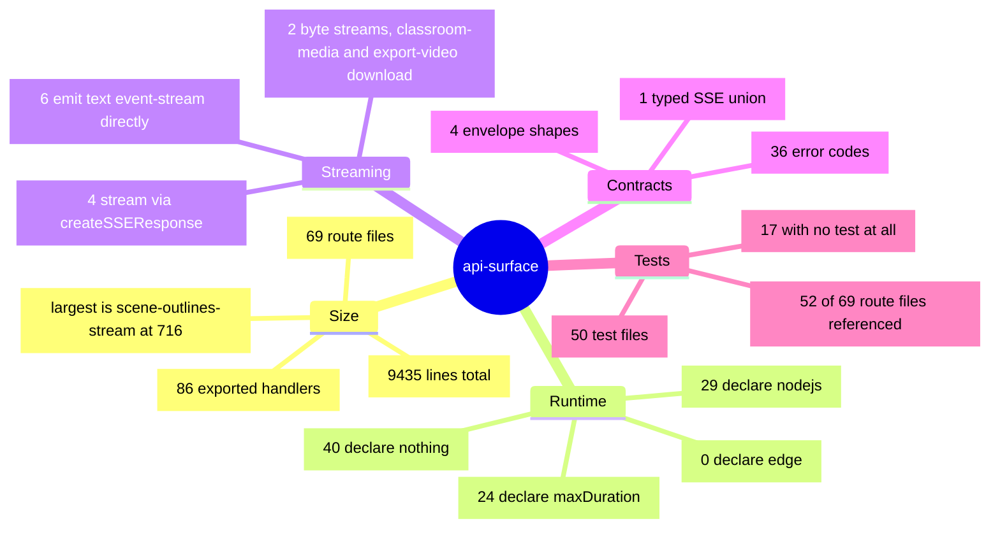
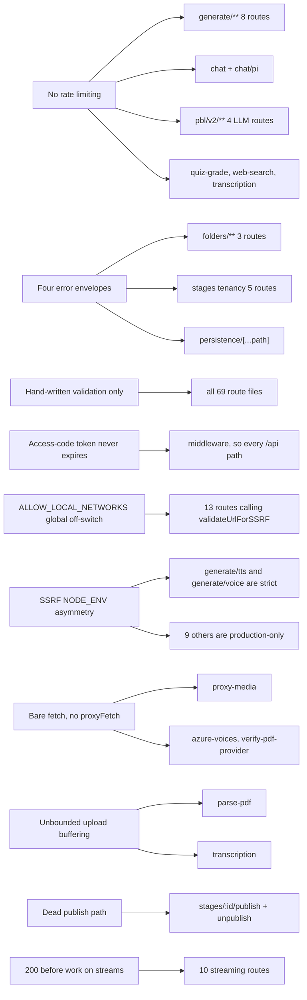

# Quality observations and measured metrics

## Metrics, each with the command that produced it

All commands were run from the repo root at `/local/home/cajias/Projects/OpenMAIC`
on branch `main`, HEAD `c2c9553a`.

| Metric | Value | Command |
| --- | --- | --- |
| Route files | **69** | `git ls-files 'app/api/*' \| grep -c 'route.ts$'` |
| Total route lines | **9435** | `git ls-files 'app/api/*' \| grep 'route.ts$' \| tr '\n' '\0' \| xargs -0 wc -l \| tail -1` |
| Exported HTTP handlers | **86** | node scan of the 69 files for `^export (async )?(function\|const) <METHOD>` |
| — `GET` | 31 | same scan |
| — `POST` | 44 | same scan |
| — `PUT` | 2 | same scan (`stages/[id]`, `persistence/[...path]`) |
| — `PATCH` | 4 | same scan |
| — `DELETE` | 5 | same scan |
| Files declaring `runtime = 'nodejs'` | **29** | node scan for `^export const runtime = 'nodejs'` |
| Files declaring `runtime = 'edge'` | **0** | node scan for `^export const runtime = 'edge'` |
| Files with no `runtime` declaration | **40** | 69 − 29 |
| Files declaring `maxDuration` | **24** | node scan for `^export const maxDuration =` |
| Files declaring `dynamic` | **5** | node scan for `^export const dynamic =` |
| Routes emitting `text/event-stream` directly | **6** | node filter on the literal `text/event-stream` |
| Routes streaming via `createSSEResponse` | **4** | node filter on the literal `createSSEResponse` |
| `API_ERROR_CODES` entries | **36** | regex `^\s{2}([A-Z0-9_]+):\s'` over `lib/server/api-response.ts` |
| Route files using `apiError` | **45** | node filter on `apiError(` |
| Route files using `{error:{code,message}}` | **4** | node filter on `error:\s*\{\s*code` |
| Route files using `{error:'snake_case'}` | **5** | node filter on `\{\s*error:\s*'(not_found\|internal_error\|forbidden\|login_required)'` |
| Route files returning a plain-text `'Not found'` body | **25** | node filter on `new (Next)?Response\('Not found'` |
| Distinct import specifiers across route files | **123** | node import-frequency scan (includes 2 false positives from template strings) |
| `process.env.X` reads inside route files | **9 distinct** | node scan for `process\.env\.([A-Za-z0-9_]+)` |
| Test files importing an `app/api/**` module | **50** | node scan of `git ls-files tests e2e eval` for quoted paths containing `app/api/` |
| Route files referenced from at least one test | **52 of 69** | same scan, matching each of the 69 paths (with and without the `.ts` suffix) against the collected specifiers |
| Route files referenced from **no** test | **17** | 69 − 52 |
| Distinct `app/api/**` specifiers appearing in tests | **62** | same scan; includes `app/api/probe/route`, a synthetic path in `tests/lint-llm-entry-guard.test.ts:47` that is not a real route |
| Root runtime dependencies | **132** | `node -e` over `package.json` |
| `zod` usage in `app/api/**` | **0 files** | `grep -rln "from 'zod'" app/api` |

Shared-helper import counts (route files importing each specifier), from the
import-frequency scan:

| Specifier | Route files |
| --- | --- |
| `next/server` | 62 |
| `@/lib/server/api-response` | 48 |
| `@/lib/logger` | 35 |
| `@/lib/config/feature-flags` | 29 |
| `@/lib/server/agent-runtime/with-owner` | 22 |
| `@/lib/server/ssrf-guard` | 13 |
| `@/lib/server/resolve-model` | 13 |
| `@/lib/server/provider-config` | 13 |
| `@/lib/server/agent-runtime/route-response` | 10 |
| `@openmaic/storage` | 8 |
| `@/lib/server/agent-runtime/store` | 7 |
| `@/lib/ai/llm` | 7 |

The 17 route files no test references, verbatim from the scan:

`access-code/status`, `access-code/verify`, `azure-voices`, `chat` (the non-Pi
one), `classroom`, `comfyui-workflows`, `export-video/capability`,
`export-video/render`, `export-video/render/[jobId]`,
`export-video/render/[jobId]/download`, `generate-classroom`,
`generate-classroom/[jobId]`, `health`, `pbl/v2/task/update`, `quiz-grade`,
`server-providers`, `skills/[id]`.

The notable gaps are the four `export-video/**` routes (the only ones handling a
300 MiB streamed upload and a byte-stream response), `classroom` (the only POST
that writes to the filesystem), `access-code/verify` (the credential check
itself), and `pbl/v2/task/update` (162 lines of state-machine mutation with five
branches). Of the 52 files that *are* referenced, `parse-pdf` is referenced only
by `tests/providers/provider-neutrality-guard.test.ts`, which lints source text
rather than invoking the handler — so 51 route files have a test that actually
calls into them.

## What is genuinely well built

**1. The no-existence-oracle posture is real and consistent.** 25 route files
return a byte-identical plain-text `404 'Not found'` for "feature off", "not
yours" and "does not exist". `agent/sessions/[id]/events` goes further and
resolves the owner cookie *before* the session lookup precisely so the two 404s
carry identical cookie headers
(`app/api/agent/sessions/[id]/events/route.ts:68-85`). The invariant is written
down where it is implemented (`lib/server/agent-runtime/route-response.ts:36-40`).

**2. The SSE routes are unusually careful.** Both agent event streams serialise
polling behind a single in-flight promise and coalesce NOTIFY wakeups into
exactly one follow-up read, with the reason spelled out: two concurrent polls
share a cursor and would emit duplicates or rewind it
(`events/route.ts:255-259`). Backlog exhaustion is judged on the *raw* page size
rather than the compacted length so a page of pure `message_update` frames does
not look exhausted mid-log (`events/route.ts:202-205`). The wakeup subscription
is registered before the first read to close the race window (`:280-284`). Both
streams treat an `enqueue` throw as closure because "some runtimes do not invoke
cancel() for every broken socket" (`owner-events/route.ts:92-98`).

**3. Upload bounds are enforced on real bytes, not on `Content-Length`.**
`capBodyStream` (`lib/server/capped-stream.ts:19`) and `readMeteredBody`
(`app/api/materials/route.ts:400`) both count bytes as they flow and abort the
stream on the cap; the declared-length check is explicitly documented as "only a
courtesy 413 for honest clients"
(`app/api/export-video/render/route.ts:52-55`). `materials` additionally reserves
the per-file maximum when `Content-Length` is stripped by an intermediary, so an
unmeasured stream cannot bypass the owner byte quota (`:226-229`).

**4. The SSRF address classifier is better than most.** It unwraps IPv4-mapped
IPv6, 6to4, Teredo and ISATAP embedded addresses
(`lib/server/ssrf-guard.ts:216-241`) and blocks three cloud metadata addresses
plus `metadata.google.internal` (`:11-12`). `proxy-media` re-validates every
redirect hop (`app/api/proxy-media/route.ts:54-56`).

**5. Model routing has a coherent credential story.** When `MODEL_ROUTES` pins a
stage, the client's `apiKey`/`baseUrl`/`providerType` are discarded, so a routed
Anthropic model can never be built with the client's OpenAI credentials
(`lib/server/resolve-model.ts:72-81`). There is no hardcoded vendor fallback —
unresolvable config throws (`:66-70`).

**6. Timeout scoping is thought through in the places it matters.** The MP4
download bounds only the header fetch, not the body stream, so a large file over
a slow link is not truncated
(`app/api/export-video/render/[jobId]/download/route.ts:27-31`).
`generate/voice` composes a route deadline with a shorter lookup slice and cleans
up both listeners (`app/api/generate/voice/route.ts:39-62`, `:251-254`).

**7. Test coverage of the handlers is high for this style of codebase.** 52 of 69
route files are referenced by at least one test, including PostgreSQL-backed
integration tests (`tests/agent-runtime/session-events-live.pg.test.ts`) and a
cross-cutting gate test that asserts all persistence routes 404 when the runtime
is off (`tests/agent-runtime/persistence-routes-gate.test.ts`, which imports 13
route modules).

**8. Comment density is high and the comments explain *why*.** Nearly every
non-obvious branch carries a rationale, several citing issue numbers (`#398`,
`#665`, `#745`, `#865`, `#866`, `#1153`). This survey was possible largely because
the decisions are written down at the decision site.

## What is fragile

**1. No rate limiting anywhere in `app/api/**`.** The only 429s originate
upstream (a TTS provider, the render service) or from a per-owner *storage* quota
(`MaterialQuotaExceededError` → 429, `app/api/materials/route.ts:279-285`). With
`ACCESS_CODE` unset, every `generate/**` route is an open, unmetered spend
primitive against the operator's keys. `export-video/render` is the only route
that even derives a caller identity, and it delegates enforcement to the render
service (`route.ts:23-38`).

**2. Four error envelopes plus bare-JSON responses.** `apiError` (45 files),
`{error:{code,message}}` (4), `{error:'snake_case'}` (5), plain text (25), and
bare arrays/objects (`GET /api/agent/sessions` returns an array;
`GET /api/stages/[id]` returns the document). A generic client cannot parse
errors uniformly. Three of the shapes exist to match a reference implementation
the routes were ported from, which is a reason but not a contract.

**3. Validation is entirely hand-written, with 69 different dialects.** `zod` is
a dependency and is not used in a single route. The quality range is wide:
`chat/pi/whiteboard-visibility` rejects unknown keys via `Reflect.ownKeys`
(`route.ts:11-29`) while `usage` splits `?months` on commas with no format check
at all (`route.ts:73-74`) and `pbl/v2/task/update` accepts an arbitrary
`PBLProjectV2` from the client and mutates it (`route.ts:51-59`).

**4. The access-code token never expires server-side.** `verifyToken`
(`middleware.ts:18-44`) and `verifyAccessToken`
(`lib/server/access-token.ts:11-25`) both ignore the timestamp half they verify.
Rotating `ACCESS_CODE` is the only revocation mechanism, and it invalidates every
session at once.

**5. `ALLOW_LOCAL_NETWORKS` is a single global off-switch for 20 call sites in 16
modules.** When it is set, `validateUrlForSSRF` returns `null` at `:267-269` —
*after* the `new URL()` parse (`:255-259`) and the http/https protocol check
(`:261-263`), which still reject, and *before* the hostname, private-IP and DNS
checks, which do not run (`lib/server/ssrf-guard.ts:266-269`). The block message
advertises the switch to the caller (`:246-247`). An operator enabling it for one
internal gateway disables those checks for `proxy-media` (initial URL and every
redirect hop), every `verify-*` route, `provider/probe-models`, and — less
obviously — `lib/server/resolve-model.ts:106` and the agent-runtime redirect loops
in `generate-image.ts:111` / `generate-video.ts:155`, simultaneously.

**6. SSRF strictness is inconsistent across sibling routes.** `generate/tts`
(`route.ts:97-102`) and `generate/voice` (`:125-130`) validate a client base URL
unconditionally; `generate/image` (`:70-75`), `generate/video` (`:65-70`),
`transcription` (`:57-62`), `parse-pdf` (`:47-52`), `extract-document`,
`verify-image-provider`, `verify-video-provider`, `verify-pdf-provider` and
`resolve-model` (`:105-110`) all gate on `NODE_ENV === 'production'`. Neither
group explains the difference.

**7. Check-then-fetch DNS gap.** `validateUrlForSSRF` performs its own
`dns.lookup` (`ssrf-guard.ts:288`) and the subsequent `fetch` resolves
independently, so a rebinding record can differ between validation and
connection. The strict, IP-pinning path (`normalizeUrlForStrictFetch` +
`assertSafeIp`, used by `lib/server/agent-runtime/fetch-url.ts:50`) exists but no
route uses it.

**8. `proxy-media` and every `verify-*` route bypass `proxyFetch`.** They call
bare `fetch`, so a deployment behind a forward proxy silently fails those calls
while `export-video/**` succeeds. `proxy-media` also fully buffers the response
with `response.blob()` (`route.ts:72`) before the size check, so a lying
`content-length` still costs the real byte count in memory.

**9. `persistence/[...path]` buffers every response in memory.** The
`ServerResponse` shim accumulates `Buffer[]` and resolves a single `Response` at
`end()` (`route.ts:187`, `:235-245`). Asset byte reads therefore have no
streaming path unless `ASSET_BYTE_EGRESS=redirect` is on. The route's own
authenticator takes the partition key from a client-supplied header and the file
says so (`lib/persistence/server-auth.ts:1-13`).

**10. Publishing is dead code.** `stages/[id]/publish` and `unpublish` reject
`anon:`-prefixed owners, and every owner is `anon:`-prefixed because no call site
passes `authenticatedOwnerId`. See `05-failure-modes.md` §8.

**11. Two unbounded upload paths.** `parse-pdf` (`route.ts:61-62`) and
`transcription` (`route.ts:79`) buffer the whole uploaded file with no size cap
of their own, unlike `extract-document` (413 at
`MAX_EXTRACT_DOCUMENT_FILE_SIZE_BYTES`) and `materials` (per-class caps). The
framework's body limit is the only bound.

**12. `Content-Disposition` filename injection.**
`export-video/render/[jobId]/download/route.ts:57` interpolates an unvalidated
path segment into a quoted header value; `skills/[id]` validates first with
`isSafeSkillId`. See `05-failure-modes.md` §6.

**13. Streaming routes commit a 200 before doing work.** Ten routes do this, so
`res.ok` is not a success signal and a caller must parse the frames. Only the
four PBL routes have a typed event union to parse against
(`lib/pbl/v2/api/sse.ts:168-175`); the other six document their events in
comments.

**14. `agent/skills/[id]` drops the owner cookie on its 404**
(`route.ts:22`), the one place in the family that breaks the
"headers ride every response" invariant `with-owner.ts:7-10` exists to enforce.

## Which fragility touches which route family

