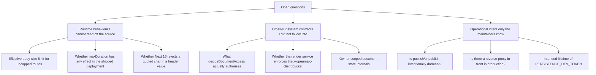

# Open questions

Everything here is something I could not settle by reading the code in scope. No
guesses are recorded as facts.

## Runtime behaviour

1. **What is the effective request-body limit for the routes with no cap of their
   own?** `parse-pdf` ([`route.ts:61-62`](app/api/parse-pdf/route.ts#L61-L62)) and `transcription` ([`route.ts:79`](app/api/transcription/route.ts#L79)) buffer
   the whole upload with no explicit check. Next.js App Router route handlers do
   not use the old `api.bodyParser.sizeLimit` config, and I found no
   `next.config` setting or reverse-proxy config in scope that bounds it. Whether
   these are effectively unbounded depends on the deployment (`next start` vs a
   platform adapter vs an nginx `client_max_body_size`), which I cannot read from
   `app/api/**`.

2. **Does `maxDuration` do anything in the target deployment?** 24 files declare
   it, and three comments state plainly that self-hosted `next start` ignores it
   and that it remains useful only to a platform build adapter
   ([`app/api/agent/owner-events/route.ts:19-21`](app/api/agent/owner-events/route.ts#L19-L21),
   [`app/api/agent/sessions/[id]/events/route.ts:44-46`](app/api/agent/sessions/[id]/events/route.ts#L44-L46),
   [`app/api/generate/image/route.ts:41`](app/api/generate/image/route.ts#L41)). Which deployment target is primary — and
   therefore whether the 300 s ceilings are real — is not determinable here.

3. **Would Next 16 / undici reject a `"` inside a `Content-Disposition` value?**
   The filename-injection concern at
   [`app/api/export-video/render/[jobId]/download/route.ts:57`](app/api/export-video/render/[jobId]/download/route.ts#L57) assumes a quote
   passes through. CR/LF is certainly rejected by the `Headers` constructor; a
   double quote almost certainly is not, but I did not run it. Confirming needs a
   request with a crafted `jobId`, which is outside a read-only survey.

4. **What does the framework do with the `PUT`/`PATCH` methods the
   `persistence/[...path]` shim never receives?** The five method consts all
   delegate to one handler ([`route.ts:325-329`](app/api/persistence/[...path]/route.ts#L325-L329)), and the Node-style handler decides
   from `request.method`. Whether `createStorageHttpHandler` answers 405 for an
   unrouted method/path combination, or falls through to something else, is inside
   `@openmaic/storage`.

## Cross-subsystem contracts I deliberately did not follow into

5. **`decideDocumentAccess(action, ownerId, readStageMeta, existsProbe, readStageMeta)`**
   ([`app/api/persistence/[...path]/route.ts:291-300`](app/api/persistence/[...path]/route.ts#L291-L300)) is the entire authorisation
   decision for `/documents*` traffic through the embedded storage handler, and it
   lives in `lib/persistence/document-access.ts`. I did not read it, so I cannot
   state which actions it allows for a non-owner, nor what the third and fifth
   arguments (both `readStageMeta`) mean semantically. This is the single largest
   gap in the survey's authorisation story.

6. **Does the render service actually enforce a per-identity limit on
   `x-openmaic-client`?** [`app/api/export-video/render/route.ts:23-38`](app/api/export-video/render/route.ts#L23-L38) describes
   the header as feeding "the render service's per-identity guard" and maps an
   upstream 429 to `RATE_LIMITED` (`:88-96`). The enforcement lives in
   `render-service/`, out of scope. If it does not enforce, the surface has no rate
   limiting at all rather than one delegated case.

7. **`getOwnerScopedDocumentStore(ownerId)`** — every `stages/**`, `folders/**`
   route depends on it re-checking the owner scope *inside* its write transaction
   (asserted in comments at [`app/api/stages/[id]/route.ts:5-9`](app/api/stages/[id]/route.ts#L5-L9) and
   [`app/api/stage-meta/[stageId]/route.ts:52-55`](app/api/stage-meta/[stageId]/route.ts#L52-L55)). I did not verify that claim in
   `lib/server/agent-runtime/owner-scoped-documents.ts` or in the storage package.
   If it does not hold, `PUT /api/stages/[id]` would be writable across owners
   despite the pre-read.

8. **`bindOwnerMaterialsToSession` and `SessionMaterialBindingError`** — the
   session and message routes both convert that error to a plain 404
   ([`sessions/route.ts:178-180`](app/api/agent/sessions/route.ts#L178-L180), [`messages/route.ts:113-115`](app/api/agent/sessions/[id]/messages/route.ts#L113-L115)). Whether it fires for
   "material belongs to someone else" as well as "material does not exist" decides
   whether the 404 is an authorisation answer or an existence answer.

9. **`resolveVisionImagesForPrompt(images, req.headers)`** takes the raw request
   headers ([`app/api/generate/scene-content/route.ts:142`](app/api/generate/scene-content/route.ts#L142),
   [`scene-outlines-stream/route.ts:358`](app/api/generate/scene-outlines-stream/route.ts#L358)), which implies it re-authenticates against
   the persistence layer using client-supplied headers. Which principal it resolves
   under, and therefore whether one caller can name another's asset id, is in
   `lib/persistence/resolve-vision-images.ts`.

10. **`resolveServerAsset(assetId, req.headers, cap)`** in `extract-document`
    ([`route.ts:533-537`](app/api/extract-document/route.ts#L533-L537)) returns a status union including `'unauthenticated'`, so it
    performs its own auth. Same question as above: whose assets are reachable.

## Operational intent

11. **Is `stages/[id]/publish` / `unpublish` intentionally dormant, or a
    regression?** [`lib/server/agent-runtime/owner.ts:46-50`](lib/server/agent-runtime/owner.ts#L46-L50) reads like a
    forward-looking note ("a future auth integration must thread
    `authenticatedOwnerId` through those call sites"), which suggests intentional.
    But `publish` was written with a full owner/forbidden/idempotent ladder that
    can never execute past its first guard, which suggests it was written against
    an auth layer that has not landed. I cannot tell which from the code, and
    `tests/agent-runtime/stage-meta-routes.test.ts` exists but I did not read its
    assertions.

12. **Is a trusted reverse proxy assumed in production?**
    `TRUST_PROXY_HEADERS` defaults off and the comment says the default Compose
    setup exposes the app directly ([`export-video/render/route.ts:23-31`](app/api/export-video/render/route.ts#L23-L31)). If a
    proxy *is* present in the real deployment, `clientIdentity` collapses every
    caller into one `'direct'` bucket unnecessarily. No deployment manifest in
    scope answers this.

13. **What is the intended lifetime of the `PERSISTENCE_DEV_TOKEN` scheme?**
    [`lib/persistence/server-auth.ts:1-13`](lib/persistence/server-auth.ts#L1-L13) says production must replace the module.
    Two routes (`persistence/[...path]`, `chat/pi/whiteboard-visibility`) and one
    capability path (`chat/pi`'s native whiteboard) depend on it. Whether the
    replacement is planned, and whether `/documents*` traffic is considered
    production-ready today because it uses the anonymous-owner path instead, is a
    roadmap question.

14. **Why is SSRF validation unconditional in `generate/tts` and
    `generate/voice` but production-only everywhere else?** Neither group carries a
    comment. Either the strict pair is the intended target state and the rest is
    drift, or the loose group is intended and the pair is an oversight. The code
    does not say.

15. **Is `comfyui-workflows` returning `{workflows: []}` on error deliberate?**
    ([`route.ts:19-22`](app/api/comfyui-workflows/route.ts#L19-L22).) Every other silent degradation in the surface has a
    rationale comment; this one does not, and it makes "ComfyUI is misconfigured"
    indistinguishable from "no workflows installed".

16. **Is the `403 'Forbidden'` in `agent/sessions/[id]/messages`
    ([`route.ts:116-118`](app/api/agent/sessions/[id]/messages/route.ts#L116-L118)) a deliberate exception to the no-existence-oracle rule?**
    It is only reachable after the ownership pre-check has passed, so it may be
    unreachable in practice — but if `AgentSessionAccessError` can fire for a
    concurrent ownership change, it distinguishes "yours a moment ago" from "never
    yours", which the rest of the family refuses to do.

## Things I confirmed are *not* questions

- There is no OpenAPI/JSON-schema artifact for this surface. Searched for one
  while enumerating the tree; none exists.
- `lib/api/*` is not an HTTP module (see `00-overview.md`). Confirmed by reading
  `lib/api/stage-api.ts` and `lib/api/stage-api-types.ts` and finding no route
  file importing either.
- `app/api/probe/route` does not exist. It is a synthetic path in a lint guard's
  allowlist ([`tests/lint-llm-entry-guard.test.ts:47`](tests/lint-llm-entry-guard.test.ts#L47)).
