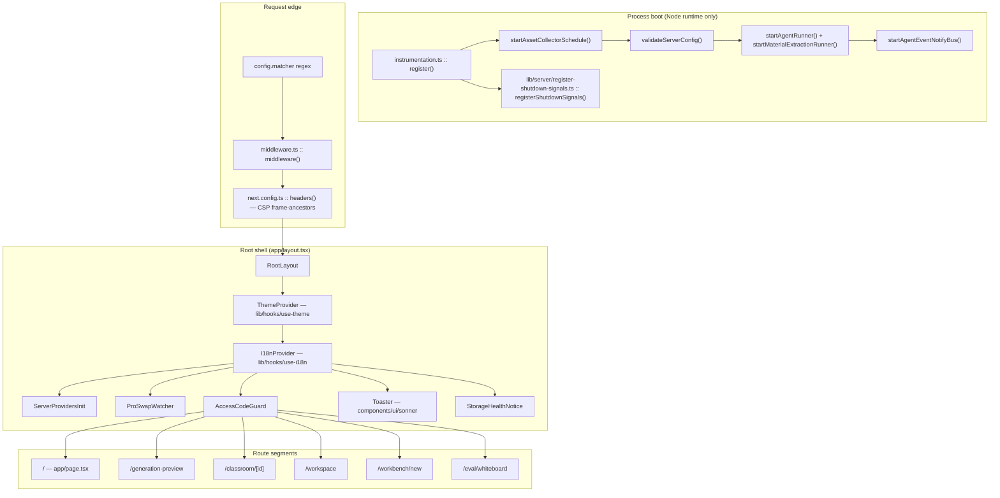
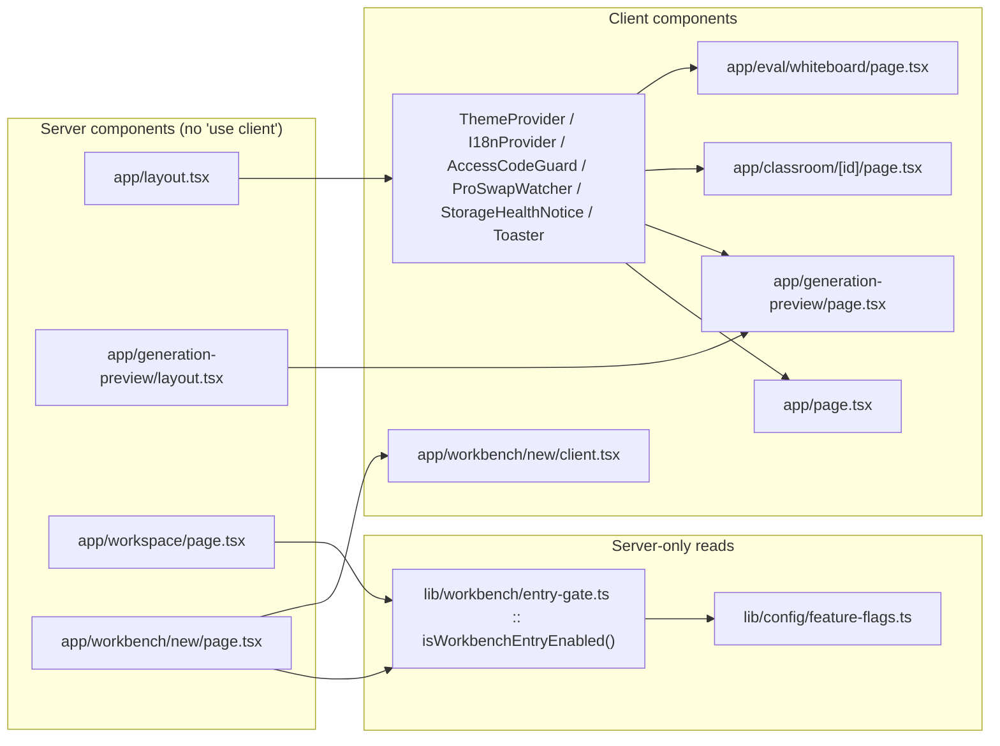

# 00 — Overview: app shell, routing, middleware, instrumentation

**Slug:** `app-shell-and-routing`
**Surveyed at commit:** `c2c9553a` (`main`)

## What this subsystem is

Everything between "an HTTP request hits the Next server" and "a product surface
is mounted in the browser", plus the process-lifecycle hooks that run once per
server instance. Concretely:

- The **route tree** — six `page.tsx` segments outside `app/api` (measured, see
  `06-quality-and-metrics.md` M3) and two `layout.tsx` files (M4).
- The **root layout** (`app/layout.tsx`) and its ordered provider stack.
- **Edge/Node middleware** (`middleware.ts`) — the workbench 404 gate and the
  `ACCESS_CODE` site password.
- **Build and platform configuration** — `next.config.ts`, `vercel.json`,
  `tsconfig.json` / `tsconfig.build.json`, `postcss.config.mjs`,
  `components.json`.
- **`instrumentation.ts`** — the once-per-process startup schedule and graceful
  shutdown, with the `process.once` calls split into a node-only module.

It does **not** own: the 69 `app/api/**/route.ts` handlers (M5), the workbench
shell internals under `components/workbench/`, the classroom `Stage`, the
generation pipeline, or persistence. Those are named here only where the shell
crosses into them.

## Charter, as the code actually enforces it

1. **Every gate is server-authoritative where it can be.** The Pro workbench is
   gated three times over — in middleware (`middleware.ts:56`), in the route
   itself (`app/workspace/page.tsx:35`, `app/workbench/new/page.tsx:14`), and in
   the client badge via a runtime probe (`app/page.tsx:145`).
2. **The root layout mounts side effects, not chrome.** Four of the seven
   children of `<body>` render `null` and exist purely for their effects
   (`ServerProvidersInit`, `ProSwapWatcher`, `StorageHealthNotice`, and
   `AccessCodeGuard`'s modal branch).
3. **Nothing periodic starts from a route module.** `instrumentation.ts:1-12`
   states the rule explicitly: a route module can be instantiated more than once
   and gets no shutdown hook, so timers live in `register()`.
4. **The Edge bundle must stay small and Node-free.** Every Node-touching import
   inside `register()` is dynamic (`instrumentation.ts:19,28,37,42,48,50,85,100`)
   and guarded by `process.env.NEXT_RUNTIME !== 'nodejs'` at line 16.

## Internal parts

## Route map

| Route | Segment file | Component kind | Rendering | Renders |
| --- | --- | --- | --- | --- |
| `/` | `app/page.tsx:1894` | client (`'use client'` at line 1) | default (static shell, all data client-fetched) | `HomePage` — composer, recent-course discovery, folders, settings, Pro badge |
| `/generation-preview` | `app/generation-preview/page.tsx:1539` | client | `force-dynamic` via `app/generation-preview/layout.tsx:2` | `GenerationPreviewContent` inside `Suspense` — step visualiser, outline editor, agent reveal |
| `/classroom/[id]` | `app/classroom/[id]/page.tsx:28` | client | default | `ClassroomDetailPage` → `components/stage` `Stage`, wrapped in a second `ThemeProvider` + `MediaStageProvider` |
| `/workspace` | `app/workspace/page.tsx:34` | **server** | `force-dynamic` (line 32) | gate → `Suspense` → `WorkspaceEntry` → `WorkspaceShell` |
| `/workbench/new` | `app/workbench/new/page.tsx:13` | **server** | `force-dynamic` (line 11) | gate → `Suspense` → `WorkbenchLaunchBridge` (`app/workbench/new/client.tsx:45`) |
| `/eval/whiteboard` | `app/eval/whiteboard/page.tsx:105` | client | default | bare `ScreenElement` canvas driven by `window.__setElements`, used by `eval/whiteboard-layout/capture.ts:19` |

There is **no** `error.tsx`, `not-found.tsx`, `global-error.tsx`, `loading.tsx`,
`template.tsx`, `robots.ts`, `sitemap.ts`, or `opengraph-image` anywhere under
`app/` — verified with
`git ls-files app | grep -E "error|not-found|loading|template|robots|sitemap|opengraph|default"`,
which returns nothing. Consequences are in `05-failure-modes.md`.

## File inventory

| Path | Lines | Role |
| --- | --- | --- |
| `app/page.tsx` | 1896 | `/` — home surface; largest file in scope |
| `app/generation-preview/page.tsx` | 1554 | generation progress + outline review |
| `app/generation-preview/components/visualizers.tsx` | 848 | per-step animated visualisers |
| `app/globals.css` | 578 | Tailwind v4 entry, `@theme` tokens, `@source` scan hints |
| `app/classroom/[id]/page.tsx` | 256 | classroom loader + generation resume |
| `app/generation-preview/types.ts` | 147 | `GenerationSessionState`, step table |
| `app/workbench/new/client.tsx` | 139 | legacy launch-link bridge |
| `instrumentation.ts` | 102 | `register()` — startup + shutdown |
| `app/eval/whiteboard/page.tsx` | 107 | Playwright-driven render harness |
| `middleware.ts` | 90 | workbench gate + `ACCESS_CODE` |
| `app/layout.tsx` | 63 | root layout + provider stack |
| `next.config.ts` | 59 | output mode, externals, security headers |
| `app/workspace/page.tsx` | 42 | Pro workspace entry (server gate) |
| `tsconfig.json` | 42 | dev typecheck config |
| `app/editor-fonts.ts` | 39 | ~23 `@fontsource` CSS side-effect imports |
| `components.json` | 26 | shadcn generator config |
| `app/workbench/new/page.tsx` | 21 | legacy entry (server gate) |
| `tsconfig.build.json` | 16 | production typecheck (excludes tests) |
| `vercel.json` | 11 | Vercel framework + 300s API `maxDuration` |
| `postcss.config.mjs` | 7 | `@tailwindcss/postcss` only |
| `app/generation-preview/layout.tsx` | 6 | `force-dynamic` marker |
| `app/generation-preview/vocational-mode.ts` | 6 | one helper |
| `app/generation-preview/foreground-retry.ts` | 4 | one retry-options constant |
| `components/site-header/theme-toggle.tsx` | 66 | the only file in `components/site-header/` |

Command: `git ls-files app | grep -v '^app/api/' | xargs wc -l`, plus
`wc -l` on the root config files.

## Server/client boundary in one picture

What crosses the boundary is deliberately narrow: **only `children` and
`ReactNode`**. No server component in this subsystem passes a serialised prop, a
server action, or fetched data to a client component. Every gate decision is
consumed on the server and converted into control flow (`redirect`, `notFound`)
before render — see `01-modules.md`.

## Files in this pack

Ten files. Every row links, so this table is the pack's navigation as well as its manifest.

| File | Contents |
| --- | --- |
| `00-overview.md` | this file |
| [`01-modules.md`](./01-modules.md) | per-module responsibilities with `path:line` anchors |
| [`02a-interfaces-lifecycle-and-routing.md`](./02a-interfaces-lifecycle-and-routing.md) | verbatim signatures: `register()`, shutdown handles, middleware, route components, gates |
| [`02b-interfaces-client-contracts.md`](./02b-interfaces-client-contracts.md) | verbatim signatures: providers/context, pro-swap route handoff, deep-link serialisation |
| [`02c-interfaces-session-handoff.md`](./02c-interfaces-session-handoff.md) | verbatim signatures: the three `sessionStorage` handoff contracts and the `previewPhase` state machine |
| [`03-flows.md`](./03-flows.md) | four traced end-to-end flows: hop tables + sequence diagrams |
| [`04-dependencies-and-config.md`](./04-dependencies-and-config.md) | deps, env vars, config resolution, `components/ui` characterisation |
| [`05-failure-modes.md`](./05-failure-modes.md) | error handling and failure behaviour |
| [`06-quality-and-metrics.md`](./06-quality-and-metrics.md) | quality observations and every measured metric with its command |
| [`07-open-questions.md`](./07-open-questions.md) | what could not be determined, and why |

The interfaces section is split three ways because a single file exceeded the
350-line ceiling; `02a` / `02b` / `02c` cross-reference each other in their
headers. No section listed in the brief is omitted — every one has real content.
