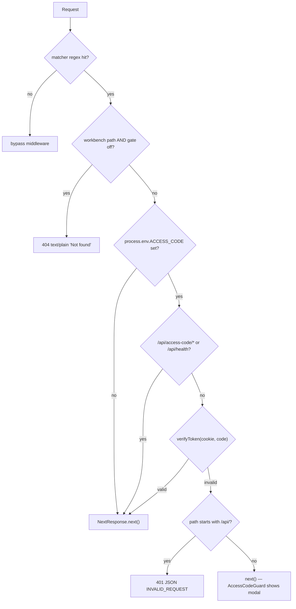
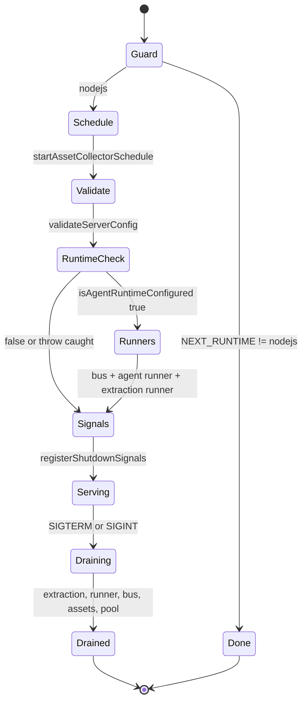

# 01 — Modules

One subsection per module that carries real behaviour. Anchors are
`path:line`. Skimmed-only modules are grouped at the end.

## `middleware.ts` — the request edge

Two unrelated responsibilities in one function, in a fixed order.

**Order ([`middleware.ts:46-86`](middleware.ts#L46-L86)):**

1. **Workbench 404 gate** (lines 53-58). Computes
   `canInspectServerRuntime = process.env.NEXT_RUNTIME !== 'edge'`, then
   `workbenchEnabled = isProWorkbenchEnabled() && (!canInspectServerRuntime || isAgentRuntimeConfigured())`.
   When false and the path is `/workbench` or `/workbench/*`, returns
   `new NextResponse('Not found', { status: 404 })`. This runs **before** the
   access-code check, so a workbench probe answers 404 even on an unauthenticated
   gated deployment.
2. **`ACCESS_CODE` short-circuit** (lines 60-63). Unset ⇒ `NextResponse.next()`
   and nothing else happens.
3. **Allowlist** (lines 66-68): `/api/access-code/*` prefix and exactly
   `/api/health`.
4. **Cookie verification** (lines 71-74): reads `openmaic_access` and calls the
   local `verifyToken` (line 18).
5. **API rejection** (lines 77-82): unauthenticated `/api/*` ⇒ JSON
   `{ success: false, errorCode: 'INVALID_REQUEST', error: 'Access code required' }`
   with status 401.
6. **Page pass-through** (line 85): every other unauthenticated request is let
   through, and `AccessCodeGuard` renders the modal client-side.

**Matcher ([`middleware.ts:89`](middleware.ts#L89)):** `'/((?!_next/static|_next/image|favicon.ico|logos/).*)'`.
So middleware runs for every page, every `/api/*` route, `apple-icon.png`,
`/avatars/*`, `/vendor/*` and `/logo-horizontal.png` — but not for the ~30 provider
SVGs under `public/logos/` (an invocation-cost exclusion, not a security one:
those paths would pass the gate anyway via step 6).

**Crypto ([`middleware.ts:5-44`](middleware.ts#L5-L44)):** hand-rolled Web Crypto HMAC-SHA256 so the
function stays Edge-compatible. `verifyToken` splits on the first `.`, re-signs
the timestamp half, and compares with an XOR accumulator after a length check
(line 38-43). The comment at line 37 is honest that this is not truly
constant-time in JS. The Node-side twin is [`lib/server/access-token.ts:11`](lib/server/access-token.ts#L11)
(`verifyAccessToken`), which uses `crypto.timingSafeEqual`. **Neither side
validates the timestamp** — see `06-quality-and-metrics.md`.



## `instrumentation.ts` — process-scoped startup and shutdown

`register()` (line 13) is the only `export`. Next calls it once per server
instance before the first request.

**Startup sequence, in source order:**

| Step | Line | Call | Notes |
| --- | --- | --- | --- |
| 1 | 16 | `if (process.env.NEXT_RUNTIME !== 'nodejs') return;` | Edge invocation is a no-op; asserted by [`tests/persistence/asset-collector-schedule.test.ts:290`](tests/persistence/asset-collector-schedule.test.ts#L290) |
| 2 | 19-21 | `startAssetCollectorSchedule()` | dynamic import so `pg` never enters the Edge bundle |
| 3 | 28-29 | `validateServerConfig()` | warn-only boot validation of `MODEL_ROUTES` / `DEFAULT_MODEL` / `<PREFIX>_MODELS` |
| 4 | 37-38 | `isAgentRuntimeConfigured()` | flag **and** non-empty `DATABASE_URL` |
| 5 | 42-45 | `startAgentEventNotifyBus()` | one dedicated `LISTEN` connection per instance |
| 6 | 48-49 | `startAgentRunner()` | installs a timer only; store init stays lazy |
| 7 | 50-51 | `startMaterialExtractionRunner()` | second worker loop |
| 8 | 100-101 | `registerShutdownSignals(shutdown)` | dynamic import, node-only module |

Steps 4-7 sit inside a `try`/`catch` (lines 36-55) that logs
`'[instrumentation] Agent runtime startup failed'` and continues. Steps 2 and 3
do **not**.

**Shutdown ([`instrumentation.ts:57-95`](instrumentation.ts#L57-L95)):** `shutdown` is memoised with
`shutdownPromise ??=` (line 59) so concurrent signals share one drain. Order is
deliberate and commented at lines 60-62 — sessions are parked before any pool
they use closes:

1. `extractionRunner?.stop()` (line 63)
2. `runner?.stop()` (line 68)
3. `stopAgentEventNotifyBus?.()` (line 73)
4. `assetSchedule?.stop()` (line 78)
5. `pool.end()` from `getServerPersistenceProvider(connectionString)` (lines 82-92)

Each step has its own `try`/`catch` with a distinct `console.error` prefix, so
one failing drain never skips the rest.



## `lib/server/register-shutdown-signals.ts` — the node-only split

Sixteen lines, one function (line 12):

```ts
export function registerShutdownSignals(shutdown: () => Promise<void>): void {
  process.once('SIGTERM', () => void shutdown());
  process.once('SIGINT', () => void shutdown());
}
```

The docstring (lines 4-11) gives the exact reason for the split: Turbopack's
static Edge-runtime scan flags a top-level `process.once` reference in the
Edge-analysed module graph and **cannot prove** the `NEXT_RUNTIME` guard in
[`instrumentation.ts:16`](instrumentation.ts#L16) makes it unreachable, so it warned on every compile.
Moving it behind a dynamic import at [`instrumentation.ts:100`](instrumentation.ts#L100) removes the
reference from that graph. Commit `1b2d9332` is the change.

`process.once` (not `on`) is what makes the handler self-removing; the memoised
`shutdownPromise` is the second, independent once-guard.
`tests/server/register-shutdown-signals.test.ts` asserts exactly one listener per
signal (line 14), single invocation on repeat emit (line 24, 42), and that the
listener count returns to 0 (line 39).

## `app/layout.tsx` — the root shell

`RootLayout` (line 37) is a server component. It renders
`<html lang="en" suppressHydrationWarning>` with `suppressHydrationWarning` also
on `<body>` (lines 43-47) — necessary because `ThemeProvider` adds/removes the
`dark` class on `documentElement` in an effect.

**Provider stack, outer to inner (lines 48-59):**

1. `ThemeProvider` — [`lib/hooks/use-theme.tsx:15`](lib/hooks/use-theme.tsx#L15)
2. `I18nProvider` — [`lib/hooks/use-i18n.tsx:29`](lib/hooks/use-i18n.tsx#L29)
3. `ServerProvidersInit` — renders `null`, fetches server-configured providers on mount
4. `ProSwapWatcher` — renders `null`, reports pathname arrivals to `pro-swap`
5. `AccessCodeGuard` — wraps `{children}`; the only child that receives them
6. `Toaster position="top-center"` — `components/ui/sonner.tsx`
7. `StorageHealthNotice` — renders `null`; deliberately **after** `Toaster`
   (comment at lines 54-56: a toast raised before its host exists has nowhere to go)

**Font strategy (lines 2-3, 16-29):** `GeistSans`/`GeistMono` come from
`next/font` and contribute CSS variables to `<body className>`. The UI font
(Inter) comes from the `@fontsource-variable/inter` **stylesheet** (line 29), not
`next/font`, because only the stylesheet carries per-subset `unicode-range`
declarations; `--font-sans` is therefore declared in [`app/globals.css:68`](app/globals.css#L68) rather
than by a generated class. The 14-line comment at lines 16-28 records both
failed alternatives.

**Global CSS imports (lines 4-7):** `./globals.css`,
`@openmaic/renderer/fonts.css`, `animate.css`, `katex/dist/katex.min.css`.

`metadata` (line 31) is a static object — title `OpenMAIC`. There is no
`generateMetadata` anywhere in the non-API tree.

## `lib/config/feature-flags.ts` — the flag vocabulary

14 exported predicates over one helper (`readBoolean`, line 10) that accepts only
the strings `'true'` and `'1'`. The split that matters:

| Kind | Reads | Functions |
| --- | --- | --- |
| server-only | `OPENMAIC_*` | `isAgentRuntimeEnabled` (18), `isAgentRuntimeConfigured` (23), `isPiNativeChildRuntimeEnabled` (80), `isPiNativeChildSpotlightEnabled` (88), `isVocationalTaskEngineEnabled` (97) |
| public / build-time | `NEXT_PUBLIC_*` | `isProWorkbenchEnabled` (32), `isMaicEditorEnabled` (47), `isPlaybackRendererEnabled` (55), `isEditorRendererEnabled` (64), `isPiChatEnabled` (72), `shouldShowVocationalTestUi` (111), `isVideoExportEnabled` (121), `isPptxImportEnabled` (127) |

`isAgentRuntimeConfigured` (line 23) is the pattern to internalise: a flag is not
a capability. It returns
`isAgentRuntimeEnabled() && Boolean(process.env.DATABASE_URL?.trim())`.
`isMaicEditorEnabled` (line 48) implies from the workbench flag — Pro mode always
ships the editor.

## `lib/workbench/entry-gate.ts` — the shared route gate

Six lines. `isWorkbenchEntryEnabled()` (line 4) =
`isProWorkbenchEnabled() && isAgentRuntimeConfigured()`. Both `/workspace` and
`/workbench/new` call exactly this, so the two entry routes cannot disagree.
[`tests/workbench/entry-gate.test.ts:29-41`](tests/workbench/entry-gate.test.ts#L29-L41) enumerates all five off-cases
including a whitespace-only `DATABASE_URL`.

## `app/workspace/page.tsx` — the Pro workspace entry

42 lines, 26 of which are a docstring explaining why the workspace is a route
rather than a `useState` on `/`. Behaviour:

- `export const dynamic = 'force-dynamic'` (line 32) — keeps the flags
  request-scoped instead of baked into a prerender.
- `if (!isWorkbenchEntryEnabled()) redirect('/')` (line 35) — redirect, not 404,
  because a workspace whose every submit 404s is worse than no workspace
  (docstring lines 10-16).
- `<Suspense fallback={null}><WorkspaceEntry /></Suspense>` (lines 38-40) — the
  boundary exists because the shell reads the initial deep-link snapshot from
  `useSearchParams`.

`WorkspaceEntry` ([`components/workbench/WorkspaceEntry.tsx:4`](components/workbench/WorkspaceEntry.tsx#L4)) is a 6-line
integration seam that returns `<WorkspaceShell />`.

**Stale-comment warning:** the docstring at lines 5-8 and the one in
[`components/workbench/workspace/WorkspaceShell.tsx:7`](components/workbench/workspace/WorkspaceShell.tsx#L7) both refer to an
`AppChrome` component that "suppresses `SiteHeader` on this path". Neither
`AppChrome` nor `SiteHeader` exists in this repository —
`git log --pretty=format: --name-only -- 'components/site-header/'` lists only
`theme-toggle.tsx`, and history is squashed at `04621578`. See
`06-quality-and-metrics.md`.

## `app/workbench/new/page.tsx` + `client.tsx` — the legacy launch bridge

The route is a compatibility shim, not a product surface. Server half (21 lines):
`force-dynamic` (line 11), `notFound()` when the gate is off (line 14) — note
**`notFound`, not `redirect`**, unlike `/workspace` — then
`Suspense` → `WorkbenchLaunchBridge`.

Client half ([`client.tsx:45`](app/workbench/new/client.tsx#L45)) consumes a launch intent exactly once:

1. `intent` is memoised from `searchParams.get('prompt')` and `('skill')`
   (lines 53-58); when absent it falls back to
   `sessionStorage['workbench.launchPrompt']` (line 61) — the rolling-deploy
   handoff key defined at line 23.
2. `parseLegacyHandoff` (line 32) accepts either a `{ v: 1, prompt }` JSON
   envelope or a bare string.
3. No prompt ⇒ `router.replace('/workspace')` (line 74).
4. Otherwise `createWorkbenchSession(...)` (line 77), then
   `router.replace(workspaceHref({ sessionId: session.id, courseId: null }))`
   (line 92).
5. `courseRefsAccepted === false` raises a warning toast (line 85).
6. A `WorkbenchApiError` with `status === 400` and `/unknown skill/i` retries once
   without the skill by setting `skillOverride` to `null` and bumping `attempt`
   (lines 95-105). Any other error renders a retry surface (lines 110-129).

The `launched` ref is keyed `` `${attempt}:${skill ?? ''}` `` (line 70), which is
what makes the retry re-fire while still preventing a double launch.

## `app/page.tsx` — the home surface

1896 lines, `'use client'`, one default export (`Page` at line 1894) that renders
`HomePage` (line 129). Three components live in the file: `HomePage`,
`GreetingBar` (line 1362), `ClassroomCard` (line 1641). 9 `useEffect` call sites
and 26 `useState` slots (measured — `06-quality-and-metrics.md` M14/M15).

Shell-relevant behaviour only:

- **Pro runtime probe** (lines 139-157). Module-level `workbenchRuntimeCache`
  (line 111) is a `boolean | null` retained across client navigations. The effect
  fetches `/api/agent/runtime`, reads `body?.enabled === true`, and a failed probe
  keeps the entry hidden and allows a later visit to retry (comment line 152).
- **Prefetch** (lines 163-165): `router.prefetch('/workspace')` once the entry is
  enabled.
- **Pro entry** (lines 159-162): `enterWorkbench()` resolves
  `workspaceResumeHref(readLastWorkspaceSessionId())` and hands the push to
  `startProSwap`.
- **Entrance suppression** (lines 135-136): `const [swapped] = useState(arrivedByProSwap)`
  and `heroEnter` returns `false` when swapped, so the hero does not replay after
  a route handoff.
- **Generation handoff** (lines 604-673): freeze the material set, write each
  blob with `storeDocumentBlob`, build `sessionState` (line 655), write
  `sessionStorage['generationSession']` (line 671), `router.push('/generation-preview')`.

## `app/generation-preview/*` — the progress surface

- `layout.tsx` (6 lines) exists only for `export const dynamic = 'force-dynamic'`
  (line 2), justified in its one-line comment as needed because the page uses
  client hooks.
- [`page.tsx:1539`](app/generation-preview/page.tsx#L1539) wraps `GenerationPreviewContent` in `Suspense` with a
  skeleton fallback.
- Session lifecycle: load on mount (lines 220-243), normalise a missing
  `previewPhase` (line 228), restore mid-stream review intent (lines 233-235),
  persist on every change via `persistSession` (line 176). Abort on unmount
  (lines 246-251).
- Exit paths: success writes `sessionStorage['generationParams']` (line 1040),
  removes `generationSession` (line 1050), `await store.saveToStorage()`, then
  `router.push('/classroom/${stage.id}')` (line 1052). `goBackToHome` (line 1073)
  aborts, clears the timer, removes the session, pushes `/`.
- [`types.ts:22`](app/generation-preview/types.ts#L22) defines `previewPhase` as
  `'preparing' | 'outline-ready' | 'review' | 'generating-content'`;
  `getActiveSteps` (line 135) filters `ALL_STEPS` per session.

## `app/classroom/[id]/page.tsx` — the classroom loader

`ClassroomDetailPage` (line 28) reads its id from `useParams()` (lines 29-30) —
a client read, not the server `params` prop.

Three phases:

1. **Reset on id change** (lines 112-139): `setLoading(true)`, clear the media
   store (`revokeObjectUrls()` then `tasks: {}`), clear whiteboard history, then
   `loadClassroom(() => !cancelled)`; cleanup calls `stop()`.
2. **Load** (`loadClassroom`, lines 45-110): claims a load token
   (`claimStageSceneLoadToken`), delegates to `runClassroomLoad` with 15 injected
   deps, then fires `fetchStageMeta(classroomId)` **after** the load so the
   ownership sidecar's answer wins (comment lines 78-82). Three outcomes are
   handled distinctly: `'found'` sets viewer access, `'unavailable'` records the
   outage without concluding "stranger's course", `'absent'` keeps the local
   editable default (lines 87-104).
3. **Resume** (lines 142-221): reads `sessionStorage['generationParams']`,
   rebuilds `imageMapping` from a **mix** of allocated `assetId`s and IndexedDB
   `storageId`s (comment lines 162-169), and either `generateRemaining(...)` or,
   for a finished deck, `markGenerationCompleteIfDone()` +
   `generateMediaForOutlines(...)` on only the outlines that still have a scene.

It renders its own `ThemeProvider` (line 224) nested inside the root layout's —
harmless, but redundant.

## `app/eval/whiteboard/page.tsx` — the harness route

A production route that exists for tooling. On mount it seeds the stage store
with a synthetic stage/scene (lines 21-51), then installs two globals:
`window.__setElements` (line 55) and `window.__evalReady = true` (line 79).
[`eval/whiteboard-layout/capture.ts:19-23`](eval/whiteboard-layout/capture.ts#L19-L23) navigates to `/eval/whiteboard` and
waits on `__evalReady` before injecting elements and screenshotting a fixed
1000x563 clip. `setReady` is deferred with `queueMicrotask` (line 81) to avoid a
cascading-render warning. This route is **not** flag-gated.

## Skimmed-only modules

- `app/generation-preview/components/visualizers.tsx` (848 lines) — per-step
  animated visualisers; presentation only.
- `app/globals.css` (578 lines) — Tailwind v4 entry. Lines 1-3 import
  `tailwindcss`, `tw-animate-css`, `shadcn/tailwind.css`; line 5 pulls the
  workbench chat skin; lines 9-16 are `@source` directives that force Tailwind to
  scan `streamdown`, `@openmaic/renderer/dist`, and a gitignored local sandbox.
  `@theme inline` (lines 20-61) maps `--color-*` to `--*` CSS variables.
- `app/editor-fonts.ts` (39 lines) — 23 `@fontsource` CSS imports. Its docstring
  claims it is "imported once from the root layout"; it is not. The only importer
  is [`lib/edit/preload-editor.ts:35`](lib/edit/preload-editor.ts#L35), a lazy `import()`.
- `components/site-header/theme-toggle.tsx` (66 lines) — a three-option theme
  popover with an outside-mousedown close. Its only importer is
  [`components/workbench/workspace/WorkspaceRail.tsx:100`](components/workbench/workspace/WorkspaceRail.tsx#L100).
- `components/ui/` (34 files, 3241 lines) — characterised in
  `04-dependencies-and-config.md`.
