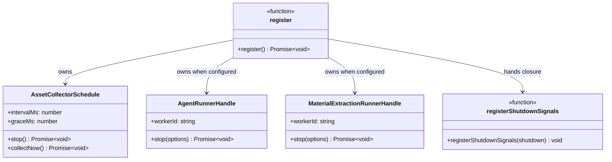
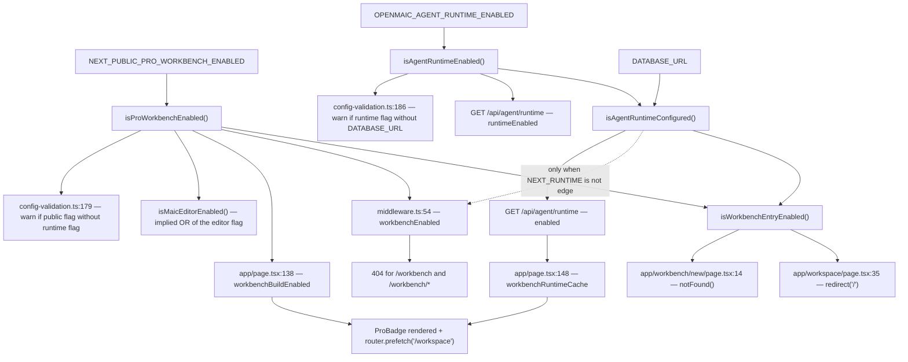

# 02a — Interfaces: process lifecycle, middleware, routes, gates

Part 1 of 2. Client-side contracts (providers, pro-swap, deep links, generation
handoff) are in `02b-interfaces-client-contracts.md`. Every signature below is
copied verbatim from the file at the cited line.

## Process lifecycle

[`instrumentation.ts:13`](instrumentation.ts#L13)

```ts
export async function register(): Promise<void>
```

[`lib/server/register-shutdown-signals.ts:12`](lib/server/register-shutdown-signals.ts#L12)

```ts
export function registerShutdownSignals(shutdown: () => Promise<void>): void
```

The three handle types `register()` consumes are declared elsewhere and imported
as `import(...)` types so the Edge module graph never sees them:

[`instrumentation.ts:31-34`](instrumentation.ts#L31-L34)

```ts
let runner: import('@/lib/server/agent-runtime/runner').AgentRunnerHandle | undefined;
let extractionRunner:
  | import('@/lib/server/material-extraction/runner').MaterialExtractionRunnerHandle
  | undefined;
```

[`lib/server/agent-runtime/runner.ts:850`](lib/server/agent-runtime/runner.ts#L850)

```ts
export interface AgentRunnerHandle {
  readonly workerId: string;
  stop(options?: { timeoutMs?: number }): Promise<void>;
}
```

[`lib/server/material-extraction/runner.ts:11`](lib/server/material-extraction/runner.ts#L11)

```ts
export interface MaterialExtractionRunnerHandle {
  workerId: string;
  stop(options?: { timeoutMs?: number }): Promise<void>;
}
```

[`lib/persistence/asset-collector-schedule.ts:42`](lib/persistence/asset-collector-schedule.ts#L42)

```ts
export interface AssetCollectorSchedule {
  /** Stop the schedule and release the pool. */
  stop(): Promise<void>;
  /** Run one pass now, awaiting it. Exposed for tests; the timer does not await. */
  collectNow(): Promise<void>;
  intervalMs: number;
  graceMs: number;
}
```

[`lib/persistence/asset-collector-schedule.ts:88`](lib/persistence/asset-collector-schedule.ts#L88)

```ts
export function startAssetCollectorSchedule(
  deps: AssetCollectorScheduleDeps = {},
): AssetCollectorSchedule | undefined
```

The `| undefined` return is why [`instrumentation.ts:78`](instrumentation.ts#L78) uses
`assetSchedule?.stop()`. It is `undefined` when server persistence is not
configured or the operator disabled collection
([`asset-collector-schedule.ts:80-87`](lib/persistence/asset-collector-schedule.ts#L80-L87)).



## Middleware

[`middleware.ts:46`](middleware.ts#L46) and [`:88`](middleware.ts#L88)

```ts
export async function middleware(request: NextRequest)
```

```ts
export const config = {
  matcher: ['/((?!_next/static|_next/image|favicon.ico|logos/).*)'],
};
```

Note there is no explicit return type on `middleware` — it returns
`NextResponse.next()`, `NextResponse.json(...)`, or a bare
`new NextResponse(body, init)` depending on branch.

Internal helpers (not exported): `encode` (line 6), `bufToHex` (line 11),
`verifyToken` (line 18):

```ts
async function verifyToken(token: string, accessCode: string): Promise<boolean>
```

Node-side counterparts, [`lib/server/access-token.ts:4`](lib/server/access-token.ts#L4) and [`:11`](lib/server/access-token.ts#L11):

```ts
export function createAccessToken(accessCode: string): string
export function verifyAccessToken(token: string, accessCode: string): boolean
```

The two verifiers are independent implementations of the same wire format
(`timestamp.hexSignature`): the Edge one uses `crypto.subtle` + an XOR compare,
the Node one uses `createHmac` + `timingSafeEqual`. Neither reads the timestamp.

## Route components

| Path | Signature |
| --- | --- |
| [`app/layout.tsx:37`](app/layout.tsx#L37) | `export default function RootLayout({ children }: Readonly<{ children: React.ReactNode }>)` |
| [`app/page.tsx:1894`](app/page.tsx#L1894) | `export default function Page()` |
| [`app/generation-preview/layout.tsx:4`](app/generation-preview/layout.tsx#L4) | `export default function GenerationPreviewLayout({ children }: { children: React.ReactNode })` |
| [`app/generation-preview/page.tsx:1539`](app/generation-preview/page.tsx#L1539) | `export default function GenerationPreviewPage()` |
| [`app/classroom/[id]/page.tsx:28`](app/classroom/[id]/page.tsx#L28) | `export default function ClassroomDetailPage()` |
| [`app/workspace/page.tsx:34`](app/workspace/page.tsx#L34) | `export default function WorkspacePage()` |
| [`app/workbench/new/page.tsx:13`](app/workbench/new/page.tsx#L13) | `export default function WorkbenchNewCompatibilityPage()` |
| [`app/eval/whiteboard/page.tsx:105`](app/eval/whiteboard/page.tsx#L105) | `export default function EvalWhiteboardPage()` |

Note the shape: **no route component in this subsystem takes `params` or
`searchParams` props.** `/classroom/[id]` reads its dynamic segment with
`useParams()` ([`app/classroom/[id]/page.tsx:29`](app/classroom/[id]/page.tsx#L29)); `/workspace` and
`/workbench/new` read query params client-side with `useSearchParams()` behind a
`Suspense` boundary. Consequence: none of the three can produce a server-rendered,
data-dependent response, and none of them can be statically prerendered per-id.

Route segment config exports outside `app/api` (the complete set):

```ts
// app/generation-preview/layout.tsx:2
export const dynamic = 'force-dynamic';
// app/workspace/page.tsx:32
export const dynamic = 'force-dynamic';
// app/workbench/new/page.tsx:11
export const dynamic = 'force-dynamic';
```

There is no `revalidate`, `runtime`, `fetchCache`, `generateMetadata`, or
`generateStaticParams` anywhere in the non-API tree.

[`app/layout.tsx:31`](app/layout.tsx#L31)

```ts
export const metadata: Metadata = {
  title: 'OpenMAIC',
  description:
    'The open-source AI interactive classroom. Upload a PDF to instantly generate an immersive, multi-agent learning experience.',
};
```

## Gates

[`lib/workbench/entry-gate.ts:4`](lib/workbench/entry-gate.ts#L4)

```ts
/** Server-authoritative decision shared by every workbench entry route. */
export function isWorkbenchEntryEnabled(): boolean {
  return isProWorkbenchEnabled() && isAgentRuntimeConfigured();
}
```

`lib/config/feature-flags.ts:10,18,23,32,47`

```ts
function readBoolean(envValue: string | undefined): boolean {
  return envValue === 'true' || envValue === '1';
}

/**
 * Server-only gate for durable background agent execution. This is evaluated
 * at process runtime and is never exposed to the browser bundle.
 */
export function isAgentRuntimeEnabled(): boolean;

/** The Node runtime can start the runner only with a non-empty database URL. */
export function isAgentRuntimeConfigured(): boolean;

export function isProWorkbenchEnabled(): boolean;
export function isMaicEditorEnabled(): boolean;
```

The remaining nine predicates share the same shape
(`() => boolean` over `readBoolean(process.env.X)`) and are tabulated in
`01-modules.md`. One is not a pure flag read:

[`lib/config/feature-flags.ts:101`](lib/config/feature-flags.ts#L101)

```ts
export function resolveVocationalActive(
  requirements?: { taskEngineMode?: boolean } | null,
): boolean {
  return Boolean(requirements?.taskEngineMode) && isVocationalTaskEngineEnabled();
}
```

The runtime probe the client gates on, [`app/api/agent/runtime/route.ts:16-24`](app/api/agent/runtime/route.ts#L16-L24):

```ts
export const runtime = 'nodejs';

export async function GET() {
  return Response.json({
    enabled: isAgentRuntimeConfigured(),
    runtimeEnabled: isAgentRuntimeEnabled(),
  });
}
```

## The gate-decision surface, drawn



The important asymmetry: `middleware.ts` reaches `isAgentRuntimeConfigured()`
**conditionally** (only when `NEXT_RUNTIME !== 'edge'`), while both route gates
reach it unconditionally. That is why the routes, not middleware, are the
authority — see `07-open-questions.md` Q1.
