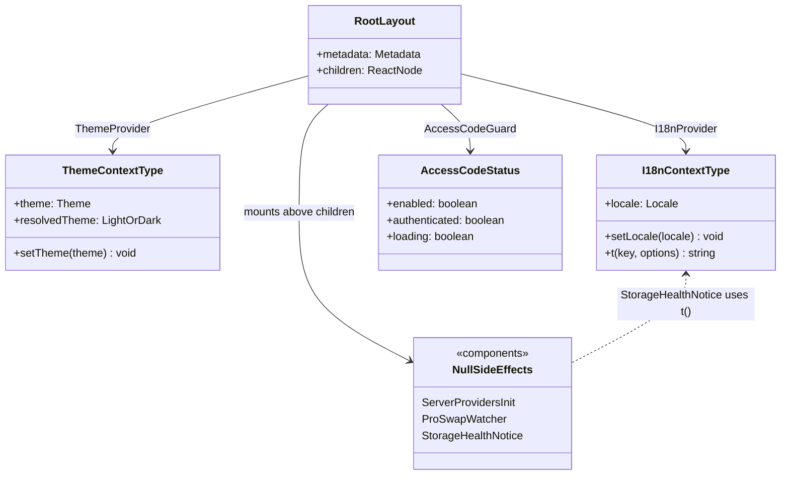
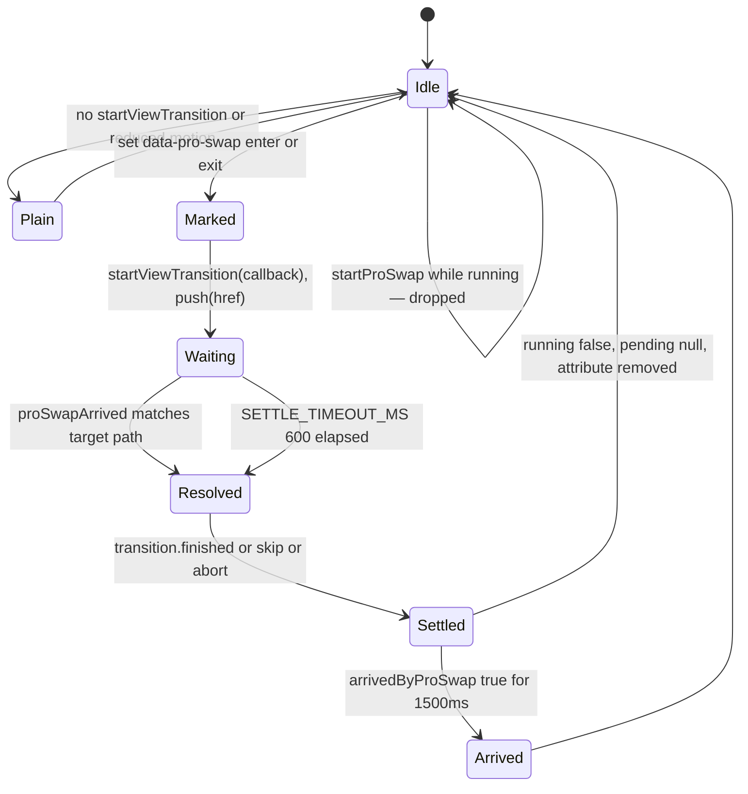
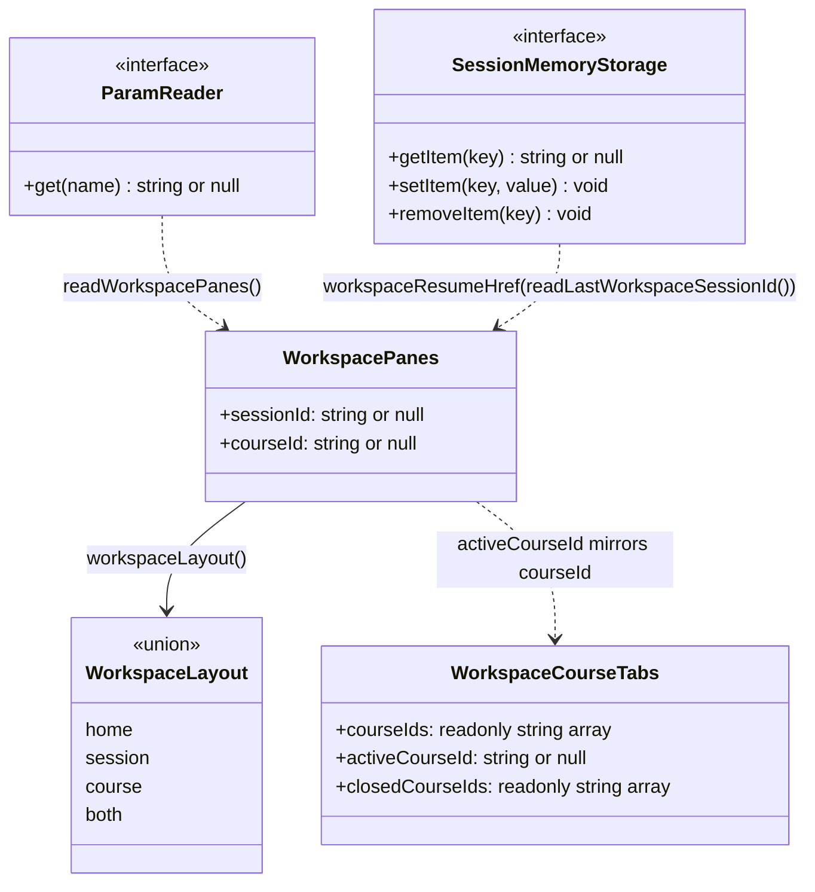

# 02b — Interfaces: providers, route handoff, deep links

Part 2 of 3. Server-side lifecycle, middleware, route and gate signatures are in
`02a-interfaces-lifecycle-and-routing.md`; the `sessionStorage` handoff contracts
are in `02c-interfaces-session-handoff.md`. Every signature below is copied
verbatim from the file at the cited line.

## Providers and context

`lib/hooks/use-theme.tsx:5-13,15,65`

```ts
type Theme = 'light' | 'dark' | 'system';

interface ThemeContextType {
  theme: Theme;
  setTheme: (theme: Theme) => void;
  resolvedTheme: 'light' | 'dark';
}

const ThemeContext = createContext<ThemeContextType | undefined>(undefined);

export function ThemeProvider({ children }: { children: ReactNode })
export function useTheme()   // throws 'useTheme must be used within ThemeProvider'
```

`resolvedTheme` is derived, not stored: `theme === 'system' ? systemTheme : theme`
(line 19), where `systemTheme` comes from a `matchMedia` listener installed at
lines 43-50. Neither `Theme` nor `ThemeContextType` is exported — only the
provider and the hook.

`lib/hooks/use-i18n.tsx:21-27,29,60`

```ts
type I18nContextType = {
  locale: Locale;
  setLocale: (locale: Locale) => void;
  t: (key: string, options?: Record<string, unknown>) => string;
};

const I18nContext = createContext<I18nContextType | undefined>(undefined);

export function I18nProvider({ children }: { children: ReactNode })
export function useI18n()     // throws 'useI18n must be used within I18nProvider'
```

`locale` is read straight off i18next (`i18n.language || defaultLocale`, line 32),
so the context holds no state of its own. The private matcher that resolves a
browser language code, `lib/hooks/use-i18n.tsx:11`:

```ts
/** Match a browser language code (e.g. 'en', 'zh-TW') to a supported locale */
function resolveLocale(lang: string): Locale
```

`components/access-code-guard.tsx:7`

```ts
export function AccessCodeGuard({ children }: { children: ReactNode })
```

Its internal status shape (lines 8-12) — the only stateful provider in the stack
whose shape matters, because it is a three-state machine, not a boolean:

```ts
const [status, setStatus] = useState<{
  enabled: boolean;
  authenticated: boolean;
  loading: boolean;
}>({ enabled: false, authenticated: false, loading: true });
```

`needsAuth` is `!status.loading && status.enabled && !status.authenticated`
(line 38); the `loading` term is what stops the modal flashing on every cold load.
Note `children` render unconditionally at line 57 — the modal is an overlay, not a
replacement.

The three null-rendering side-effect components take no props:

```ts
// components/server-providers-init.tsx:10
export function ServerProvidersInit()      // returns null
// components/workbench/ProSwapWatcher.tsx:17
export function ProSwapWatcher()           // returns null
// components/storage-health-notice.tsx:16
export function StorageHealthNotice()      // returns null
```

`components/ui/sonner.tsx:13,45`

```ts
const Toaster = ({ ...props }: ToasterProps) => { /* … */ };
export { Toaster };
```

`ToasterProps` is `sonner`'s own type. Line 14 is the mismatch documented in
`06-quality-and-metrics.md`: `const { theme = 'system' } = useTheme();` where
`useTheme` comes from `next-themes`, not from `lib/hooks/use-theme`.

The health channel `StorageHealthNotice` subscribes to,
`lib/store/persist-health` (consumed at `components/storage-health-notice.tsx:21`):

```ts
subscribeToPersistHealth(({ name, status }) => void): () => void
acknowledgePersistLoss(name): void
```

`status` is compared against three literals in the component:
`'changes-lost'` (line 28), `'recovered'` (line 42), and everything else, which is
treated as unavailable (line 46).



## Pro swap — the route-handoff module

`lib/workbench/pro-swap.ts:49-57,71,76,92,108`

```ts
type ViewTransition = {
  readonly finished: Promise<void>;
  readonly ready: Promise<void>;
  skipTransition: () => void;
};

type ViewTransitionDocument = Document & {
  startViewTransition?: (callback: () => void | Promise<void>) => ViewTransition;
};

/** Called by `ProSwapWatcher` on every pathname change. */
export function proSwapArrived(pathname: string): void;
/** True while a swap is animating — the guard against a double click. */
export function isProSwapRunning(): boolean;
export function arrivedByProSwap(): boolean;
export function startProSwap(href: string, push: (href: string) => void): void;
```

`push` is injected rather than imported so the module stays out of the Next router
import graph and is unit-testable with a plain function (docstring lines 104-106).
Module-level mutable state, lines 59-61:

```ts
let pending: { path: string; arrive: () => void } | null = null;
let running = false;
let startedAt = 0;
```

Two timing constants: `SETTLE_TIMEOUT_MS = 600` (line 47) and
`ARRIVAL_WINDOW_MS = 1500` (line 68). `arrivedByProSwap()` is deliberately
idempotent — "it reads a clock, it does not consume a token" — so a StrictMode
double render cannot get two answers (docstring lines 89-91).

Callers: `app/page.tsx:161` (enter, `/` → `/workspace`) and
`components/workbench/workspace/WorkspaceShell.tsx:648` (exit, `/workspace` → `/`).
The CSS that reads `data-pro-swap` is `components/workbench/pro-swap.css`,
imported by `components/workbench/ProBadge.tsx:16`. The morph anchors are DOM
attributes set on the home page: `data-pro-morph="lockup"` (`app/page.tsx:834`),
`"badge"` (line 851), `"composer"` (line 876).



## Deep-link serialisation

`lib/workbench/workspace-panes.ts:24-26,28,40,47,52,55,73,85,96,98,105,115`

```ts
export const WORKSPACE_SESSION_PARAM = 'session';
export const WORKSPACE_COURSE_PARAM = 'course';
export const WORKSPACE_PATH = '/workspace';

export interface WorkspacePanes {
  /** The attached agent session, or null. */
  readonly sessionId: string | null;
  /** The course open in the classroom pane, or null. */
  readonly courseId: string | null;
}

export interface WorkspaceCourseTabs {
  readonly courseIds: readonly string[];
  readonly activeCourseId: string | null;
  /** Tabs the user explicitly closed; created-stage replay must not revive them. */
  readonly closedCourseIds?: readonly string[];
}

export const NO_COURSE_TABS: WorkspaceCourseTabs;
export const NO_PANES: WorkspacePanes = { sessionId: null, courseId: null };

/** The minimal read surface of `URLSearchParams` / Next's `ReadonlyURLSearchParams`. */
export interface ParamReader {
  get(name: string): string | null;
}

export function readWorkspacePanes(search: ParamReader): WorkspacePanes;
export function workspaceHref(panes: WorkspacePanes): string;
export type WorkspaceLayout = 'home' | 'session' | 'course' | 'both';
export function workspaceLayout(panes: WorkspacePanes): WorkspaceLayout;
export function samePanes(a: WorkspacePanes, b: WorkspacePanes): boolean;
export function withCourse(panes: WorkspacePanes, courseId: string | null): WorkspacePanes;
```

Two contracts worth spelling out because they are defensive on purpose:

- `readParam` (line 66, private) treats `?session=` with no value as absent, so a
  truncated link lands on the home surface rather than attaching to a session
  whose id is `''` — which would fetch `/api/agent/sessions/` and hang the pane on
  a loading state forever (docstring lines 59-65).
- `workspaceHref` (line 85) fixes param order (session, then course) so one
  layout always produces one string and a router comparison against
  `window.location` never sees two spellings of one state (docstring lines 80-84).

Only `activeCourseId` is mirrored into the URL; `courseIds` is the ordered,
workspace-wide set that stays local to the browser (docstring lines 35-39).

`lib/workbench/workspace-session-memory.ts:8,29,40,51,59,73,86`

```ts
export const LAST_WORKSPACE_SESSION_STORAGE_KEY = 'openmaic:workspace:last-session';

export function readLastWorkspaceSessionId(storage?: SessionMemoryStorage): string | null;
export function rememberWorkspaceSession(sessionId: string, storage?: SessionMemoryStorage): void;
/** Remember that the clean workspace home, rather than a conversation, was last open. */
export function rememberWorkspaceHome(storage?: SessionMemoryStorage): void;
export function forgetWorkspaceSession(sessionId: string, storage?: SessionMemoryStorage): void;
export function validateRememberedWorkspaceSession(
  sessionId: string,
  existingSessionIds: readonly string[],
  storage?: SessionMemoryStorage,
): boolean;
/** The classic-mode entry target; missing memory keeps the clean Pro home. */
export function workspaceResumeHref(sessionId: string | null): string;
```

The `storage?: SessionMemoryStorage` parameter on every function is the injection
seam; `availableStorage` (line 18) falls back to `window.localStorage` and returns
`null` on the server, which is why every function is safe to call during SSR. A
private sentinel `'openmaic:workspace:home'` (line 10) distinguishes "last had the
clean home open" from "no memory", and `readLastWorkspaceSessionId` maps it back to
`null` (line 34).


