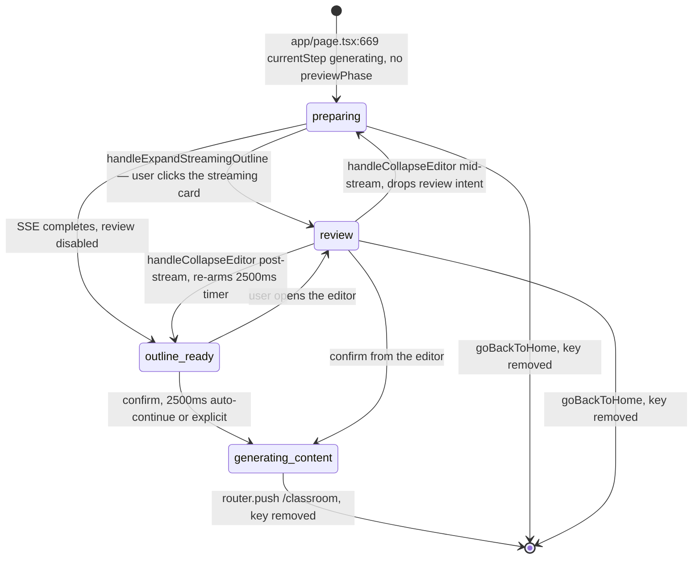
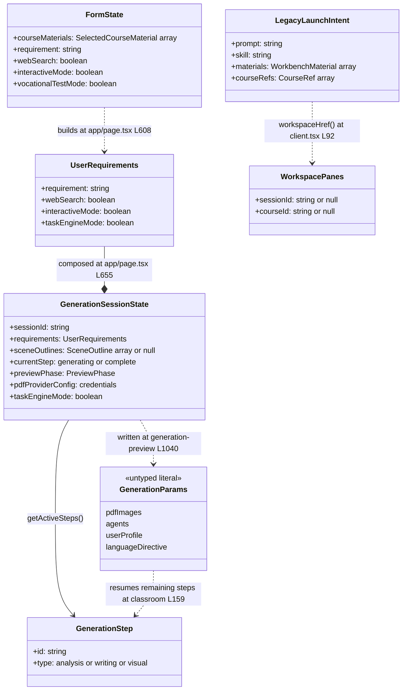

# 02c — Interfaces: the `sessionStorage` handoff contracts

Part 3 of 3. See `02a-interfaces-lifecycle-and-routing.md` for lifecycle,
middleware, route and gate signatures, and `02b-interfaces-client-contracts.md`
for providers, pro-swap, and deep-link serialisation.

Three route transitions in this app carry state through `sessionStorage` rather
than through props, params, or a server round-trip. This file records those
contracts because they are the real coupling between route segments and none of
them is enforced at runtime.

## The three keys

| Key | Written by | Read by | Cleared by |
| --- | --- | --- | --- |
| `generationSession` | `app/page.tsx:671`, then re-written on every phase change by `persistSession` (`app/generation-preview/page.tsx:178`) | `app/generation-preview/page.tsx:223` | `app/generation-preview/page.tsx:1050` (success), `:1060` (error), `:1077` (back to home) |
| `generationParams` | `app/generation-preview/page.tsx:1040` | `app/classroom/[id]/page.tsx:159` | never |
| `workbench.launchPrompt` | older deployments only (rolling-deploy handoff; no current writer in this tree) | `app/workbench/new/client.tsx:61` | `app/workbench/new/client.tsx:88` |

`generationParams` is never removed. A later visit to any classroom re-reads
whatever was left there, and the resume effect guards against acting on it only by
checking store state (`app/classroom/[id]/page.tsx:143-153`), not by checking
whether the params belong to this course.

## `generationSession` — the typed one

`app/generation-preview/types.ts:12`

```ts
// Session state stored in sessionStorage
export interface GenerationSessionState {
  sessionId: string;
  requirements: UserRequirements;
  pdfText: string;
  documentSources?: SessionDocumentSource[];
  pdfImages?: PdfImage[];
  imageStorageIds?: string[];
  imageMapping?: ImageMapping;
  sceneOutlines?: SceneOutline[] | null;
  currentStep: 'generating' | 'complete';
  previewPhase?: 'preparing' | 'outline-ready' | 'review' | 'generating-content';
  // PDF deferred parsing fields
  pdfStorageKey?: string;
  pdfFileName?: string;
  documentMimeType?: string;
  pdfProviderId?: string;
  pdfProviderConfig?: {
    apiKey?: string;
    baseUrl?: string;
    accessKeyId?: string;
    accessKeySecret?: string;
  };
  // Web search context
  researchContext?: string;
  researchSources?: Array<{ title: string; url: string }>;
  // Language directive inferred from outline generation
  languageDirective?: string;
  // Concise course title inferred from outline generation (used as the stage name)
  courseTitle?: string;
  // Server-effective vocational mode from the outline generation done event.
  taskEngineMode?: boolean;
}
```

Only `sessionId`, `requirements`, `pdfText`, and `currentStep` are required. The
producer at `app/page.tsx:655-670` supplies `pdfText: ''`, `pdfImages: []`,
`imageStorageIds: []`, and `sceneOutlines: null` — every meaningful field arrives
later, written back by `persistSession`.

Note `pdfProviderConfig` carries **provider credentials** through
`sessionStorage`. Same-origin, but they are at rest in the browser for the
lifetime of the tab.

## `previewPhase` — the state machine the surface renders from



Line anchors for the transitions: `handleExpandStreamingOutline`
(`app/generation-preview/page.tsx:1083-1092`), `handleCollapseEditor`
(`:1099-1119`), the 2500 ms `OUTLINE_REVIEW_AUTO_CONTINUE_MS` timer (`:66,210-215`),
and `goBackToHome` (`:1073-1079`).

`handleConfirmOutlines` (`:1161`) has **two** paths, and only one of them writes the
phase. When a parked promise exists — the normal case, created after SSE completes —
it resolves that promise and returns early (`:1168-1173`), leaving `previewPhase`
alone; the generation driver advances it. The fallback path, taken when the session
was restored mid-review and there is no parked promise, builds
`{ ...session, sceneOutlines: finalOutlines, previewPhase: 'generating-content' }`
and calls `startGeneration` itself (`:1181-1188`). The comment at `:1175-1179`
records exactly this asymmetry.

Backfill on load, `app/generation-preview/page.tsx:227-235`:

```ts
if (!parsed.previewPhase) {
  parsed.previewPhase = parsed.sceneOutlines?.length ? 'outline-ready' : 'preparing';
}
// Restore review intent: a saved 'review' phase without outlines means the user
// had opened the editor mid-stream before the refresh — preserve that intent so
// the post-stream auto-continue timer doesn't fire after SSE restart.
if (parsed.previewPhase === 'review' && !parsed.sceneOutlines?.length) {
  outlineReviewIntentRef.current = true;
}
parsed.taskEngineMode = parsed.taskEngineMode === true;
```

These three lines are the entire validation of a cross-route payload.

## The step table

`app/generation-preview/types.ts:45,90,135`

```ts
export type GenerationStep = {
  id: string;
  title: string;
  description: string;
  icon: React.ElementType;
  type: 'analysis' | 'writing' | 'visual';
};

export const ALL_STEPS: GenerationStep[];   // 6 entries, in order:
                                            // pdf-analysis, web-search, outline,
                                            // agent-generation, slide-content, actions
export const getActiveSteps = (session: GenerationSessionState | null) => GenerationStep[];
export function getGenerationStepText(
  step: GenerationStep,
  session: GenerationSessionState | null,
);
```

`getActiveSteps` filters on three conditions (lines 137-145):

| Step id | Included when |
| --- | --- |
| `pdf-analysis` | `session.pdfStorageKey` is set, **or** `documentSources.length > 0 && !session.pdfText` |
| `web-search` | `session.requirements.webSearch` |
| `agent-generation` | `useSettingsStore.getState().agentMode === 'auto'` |
| `outline`, `slide-content`, `actions` | always |

`getGenerationStepText` (line 63) has one special case: audio/video material gets
`'generation.analyzingMediaMaterial'` instead of the generic document copy,
decided by `isMediaMaterial` (line 56), which checks the MIME prefix and then falls
back to an extension allowlist (`MEDIA_EXTENSIONS`, line 53).

## `generationParams` — the untyped one

Written as an object literal at `app/generation-preview/page.tsx:1040-1048`:

```ts
sessionStorage.setItem(
  'generationParams',
  JSON.stringify({
    pdfImages: currentSession.pdfImages,
    agents,
    userProfile,
    languageDirective,
  }),
);
```

There is **no declared type**. The consumer re-declares the only part it needs
inline (`app/classroom/[id]/page.tsx:170-172`):

```ts
const pdfImages = (params.pdfImages || []) as Array<
  { id: string; assetId?: string; storageId?: string } & Record<string, unknown>
>;
```

and reads `params.agents`, `params.userProfile`, `params.languageDirective`
untyped at lines 181-184. The `assetId` / `storageId` duality is deliberate and
commented at lines 162-169: a server-backed deployment stores allocated asset ids
on the session's `pdfImages`, but a source whose cache write failed materialised
its own images, so the mapping may **mix** allocated asset ids and IndexedDB data
URLs, and the resume merges both rather than choosing one transport.

## `workbench.launchPrompt` — the legacy one

`app/workbench/new/client.tsx:23,25,32`

```ts
// Older deployed home composers may still write this key during a rolling deploy.
const LEGACY_LAUNCH_HANDOFF_KEY = 'workbench.launchPrompt';

interface LegacyLaunchIntent {
  readonly prompt: string;
  readonly skill?: string;
  readonly materials?: WorkbenchMaterial[];
  readonly courseRefs?: CourseRef[];
}

function parseLegacyHandoff(raw: string): LegacyLaunchIntent
```

`parseLegacyHandoff` accepts two wire formats: a `{ v: 1, prompt, … }` JSON
envelope, validated only by `parsed?.v === 1 && typeof parsed.prompt === 'string'`
(line 37), or a bare string treated as the prompt (line 42). Query params win over
the storage key (`intent` memo, lines 53-66).

## Producer side: `FormState`

`app/page.tsx:113,121`

```ts
interface FormState {
  courseMaterials: SelectedCourseMaterial[];
  requirement: string;
  webSearch: boolean;
  interactiveMode: boolean;
  vocationalTestMode: boolean;
}

const initialFormState: FormState = {
  courseMaterials: [],
  requirement: '',
  webSearch: false,
  interactiveMode: false,
  vocationalTestMode: false,
};
```

`vocationalTestMode` does not survive as itself: `app/page.tsx:613-614` folds it
into `interactiveMode: true` plus `taskEngineMode: true` on the
`UserRequirements` that goes into the session.

## Full handoff graph



## Why this matters for documentation

Anyone describing "how a course gets generated" will be tempted to draw a server
pipeline. The route-level truth is: the browser holds the whole session, the three
page segments communicate through two `sessionStorage` keys, and the server sees
only individual stateless `/api/*` calls carrying credentials in headers
(`app/generation-preview/page.tsx:254-278`). A hard refresh mid-generation is
recoverable **only** because `generationSession` is on disk in the tab; closing the
tab loses it.
