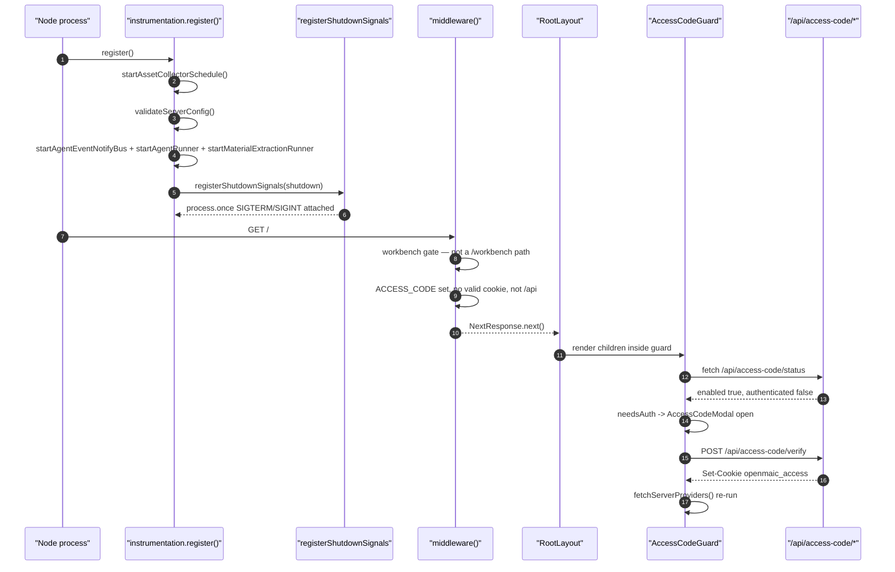
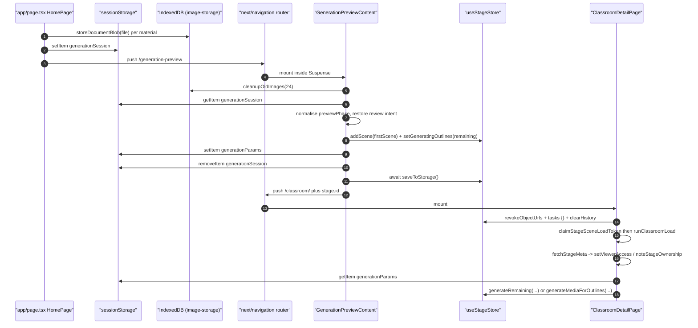
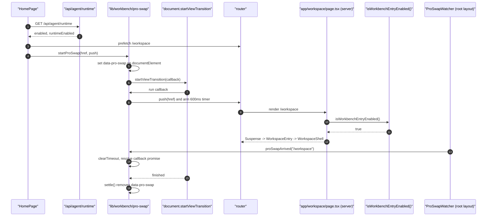
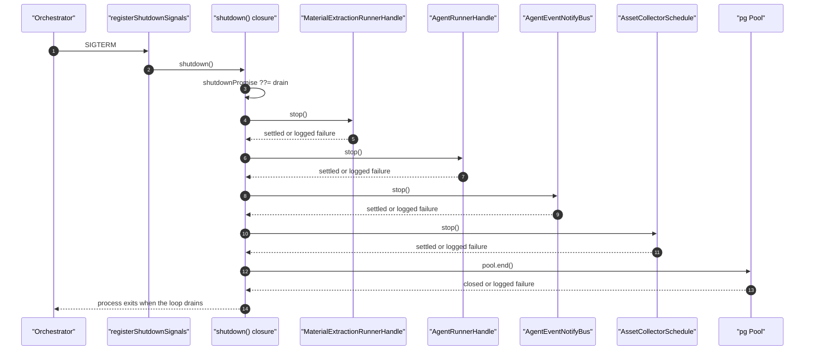

# 03 — Traced end-to-end flows

Four flows, each an ordered hop table plus a sequence diagram. Every hop names a
real function or export at a real line.

---

## Flow A — Cold boot, then first `GET /` on an `ACCESS_CODE` deployment

### A.1 Boot hops

| # | Where | Call | Effect |
| --- | --- | --- | --- |
| 1 | Next server | `register()` | [`instrumentation.ts:13`](instrumentation.ts#L13) — awaited before the first request is served |
| 2 | [`instrumentation.ts:16`](instrumentation.ts#L16) | `process.env.NEXT_RUNTIME !== 'nodejs'` | Edge invocation returns immediately |
| 3 | [`instrumentation.ts:19-21`](instrumentation.ts#L19-L21) | `await import('@/lib/persistence/asset-collector-schedule')` → `startAssetCollectorSchedule()` | 15-minute reclamation timer; returns `undefined` with no `DATABASE_URL` |
| 4 | [`instrumentation.ts:28-29`](instrumentation.ts#L28-L29) | `await import('@/lib/server/config-validation')` → `validateServerConfig()` | emits `[config] …` warnings; never throws ([`config-validation.ts:202-213`](lib/server/config-validation.ts#L202-L213)) |
| 5 | [`instrumentation.ts:37-38`](instrumentation.ts#L37-L38) | `isAgentRuntimeConfigured()` | [`feature-flags.ts:23`](lib/config/feature-flags.ts#L23) — flag AND trimmed `DATABASE_URL` |
| 6 | [`instrumentation.ts:42-45`](instrumentation.ts#L42-L45) | `startAgentEventNotifyBus()` | one `LISTEN` connection per instance |
| 7 | [`instrumentation.ts:48-49`](instrumentation.ts#L48-L49) | `startAgentRunner()` | `AgentRunnerHandle`, timer only |
| 8 | [`instrumentation.ts:50-51`](instrumentation.ts#L50-L51) | `startMaterialExtractionRunner()` | `MaterialExtractionRunnerHandle` |
| 9 | [`instrumentation.ts:57-95`](instrumentation.ts#L57-L95) | build `shutdown` closure | memoised with `shutdownPromise ??=` |
| 10 | [`instrumentation.ts:100-101`](instrumentation.ts#L100-L101) | `await import('@/lib/server/register-shutdown-signals')` → `registerShutdownSignals(shutdown)` | two `process.once` handlers |

### A.2 Request hops

| # | Where | Call | Effect |
| --- | --- | --- | --- |
| 11 | [`middleware.ts:89`](middleware.ts#L89) | matcher regex | `/` matches |
| 12 | [`middleware.ts:53-56`](middleware.ts#L53-L56) | workbench gate | path is not `/workbench*`, falls through |
| 13 | [`middleware.ts:60`](middleware.ts#L60) | `process.env.ACCESS_CODE` | set, so the gate is live |
| 14 | [`middleware.ts:66`](middleware.ts#L66) | allowlist check | `/` is not allowlisted |
| 15 | [`middleware.ts:71-72`](middleware.ts#L71-L72) | `request.cookies.get('openmaic_access')` → `verifyToken` | no cookie on a cold visit |
| 16 | [`middleware.ts:77`](middleware.ts#L77) | `/api/` prefix check | not an API path |
| 17 | [`middleware.ts:85`](middleware.ts#L85) | `NextResponse.next()` | page is served unauthenticated by design |
| 18 | [`next.config.ts:38-55`](next.config.ts#L38-L55) | `headers()` | adds `X-Frame-Options: SAMEORIGIN` (only when `ALLOWED_FRAME_ANCESTORS` is unset) and `Content-Security-Policy: frame-ancestors …` |
| 19 | [`app/layout.tsx:37`](app/layout.tsx#L37) | `RootLayout` | renders `<html>`/`<body>` and the provider stack |
| 20 | [`app/page.tsx:1894`](app/page.tsx#L1894) | `Page()` → `HomePage()` | client component, hydrates |
| 21 | [`components/access-code-guard.tsx:16`](components/access-code-guard.tsx#L16) | `fetch('/api/access-code/status')` | re-enters middleware |
| 22 | [`middleware.ts:66`](middleware.ts#L66) | allowlist | `/api/access-code/` prefix matches ⇒ `next()` |
| 23 | [`app/api/access-code/status/route.ts:11-13`](app/api/access-code/status/route.ts#L11-L13) | `cookies()` + `verifyAccessToken` | returns `{ enabled: true, authenticated: false }` |
| 24 | `components/access-code-guard.tsx:38,43` | `needsAuth` ⇒ `<AccessCodeModal open />` | children still render behind it (line 57) |
| 25 | [`app/api/access-code/verify/route.ts:26-38`](app/api/access-code/verify/route.ts#L26-L38) | `timingSafeEqual`, `createAccessToken`, `cookieStore.set` | httpOnly, sameSite lax, 7-day maxAge, `secure` in production |
| 26 | [`components/access-code-guard.tsx:46-53`](components/access-code-guard.tsx#L46-L53) | `setStatus`, then `fetchServerProviders()` | the re-fetch exists because the first `ServerProvidersInit` call was 401'd |

---

## Flow B — `/` → `/generation-preview` → `/classroom/[id]`

The whole handoff rides on two `sessionStorage` keys. Nothing is passed as a
route param.

| # | Where | Call | Effect |
| --- | --- | --- | --- |
| 1 | [`app/page.tsx:605`](app/page.tsx#L605) | `setPreparingGenerate(true)` | freezes the course-material set for the duration of prep |
| 2 | [`app/page.tsx:607-615`](app/page.tsx#L607-L615) | build `UserRequirements` | `taskEngineMode` added only when the vocational test toggle is on |
| 3 | [`app/page.tsx:633`](app/page.tsx#L633) | `storeDocumentBlob(item.file)` per material | IndexedDB write; on throw, `deleteDocumentBlob` for every key already written (line 650) |
| 4 | [`app/page.tsx:655-670`](app/page.tsx#L655-L670) | build `sessionState` | `sessionId: nanoid()`, `currentStep: 'generating'`, plus backward-compatible single-document fields |
| 5 | [`app/page.tsx:671`](app/page.tsx#L671) | `sessionStorage.setItem('generationSession', …)` | the entire handoff payload |
| 6 | [`app/page.tsx:673`](app/page.tsx#L673) | `router.push('/generation-preview')` | client navigation |
| 7 | [`middleware.ts:89`](middleware.ts#L89) | matcher | matches; `ACCESS_CODE` path as in Flow A |
| 8 | `app/generation-preview/layout.tsx:2,5` | `dynamic = 'force-dynamic'`, `return children` | no chrome, just the rendering directive |
| 9 | [`app/generation-preview/page.tsx:1541`](app/generation-preview/page.tsx#L1541) | `<Suspense fallback={skeleton}>` | skeleton is a pulsing two-bar placeholder |
| 10 | [`app/generation-preview/page.tsx:221`](app/generation-preview/page.tsx#L221) | `cleanupOldImages(24)` | fire-and-forget IndexedDB GC |
| 11 | [`app/generation-preview/page.tsx:223-237`](app/generation-preview/page.tsx#L223-L237) | read + normalise session | missing `previewPhase` backfilled (line 228); `'review'` without outlines restores `outlineReviewIntentRef` (line 234); `taskEngineMode` coerced to strict boolean (line 236) |
| 12 | [`app/generation-preview/page.tsx:242`](app/generation-preview/page.tsx#L242) | `setSessionLoaded(true)` | unlocks the render branches at lines 1192 and 1203 |
| 13 | [`app/generation-preview/page.tsx:254-269`](app/generation-preview/page.tsx#L254-L269) | `getApiHeaders()` | credentials travel as `x-model` / `x-api-key` / `x-base-url` / `x-provider-type` / `x-image-*` / `x-video-*` request headers |
| 14 | [`app/generation-preview/page.tsx:1014-1029`](app/generation-preview/page.tsx#L1014-L1029) | first-scene TTS | blocking; `!ttsResult.success` throws `t('generation.speechFailed')` |
| 15 | [`app/generation-preview/page.tsx:1032-1037`](app/generation-preview/page.tsx#L1032-L1037) | `store.addScene`, `setCurrentSceneId`, `setGeneratingOutlines(remaining)` | remaining outlines become skeleton placeholders |
| 16 | [`app/generation-preview/page.tsx:1040-1048`](app/generation-preview/page.tsx#L1040-L1048) | `sessionStorage.setItem('generationParams', …)` | `{ pdfImages, agents, userProfile, languageDirective }` — the resume contract |
| 17 | [`app/generation-preview/page.tsx:1050-1051`](app/generation-preview/page.tsx#L1050-L1051) | `removeItem('generationSession')`, `await store.saveToStorage()` | durable before navigation |
| 18 | [`app/generation-preview/page.tsx:1052`](app/generation-preview/page.tsx#L1052) | `router.push('/classroom/${stage.id}')` | |
| 19 | [`app/classroom/[id]/page.tsx:29-30`](app/classroom/[id]/page.tsx#L29-L30) | `useParams()` → `params?.id as string` | client-side segment read |
| 20 | [`app/classroom/[id]/page.tsx:116-129`](app/classroom/[id]/page.tsx#L116-L129) | reset | `setLoading(true)`, `revokeObjectUrls()`, `tasks: {}`, `clearHistory()` |
| 21 | [`app/classroom/[id]/page.tsx:47-48`](app/classroom/[id]/page.tsx#L47-L48) | `claimStageSceneLoadToken()` + `isCurrentStageSceneLoadToken` | the `isCurrent` guard against a superseded load |
| 22 | [`app/classroom/[id]/page.tsx:50-76`](app/classroom/[id]/page.tsx#L50-L76) | `runClassroomLoad({ … })` | 15 injected dependencies from `defaultClassroomLoadDeps` |
| 23 | [`app/classroom/[id]/page.tsx:84-106`](app/classroom/[id]/page.tsx#L84-L106) | `fetchStageMeta(classroomId)` | fired **after** the load; `found` / `unavailable` / `absent` handled distinctly |
| 24 | [`app/classroom/[id]/page.tsx:159-160`](app/classroom/[id]/page.tsx#L159-L160) | read `sessionStorage['generationParams']` | |
| 25 | [`app/classroom/[id]/page.tsx:187-199`](app/classroom/[id]/page.tsx#L187-L199) | rebuild `imageMapping` | merges allocated `assetId`s with `loadImageMapping(storageIds)` |
| 26 | [`app/classroom/[id]/page.tsx:174-185`](app/classroom/[id]/page.tsx#L174-L185) or `:211-219` | `generateRemaining(...)` or `markGenerationCompleteIfDone()` + `generateMediaForOutlines(...)` | branch on `!generationComplete && hasPending` |
| 27 | [`app/classroom/[id]/page.tsx:250`](app/classroom/[id]/page.tsx#L250) | `<Stage onRetryOutline={retrySingleOutline} />` | inside `ThemeProvider` + `MediaStageProvider` |

---

## Flow C — Pro entry: `/` → `/workspace` with the View-Transition swap

This is the most intricate hop chain in the subsystem because state has to
outlive the component that started it.

| # | Where | Call | Effect |
| --- | --- | --- | --- |
| 1 | [`app/page.tsx:138`](app/page.tsx#L138) | `isProWorkbenchEnabled()` | build-time flag, inlined |
| 2 | [`app/page.tsx:142-157`](app/page.tsx#L142-L157) | `fetch('/api/agent/runtime')` | only when the build flag is on and `workbenchRuntimeCache === null` |
| 3 | [`app/api/agent/runtime/route.ts:21-24`](app/api/agent/runtime/route.ts#L21-L24) | returns `{ enabled: isAgentRuntimeConfigured(), runtimeEnabled: isAgentRuntimeEnabled() }` | `enabled` is usability, `runtimeEnabled` is intent |
| 4 | [`app/page.tsx:148-149`](app/page.tsx#L148-L149) | `workbenchRuntimeCache = body?.enabled === true` | module-level cache survives client navigations |
| 5 | [`app/page.tsx:158`](app/page.tsx#L158) | `workbenchEntryEnabled = build && runtime` | |
| 6 | [`app/page.tsx:163-165`](app/page.tsx#L163-L165) | `router.prefetch('/workspace')` | so the swap's 600 ms budget is enough |
| 7 | [`app/page.tsx:848-855`](app/page.tsx#L848-L855) | render `<ProBadge active={false} onToggle={enterWorkbench} />` inside `data-pro-morph="badge"` | the lockup carries `data-pro-morph="lockup"` at line 834 |
| 8 | [`app/page.tsx:160`](app/page.tsx#L160) | `workspaceResumeHref(readLastWorkspaceSessionId())` | `/workspace?session=…` or bare `/workspace` |
| 9 | [`lib/workbench/pro-swap.ts:109`](lib/workbench/pro-swap.ts#L109) | `if (running) return` | double-click guard |
| 10 | [`lib/workbench/pro-swap.ts:112-115`](lib/workbench/pro-swap.ts#L112-L115) | no `startViewTransition` or `prefers-reduced-motion` ⇒ plain `push(href)` | graceful degradation |
| 11 | [`lib/workbench/pro-swap.ts:123`](lib/workbench/pro-swap.ts#L123) | `root.setAttribute('data-pro-swap', 'enter')` | set **before** `startViewTransition`, because the old snapshot is taken synchronously |
| 12 | [`lib/workbench/pro-swap.ts:127-144`](lib/workbench/pro-swap.ts#L127-L144) | `doc.startViewTransition(cb)` | `cb` returns a promise raced against `SETTLE_TIMEOUT_MS = 600` |
| 13 | [`lib/workbench/pro-swap.ts:142`](lib/workbench/pro-swap.ts#L142) | `push(href)` inside `cb` | the actual `router.push` |
| 14 | [`middleware.ts:54-58`](middleware.ts#L54-L58) | workbench gate | `/workspace` is **not** matched by this gate — it only guards `/workbench*` |
| 15 | [`app/workspace/page.tsx:35`](app/workspace/page.tsx#L35) | `isWorkbenchEntryEnabled()` | `redirect('/')` when off |
| 16 | [`app/workspace/page.tsx:38-40`](app/workspace/page.tsx#L38-L40) | `<Suspense fallback={null}><WorkspaceEntry /></Suspense>` | |
| 17 | [`components/workbench/WorkspaceEntry.tsx:5`](components/workbench/WorkspaceEntry.tsx#L5) | `<WorkspaceShell />` | subsystem boundary |
| 18 | [`components/workbench/ProSwapWatcher.tsx:18-22`](components/workbench/ProSwapWatcher.tsx#L18-L22) | `usePathname()` effect → `proSwapArrived(pathname)` | mounted in the root layout, so it survives the navigation |
| 19 | [`lib/workbench/pro-swap.ts:72`](lib/workbench/pro-swap.ts#L72) | `if (pending && pending.path === pathname) pending.arrive()` | `clearTimeout`, resolve |
| 20 | [`lib/workbench/pro-swap.ts:146-151`](lib/workbench/pro-swap.ts#L146-L151) | `transition.finished.then(settle, settle)` | clears `running`, `pending`, and removes `data-pro-swap` on success, skip, **and** abort |
| 21 | [`lib/workbench/pro-swap.ts:92-94`](lib/workbench/pro-swap.ts#L92-L94) | `arrivedByProSwap()` | `startedAt > 0 && Date.now() - startedAt < 1500` — read by the mounting surface to skip its entrance |

Legacy variant, `GET /workbench/new?prompt=…`:

| # | Where | Call |
| --- | --- | --- |
| L1 | [`middleware.ts:56`](middleware.ts#L56) | 404 when the gate is off — this path **is** matched |
| L2 | [`app/workbench/new/page.tsx:14`](app/workbench/new/page.tsx#L14) | `notFound()` when the gate is off |
| L3 | [`app/workbench/new/client.tsx:54-66`](app/workbench/new/client.tsx#L54-L66) | `searchParams.get('prompt')`, else `sessionStorage['workbench.launchPrompt']` |
| L4 | [`app/workbench/new/client.tsx:77-82`](app/workbench/new/client.tsx#L77-L82) | `createWorkbenchSession({ prompt, skill?, materials?, courseRefs? })` |
| L5 | [`app/workbench/new/client.tsx:88`](app/workbench/new/client.tsx#L88) | `sessionStorage.removeItem('workbench.launchPrompt')` |
| L6 | [`app/workbench/new/client.tsx:92`](app/workbench/new/client.tsx#L92) | `router.replace(workspaceHref({ sessionId, courseId: null }))` |

---

## Flow D — `SIGTERM` drain

| # | Where | Call | Effect |
| --- | --- | --- | --- |
| 1 | container/orchestrator | `SIGTERM` | |
| 2 | [`lib/server/register-shutdown-signals.ts:13`](lib/server/register-shutdown-signals.ts#L13) | `process.once('SIGTERM', () => void shutdown())` | self-removing handler |
| 3 | [`instrumentation.ts:59`](instrumentation.ts#L59) | `shutdownPromise ??= (async () => …)()` | second once-guard; concurrent `SIGINT` joins the same promise |
| 4 | [`instrumentation.ts:63`](instrumentation.ts#L63) | `await extractionRunner?.stop()` | on throw, logs `'Material extraction runner drain failed'` and continues |
| 5 | [`instrumentation.ts:68`](instrumentation.ts#L68) | `await runner?.stop()` | parks agent sessions **before** any pool closes |
| 6 | [`instrumentation.ts:73`](instrumentation.ts#L73) | `await stopAgentEventNotifyBus?.()` | releases the `LISTEN` connection |
| 7 | [`instrumentation.ts:78`](instrumentation.ts#L78) | `await assetSchedule?.stop()` | stops the timer, releases its own small pool |
| 8 | [`instrumentation.ts:82-88`](instrumentation.ts#L82-L88) | `getServerPersistenceProvider(connectionString)` → `pool.end()` | only when `DATABASE_URL?.trim()` is non-empty |
| 9 | process | exits when the loop drains | nothing calls `process.exit` |

Note the ordering guarantee that is **not** made: there is no request-draining
step. Next's own server closes its listener; `register()` has no hook for
in-flight HTTP requests.
