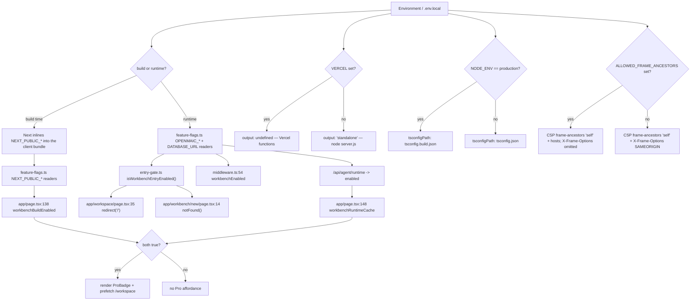
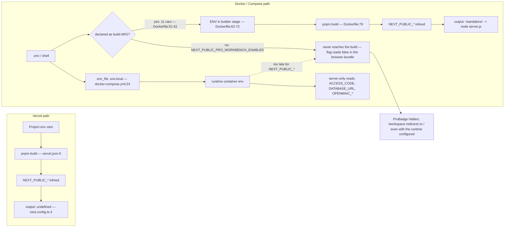

# 04 — Dependencies and configuration

## External dependencies actually reached by the shell

Only packages this subsystem's files import directly. Versions from
`package.json`.

| Package | Version | Where | Why |
| --- | --- | --- | --- |
| `next` | `16.2.11` | everywhere | app router, `middleware.ts`, `instrumentation.ts` |
| `react` / `react-dom` | `19.2.3` | everywhere | `Suspense`, `useDeferredValue` (`app/page.tsx:3`) |
| `geist` | `^1.7.0` | `app/layout.tsx:2-3` | `GeistSans` / `GeistMono` via `next/font` |
| `@fontsource-variable/inter` | `^5.2.8` | `app/layout.tsx:29` | UI font stylesheet with per-subset `unicode-range` |
| `@fontsource/*` (13 families) | `^5.2.x` | `app/editor-fonts.ts:15-39` | slide-editor font picker |
| `animate.css` | `^4.1.1` | `app/layout.tsx:6` | global animation classes |
| `katex` | `^0.16.33` | `app/layout.tsx:7` | `katex.min.css` for slide math |
| `@openmaic/renderer` | `workspace:*` | `app/layout.tsx:5` | `fonts.css` side effect |
| `sonner` | `^2.0.7` | `components/ui/sonner.tsx:4`, `components/storage-health-notice.tsx:4`, `app/workbench/new/client.tsx:12` | toasts |
| `next-themes` | `^0.4.6` | `components/ui/sonner.tsx:3` | **only** consumer; see the mismatch note below |
| `react-i18next` / `i18next` | `^17.0.1` / `^26.0.1` | `lib/hooks/use-i18n.tsx:4,6` | translation runtime |
| `motion` | `^12.27.5` | `app/page.tsx:5`, `app/generation-preview/page.tsx:5` | hero and step animations |
| `lucide-react` | `^0.562.0` | `app/page.tsx:6-30` (25 icons), `components/site-header/theme-toggle.tsx:4` | icon set (`components.json:13` pins `iconLibrary`) |
| `zustand` | `^5.0.10` | via `lib/store/*` from every client page | stage, settings, media, whiteboard stores |
| `tailwindcss` + `@tailwindcss/postcss` | `^4` | `postcss.config.mjs:3`, `app/globals.css:1` | CSS pipeline |
| `tw-animate-css` | `^1.4.0` | `app/globals.css:2` | Tailwind v4 animation utilities |
| `shadcn` | `^3.6.3` | `app/globals.css:3` (`shadcn/tailwind.css`), `components.json` | component generator + base stylesheet |
| `radix-ui` / `@radix-ui/react-*` | `^1.4.3` / various | 20 of 34 `components/ui/*` | primitives |
| `@base-ui/react` | `^1.1.0` | `components/ui/combobox.tsx:4` | the one non-Radix primitive |
| `pg` | `^8.16.3` | reached via dynamic import from `instrumentation.ts` | asset collector pool, `pool.end()` on drain |
| `@playwright/test` | `^1.58.2` (dev) | `eval/whiteboard-layout/capture.ts:1` | drives `/eval/whiteboard` |

### `next-themes` provider mismatch — verified

`components/ui/sonner.tsx:3` imports `useTheme` from `next-themes`, but the root
layout mounts the hand-rolled `ThemeProvider` from `@/lib/hooks/use-theme`
(`app/layout.tsx:8,48`). `next-themes`' own `ThemeProvider` is mounted **nowhere** —
`rtk grep 'next-themes' .` returns exactly four first-party hits, all of them the
one import at `sonner.tsx:3` plus `package.json`. `sonner.tsx:14` destructures
with a default: `const { theme = 'system' } = useTheme();`.

Inferred: with no `next-themes` provider in the tree, `theme` is `undefined`, the
default `'system'` is used, and Sonner falls back to OS colour-scheme detection —
so toasts follow the OS preference rather than an explicit in-app light/dark
choice. Not verified at runtime: `node_modules` is not installed in this
checkout (`ls node_modules` → no such file), so the library's outside-provider
behaviour could not be read from source.

## Environment variables

Only variables this subsystem reads. `required` means the shell behaves
differently in a user-visible way when unset.

| Variable | Required | Read at | Effect |
| --- | --- | --- | --- |
| `ACCESS_CODE` | no | `middleware.ts:60`, `app/api/access-code/status/route.ts:6`, `.../verify/route.ts:7` | unset ⇒ middleware short-circuits to `next()` and the guard reports `enabled: false`. Set ⇒ HMAC cookie gate; API 401, pages get a modal |
| `NEXT_PUBLIC_PRO_WORKBENCH_ENABLED` | no | `lib/config/feature-flags.ts:33` | build-time. Gates the home Pro badge, `/workspace`, `/workbench/new`, and the middleware `/workbench*` 404 |
| `OPENMAIC_AGENT_RUNTIME_ENABLED` | no | `lib/config/feature-flags.ts:19` | server-only intent flag for the agent runtime |
| `DATABASE_URL` | no | `lib/config/feature-flags.ts:24`, `instrumentation.ts:82` | promotes the runtime flag from "intended" to "configured"; also gates the asset collector and the shutdown `pool.end()` |
| `NEXT_RUNTIME` | set by Next | `instrumentation.ts:16`, `middleware.ts:53` | `'nodejs'` unlocks `register()`; `'edge'` makes middleware skip the server-runtime half of the workbench gate |
| `ALLOWED_FRAME_ANCESTORS` | no | `next.config.ts:39` | space-separated extra CSP `frame-ancestors`. When set, `X-Frame-Options` is **omitted** entirely (line 48) because it has no allow-list form |
| `VERCEL` | set by Vercel | `next.config.ts:4` | present ⇒ `output: undefined`; absent ⇒ `output: 'standalone'` |
| `NODE_ENV` | set by tooling | `next.config.ts:13`, `app/api/access-code/verify/route.ts:37` | `'production'` selects `tsconfig.build.json` and sets the cookie `secure` flag |
| `NEXT_PUBLIC_MAIC_EDITOR_ENABLED` | no | `lib/config/feature-flags.ts:48` | classroom editor without the workbench; implied by the Pro flag |
| `NEXT_PUBLIC_ENABLE_PPTX_IMPORT` | no | `lib/config/feature-flags.ts:127` via `app/page.tsx:108` | evaluated at module scope into `PPTX_IMPORT_ENABLED` |
| `NEXT_PUBLIC_SHOW_VOCATIONAL_TEST_UI` | no | `lib/config/feature-flags.ts:112` via `app/page.tsx:137` | shows the vocational toggle on the composer |
| `ASSET_COLLECTION_ENABLED` / `_INTERVAL_MS` / `_GRACE_MS` | no | `lib/persistence/asset-collector-schedule.ts:58,62` | reached from `register()`; `'0'`/`'false'` disables, default interval 15 min (line 35) |
| `PORT` / `HOSTNAME` | no | `Dockerfile:89-90`, `playwright.config.ts:35` | container listens on `0.0.0.0:3000`; e2e uses `3002` |

Truthiness is strict: `readBoolean` (`lib/config/feature-flags.ts:11`) accepts
only the exact strings `'true'` and `'1'`. `'TRUE'`, `'yes'`, and `'on'` are all
false.

## Configuration resolution

## `next.config.ts` in detail

| Key | Line | Value / behaviour |
| --- | --- | --- |
| `output` | 4 | `process.env.VERCEL ? undefined : 'standalone'` |
| `outputFileTracingIncludes` | 5-11 | forces `lib/server/agent-runtime/import-pptx-worker.mjs`, `skills/openmaic/**`, `skills/agent-runtime/**` into the standalone bundle |
| `typescript.tsconfigPath` | 13 | `tsconfig.build.json` in production, `tsconfig.json` otherwise |
| `transpilePackages` | 15 | `mathml2omml`, `pptxgenjs`, `@openmaic/importer` — the vendored forks |
| `serverExternalPackages` | 23-34 | `@earendil-works/pi-ai`, `@earendil-works/pi-agent-core`, `@openmaic/generation`, `@aws-sdk/client-s3`, `@aws-sdk/s3-request-presigner` |
| `experimental.proxyClientMaxBodySize` | 36 | `'200mb'` |
| `headers()` | 38-56 | security headers on `/(.*)` |

The `serverExternalPackages` comment (lines 16-22) is a load-bearing piece of
history: those packages do a runtime `import(specifier)` with a computed
specifier, webpack cannot statically analyse it, and bundling produced
`"Cannot find module as expression is too dynamic"` at runtime on the "Edit with
AI" Pro path — which broke the `#619` keep-alive e2e. The AWS SDK entries
(lines 26-33) are externalised as optional peers of `@openmaic/storage`, with a
static anchor in `lib/persistence/asset-byte-store.ts` keeping them traced into
the standalone image.

## Platform config

`vercel.json` (11 lines): `framework: nextjs`, `installCommand: pnpm install`,
`buildCommand: pnpm build`, and `functions["app/api/**/*.ts"].maxDuration = 300`.
Note the glob covers only `app/api`, so the 300 s budget does not apply to page
segments — which is consistent, since none of them do server-side work.

`Dockerfile`: 4 stages (`base`, `deps`, `builder`, `runner`). The `builder` stage
declares `ARG`+`ENV` for 11 build-time variables (lines 51-72) and the runner
copies `.next/standalone` + `.next/static` and runs `node server.js` as UID 1001.

**Gap:** `NEXT_PUBLIC_PRO_WORKBENCH_ENABLED` is **not** among the builder's
`ARG`s (`Dockerfile:51-61`) nor `docker-compose.yml`'s `build.args`
(`docker-compose.yml:5-21`), even though `README.md:457` documents it as the way
to turn the workbench on. Because it is a `NEXT_PUBLIC_*` value inlined at build
time, a Compose/Docker build cannot enable the Pro entry — the badge stays hidden
and `/workspace` redirects to `/` regardless of the runtime env. Setting it in
`.env.local` (which `docker-compose.yml:24-25` passes as `env_file`) reaches the
**runtime** container, not the build.

### Where a `NEXT_PUBLIC_*` value can and cannot enter each deployment

The dotted edge is the whole finding: `docker-compose.yml`'s `env_file` reaches the
**runtime** container, but a `NEXT_PUBLIC_*` flag is only meaningful during
`pnpm build`, which happens in the `builder` stage from `ARG`s.

## `components/ui/` — characterisation

34 files, 3241 lines total (measured). Standard shadcn-generated wrappers:
`'use client'` on 27 of 34, `cva` variants, `cn()` from `@/lib/utils`, and
`data-slot` attributes. Primitive sources split three ways:

- `radix-ui` barrel import — 17 files
  (`git grep -l "from 'radix-ui'" -- components/ui | wc -l`): `alert-dialog`,
  `avatar`, `badge`, `button`, `button-group`, `collapsible`, `context-menu`,
  `dialog`, `dropdown-menu`, `hover-card`, `label`, `progress`, `scroll-area`,
  `select`, `separator`, `tabs`, `tooltip`.
- Per-package `@radix-ui/react-*` — 4 files: `checkbox`, `popover`, `slider`,
  `switch`. These are exactly the four with explicit entries in
  `package.json:80-83`.
- `@base-ui/react` — 1 file: `combobox.tsx:4`.
- The remaining 12 files import no Radix/Base-UI primitive: `alert`,
  `avatar-display`, `card`, `carousel` (uses `embla-carousel-react`), `command`
  (uses `cmdk`), `circular-progress`, `field`, `floating-layer-owner`, `input`,
  `input-group`, `sonner` (uses `sonner` + `next-themes`), `textarea`.

Two files are **not** stock shadcn and carry real logic:

- `components/ui/floating-layer-owner.tsx` (99 lines) — associates portalled UI
  with its opening surface via React context, since context crosses portals but
  DOM containment does not (docstring lines 9-12). Exports
  `FLOATING_LAYER_OWNER_ATTRIBUTE`, `useFloatingLayerOwnerProps`,
  `isEventInsideFloatingLayer`, and `installFloatingLayerDismissListeners`. The
  keydown listener is deliberately in bubble phase (comment lines 85-86) because
  Radix child layers handle Escape during document capture.
- `components/ui/sonner.tsx` (45 lines) — the `next-themes` consumer described
  above, plus a custom Lucide icon set and CSS-variable theming.

`components.json` pins `style: "radix-vega"`, `rsc: true`, `baseColor: "neutral"`,
`cssVariables: true`, aliases `@/components` / `@/lib/utils` / `@/components/ui`,
and one extra registry: `"@ai-elements": "https://registry.ai-sdk.dev/{name}.json"`.

## TypeScript configuration

`tsconfig.json`: `strict: true`, `noEmit`, `moduleResolution: "bundler"`,
`isolatedModules`, `jsx: "react-jsx"`, `target: "ES2017"`, path alias
`@/* -> ./*`, and the `next` plugin. `include` covers `**/*.ts`, `**/*.tsx`,
`**/*.mts`, plus `.next/types` and `.next/dev/types`. `exclude` drops
`packages/*/src`, `packages/docs`, `openclaw`, `e2e`, `render-service`.

`tsconfig.build.json` extends it and **replaces** `exclude` (the comment at line 3
warns that shared entries must be kept in sync manually), adding `tests`, `eval`,
and `packages/@openmaic/*/test`. `next.config.ts:13` selects it only when
`NODE_ENV === 'production'`, so `pnpm dev` typechecks the test tree and
`pnpm build` does not.

## Non-obvious data that crosses the wire

Provider credentials travel as **request headers** built client-side by
`getApiHeaders()` (`app/generation-preview/page.tsx:254-278`):
`x-model`, `x-api-key`, `x-base-url`, `x-provider-type`, `x-image-provider`,
`x-image-model`, `x-image-api-key`, `x-image-base-url`, `x-video-provider`,
`x-video-model`, `x-video-api-key`, `x-video-base-url`,
`x-image-generation-enabled`, `x-video-generation-enabled`. This is a
bring-your-own-key design where the browser holds the secrets; the shell's only
role is that it never proxies them through a page segment.
