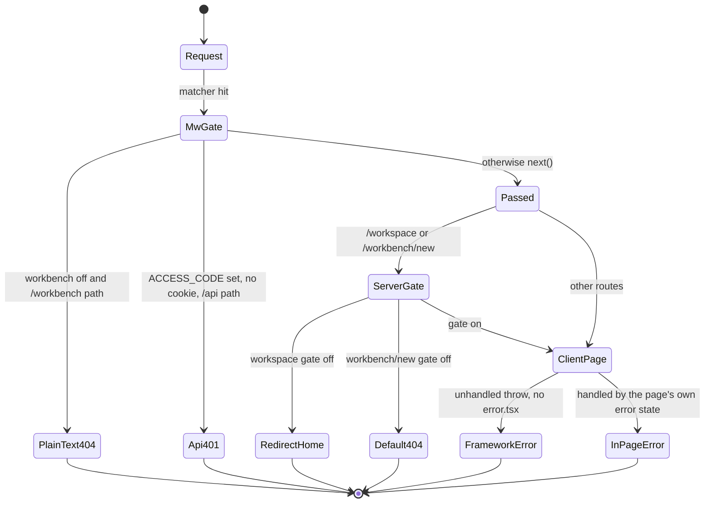
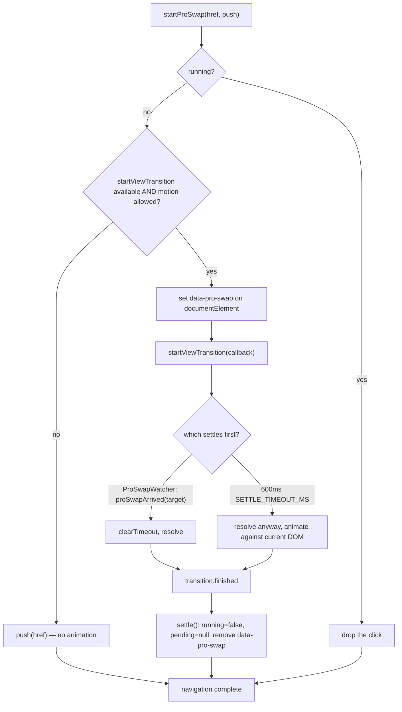

# 05 — Failure modes

Each entry: the trigger, what the code actually does, and where. "Uncovered"
means no handler exists — that is a statement about the code, not a guess.

## The big structural gap: no error or 404 boundaries

`git ls-files app | grep -E "error|not-found|loading|template|global-error"`
returns **nothing**. There is no `app/error.tsx`, `app/global-error.tsx`,
`app/not-found.tsx`, `app/loading.tsx`, or `app/template.tsx` anywhere in the
tree.

Consequences, in order of user visibility:

| Trigger | Actual behaviour |
| --- | --- |
| Unhandled render throw in any client page | Next's built-in error overlay in dev; in production the framework's default error page. No branded surface, no reset button, no i18n |
| `notFound()` from `app/workbench/new/page.tsx:14` | Next's default 404 page — outside the root layout's providers, so no theme, no locale |
| Unknown URL (e.g. `/nope`) | same default 404, but middleware still runs on it (the matcher does not exclude unmatched paths) |
| `middleware.ts:57` workbench 404 | `new NextResponse('Not found', { status: 404 })` — plain `text/plain`, a **third** distinct 404 presentation |
| Slow server segment | no `loading.tsx`, so `/workspace` and `/workbench/new` have no streaming fallback above their own `Suspense` |

Three different 404 renderings for one logical condition (workbench off) is worth
knowing before writing docs that promise a consistent error experience.

## Middleware

| Failure | Behaviour | Where |
| --- | --- | --- |
| `crypto.subtle.importKey` / `sign` rejects | **Uncovered.** `verifyToken` has no `try`; a rejection propagates out of `middleware()` and Next answers 500 for that request — including for page loads that would otherwise have been allowed through to the modal | `middleware.ts:26-35` |
| Malformed cookie (no `.`) | `verifyToken` returns `false` at line 20; request is treated as unauthenticated | `middleware.ts:19-20` |
| Signature length mismatch | early `false` before the XOR loop | `middleware.ts:38` |
| Correct signature, arbitrarily old timestamp | **accepted.** Neither `verifyToken` (Edge) nor `verifyAccessToken` (`lib/server/access-token.ts:11`) inspects the timestamp half. Cookie `maxAge` (7 days, `verify/route.ts:36`) is browser-enforced only, so a captured token never expires server-side | `middleware.ts:22-43` |
| Workbench gate on the Edge runtime | `canInspectServerRuntime` is `false`, so only the public flag is checked (line 55). A build with the public flag on and no `DATABASE_URL` therefore lets `/workbench*` through middleware; the route's own `notFound()` catches it | `middleware.ts:53-58` |

## `instrumentation.ts`

| Failure | Behaviour | Where |
| --- | --- | --- |
| `startAssetCollectorSchedule()` throws | **Uncovered.** It sits outside the `try` at line 36, so `register()` rejects — and everything after it is skipped: `validateServerConfig`, both runners, the notify bus, **and `registerShutdownSignals`**. The server would run without any signal handler | `instrumentation.ts:21` |
| `validateServerConfig()` throws | Cannot: it wraps all four validators in its own `try`/`catch` and warns instead (`lib/server/config-validation.ts:203-212`) | `instrumentation.ts:29` |
| Agent runtime startup throws (bus, runner, or extraction runner) | Caught, logged `'[instrumentation] Agent runtime startup failed'`, boot continues. `runner`/`extractionRunner` stay `undefined`, so the drain's `?.` calls are no-ops | `instrumentation.ts:53-55` |
| One drain step throws during shutdown | Caught per step with its own message; the remaining steps still run | `instrumentation.ts:64,69,74,79,89` |
| Both `SIGTERM` and `SIGINT` arrive | `shutdownPromise ??=` makes the second a join, not a second drain | `instrumentation.ts:59` |
| Signal arrives twice | `process.once` self-removes; asserted in `tests/server/register-shutdown-signals.test.ts:36-39` |
| `getServerPersistenceProvider` rejects at drain time | Caught, logged `'Persistence pool shutdown failed'`; the process still exits | `instrumentation.ts:89-91` |
| In-flight HTTP requests at `SIGTERM` | **Not addressed.** There is no request-draining step; only the background workers are parked | `instrumentation.ts:57-95` |

## Root-layout providers

| Failure | Behaviour | Where |
| --- | --- | --- |
| `/api/access-code/status` fetch rejects | **Fails closed**: `setStatus({ enabled: true, authenticated: false, loading: false })` with the comment "safer than silently disabling" — the modal appears even on a deployment with no `ACCESS_CODE` | `components/access-code-guard.tsx:27-32` |
| `/api/access-code/status` returns non-JSON | **Uncovered by the success path**: `res.json()` rejection is caught by the same `.catch`, so it also fails closed | `components/access-code-guard.tsx:17,27` |
| `useTheme()` used outside `ThemeProvider` | throws `'useTheme must be used within ThemeProvider'` | `lib/hooks/use-theme.tsx:68` |
| `useI18n()` used outside `I18nProvider` | throws `'useI18n must be used within I18nProvider'` | `lib/hooks/use-i18n.tsx:63` |
| `localStorage` unavailable (private mode, blocked storage) | `I18nProvider` swallows and keeps the default locale (`use-i18n.tsx:43-45,52-54`); `readLastWorkspaceSessionId` returns `null` (`workspace-session-memory.ts:35`); home page `try`/`catch` blocks ignore it (`app/page.tsx:186,196,204`) |
| `localStorage.setItem('theme', …)` throws | **Uncovered.** `handleSetTheme` (`lib/hooks/use-theme.tsx:53-56`) has no `try`, so a blocked write throws out of the click handler after the in-memory state has already changed | `lib/hooks/use-theme.tsx:55` |
| A persisted zustand store refuses to write | `StorageHealthNotice` raises a sticky `duration: Infinity` toast per key, with two distinct ids: `persist-unavailable:{name}` (retracted on `'recovered'`) and `persist-changes-lost:{name}` (only dismissable, and dismissal calls `acknowledgePersistLoss(name)`) | `components/storage-health-notice.tsx:28-46` |
| `fetchServerProviders()` 401s behind `ACCESS_CODE` | Silently keeps blank defaults; the `onSuccess` handler in `AccessCodeGuard` re-fires it after the cookie exists, which is the entire reason line 53 exists | `components/access-code-guard.tsx:47-53` |

## Route-level failures

### `/workspace` and `/workbench/new`

| Trigger | Behaviour |
| --- | --- |
| Gate off | `/workspace` → `redirect('/')` (`app/workspace/page.tsx:35`); `/workbench/new` → `notFound()` (`app/workbench/new/page.tsx:14`). Both asserted in `tests/workbench/entry-routes.test.ts:34-42` |
| `createWorkbenchSession` rejects | error state → destructive text + Retry button + "back to workspace" link (`app/workbench/new/client.tsx:110-129`) |
| `WorkbenchApiError` 400 with `/unknown skill/i` | one automatic retry without the skill: `setSkillOverride(null)` + `setAttempt(n+1)`, plus a toast (`app/workbench/new/client.tsx:95-105`) |
| `sessionStorage.removeItem` denied after a successful create | swallowed — "The session exists; a denied cleanup does not invalidate it" (`client.tsx:88-91`) |
| `courseRefsAccepted === false` | warning toast, navigation still proceeds (`client.tsx:84-86`) |
| Legacy handoff JSON malformed | `parseLegacyHandoff` falls back to treating the whole string as the prompt (`client.tsx:34-42`) |

### `/generation-preview`

| Trigger | Behaviour |
| --- | --- |
| No `generationSession` in sessionStorage | "session not found" card with a Back-to-home button (`app/generation-preview/page.tsx:1203-1219`) |
| `JSON.parse` of the session throws | logged via `log.error('Failed to parse generation session:', e)`, `session` stays `null`, so the not-found card renders (`page.tsx:238-240`) |
| `AbortError` during generation | recognised by `isAbortError` and treated as expected navigation-away: logged, **not** surfaced (`page.tsx:1056-1059`) |
| Any other generation error | `sessionStorage.removeItem('generationSession')` then `setError(...)` — the session is destroyed, so a reload lands on the not-found card rather than retrying (`page.tsx:1060-1061`) |
| Provider auth / rate-limit / 5xx | mapped to distinct i18n strings by `sceneGenerationErrorMessage` on `errorCode` and `statusCode` (`page.tsx:148-174`) |
| First-scene TTS fails | throws `t('generation.speechFailed')` — a hard failure of the whole navigation, not a degraded one (`page.tsx:1028`) |
| Unmount mid-generation | `abortControllerRef.current?.abort()` + `clearOutlineReviewTimer()` (`page.tsx:246-251`) |

### `/classroom/[id]`

| Trigger | Behaviour |
| --- | --- |
| Load failure | `setError` → inline destructive message + Retry that calls `loadClassroom()` with the default `isEffectCurrent` (`app/classroom/[id]/page.tsx:233-248`) |
| Course switched mid-load | `claimStageSceneLoadToken()` + `isCurrentStageSceneLoadToken` make the stale load's writes no-ops (lines 47-48); `cancelled` flag plus `stop()` in cleanup (lines 131-138) |
| `fetchStageMeta` rejects | `.catch(() => noteStageOwnership(classroomId, false, null))` — records the outage without concluding the viewer is a stranger (line 106) |
| `fetchStageMeta` returns `'unavailable'` | same: the edit gate keeps its upstream defaults rather than treating `isOwner === false` as a conclusion (lines 94-99) |
| `generateMediaForOutlines` rejects | `log.warn('[Classroom] Media generation resume error:', err)` — swallowed (line 217-219) |
| `JSON.parse(generationParams)` throws | **Uncovered.** Line 160 parses without a `try`, inside the effect body, so a corrupt value throws during the resume effect |
| `loadImageMapping(storageIds)` rejects | **Uncovered.** The `void (async () => { … })()` at lines 194-199 has no `.catch`, producing an unhandled rejection and skipping `finishResume` |

### `/eval/whiteboard`

No error handling at all, by design — it is a Playwright harness. Note it is
**not** flag-gated, so it ships to production and any visitor can reach a route
that installs `window.__setElements`. That setter only writes to the local stage
store for the synthetic `__eval_stage__` id, so the blast radius is a
self-inflicted render.

## Pro-swap failure modes (documented in-source, worth repeating)

`lib/workbench/pro-swap.ts:26-38` enumerates its own three failure modes and the
mitigation for each:

1. **Stuck page** — `startViewTransition` freezes rendering until the callback's
   promise settles, so every wait is raced against `SETTLE_TIMEOUT_MS = 600`
   (line 130). The timer is the one thing that must never fail to run.
2. **Half-faded page** — `data-pro-swap` on `<html>` must not survive the
   transition or two elements fight for one `view-transition-name`. It is removed
   from `finished`, which settles on success, skip **and** abort (line 151).
3. **Double click** — a second swap while one runs is dropped, not queued
   (line 109).

Degradation: no `startViewTransition` or `prefers-reduced-motion: reduce` ⇒ plain
`push(href)`, no attribute, no waiting (lines 112-115).

## Config-time failures

| Trigger | Behaviour | Where |
| --- | --- | --- |
| `MODEL_ROUTES` unparseable, unknown stage key, unregistered provider prefix, bare model id, pinned `<PREFIX>_MODELS` on an unconfigured provider | one `[config] …` `console.warn` each; server still boots | `lib/server/config-validation.ts:1-25,202-213` |
| `NEXT_PUBLIC_PRO_WORKBENCH_ENABLED` set without `OPENMAIC_AGENT_RUNTIME_ENABLED` | explicit warning naming both variables | `lib/server/config-validation.ts:179-183` |
| `OPENMAIC_AGENT_RUNTIME_ENABLED` set without `DATABASE_URL` | explicit warning; probe reports disabled, routes 404, no runner | `lib/server/config-validation.ts:186-190` |
| `maic-agent-driver` route missing or wrong dialect | `assertAgentDriverRouteConfig` throws, caught, warned | `lib/server/config-validation.ts:191-195` |
| `ASSET_COLLECTION_INTERVAL_MS` not a safe integer ≥ minimum | warns and uses the fallback | `lib/persistence/asset-collector-schedule.ts:66-71` |

Everything in this table is **warn-only** — deliberate, and stated at
`lib/server/config-validation.ts:22-24`: operators with partial config still get a
running app.
