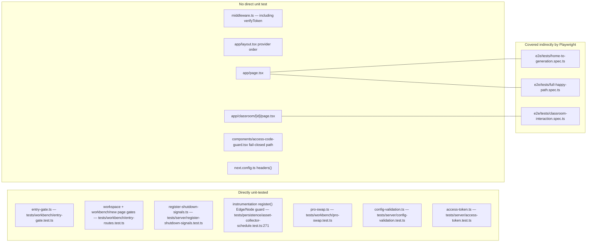
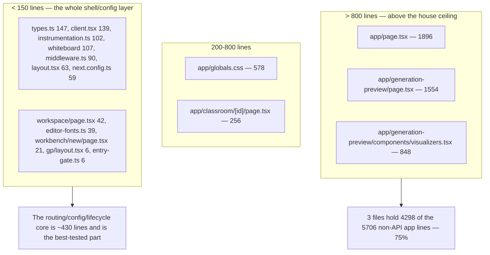

# 06 — Quality observations and measured metrics

## Measured metrics

Every number below was produced by the command next to it, run at repo root on
commit `c2c9553a`.

| # | Metric | Value | Command |
| --- | --- | --- | --- |
| M1 | Non-API source files under `app/` | 15 | `git ls-files app \| grep -v '^app/api/' \| grep -Ec '\.(tsx\|ts\|css)$'` |
| M2 | Total lines in those files | 5706 | `git ls-files app \| grep -v '^app/api/' \| grep -E '\.(tsx\|ts\|css)$' \| xargs wc -l \| tail -1` |
| M3 | `page.tsx` segments (whole `app/`) | 6 | `git ls-files app \| grep -c 'page.tsx$'` |
| M4 | `layout.tsx` files | 2 | `git ls-files app \| grep -c 'layout.tsx$'` |
| M5 | `app/api/**/route.ts` handlers (out of scope, for contrast) | 69 | `git ls-files app/api \| grep -c 'route.ts$'` |
| M6 | Non-API `app/` files with `'use client'` | 6 | `git grep -l "use client" -- 'app/*.tsx' 'app/**/*.tsx' \| grep -vc '^app/api/'` |
| M7 | Files in `components/ui/` | 34 | `git ls-files components/ui \| wc -l` |
| M8 | Lines in `components/ui/` | 3241 | `git ls-files components/ui \| xargs wc -l \| tail -1` |
| M9 | Files in `components/site-header/` | 1 | `git ls-files components/site-header \| wc -l` |
| M10 | Largest non-API `app/` file | `app/page.tsx`, 1896 lines | `git ls-files app \| grep -v '^app/api/' \| grep -E '\.(tsx\|ts\|css)$' \| xargs wc -l \| sort -rn \| head -6` |
| M11 | Total lines across the 8 root config files in scope | 353 | `wc -l middleware.ts next.config.ts instrumentation.ts vercel.json postcss.config.mjs components.json tsconfig.json tsconfig.build.json` |
| M12 | `readBoolean` call sites in `feature-flags.ts` | 13 lines | `git grep -c "readBoolean" -- lib/config/feature-flags.ts` |
| M13 | Exported predicates in `feature-flags.ts` | 14 | `git grep -c "^export function" -- lib/config/feature-flags.ts` |
| M14 | `useEffect(` call sites in `app/page.tsx` | 9 | `git grep -c "useEffect(" -- app/page.tsx` |
| M15 | Lines containing `useState` in `app/page.tsx` | 27 (26 call sites + 1 import) | `git grep -c "useState" -- app/page.tsx` |
| M16 | `useEffect(` call sites in `app/generation-preview/page.tsx` | 3 | `git grep -c "useEffect(" -- app/generation-preview/page.tsx` |
| M17 | `components/ui` files importing the `radix-ui` barrel | 17 | `git grep -l "from 'radix-ui'" -- components/ui \| wc -l` |
| M18 | `await import(` sites in `instrumentation.ts` | 8 | `git grep -c "await import(" -- instrumentation.ts` |
| M19 | `try {` blocks in `instrumentation.ts` | 6 | `git grep -c "try {" -- instrumentation.ts` |
| M20 | `console.error` sites in `instrumentation.ts` | 6 | `git grep -c "console.error" -- instrumentation.ts` |
| M21 | Docstring lines in `app/workspace/page.tsx` (of 42 total) | 26 | `git grep -c "^ \*\|^/\*\*" -- app/workspace/page.tsx` |
| M22 | Test files importing a subsystem module directly | 6 | `git grep -l "@/instrumentation\|@/app/workspace/page\|@/app/workbench/new/page\|@/lib/workbench/entry-gate\|register-shutdown-signals\|@/lib/workbench/pro-swap" -- tests \| wc -l` |
| M23 | Test files importing `@/middleware` | 0 | `git grep -l "from '@/middleware'" -- tests e2e \| wc -l` |
| M24 | Test files importing `@/app/layout` | 0 | `git grep -l "@/app/layout" -- tests e2e \| wc -l` |
| M25 | Test files importing `@/app/page` | 0 | `git grep -l "@/app/page" -- tests e2e \| wc -l` |
| M26 | Test files importing `@/app/classroom/*` | 0 | `git grep -l "@/app/classroom" -- tests e2e \| wc -l` |
| M27 | Test files touching access-code crypto | 1 (`tests/server/access-token.test.ts`, 17 lines, 1 `test`) | `git grep -l "access-code\|access-token" -- tests e2e` |

### Coverage shape

## What is genuinely well built

| Observation | Evidence | Severity |
| --- | --- | --- |
| **Flags are separated into intent vs capability, and the distinction is enforced everywhere.** `isAgentRuntimeConfigured()` = flag AND `DATABASE_URL`; `/api/agent/runtime` returns both `enabled` (usability) and `runtimeEnabled` (intent) so a client can distinguish "off by choice" from "on but broken". | [`lib/config/feature-flags.ts:23`](lib/config/feature-flags.ts#L23), `app/api/agent/runtime/route.ts:6-12,21-24` | strength |
| **One gate function for the two page entry points; the middleware is a third point that computes its own expression.** `isWorkbenchEntryEnabled()` ([`entry-gate.ts:4`](lib/workbench/entry-gate.ts#L4)) = `isProWorkbenchEnabled() && isAgentRuntimeConfigured()`, and it is the single source for [`app/workspace/page.tsx:35`](app/workspace/page.tsx#L35) and [`app/workbench/new/page.tsx:14`](app/workbench/new/page.tsx#L14). [`middleware.ts:53-55`](middleware.ts#L53-L55) does **not** call it — it inlines `isProWorkbenchEnabled() && (!canInspectServerRuntime \|\| isAgentRuntimeConfigured())`, so on the Edge runtime the `DATABASE_URL` half is deliberately dropped and the middleware lets `/workbench` through on the public flag alone. Disagreement is therefore possible by design, not impossible: the page component is what 404s in that case, and the comment at [`:50-52`](middleware.ts#L50-L52) records why. [`tests/workbench/entry-gate.test.ts:29-41`](tests/workbench/entry-gate.test.ts#L29-L41) enumerates all five off-cases including a whitespace-only `DATABASE_URL`, but covers the function, not the middleware expression. | [`lib/workbench/entry-gate.ts:4`](lib/workbench/entry-gate.ts#L4), [`middleware.ts:53-58`](middleware.ts#L53-L58), [`tests/workbench/entry-routes.test.ts:34-50`](tests/workbench/entry-routes.test.ts#L34-L50) | strength, with one asymmetry to know about |
| **Redirect vs 404 is chosen deliberately per route, with the reasoning recorded.** `/workspace` redirects because "a workspace whose every submit 404s is worse than no workspace"; `/workbench/new` 404s because it is a compat shim with no product value. | `app/workspace/page.tsx:10-16,35`, [`app/workbench/new/page.tsx:14`](app/workbench/new/page.tsx#L14) | strength |
| **The Edge/Node split in `instrumentation.ts` is disciplined and the reason is written down.** All 8 imports inside `register()` are dynamic (M18) behind a single `NEXT_RUNTIME` guard, and the `process.once` calls were extracted into their own module specifically because Turbopack's static Edge scan cannot prove the guard. | `instrumentation.ts:16,19,28,37,42,48,50,85,100`; [`lib/server/register-shutdown-signals.ts:4-11`](lib/server/register-shutdown-signals.ts#L4-L11) | strength |
| **Shutdown ordering is causally correct and per-step fault-isolated.** Sessions are parked before any pool they use closes; 6 `try` blocks and 6 distinct `console.error` prefixes (M19/M20) mean one failing drain never skips the rest; `shutdownPromise ??=` plus `process.once` gives two independent once-guards. | [`instrumentation.ts:57-95`](instrumentation.ts#L57-L95) | strength |
| **Boot-time config validation is warn-first and specific.** Each warning names the exact variables to change; the whole validator is wrapped so a bug in validation can never take the server down. | `lib/server/config-validation.ts:22-24,181,188,202-213` | strength |
| **Load-token discipline on the classroom route.** `claimStageSceneLoadToken()` + `isCurrentStageSceneLoadToken` + a `cancelled` flag mean a fast course switch cannot let a stale load write into the new course's store. | `app/classroom/[id]/page.tsx:47-48,131-138` | strength |
| **`fetchStageMeta` distinguishes "not the owner" from "could not ask".** The `'unavailable'` branch deliberately refuses to conclude anything about ownership, with the reasoning inline. | [`app/classroom/[id]/page.tsx:94-104`](app/classroom/[id]/page.tsx#L94-L104) | strength |
| **The pro-swap module documents its own failure modes ranked by severity and mitigates each.** Rare, and the 600 ms race against a promise that gates rendering is the right instinct. | `lib/workbench/pro-swap.ts:26-38,130` | strength |
| **`StorageHealthNotice` gets toast identity right.** "Storage is down" (retractable) and "your edits were lost" (a fact recovery does not undo) get different ids on purpose, with the reasoning in a 6-line comment. | [`components/storage-health-notice.tsx:22-38`](components/storage-health-notice.tsx#L22-L38) | strength |
| **Comments explain rejected alternatives, not just the code.** The 14-line font comment in [`app/layout.tsx:16-28`](app/layout.tsx#L16-L28) records two approaches that failed and why; [`next.config.ts:16-22`](next.config.ts#L16-L22) records the exact runtime error and the e2e it broke. | [`app/layout.tsx:16-28`](app/layout.tsx#L16-L28), [`next.config.ts:16-33`](next.config.ts#L16-L33) | strength |

## Problems

| Observation | Evidence | Severity |
| --- | --- | --- |
| **`components/ui/sonner.tsx` consumes a provider the app never mounts.** It imports `useTheme` from `next-themes` while the root layout mounts the hand-rolled `ThemeProvider` from `@/lib/hooks/use-theme`. `next-themes`' `ThemeProvider` appears nowhere in the repo. Inferred: `theme` is `undefined`, the `= 'system'` default applies, and toasts follow OS colour scheme rather than the user's in-app choice. | `components/ui/sonner.tsx:3,14` vs `app/layout.tsx:8,48`; `rtk grep 'next-themes' .` yields only `sonner.tsx` and `package.json` | medium |
| **Access tokens never expire server-side.** `createAccessToken` signs a timestamp, but neither verifier inspects it. The only expiry is the 7-day cookie `maxAge`, which is browser-enforced. A token copied out of a browser stays valid until `ACCESS_CODE` is rotated. The single test asserts signature behaviour only. | [`lib/server/access-token.ts:4-25`](lib/server/access-token.ts#L4-L25), [`middleware.ts:22-43`](middleware.ts#L22-L43), [`app/api/access-code/verify/route.ts:36`](app/api/access-code/verify/route.ts#L36), [`tests/server/access-token.test.ts:6-16`](tests/server/access-token.test.ts#L6-L16) | medium |
| **`NEXT_PUBLIC_PRO_WORKBENCH_ENABLED` cannot be set in the Docker/Compose build**, yet [`README.md:457`](README.md#optional-agent-workbench-and-runtime) documents it as the enablement path. It is absent from the builder `ARG` list and from Compose `build.args`, and it is inlined at build time — so a Compose deployment cannot turn the Pro workbench on. | [`Dockerfile:51-72`](Dockerfile#L51-L72), [`docker-compose.yml:5-21`](docker-compose.yml#L5-L21), [`README.md:456-461`](README.md#optional-agent-workbench-and-runtime) | medium |
| **Two load-bearing docstrings describe components that do not exist.** [`app/workspace/page.tsx:5-8`](app/workspace/page.tsx#L5-L8) and [`components/workbench/workspace/WorkspaceShell.tsx:7`](components/workbench/workspace/WorkspaceShell.tsx#L7) both say `AppChrome` suppresses `SiteHeader` on the workspace path. Neither symbol exists; `components/site-header/` has only ever contained `theme-toggle.tsx`. A reader trying to find where the header is suppressed will find nothing. | `git grep "AppChrome\|SiteHeader"` returns only comments + CSS comments; `git log --pretty=format: --name-only -- 'components/site-header/'` lists one file | medium |
| **`app/editor-fonts.ts`'s docstring contradicts its only importer.** It says "Imported once from the root layout"; `app/layout.tsx` does not import it. The sole importer is the lazy `import('@/app/editor-fonts')` in [`lib/edit/preload-editor.ts:35`](lib/edit/preload-editor.ts#L35). The docstring also says Inter is loaded "via `next/font` in `app/layout.tsx`", which stopped being true when the layout switched to `@fontsource-variable/inter` ([`app/layout.tsx:16-29`](app/layout.tsx#L16-L29)). | [`app/editor-fonts.ts:1-12`](app/editor-fonts.ts#L1-L12) vs [`app/layout.tsx:29`](app/layout.tsx#L29), [`lib/edit/preload-editor.ts:35`](lib/edit/preload-editor.ts#L35) | low |
| **No error/404/loading boundaries anywhere in `app/`.** Three distinct 404 presentations exist for the single condition "workbench disabled" (plain-text from middleware, Next's default page from `notFound()`, a redirect from `/workspace`), and any unhandled client throw drops to the framework's unstyled error page outside the provider stack. | `git ls-files app \| grep -E "error\|not-found\|loading\|template"` returns nothing; [`middleware.ts:57`](middleware.ts#L57); [`app/workbench/new/page.tsx:14`](app/workbench/new/page.tsx#L14) | medium |
| **`startAssetCollectorSchedule()` sits outside `register()`'s `try`.** A throw there skips config validation, both runners, the notify bus, and — critically — `registerShutdownSignals`, leaving a server with no drain handler. The four calls that follow it are all individually protected; this one is not. | [`instrumentation.ts:21`](instrumentation.ts#L21) vs the `try` opening at line 36 | medium |
| **`middleware.ts` has zero direct test coverage (M23).** The hand-rolled Edge HMAC verifier, the matcher, and the gate-before-allowlist ordering are all untested. Its Node twin (`access-token.ts`) has one 17-line test with a single assertion block. | M23; `tests/server/access-token.test.ts` | medium |
| **`app/page.tsx` is 1896 lines with 26 `useState` slots and 9 effects in one client component** (M10/M14/M15) and has no unit test (M25). It is the app's entry surface and the only place the Pro runtime probe, the generation handoff, folder CRUD, search, and thumbnail lifecycle all live. House style is 200-400 lines, 800 max. | M10, M14, M15, M25 | medium |
| **The generation handoff has no schema validation on either side.** [`app/generation-preview/page.tsx:226`](app/generation-preview/page.tsx#L226) casts `JSON.parse` output to `GenerationSessionState` and checks only `previewPhase`; [`app/classroom/[id]/page.tsx:160`](app/classroom/[id]/page.tsx#L160) parses `generationParams` with no `try` at all, so a corrupt value throws inside the resume effect. A stale-shape session from a previous deployment is accepted. | [`app/generation-preview/page.tsx:226-228`](app/generation-preview/page.tsx#L226-L228), [`app/classroom/[id]/page.tsx:159-160`](app/classroom/[id]/page.tsx#L159-L160) | low |
| **Two unhandled async paths in the classroom resume effect.** `void (async () => { … })()` at [`app/classroom/[id]/page.tsx:194-199`](app/classroom/[id]/page.tsx#L194-L199) has no `.catch`: a `loadImageMapping` rejection becomes an unhandled rejection and `finishResume` never runs, so the deck silently stops resuming. | [`app/classroom/[id]/page.tsx:194-199`](app/classroom/[id]/page.tsx#L194-L199) | low |
| **`ThemeProvider` is mounted twice on the classroom route.** [`app/classroom/[id]/page.tsx:224`](app/classroom/[id]/page.tsx#L224) nests a second one inside the root layout's. Harmless (the inner one wins for its subtree and applies the same `dark` class to the same `documentElement`) but it means two independent `matchMedia` listeners and two `localStorage` reads. | [`app/layout.tsx:48`](app/layout.tsx#L48), [`app/classroom/[id]/page.tsx:224`](app/classroom/[id]/page.tsx#L224) | low |
| **`handleSetTheme` writes `localStorage` without a guard.** Every other storage touch in the shell is wrapped; this one throws out of the click handler in a blocked-storage context, after the in-memory state has already changed. | [`lib/hooks/use-theme.tsx:53-56`](lib/hooks/use-theme.tsx#L53-L56) vs [`lib/hooks/use-i18n.tsx:50-54`](lib/hooks/use-i18n.tsx#L50-L54) | low |
| **`/eval/whiteboard` is an unflagged production route.** It installs `window.__setElements` and `window.__evalReady` and exists only to be driven by `eval/whiteboard-layout/capture.ts`. Blast radius is limited to the synthetic `__eval_stage__`, but it is reachable on any deployment. | `app/eval/whiteboard/page.tsx:55,79`; no flag check in the file | low |
| **`tsconfig.build.json` replaces rather than extends `exclude`,** and the only thing keeping the two lists consistent is a comment. Dev typechecks `tests`/`eval`; production does not. | [`tsconfig.build.json:3-15`](tsconfig.build.json#L3-L15) vs [`tsconfig.json:33-41`](tsconfig.json#L33-L41) | info |
| **`X-Frame-Options` is dropped entirely when `ALLOWED_FRAME_ANCESTORS` is set.** Correct — the header has no allow-list form — but it means embedding-enabled deployments lose the fallback for browsers without CSP `frame-ancestors` support. The comment says so. | [`next.config.ts:46-51`](next.config.ts#L46-L51) | info |

## Complexity distribution

The shape is worth stating plainly for documentation authors: **the shell itself
is small, deliberate, and well covered; the two product pages hanging off it are
where the complexity lives.** `middleware.ts` (90) + `instrumentation.ts` (102) +
`app/layout.tsx` (63) + `next.config.ts` (59) + `lib/config/feature-flags.ts`
(128) + `lib/workbench/entry-gate.ts` (6) = **448 lines**, of which the two gate
modules, `instrumentation.ts`'s runtime guard, and the shutdown split all have
direct unit tests. `middleware.ts`, `app/layout.tsx`, and `next.config.ts` have
none (M23/M24).
