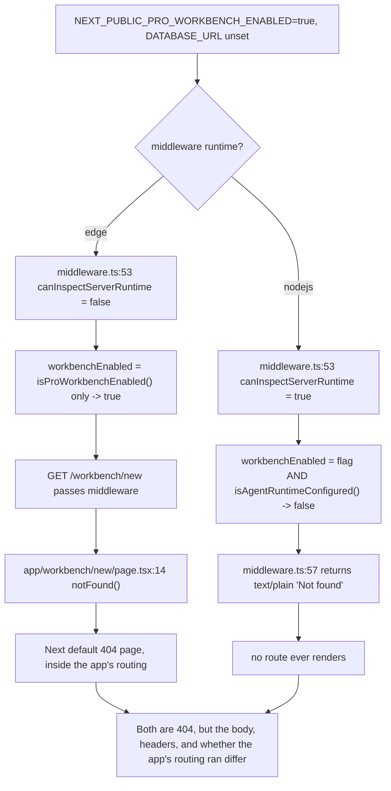
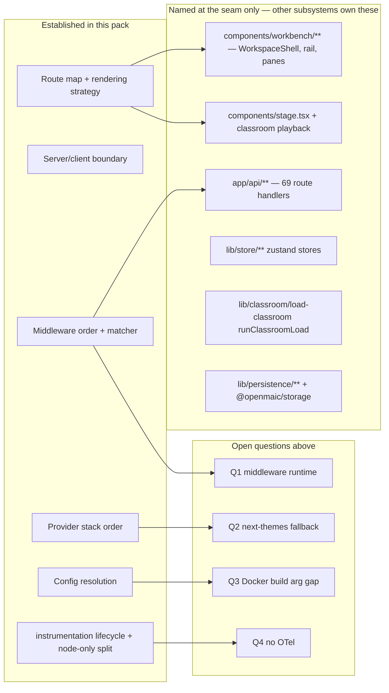

# 07 — Open questions

Things I could not determine from the repository, with the reason. Nothing here
is a guess; where I have a lean, it is labelled `Inferred:` and the missing
evidence is named.

## Blocking uncertainties

### Q1 — Which runtime does `middleware.ts` actually run on?

`middleware.ts:53` branches on `process.env.NEXT_RUNTIME !== 'edge'` and the
comment at lines 50-52 says middleware "cannot reliably inspect server-only
deployment variables, so it enforces the public gate and leaves the complete
runtime/database check to Node. A Node-hosted middleware uses the same gate as
startup."

But there is **no** `export const config = { runtime: 'nodejs' }` in
`middleware.ts` and **no** `experimental.nodeMiddleware` in `next.config.ts`
(`git grep "nodeMiddleware\|NEXT_RUNTIME"` returns only the two source guards and
two test stubs). So the runtime is whatever `next@16.2.11` defaults to.

Why it matters: on Edge, `isAgentRuntimeConfigured()` never participates in the
`/workbench*` 404 gate, so a build with `NEXT_PUBLIC_PRO_WORKBENCH_ENABLED=true`
and no `DATABASE_URL` lets `/workbench/new` through middleware and relies on the
route's own `notFound()`. On Node, middleware answers 404 first.

Blocked by: `node_modules` is not installed in this checkout (`ls node_modules`
→ no such file), so Next's shipped default could not be read from source, and I
will not assert a framework default from memory. **Resolve by** running
`pnpm dev` and logging `process.env.NEXT_RUNTIME` from inside `middleware()`, or
by reading `node_modules/next/dist/build/…` after an install.

The two branches produce different, observable behaviour for the same
misconfiguration — which is exactly why this is worth resolving before writing
docs that describe the gate:

### Q2 — Does `next-themes`' `useTheme` really fall through to `'system'` outside a provider?

`components/ui/sonner.tsx:3,14` reads `useTheme` from `next-themes` while the app
mounts only its own `ThemeProvider` (`app/layout.tsx:8,48`). The observable
symptom depends entirely on what `next-themes` returns with no provider above it.

`Inferred:` the library returns a default context object with `theme` undefined,
the `= 'system'` destructuring default applies, and Sonner does its own
`prefers-color-scheme` detection — so toast colours track the OS, not the in-app
choice. **Not verified**: `node_modules` is absent, so I could not read
`next-themes`' `ThemeContext` default, and no test covers `components/ui/sonner.tsx`.
**Resolve by** toggling to an in-app theme that disagrees with the OS and raising a
toast.

### Q3 — Is the missing `NEXT_PUBLIC_PRO_WORKBENCH_ENABLED` Docker build arg a bug or a policy?

`Dockerfile:51-72` and `docker-compose.yml:5-21` list 11 build-time variables and
omit this one, while `README.md:456-461` documents it as the enablement path. Every
other `NEXT_PUBLIC_*` flag in `.env.example` that gates a UI surface **is** wired
through as an `ARG`.

No comment or commit message in the surveyed history explains the omission
(history is squashed at `04621578`). Cannot distinguish "the workbench is
deliberately not supported in the Compose deployment" from "the arg was forgotten
when the flag was added". **Resolve by** asking the maintainers, or by checking
whether the hosted deployment at `open.maic.chat` is built from this Dockerfile.

## Non-blocking uncertainties

### Q4 — Where is the OpenTelemetry setup the brief expected?

There is none. `rtk grep "opentelemetry" .` finds 80 matches across exactly three
files, all lockfiles (`pnpm-lock.yaml`, `packages/docs/pnpm-lock.yaml`,
`render-service/package-lock.json`) — `@opentelemetry/api@1.9.0` arrives
transitively via `@langchain/core` and Next's own instrumentation hooks. **No
first-party file imports any `@opentelemetry/*` package.**

`instrumentation.ts` is Next's `instrumentation` convention used purely for
process-lifecycle work — background schedules, config validation, and graceful
shutdown — not for tracing. Open: whether OTel is planned. Nothing in
`.env.example` (no `OTEL_*` variables) or `README.md` suggests it.

### Q5 — Is `/eval/whiteboard` intended to ship to production?

It is a plain route with no flag check (`app/eval/whiteboard/page.tsx`), reached
only by `eval/whiteboard-layout/capture.ts:19`. Nothing in `next.config.ts`
excludes it. Whether the maintainers consider its presence on a public deployment
acceptable is a product decision I cannot read from the code. The concrete risk is
low: `window.__setElements` writes only to the synthetic `__eval_stage__`.

### Q6 — Does the middleware matcher's literal `favicon.ico` exclusion still apply?

`middleware.ts:89` excludes `favicon.ico`, but the icon is
`app/favicon.ico` — a Next metadata file, which the framework serves from a
generated route, not necessarily at the literal path `/favicon.ico`.
`app/apple-icon.png` has no exclusion at all. **Resolve by** inspecting the
response `Server-Timing` / request log for both icon URLs on a running server.
Functional impact is nil either way (an icon request under `ACCESS_CODE` takes the
page pass-through branch at line 85); it is only middleware invocation cost.

### Q7 — Does `experimental.proxyClientMaxBodySize: '200mb'` affect page segments?

`next.config.ts:36` sets it, and `vercel.json:6-10` caps `maxDuration` only for
`app/api/**/*.ts`. Whether the 200 MB body limit applies to every request or only
to proxied ones is a Next semantic I could not confirm without the installed
package. No file in scope reads a request body, so this does not change any
behaviour I documented.

### Q8 — Is the double `ThemeProvider` on `/classroom/[id]` load-bearing?

`app/classroom/[id]/page.tsx:224` nests a second `ThemeProvider` inside the root
layout's. The inner one wins for its subtree, but both write the same `dark` class
to the same `documentElement`, so the outcome is identical. Whether it predates
the root-layout provider or guards some render path I did not find is unclear —
there is no comment. Removing it looks safe but I did not test that.

### Q9 — Which surface renders `pro-swap.css` on the exit direction?

`lib/workbench/pro-swap.ts:123` sets `data-pro-swap='exit'` when leaving
`/workspace`, and the CSS that reads it (`components/workbench/pro-swap.css:193`)
is imported by `components/workbench/ProBadge.tsx:16`. The exit is triggered from
`components/workbench/workspace/WorkspaceShell.tsx:648` (`exitPro`). Whether the
workspace shell mounts a `ProBadge` — and therefore whether the exit stylesheet is
present when the exit animation runs — is inside the workbench subsystem, which is
out of scope here. Flagging it because a missing stylesheet on the exit path would
be an invisible degradation to a plain cut.

## What I deliberately did not chase

Boundaries I stopped at, and the exact seam:

| Adjacent subsystem | Seam in this subsystem |
| --- | --- |
| Workbench shell | `components/workbench/WorkspaceEntry.tsx:5` → `<WorkspaceShell />` |
| Classroom playback | `app/classroom/[id]/page.tsx:250` → `<Stage onRetryOutline={…} />` |
| Classroom loading | `app/classroom/[id]/page.tsx:50` → `runClassroomLoad({ … })` |
| Generation pipeline | `app/generation-preview/page.tsx:24-27` → `fetchSceneActions` / `fetchSceneContent` / `generateTTSForScene` |
| Persistence + asset lifecycle | `instrumentation.ts:20,86` → `asset-collector-schedule`, `server-provider` |
| Agent runtime | `instrumentation.ts:43,48,50` → notify bus + two runners |
| Settings / provider config | `components/server-providers-init.tsx:11` → `useSettingsStore.fetchServerProviders` |
| API surface | `middleware.ts:66,77` (allowlist + 401) and `app/api/agent/runtime/route.ts` (the probe) |
