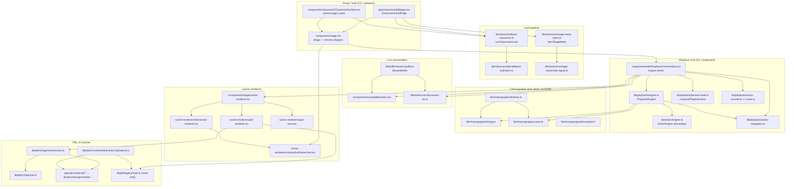
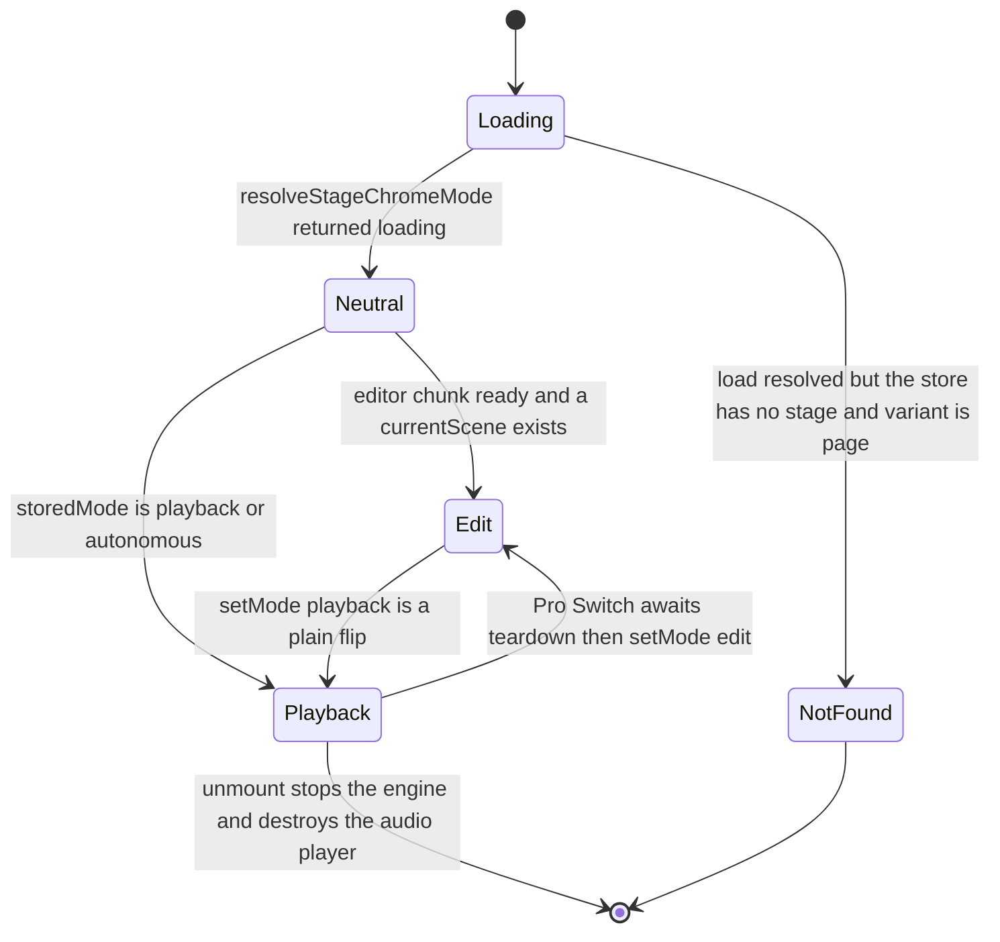

# classroom-runtime — overview

The live classroom: everything that happens after a course document exists and a
learner opens `/classroom/<id>`. It owns the playback state machine, the shared
timing/choreography spec, the presentation-pacing buffer, the roundtable
(multi-agent discussion surface), the four scene renderers, and the PBL v2
project runtime.

It does **not** own: course generation (`lib/hooks/use-scene-generator.ts`, out of
scope), the slide editor (`components/edit/EditChromeRoot`), the chat/director
orchestration behind `POST /api/chat` (`components/chat/use-chat-sessions.ts`,
`lib/orchestration/**`), or the video exporter (`lib/video-export/**`). Those are
neighbours this subsystem calls into or is called by.

## Charter

1. Turn a `Scene[]` into wall-clock behaviour — narration audio, whiteboard
   strokes, slide effects — deterministically enough that a second consumer (the
   video exporter) can reproduce it offline from the same spec.
2. Let a learner interrupt that playback at any instant, hold a live multi-agent
   conversation, and return to the exact position they left.
3. Host non-slide scene kinds (quiz, interactive HTML, PBL project) inside the
   same chrome and the same scene cursor.

## Vocabulary, precisely

| Term | What it actually is in code | Anchor |
| --- | --- | --- |
| **stage** | The course document: id, name, style, `generatedAgentConfigs`, stage-level `whiteboard`. Also — confusingly — the name of the top-level React container `components/stage.tsx`. | `packages/@openmaic/dsl/src/stage.ts` |
| **scene** | One page. `SceneCore` carries `id`, `stageId`, `title`, `order`, optional `actions?: Action[]` and `whiteboards?: Slide[]`; `Scene` binds a `type` discriminant (`slide` / `quiz` / `interactive` / `pbl`) to its matching `content`. | `packages/@openmaic/dsl/src/stage.ts:228`, `:278` |
| **action** | One playback verb. A 21-member discriminated union: `speech`, `spotlight`, `laser`, `play_video`, twelve `wb_*`, `discussion`, four `widget_*`. | `packages/@openmaic/dsl/src/action.ts:235` |
| **utterance** | **Not a domain type.** The only `utterance` identifier in the subsystem is `SpeechSynthesisUtterance` in the browser-TTS path (`lib/playback/engine.ts:798`). The two things a doc means by "utterance" are distinct types: a *lecture* line is a `SpeechAction` (authored, has `audioId` pointing at pre-generated audio); a *live* line is a `StreamBuffer` `TextItem` segment that is sealed and then queued for TTS. | `lib/playback/engine.ts:798`, `lib/buffer/stream-buffer.ts:35` |
| **fire-and-forget vs blocking** | `FIRE_AND_FORGET_ACTIONS = ['spotlight', 'laser']`; everything else holds the cursor. The timeline reads this list rather than hardcoding it. | `packages/@openmaic/dsl/src/action.ts:261`, `lib/choreography/timeline.ts:51` |
| **cursor** | `(sceneIndex, actionIndex)`. The engine is constructed with a **one-scene** array, so `sceneIndex` is effectively always 0 in the app; the multi-scene walk exists for the exporter. | `components/edit/PlaybackChromeRoot.tsx:759`, `lib/choreography/cursor.ts:44` |
| **generation** (playback) | A monotonic counter on `PlaybackEngine`. Every state transition bumps it; every async continuation checks it. This is the subsystem's cancellation primitive. | `lib/playback/engine.ts:493` |

## Internal parts

Note what the diagram says that a table would not: `lib/choreography` has **no
inbound edge from the app** except through `PlaybackEngine`, and no outbound edge
at all — that is an eslint-enforced purity boundary (see
`04-dependencies-and-config.md`). And `InteractiveIframeHost` is reached from
`Stage`, *above* the mode-swap subtree, not from the scene renderer — that is the
whole point of the keep-alive design.

## The two chrome roots

`Stage` renders exactly one of `EditChromeRoot`, `PlaybackChromeRoot`, or a
neutral `aria-busy` shell, chosen by `resolveStageChromeMode`
(`components/stage.tsx:193`). Playback → edit awaits
`PlaybackChromeRootHandle.teardown()` first (`components/stage.tsx:221`,
`components/edit/PlaybackChromeRoot.tsx:544`); edit → playback is a bare flip
because `PlaybackChromeRoot` re-initialises from scratch on mount.

## File inventory (in-scope paths)

Measured per directory (exact command in `06-quality-and-metrics.md`).
**126 files / 33 687 lines** across every declared path; **110 files / 29 835
lines** excluding `lib/hooks/`, most of which belongs to other subsystems.

| Path | Files | Lines | Largest member |
| --- | --- | --- | --- |
| `lib/classroom/` | 6 | 1 024 | `load-classroom.ts` (710) |
| `lib/choreography/` (+`descriptors/`) | 8 | 1 147 | `timeline.ts` (403) |
| `lib/playback/` | 8 | 1 651 | `engine.ts` (902) |
| `lib/buffer/` | 1 | 749 | `stream-buffer.ts` |
| `lib/live/` | 1 | 54 | `server-api.ts` — **misnamed**: it is a course-rename fetch wrapper, nothing to do with live playback |
| `lib/interactive/` | 1 | 29 | `logical-viewport.ts` |
| `lib/pbl/` (`v2/` + `legacy/`) | 37 | 9 599 | `v2/agents/instructor.ts` (1 864) |
| `lib/hooks/` | 16 | 3 852 | `use-scene-generator.ts` (1 053, generation — out of scope) |
| `components/roundtable/` | 4 | 2 734 | `index.tsx` (2 189) |
| `components/classroom/` | 1 | 392 | `ClassroomSurface.tsx` |
| `components/stage/` | 5 | 1 468 | `scene-sidebar.tsx` (597) |
| `components/scene-renderers/` (+`pbl/`) | 30 | 9 980 | `pbl/v2/chat.tsx` (1 553) |
| `app/classroom/[id]/` | 1 | 256 | `page.tsx` |
| `app/api/classroom/` | 1 | 85 | `route.ts` |
| `app/api/classroom-media/` | 1 | 131 | `[classroomId]/[...path]/route.ts` |
| `app/api/pbl/v2/` | 5 | 536 | `task/update/route.ts` (162) |

Two files central to the subsystem live **outside** the declared scope and are
documented anyway because nothing else makes sense without them:
`components/edit/PlaybackChromeRoot.tsx` (1 848 lines — owns the engine, the
roundtable props and the chat wiring) and `lib/action/engine.ts` (902 lines — the
executor every non-speech action goes through).

## Notes-pack index

Thirteen files, each 130–348 lines, 30 Mermaid diagrams in total (15 flowchart,
7 sequenceDiagram, 5 stateDiagram-v2, 1 classDiagram, 1 erDiagram, 1 mindmap).

> **Resolved.** This note previously read "`/docs` is gitignored, so this pack is
> untracked". The `/docs` entry has since been removed from `.gitignore`, so the whole set
> including this pack is tracked normally and `scripts/check-docs-links.mjs` can gate it —
> see [`../../../16-development-view/07-quality-gates.md`](../../../16-development-view/07-quality-gates.md)
> §Gate 6.

Every row links, so this table is the pack's navigation as well as its manifest.

| File | Contents |
| --- | --- |
| `00-overview.md` | this file: charter, vocabulary, inventory, internal-parts map |
| [`01a-modules-playback.md`](./01a-modules-playback.md) | classroom load, `PlaybackEngine`, choreography spec, `StreamBuffer`, roundtable |
| [`01b-modules-pbl-interactive.md`](./01b-modules-pbl-interactive.md) | scene dispatch, PBL v2 runtime, legacy PBL reachability |
| [`01c-modules-interactive-sandbox.md`](./01c-modules-interactive-sandbox.md) | interactive HTML scenes: keep-alive host, sandbox, CSP, shims |
| [`02-interfaces.md`](./02-interfaces.md) | playback engine / derived view / navigation signatures + classDiagram |
| [`02b-interfaces-pbl-and-scenes.md`](./02b-interfaces-pbl-and-scenes.md) | PBL v2 wire types, interactive host types + erDiagram |
| [`02c-interfaces-choreography-and-buffer.md`](./02c-interfaces-choreography-and-buffer.md) | choreography spec, descriptors, `StreamBuffer` contract |
| [`03a-flows-playback.md`](./03a-flows-playback.md) | flows A–C: cold open, learner interrupt, authored discussion |
| [`03b-flows-scenes-and-pbl.md`](./03b-flows-scenes-and-pbl.md) | flows D–E: seek + gated scene switch, PBL task completion |
| [`04-dependencies-and-config.md`](./04-dependencies-and-config.md) | npm deps, browser APIs, HTTP surfaces, env vars, config resolution, the purity boundary |
| [`05-failure-modes.md`](./05-failure-modes.md) | failure inventory and what each one degrades to |
| [`06-quality-and-metrics.md`](./06-quality-and-metrics.md) | every measured metric with its command; strengths and fragilities |
| [`07-open-questions.md`](./07-open-questions.md) | what could not be determined, and why |

Pack→topic mapping and the shared chapter convention: [`../index.md`](../index.md).
