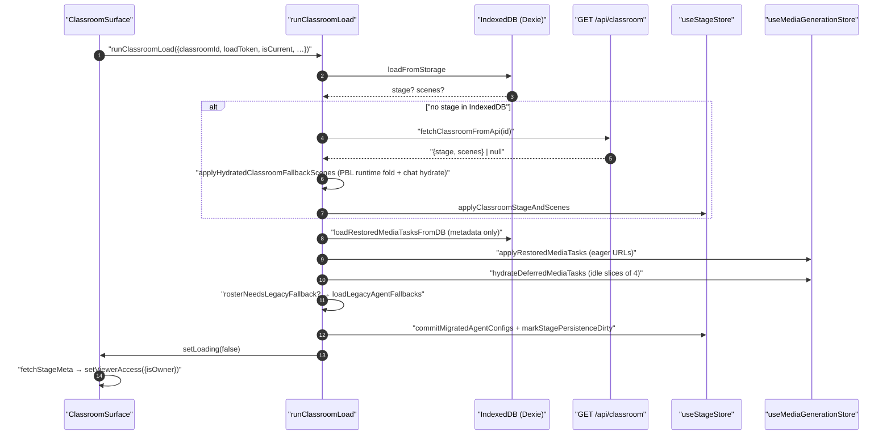
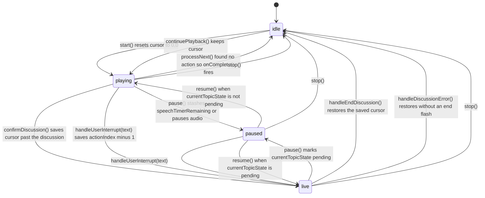
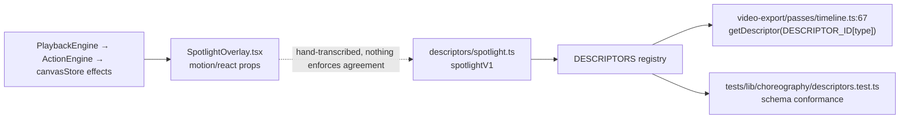
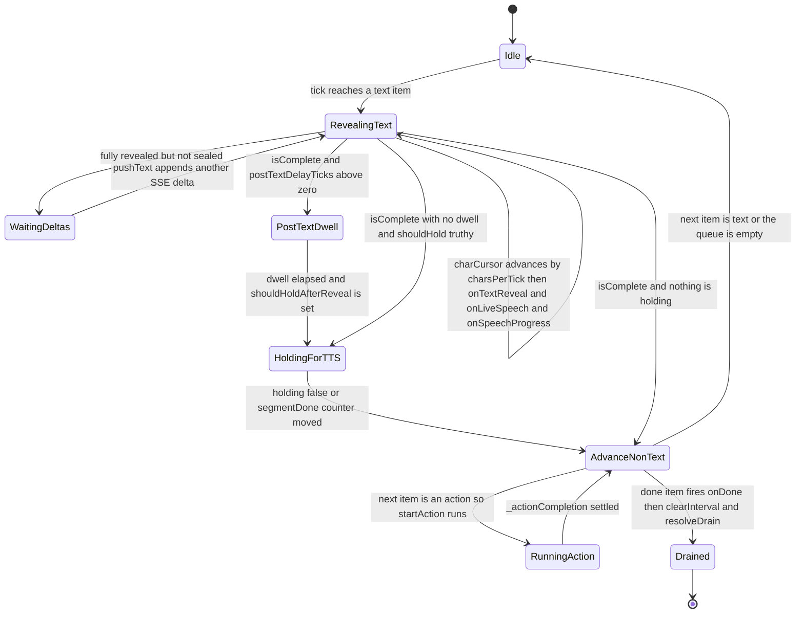

# Modules (a) — load, playback, choreography, buffer, roundtable

Companion file: `01b-modules-pbl-interactive.md` (PBL v2, legacy PBL, interactive
scene sandbox).

## 1. Classroom load — `lib/classroom/`

### `load-classroom.ts:111` `runClassroomLoad`

A fully dependency-injected load pipeline: `RunClassroomLoadArgs`
(`load-classroom.ts:56`) has 19 members, 16 of them injected functions. Order of
operations:

1. `loadFromStorage(classroomId, loadToken)` — IndexedDB first.
2. If the store still has no stage, `fetchClassroom` →
   `GET /api/classroom?id=…` (`load-classroom.ts:261`) and
   `applyFallbackScenes`.
3. `loadRestoredMediaTasks` — metadata-only read of `db.mediaFiles`
   (`:359`), split into eager `tasks` and `deferred` records.
4. Roster hydration: the stage document is authoritative; a legacy per-stage
   IndexedDB mirror is probed *once per session per stage* as a migration source
   (`:194`, memo set `fruitlessLegacyProbeStageIds` at `:104`).
5. `restoreAgentSelection` reconciles persisted agent selection against the
   stage's roster.

`isCurrent()` is re-checked after **every** await — 12 call sites in the
`runClassroomLoad` body — because both the media store and the agent registry are
global singletons and a classroom switch mid-load would otherwise
cross-contaminate them.

Two deliberate three-state distinctions live here and are load-bearing:

- `generatedAgentConfigs === undefined` (document predates roster persistence →
  probe the mirror) vs `[]` (authoritative empty roster → never probe)
  — `rosterNeedsLegacyFallback` at `:594`.
- `loadLegacyAgentFallbacks` returning `null` (read *failed*, retry next load) vs
  `[]` (mirror empty, memoise) — `:650`.

### Deferred media hydration

`applyRestoredMediaTasks` (`:460`) applies metadata synchronously and kicks off
`hydrateDeferredMediaTasks` (`:526`), which mints object URLs 4 records per idle
slice (`MEDIA_HYDRATION_CHUNK_SIZE = 4`, `MEDIA_HYDRATION_IDLE_TIMEOUT_MS = 1000`,
`:494`). A monotonic `hydrationEpoch` (`:458`) plus the caller's `isLoadCurrent`
gate the loop; a superseded restore revokes URLs it already minted rather than
leaking them (`:551`).

### `stage-ownership-signal.ts` and the third ownership state

The store holds booleans; the sidecar answers three ways. `noteStageOwnership`
(`:31`) records `found` / `absent` / `unavailable` beside the store so
`isOwner === false` is never mistaken for "this is a stranger's course" when the
sidecar simply did not answer. `resolveStageFallbackAccess` (`:58`) defaults to
`{ isOwner: true }` — single-user IndexedDB deployments have no sidecar row.

### Route duplication (real defect)

`ClassroomSurface.tsx:4` claims it is "the classroom, wherever it is mounted",
and `WorkspaceClassroomPane.tsx:168` uses it. But
`app/classroom/[id]/page.tsx:28` still carries its **own copy** of the load body
and does *not* import `ClassroomSurface`. The copies have already diverged: the
route lacks the `notFound` terminal state (`ClassroomSurface.tsx:90`), the
`useCanvasStore.resetCanvasState()` call (`:184`), the
`outlineProducer === 'server-job'` guard (`:239`) and
`shouldResumeClassroomGeneration` (`:225`).

## 2. `PlaybackEngine` — `lib/playback/engine.ts`

The state machine. 902 lines, one class, no React.

### States and transitions

`EngineMode = 'idle' | 'playing' | 'paused' | 'live'` (`types.ts:18`).

### Clock ownership

There is no single clock. Whichever of four mechanisms is live owns the advance:

| Owner | Set up at | Advances by |
| --- | --- | --- |
| Pre-generated audio (`AudioPlayer`) | `engine.ts:589` `audioPlayer.onEnded(...)` | the player's end callback → `processNext` |
| Browser-native TTS | `engine.ts:829` `utterance.onend` | per *sentence chunk*, then `playBrowserTTSChunk` recursion |
| Reading timer (no audio) | `engine.ts:601` `scheduleReadingTimer` | `setTimeout(estimateSpeechDurationMs(text, {speed}))` |
| `ActionEngine.execute` await | `engine.ts:735` | the action's own `delay()` |

Spotlight/laser do not advance a clock at all — they fire and `queueMicrotask`
straight to `processNext` (`:672`), with the microtask explicitly there to avoid
stack overflow on long runs of consecutive effects.

### Pause / seek / resume mid-utterance

- **Pause while speaking with audio**: `audioPlayer.pause()` (`:250`).
- **Pause while speaking with browser TTS**: the remaining chunks are saved
  (`browserTTSPausedChunks`, `:246`) and `speechSynthesis.cancel()` is called,
  because `speechSynthesis.pause()/resume()` is broken on Firefox. Resume
  re-speaks **from the start of the current chunk** (`:280`) — so a pause loses
  at most one sentence of position, not the whole line.
- **Pause with no audio**: the remaining reading time is computed from
  `Date.now() - speechTimerStart` and stashed in `speechTimerRemaining` (`:232`);
  resume reschedules exactly that (`:302`).
- **Pause waiting on a ProactiveCard**: audio is deliberately *not* touched
  (`:241`, `:274`) — there is no active speech.
- **Seek** = `jumpToAction(index, {autoplay})` (`:182`). It only accepts targets
  whose whole prefix is reconstructable (see below), then replays every
  whiteboard action in that prefix with `{silent: true}` so board state matches,
  re-checking the generation before each step.

### Generation guard

`invalidatePlaybackGeneration()` (`:493`) bumps a counter; every async
continuation starts with `if (!this.isCurrentGeneration(generation)) return;`.
There are 19 guard call sites, from `engine.ts:198` to `:838` (the name occurs 20
times in the file; the twentieth is the method's own declaration at `:498`). This is what makes
`pause`, `stop`, `jumpToAction` and `handleUserInterrupt` safe against in-flight
promises.

A second, subtler ordering rule appears twice with an explicit comment: **set
`mode` before stopping audio**, because `speechSynthesis.cancel()` can fire
`onend` synchronously and the `processNext` guard tests `this.mode === 'playing'`
(`:319`, `:459`).

### Navigation safety — `action-navigation.ts`

`UNSAFE_ACTION_TYPES` (`:16`) = `play_video`, `discussion`, and the four
`widget_*`. A jump target must (a) be a `speech` action and (b) have **no** unsafe
action anywhere in the prefix before it — `canReconstructPrefixForAction` (`:48`).
`canJumpWithinReconstructablePrefix` (`:65`) additionally requires the *current*
prefix to be clean, so you cannot jump backwards out of a state a widget already
mutated. `WHITEBOARD_ACTION_TYPES` (`:25`) is the replay set.

### Resume persistence — two independent stores

| Store | Scope | Key | Written by |
| --- | --- | --- | --- |
| `sessionStorage` | per tab, per scene | `openmaic:playback-action-resume:<stageId>` (`action-resume.ts:20`) | `saveActionResumePosition` on every `onProgress` |
| KV `device` scope | per device, per stage | `playback-cursor:<stageId>` (`cursor.ts:36`) | `saveCursor`, debounced 1 s (`PlaybackChromeRoot.tsx:330`) |

`sessionStorage` wins: `PlaybackChromeRoot.tsx:690` only consults the KV cursor
when the session position is absent. Both are validated against live actions —
the stored `actionId`/`actionType` must still match (`action-resume.ts:97`).
Consumed-discussion state is **deliberately not persisted** (`cursor.ts:99`,
citing #869: a re-shown discussion card auto-skips, so durability buys nothing).

## 3. Choreography spec — `lib/choreography/`

The single source of truth shared with the video exporter. Machine-enforced pure:
eslint blocks `@/…` paths, non-sibling imports, dynamic `import()`, `require()`,
and any React/DOM/GSAP/framer-motion reference inside `lib/choreography/**`
(`eslint.config.mjs:255-323`).

| Module | Exports | Note |
| --- | --- | --- |
| `timing.ts` | `EFFECT_AUTO_CLEAR_MS=5000`, `DISCUSSION_TRIGGER_DELAY_MS=3000`, `DISCUSSION_AUTO_SKIP_MS=5000`, `MAX_VIDEO_WAIT_MS=300000`, `WB_OPEN_MS=2000`, `WB_DRAW_MS=800`, `WB_EDIT_MS=600`, `WB_DELETE_MS=300`, `WB_CLOSE_MS=700`, `WIDGET_MS=300`, `wbDrawCodeMs`, `wbClearMs`, `estimateSpeechDurationMs` | Every literal was lifted verbatim out of `lib/action/engine.ts`'s `delay()` calls |
| `cursor.ts` | `resolvePlaybackCursor`, `EMPTY_SCENE_DWELL` | A scene with `actions: []` yields one synthetic blank `speech` beat so the slide still shows (`:19`) |
| `timeline.ts` | `resolveActionTimeline`, `IMPLICIT_WB_OPEN`, `TimelineSegment` | Index-domain → wall-clock expansion |
| `descriptors/` | `DESCRIPTORS`, `getDescriptor`, `spotlightV1`, `laserV1`, `AnimationDescriptorSchema` | zod-authored schema; TS types inferred from it |

### `estimateSpeechDurationMs` (`timing.ts:113`)

CJK detected when `>30 %` of characters match
`/[一-鿿㐀-䶿぀-ゟ゠-ヿ가-힯]/`; then `150 ms/char`, else `240 ms/word`
(≈250 WPM); floored at `2000 ms`; then divided by playback speed. The engine's own
`CJK_LANG_THRESHOLD = 0.3` (`engine.ts:60`) is a *separate* constant used only to
pick `zh-CN` vs `en-US` for a browser voice — same number, different purpose, two
declarations.

### `resolveActionTimeline` semantics worth knowing

- Models the *implicit* whiteboard open: a `wb_*` mutation on a closed board is
  preceded by a synthetic `IMPLICIT_WB_OPEN` segment (`timeline.ts:319`), because
  `ActionEngine.execute` awaits `ensureWhiteboardOpen` (`lib/action/engine.ts:229`).
- `play_video` with an unresolved duration **throws by default**
  (`timeline.ts:172`) rather than silently emitting a zero-length segment.
- `clampFireAndForgetLifetimes` (`:368`) corrects effect lifetimes both ways: cut
  short at a scene boundary/completion, *extended* when a later effect resets the
  single shared `ActionEngine.effectTimer` (`lib/action/engine.ts:308`).

### Descriptors are a mirror, not a source

`DESCRIPTORS` is consumed **only** by `lib/video-export/passes/timeline.ts:67`
and by `tests/lib/choreography/descriptors.test.ts`. The app's own overlays
(`packages/@openmaic/renderer/src/effects/SpotlightOverlay.tsx`,
`LaserOverlay.tsx`) still hold their animation values in `motion/react` props.
The descriptor files say so honestly — `spotlight.ts:8` "values captured verbatim
from the `SpotlightOverlay` effect component" — but nothing mechanically keeps
them in step.

## 4. `StreamBuffer` — `lib/buffer/stream-buffer.ts`

The presentation pacing layer between the SSE stream and React. One
`setInterval` tick loop, default `tickMs = 30`, `charsPerTick = 1`
(`:208`) ≈ 33 chars/s.

Eight item kinds (`BufferItem`, `:84`): `agent_start`, `agent_end`, `text`,
`action`, `thinking`, `cue_user`, `done`, `error`. `text` items are *growable* —
`pushText` appends into the last unsealed item for the same `messageId` (`:236`).

Stated invariants (`:12`): one source of pacing, `pause()` is O(1), actions fire
only when the tick cursor reaches them, and the roundtable sees only the current
segment.

### The TTS hold protocol

This is the mechanism that keeps the bubble text on screen while its audio plays.
`shouldHoldAfterReveal()` returns `{ holding, segmentDone }`
(`StreamBufferCallbacks.shouldHoldAfterReveal`, `:144`); the implementation is
`useDiscussionTTS.shouldHold` (`use-discussion-tts.ts:469`), where
`segmentDone` is a monotonic counter of finished audio segments. The buffer
snapshots that counter when it starts holding (`:574`) and releases when either
`holding` goes false **or** the counter moves (`:520`) — which is what lets it
release the moment *this* segment's audio ends even though the next one has
already started.

Two other details a reader will trip over:

- `waitUntilDrained()` (`:325`) **blocks forever while paused, by design** — the
  tick loop is a no-op when `_paused` and nothing advances.
- `dispose()` fires a final `onLiveSpeech(null, null)`; `shutdown()` (`:454`) is
  the same teardown *without* that callback, used when replacing a buffer so a
  stale microtask cannot clear the live roundtable.
- Actions are tracked through one `_actionCompletion` promise (`:723`); a throwing
  or rejecting `onActionReady` is converted into an `onError` and never blocks the
  queue permanently (`:745`).

## 5. Roundtable — `components/roundtable/index.tsx`

2 189 lines, **presentational**. It holds no engine and no session; it receives
57 props (`RoundtableProps`, `:44`) and renders the avatar row, the single speech
bubble, the text/voice input, the toolbar and the presentation overlay.

Agent cast: `agentsToParticipants(selectedAgentIds, t)`
(`lib/orchestration/registry/store.ts:280`) resolves the selected ids from the
registry, sorts teacher-first then by `priority` desc, and — if no agent declares
`role === 'teacher'` — promotes the highest-priority agent into the teacher seat
(`:298`). So there is always exactly one teacher on the left; everyone else is a
student on the right.

Turn-taking is *not* decided here. The engine surfaces a `discussion` action as a
`ProactiveCard`; the director behind `POST /api/chat`
(`components/chat/use-chat-sessions.ts:1307`) decides which agent speaks; the
roundtable only reflects `speakingAgentId` / `thinkingState` / `liveSpeech`.

Learner interruption paths, all funnelled through the same
`onMessageSend`/`onInputActivate` props:

| Trigger | Roundtable handler | Effect |
| --- | --- | --- |
| `T` key or bubble tap | `handleToggleInput` (`:414`) → `onInputActivate` | `PlaybackChromeRoot.tsx:1656` pauses the live buffer + TTS **and** `engine.pause()` |
| `V` key | `handleToggleVoice` (`:427`) | ASR via `useAudioRecorder`; transcription calls `onMessageSend` |
| Send | `handleSendMessage` (`:403`) | local user bubble for 3 s, then `onMessageSend`, then a send cooldown until the agent bubble appears |
| `Space` during live flow | `:473` | `onDiscussionPause` / `onDiscussionResume` — buffer-level, *not* engine-level |
| `Escape` | `:455` | closes panels and cancels in-flight ASR |

`Space` is arbitrated between two listeners: `PlaybackChromeRoot.tsx:1337`
explicitly breaks out of its own `Space` handler while
`chatSessionType === 'qa' | 'discussion'` so the roundtable owns it during a live
session and the engine owns it otherwise.

### `computePlaybackView` — `lib/playback/derived-state.ts:77`

Pure reduction of 13 raw state fields into one `PlaybackView`
(`phase`, `sourceText`, `bubbleRole`, `activeRole`, `buttonState`,
`isInLiveFlow`, `isTopicActive`). Two ordering decisions are commented as
bug-fixes: live-flow phases are tested **before** `playbackCompleted` so starting
a Q&A from a finished scene does not leak the restart icon (`:105`), and
`sessionType` participates in `isInLiveFlow` to bridge the gap between agent-loop
turns (`:96`).

The roundtable then *re-derives* `bubbleRole`/`activeRole` locally (`:542`,
`:559`) with `playbackView?.… ?? <local fallback>` and re-publishes an
`enrichedPlaybackView` (`:598`). Two derivations of the same fact, in two files.
