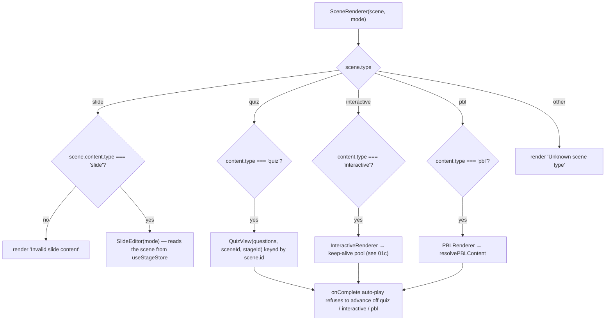
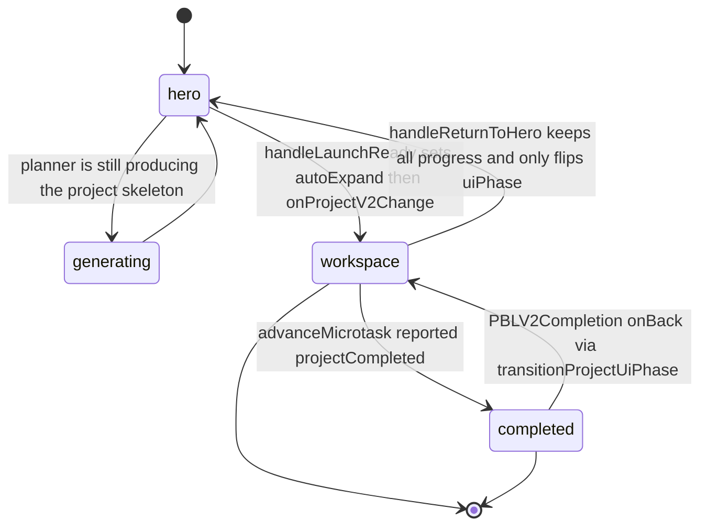
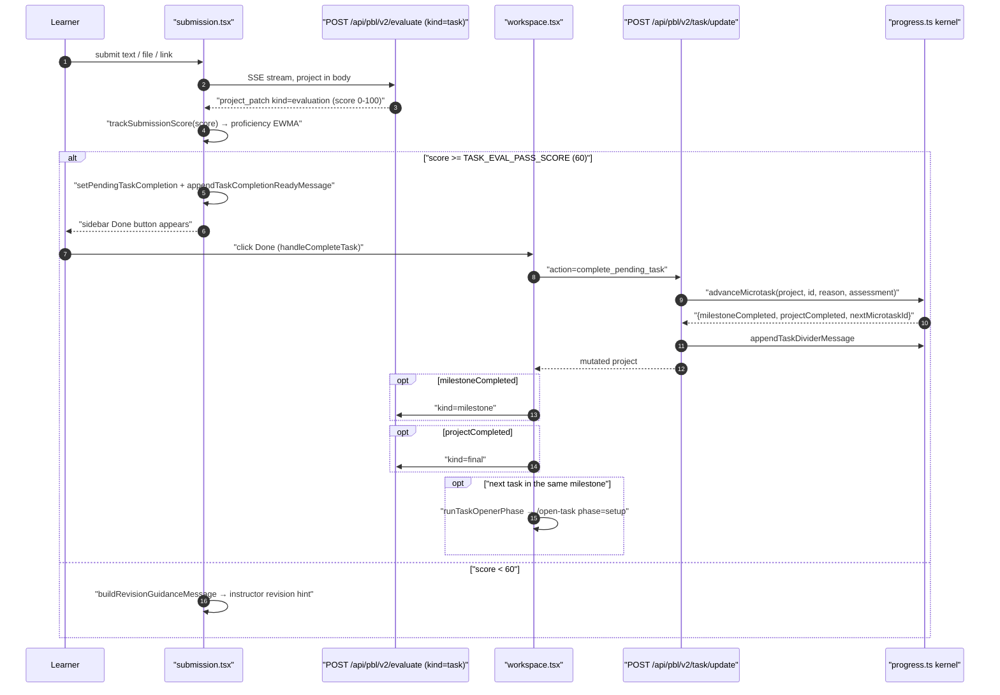
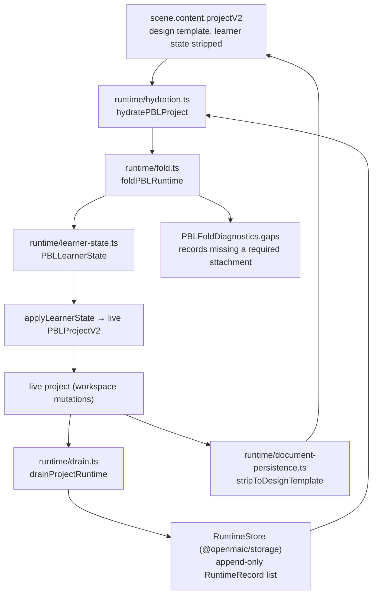

# Modules (b) — scene dispatch and the PBL v2 runtime

Companion files: `01a-modules-playback.md` (playback core),
`01c-modules-interactive-sandbox.md` (interactive HTML scenes and their sandbox).

## 1. Scene dispatch

[`components/stage/scene-renderer.tsx:20`](components/stage/scene-renderer.tsx#L20) is a four-way switch on `scene.type`,
each arm re-checking `scene.content.type` and rendering `Invalid … content` on a
mismatch:

| `scene.type` | Renderer | Notes |
| --- | --- | --- |
| `slide` | `SlideEditor` (imported as `SlideRenderer`) | takes only `mode`; reads the current scene from the store |
| `quiz` | `QuizView` (1 116 lines) | keyed by `scene.id`; answers persist per `(stageId, sceneId)` |
| `interactive` | `InteractiveRenderer` | a **placeholder** only — see `01c` |
| `pbl` | `PBLRenderer` | see §2 |

Auto-play deliberately stops at non-slide scenes:
[`components/edit/PlaybackChromeRoot.tsx:896`](components/edit/PlaybackChromeRoot.tsx#L896) and [`:910`](components/edit/PlaybackChromeRoot.tsx#L910) return early when the
current scene is `quiz`, `interactive` or `pbl`, so a learner is never advanced
past an activity they have not finished.

## 2. PBL v2

### 2.1 Content resolution and legacy reachability

[`lib/pbl/legacy/read.ts:206`](lib/pbl/legacy/read.ts#L206) `resolvePBLContent` is the single arbiter, returning
`{kind:'v2'} | {kind:'legacy'} | {kind:'empty'}`:

- `v2` when `isRunnablePBLProjectV2(content.projectV2)` — requires containers for
  `milestones` / `roles` / `submissions` / `evaluations` / `threads` /
  `engagementEvents`, at least one `instructor` role with a non-empty string `id`
  and a string `name`, and every milestone carrying at least one microtask with a
  non-empty string `id` and a string `title` ([`lib/pbl/v2/types.ts:658`](lib/pbl/v2/types.ts#L658)).
- `legacy` when a non-empty `projectConfig` with `issueboard.issues.length > 0`
  is present.
- `empty` otherwise → `PBLRenderer` renders `t('pbl.emptyProject')`
  ([`pbl-renderer.tsx:70`](components/scene-renderers/pbl-renderer.tsx#L70)).

**Is legacy reachable? Yes for reading, no for running.** A `legacy` result is
immediately upgraded by `upgradeLegacyPBLConfigToProjectV2`
([`pbl-renderer.tsx:47`](components/scene-renderers/pbl-renderer.tsx#L47), [`legacy/read.ts:84`](lib/pbl/legacy/read.ts#L84)) into a synthetic v2 project: one
`role-compat-instructor` role, one milestone per legacy issue (ordered by
`issue.index`), exactly one microtask per milestone, notes lifted into a
`reference` document, and the legacy chat replayed into the instructor thread with
`isLegacyUserMessage` deciding authorship (`:274`). Language is sniffed from the
content (`detectLegacyLanguage`, `:304`). So there is **no legacy runtime** — only
a read-time projection.

Production importers of `lib/pbl/legacy/read.ts`:
[`components/scene-renderers/pbl-renderer.tsx:9`](components/scene-renderers/pbl-renderer.tsx#L9),
[`lib/pbl/v2/runtime/hydration.ts:9`](lib/pbl/v2/runtime/hydration.ts#L9),
[`lib/pbl/v2/runtime/document-persistence.ts:2`](lib/pbl/v2/runtime/document-persistence.ts#L2),
[`app/api/generate/scene-actions/route.ts:28`](app/api/generate/scene-actions/route.ts#L28),
[`lib/server/agent-runtime/generation-content.ts:8`](lib/server/agent-runtime/generation-content.ts#L8), plus type-only imports in
[`lib/types/stage.ts:20`](lib/types/stage.ts#L20) and [`lib/document-store/validators.ts:10`](lib/document-store/validators.ts#L10). The module
header states the writer rule explicitly: "Writers must never import it to create
or project legacy shapes" ([`legacy/read.ts:5`](lib/pbl/legacy/read.ts#L5)).

One asymmetry worth knowing: the upgraded project is rendered but **never
persisted back as v2** — `preparePBLScenesForDocumentPersistence`
([`runtime/document-persistence.ts:14`](lib/pbl/v2/runtime/document-persistence.ts#L14)) skips any scene whose `resolvePBLContent`
is not `v2`, so the original v1 `projectConfig` round-trips untouched and learner
progress on an upgraded legacy project is not written to the document.

### 2.2 UI phase machine

`PBLUiPhase = 'hero' | 'generating' | 'workspace' | 'completed'`
([`packages/@openmaic/dsl/src/pbl.ts:16`](packages/@openmaic/dsl/src/pbl.ts#L16)).

`workspace` and `completed` are both rendered by **one** portaled
`PBLV2WorkspaceLayer` ([`pbl-renderer.tsx:293`](components/scene-renderers/pbl-renderer.tsx#L293)), `position: fixed`, portalled to
`document.body` — or to `document.fullscreenElement` while native fullscreen is on
(`:260`). That single-instance choice is what preserves chat scroll position and an
in-flight instructor stream across expand/collapse *and* across
workspace → completion.

A late-resolving stream that finishes after the learner stepped back to the Hero
is handled by `handleWorkspaceProjectChange` (`:197`): it reads the **live**
`uiPhase` out of the store and rewrites the incoming clone's `uiPhase` back to
`hero`, so background progress lands without yanking the learner forward.

`activeStreamCount` (`:132`) is a *count*, not a boolean, precisely because an
instructor chat turn and a submission evaluation can overlap; the comment spells
out the bug a boolean caused.

Launch choreography constants: `HERO_LAUNCH_EXPAND_DURATION_SECONDS = 1.3` with
ease `[0.4, 0, 0.2, 1]` for the one-time Hero → workspace reveal, versus
`IMMERSIVE_LAUNCH_DURATION_SECONDS = 0.45` for every later manual expand
([`pbl-renderer.tsx:20-30`](components/scene-renderers/pbl-renderer.tsx#L20-L30)).

### 2.3 Instructor agent — `lib/pbl/v2/agents/instructor.ts`

1 864 lines. `runInstructorTurn` (`:1301`) is an `AsyncGenerator<PBLSSEEvent>`.

Three phases (`InstructorPhase`, `:58`) with different tool exposure:

| Phase | Trigger | Tools exposed | Prompt block |
| --- | --- | --- | --- |
| `greeting` | first entry, empty instructor thread ([`chat.tsx:395`](components/scene-renderers/pbl/v2/chat.tsx#L395)) | none | `PHASE_BLOCKS.greeting` ([`:69`](components/scene-renderers/pbl/v2/chat.tsx#L69)) |
| `setup` | a new microtask became active ([`workspace.tsx:220`](components/scene-renderers/pbl/v2/workspace.tsx#L220) `runTaskOpenerPhase`) | none | `PHASE_BLOCKS.setup` ([`:82`](components/scene-renderers/pbl/v2/workspace.tsx#L82)) |
| `instructing` | learner message ([`chat.tsx:505`](components/scene-renderers/pbl/v2/chat.tsx#L505)) | `record_observation`, `adjust_difficulty` | `PHASE_BLOCKS.instructing` ([`:97`](components/scene-renderers/pbl/v2/chat.tsx#L97)) |

Openers expose **no** tools deliberately: an eager-tool model would emit a tool
call instead of speaking and leave the learner with an empty chat (`:1495`).
`toolChoice` is never forced — measured against the live DeepSeek V4 Pro API,
thinking mode plus a forced `toolChoice` returns HTTP 400 "Thinking mode does not
support this tool_choice" (`:1508`).

Budget: `MAX_INSTRUCTOR_STEPS = 7` (`:61`), `MAX_HISTORY_MESSAGES = 24` (`:62`),
plus `compressIfNeeded` from `instructor-memory.ts` for the older tail.

Prompt assembly puts the current milestone and microtask **at the tail** for
positional recency (`:4`), and appends the phase block last. Output post-processing
is unusually heavy: `stripLeakedToolJson` (`:981`),
`dedupeAdjacentRepeatedSentences` (`:955`), `cleanInstructorCommitText` (`:997`),
`stripOrphanTrailingQuestion` (`:1133`), `stripPrematureNextTaskSetup` (`:1191`).

**The instructor cannot advance the task.** The header comment still says "the
three teaching tools" while listing two (`:7`) — stale prose — but the tool object
at `:1422` really does contain only `record_observation` and `adjust_difficulty`,
and `:1416` states the rule: "NO advance machinery: task readiness is decided only
by right-side submission evaluation".

### 2.4 Task engine

The mutation kernel lives in `@openmaic/generation`;
`lib/pbl/v2/operations/kernel/*` are five two-line compatibility barrels
(`export * from '@openmaic/generation';`). The real code is
`packages/@openmaic/generation/src/pbl/operations/kernel/`: `progress.ts` (969),
`proficiency.ts` (893), `task-completion.ts` (191), `engagement.ts` (185),
`runtime-events.ts` (130).

Completion is a **two-step gate**: the system stages readiness, the learner
confirms it.

`advanceMicrotask` ([`progress.ts:463`](packages/@openmaic/generation/src/pbl/operations/kernel/progress.ts#L463)) refuses an already-terminal microtask
(`already_terminal`), clears the pending completion, writes a `status_changed`
runtime event, records a `microtask_completed` engagement event, then **freezes**
`microtask.engagement = microtaskEngagement(project, microtaskId)` — explicitly
because the engagement ledger is a 500-entry ring
(`MAX_ENGAGEMENT_EVENTS = 500`, [`engagement.ts:28`](packages/@openmaic/generation/src/pbl/operations/kernel/engagement.ts#L28)) and a long project would
otherwise evaluate against rolled-off telemetry ([`progress.ts:515-526`](packages/@openmaic/generation/src/pbl/operations/kernel/progress.ts#L515-L526)).

Milestone boundaries are a *third* explicit gate: completing the last microtask of
a milestone stages a `PBLHandover` ([`lib/pbl/v2/types.ts:500`](lib/pbl/v2/types.ts#L500)) and the learner must
click Continue → `action: 'continue_handover'` → `continueAfterHandover`
([`progress.ts:761`](packages/@openmaic/generation/src/pbl/operations/kernel/progress.ts#L761)) before the next milestone leaves `locked`.

Scenario projects add two more deterministic, LLM-free transitions on the same
endpoint: `enter_scenario` (prep stage → first roleplay stage, gated on
`milestone.scenarioStage === 'prep'`) and `complete_act`
(`completeRoleplayAct`, [`progress.ts:652`](packages/@openmaic/generation/src/pbl/operations/kernel/progress.ts#L652)) — both reject non-scenario projects
outright ([`task/update/route.ts:121`](app/api/pbl/v2/task/update/route.ts#L121), [`:151`](app/api/pbl/v2/task/update/route.ts#L151)).

### 2.5 Wire protocol and client patching

`lib/pbl/v2/api/sse.ts` owns the envelope (`event: <type>\ndata: <json>\n\n`,
`:187`), the `PBLSSEEvent` union (`:168`) and `createSSEResponse` (`:211`) with a
15 s keepalive comment (`HEARTBEAT`, `:192`) and `X-Accel-Buffering: no` (`:286`).

The server is **stateless**: the client POSTs the whole `PBLProjectV2`, the server
mutates its own copy and emits `project_patch` events describing what changed
(`:47`). Six patch kinds: `message`, `advance`, `engagement_event`, `evaluation`,
`handover`, `proficiency`.

`useInstructorStream` ([`use-instructor-stream.ts:105`](components/scene-renderers/pbl/v2/use-instructor-stream.ts#L105)) parses frames, applies each
patch through `applyInstructorEvent`, and chains evaluators **after** the
instructor stream closes, in the fixed order task → milestone → final
(`:175-243`) — never interleaved, because two concurrent LLM streams would
interleave their tokens into the same draft. A synchronous `runningRef` lock
(`:124`) rejects a second call in the same effect flush; React state alone would
let two openers double-fire.

### 2.6 Runtime ledger — fold / drain / hydration

The document stores a *design template*; learner state is reconstructed from an
append-only runtime ledger.

Key properties, all stated in code:

- Drain is **at-least-once**; downstream folds must dedupe by event id
  ([`drain.ts:8`](lib/pbl/v2/runtime/drain.ts#L8)). Two independent device-scoped watermarks per
  `(stageId, sceneId, learnerKey)` — one for `runtimeEvents`, one for
  `engagementEvents` ([`drain.ts:38`](lib/pbl/v2/runtime/drain.ts#L38)).
- Both project outboxes are bounded 500-event rings; before a save strips learner
  state, the persistence boundary verifies the fold and appends a **full snapshot**
  when the visible outboxes cannot reconstruct current state ([`drain.ts:12`](lib/pbl/v2/runtime/drain.ts#L12)).
- `hydratePBLProject` reports `source: 'fold' | 'document'`, a `diff` list and a
  `selfHealed` flag ([`hydration.ts:38`](lib/pbl/v2/runtime/hydration.ts#L38)), so divergence is observable rather than
  silently resolved.
- `PBL_DRAIN_TIMEOUT_MS = 10_000`, chain hard cap `20_000` ([`drain.ts:29-31`](lib/pbl/v2/runtime/drain.ts#L29-L31)).
- `PBL_RUNTIME_EVENT_KINDS_REQUIRING_ATTACHMENT` lists the seven kinds that must
  carry an attachment ([`record-payloads.ts:19`](lib/pbl/v2/runtime/record-payloads.ts#L19)); a record missing one becomes a
  recorded `PBLFoldGap` ([`fold.ts:27`](lib/pbl/v2/runtime/fold.ts#L27)), not a thrown error.

### 2.7 Adaptive proficiency

`PBLProficiencyAssessment` ([`lib/pbl/v2/types.ts:400`](lib/pbl/v2/types.ts#L400)) is an EWMA on `[-1,+1]`
with buckets at `±0.33`, hysteresis (the score must pass the *opposite* boundary
by `0.20` to leave a tier), a confidence gate (`< 0.4` blocks any switch), and both
a minimum-signal and a turn-cooldown gate (`dynamicSignalsSinceRetier`,
`turnsSinceRetier`). Twelve signal kinds (`ProficiencySignalKind`, `:336`) split
into five static (pre-PBL: outline keywords, prior scene difficulty, user bio,
explicit level, quiz accuracy) and seven dynamic. Sources:
`'planner' | 'pre-play' | 'dynamic' | 'self-report'` (`:379`). Signal history is
bounded to the most recent 50 (`:416`).

The learner never sees it — the only surface named in code is a dev badge behind
`PBL_V2_DEV_PROFICIENCY_BADGE` ([`api/sse.ts:122`](lib/pbl/v2/api/sse.ts#L122)).
