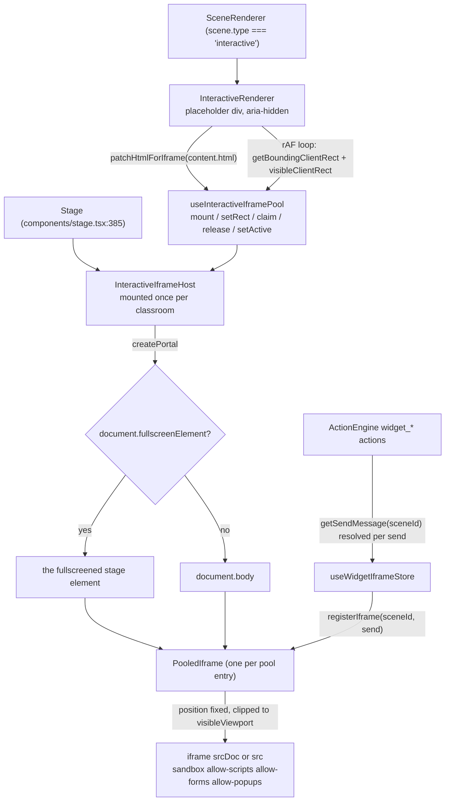
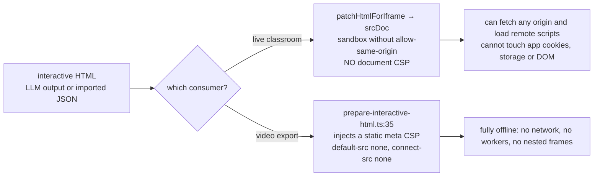
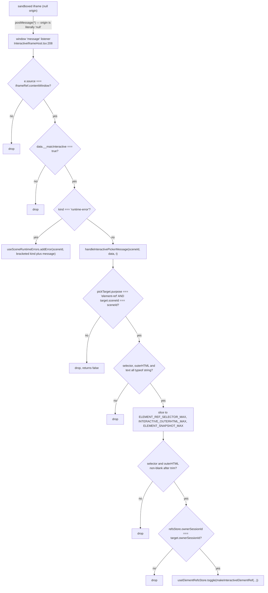

# Modules (c) — interactive HTML scenes and their sandbox

Split out of `01b-modules-pbl-interactive.md` for length. This is the
security-relevant part of the subsystem; every statement below is exact.

## 1. Split placeholder / host

`InteractiveRenderer` ([`components/scene-renderers/interactive-renderer.tsx:23`](components/scene-renderers/interactive-renderer.tsx#L23))
renders only `<div className="w-full h-full" aria-hidden />`. It (a) registers the
patched HTML in a keep-alive pool, (b) marks the scene active and claims
visibility with a `useId()` ownership token, (c) reports its screen rect every
animation frame (`:55`). The real `<iframe>` elements live in
`InteractiveIframeHost` ([`InteractiveIframeHost.tsx:88`](components/scene-renderers/InteractiveIframeHost.tsx#L88)), mounted once at the
`Stage` root ([`components/stage.tsx:385`](components/stage.tsx#L385)) — **above** the mode-swap subtree — and
portalled to `document.fullscreenElement ?? document.body` (`:99`).



Pool: `useInteractiveIframePool`, `IFRAME_POOL_CAP = 3`
([`lib/store/interactive-iframe-pool.ts:21`](lib/store/interactive-iframe-pool.ts#L21)), LRU by a monotonic `tick`, active
scene never evicted (`:79`). A content change is the **only** intended reload path
(`:117`); an equal-but-new `srcDoc` string hits the keep-alive fast path because
the comparison is by value (`:111`).

Geometry: the page is authored against a fixed logical viewport `1280 × 720`
([`lib/interactive/logical-viewport.ts:4`](lib/interactive/logical-viewport.ts#L4)); `fitGenUiViewport` contain-fits and
centres it (`:13`), and the host applies `transform: scale(...)` with the iframe
at full logical size ([`InteractiveIframeHost.tsx:262-271`](components/scene-renderers/InteractiveIframeHost.tsx#L262-L271)). The wrapper is clipped
to `intersectClientBoxes(viewport.box, clip)` (`:236`) so an overflow-hidden
ancestor still clips a `position: fixed` iframe.

## 2. The sandbox attribute — exact value

```
sandbox="allow-scripts allow-forms allow-popups"
```

[`InteractiveIframeHost.tsx:281`](components/scene-renderers/InteractiveIframeHost.tsx#L281). `allow-same-origin` is **deliberately omitted**;
the reasoning is written out at `:145-155`: combining `allow-scripts` with
`allow-same-origin` on a `srcDoc` iframe negates the sandbox, and the HTML may
come from LLM output or imported classroom JSON. The document therefore runs in a
unique (null) origin. `allow-popups` is granted, so a generated page *can* open a
new window; `allow-popups-to-escape-sandbox` is **not**, so the popup inherits the
sandbox. `allow-top-navigation`, `allow-modals`, `allow-downloads` and
`allow-pointer-lock` are not granted.

## 3. CSP — what actually exists

The **only** app-level CSP is set in [`next.config.ts:38-56`](next.config.ts#L38-L56):

```ts
key: 'Content-Security-Policy',
value: `frame-ancestors ${frameAncestors}`,
```

where `frameAncestors` is `'self'`, or `'self' <ALLOWED_FRAME_ANCESTORS>` when
that env var is set. `X-Frame-Options: SAMEORIGIN` is added only when
`ALLOWED_FRAME_ANCESTORS` is unset (`:48`), because XFO cannot express an
allowlist.

That is it. There is **no** `default-src`, `script-src`, `connect-src` or
`sandbox` directive on the app response, and **no CSP is injected into the
interactive document itself** on the live-classroom path. The sandbox attribute is
the whole isolation boundary in the browser. A static CSP meta *does* exist, but
only on the video-export path
([`lib/video-export-app/prepare-interactive-html.ts:35`](lib/video-export-app/prepare-interactive-html.ts#L35)):
`default-src 'none'; script-src 'unsafe-inline' 'unsafe-eval' data: blob:;
style-src 'unsafe-inline' data:; img-src data: blob:; font-src data:;
media-src data: blob:; worker-src 'none'; connect-src 'none'; frame-src 'none';
object-src 'none'; base-uri 'none'`. So an exported video's interactive HTML
cannot reach the network; the same HTML in the live classroom can.



## 4. Injected shims — `lib/utils/iframe.ts`

`patchHtmlForIframe(html)` (`:288`) injects, in this order, into the document
head via `injectIntoDocumentHead`:

1. `ERROR_CAPTURE_SHIM` (`:57`) — forwards `window.onerror`,
   `unhandledrejection` and a wrapped `console.error` to the parent via
   `postMessage(..., '*')`. Buffers up to 50 entries, each truncated to 1 200
   chars, and re-emits the whole buffer on `{__maicErrorReplayRequest: true}`
   because the parent subscribes only *after* inserting the iframe, and the errors
   that matter most (a `JSON.parse` that aborts setup) fire synchronously during
   `srcDoc` parse.
2. `ELEMENT_PICKER_SHIM` (`:104`) — dormant by default; armed / disarmed / synced
   by parent messages, and it only accepts messages where
   `event.source === window.parent` (`:266`). On click it blocks the event and
   emits `{selector, outerHTML (≤2048), text (≤200)}` (`:222-228`). Selector
   generation prefers a unique `#id`, then `tag.class` (max 3 classes), then an
   `:nth-of-type` path, using `CSS.escape` when available (`:117`).
3. `STORAGE_SHIM` (`:15`) — replaces `localStorage` / `sessionStorage` with an
   in-memory implementation when the real ones throw, which they do in a null
   origin. Without it, a generated page that touches storage in setup code dies
   before rendering anything.
4. `iframeCss` (`:289`) — `html, body` sizing, `overflow-x: hidden`,
   `overflow-y: auto`, `body { min-height: 100vh }`.

Order matters and is commented (`:284`): error capture goes first so it also
observes failures in the storage shim.

## 5. Parent-side validation of iframe messages



`handleInteractivePickerMessage` is exported ([`InteractiveIframeHost.tsx:36`](components/scene-renderers/InteractiveIframeHost.tsx#L36))
specifically so this validation chain is unit-testable — and
`tests/scene-renderers/interactive-iframe-picker.test.ts` exercises it.

What is **not** checked: `event.origin`. That is unavoidable — a null-origin
sandboxed frame reports `origin: "null"` — which is exactly why `event.source`
identity is the gate. Outbound messages use `targetOrigin: '*'` (`:177`), also
unavoidable for a null origin, and the comment at `:152` says so explicitly.

The `element-picker-disarmed` message is handled separately (`:44`): it clears
`pickTarget` only when this scene was the armed one, and returns `armed` so a
stale frame cannot disarm a picker it does not own.

## 6. Residual exposure

Facts, not speculation:

- `entry.src` is used when no inline HTML exists
  ([`InteractiveIframeHost.tsx:278`](components/scene-renderers/InteractiveIframeHost.tsx#L278)), i.e. an `InteractiveContent.url`
  ([`packages/@openmaic/dsl/src/interactive.ts:53`](packages/@openmaic/dsl/src/interactive.ts#L53)) is loaded into the same
  sandbox. There is no allowlist on that URL anywhere in the render path.
- The sandbox has no `allow-same-origin`, so the document cannot read app
  cookies, `localStorage`, or the parent DOM. But with no `connect-src` /
  `script-src` CSP on the live path it *can* `fetch` arbitrary origins and load
  remote scripts.
- The pool keeps up to 3 documents alive across scene switches, so a page's
  timers and network activity continue while the learner is on another scene:
  only `visibility: hidden` and `pointerEvents: none` are applied (`:259`), the
  iframe is never unmounted or `about:blank`-ed.
- `patchHtmlForIframe` performs **no sanitisation** of the authored HTML — it only
  prepends shims and CSS. Script content is executed verbatim. That is the
  intended design (the sandbox is the boundary), not an oversight, but it means
  the sandbox attribute is load-bearing and must never gain `allow-same-origin`.
- The error shim's own `message` listener does not check `event.source`
  ([`lib/utils/iframe.ts:73`](lib/utils/iframe.ts#L73)), so any frame able to reach it can trigger a buffer
  replay. Impact is bounded: the replay only re-posts to `window.parent`, and the
  parent's `addError` dedupes.
