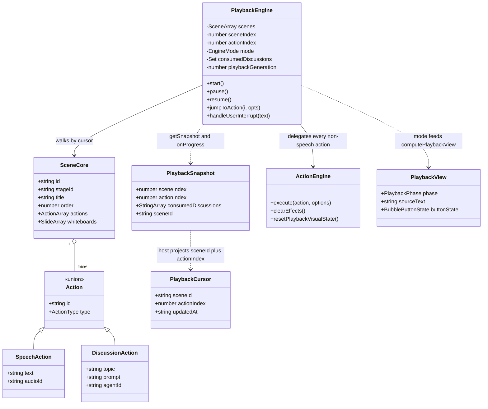

# Interfaces (a) — the playback engine and its host

Companions: `02b-interfaces-pbl-and-scenes.md` (PBL v2 wire types, interactive
host), `02c-interfaces-choreography-and-buffer.md` (choreography spec,
StreamBuffer, the host teardown handle).

Everything below is copied from the files cited. Comments are elided where noted
with `…`; identifiers, modifiers and types are unmodified.

## 1. Playback types — `lib/playback/types.ts`

```ts
export interface PlaybackSnapshot {
  sceneIndex: number;
  actionIndex: number;
  consumedDiscussions: string[];
  sceneId?: string;
}

/** Visual effects (for onEffectFire callback) */
export type Effect =
  | { kind: 'spotlight'; targetId: string; dimOpacity?: number }
  | { kind: 'laser'; targetId: string; color?: string };

/** Engine mode state machine */
export type EngineMode = 'idle' | 'playing' | 'paused' | 'live';

/** Discussion topic state */
export type TopicState = 'active' | 'pending' | 'closed';

/** Trigger event (for proactive discussion card) */
export interface TriggerEvent {
  id: string;
  question: string;
  prompt?: string;
  agentId?: string;
}
```

`PlaybackEngineCallbacks` (`types.ts:32`) — the whole surface the host wires:

```ts
export interface PlaybackEngineCallbacks {
  onModeChange?: (mode: EngineMode) => void;
  onSceneChange?: (sceneId: string) => void;
  onSpeechStart?: (text: string) => void;
  onSpeechEnd?: () => void;
  onTextDelta?: (content: string) => void;
  onSpeakerChange?: (role: string) => void;
  onEffectFire?: (effect: Effect) => void;

  // Proactive discussion
  onProactiveShow?: (trigger: TriggerEvent) => void;
  onProactiveHide?: () => void;

  // Discussion lifecycle
  onDiscussionConfirmed?: (topic: string, prompt?: string, agentId?: string) => void;
  onDiscussionEnd?: () => void;
  onUserInterrupt?: (text: string) => void;

  // Topic / Transcript
  onTopicStart?: (type: 'lecture' | 'discussion', title: string) => void;
  onTopicAppend?: (role: string, text: string) => void;
  onTopicEnd?: () => void;

  // Progress tracking (for persistence)
  onProgress?: (snapshot: PlaybackSnapshot) => void;

  /** Check if a given agent is in the user's selected list (for skipping discussion actions) */
  isAgentSelected?: (agentId: string) => boolean;

  /** Get current playback speed multiplier (e.g. 1, 1.5, 2) */
  getPlaybackSpeed?: () => number;

  onComplete?: () => void;
}
```

Measured: `engine.ts` has **zero** call sites for `onTextDelta`, `onTopicStart`,
`onTopicAppend` and `onTopicEnd` — four dead callbacks on a public interface.
`onSpeakerChange` has exactly one call site (`engine.ts:560`, always with the
literal `'teacher'`) and is **not** among the 14 callbacks the only production
constructor wires (`components/edit/PlaybackChromeRoot.tsx:759-923`: `onModeChange`,
`onProgress`, `onSceneChange`, `onSpeechStart`, `onSpeechEnd`, `onEffectFire`,
`onProactiveShow`, `onProactiveHide`, `onDiscussionConfirmed`, `onDiscussionEnd`,
`onUserInterrupt`, `isAgentSelected`, `getPlaybackSpeed`, `onComplete`).

## 2. `PlaybackEngine` public API — `lib/playback/engine.ts`

```ts
constructor(
  scenes: Scene[],
  actionEngine: ActionEngine,
  audioPlayer: AudioPlayer,
  callbacks: PlaybackEngineCallbacks = {},
)

getMode(): EngineMode                                   // :114
hasLectureInterruption(): boolean                       // :123
getCurrentSceneId(): string | null                      // :128
getSnapshot(): PlaybackSnapshot                         // :133
restoreFromSnapshot(snapshot: PlaybackSnapshot): void   // :143
start(): void                                           // :150
continuePlayback(): void                                // :164
canJumpToAction(actionIndex: number): boolean           // :174
async jumpToAction(actionIndex: number, options: { autoplay?: boolean } = {}): Promise<boolean>  // :182
pause(): void                                           // :222
resume(): void                                          // :264
stop(): void                                            // :317
confirmDiscussion(): void                               // :354
skipDiscussion(): void                                  // :385
handleEndDiscussion(): void                             // :399
handleDiscussionError(): void                           // :421
handleUserInterrupt(text: string): void                 // :440
isExhausted(): boolean                                  // :471
```

`restoreFromSnapshot` has **zero call sites anywhere**, including tests
(`grep -rn "restoreFromSnapshot" lib components app tests` returns only its own
declaration at `engine.ts:143`). The app restores position through `jumpToAction`
instead (`PlaybackChromeRoot.tsx:943`), because a bare cursor restore would not
replay the whiteboard prefix.

## 3. Derived view — `lib/playback/derived-state.ts`

```ts
export type PlaybackPhase =
  | 'idle'
  | 'lecturePlaying'
  | 'lecturePaused'
  | 'waitingProactive'
  | 'discussionActive'
  | 'discussionPaused'
  | 'cueUser'
  | 'completed';

export type BubbleButtonState = 'bars' | 'play' | 'restart' | 'none';

export interface PlaybackView {
  phase: PlaybackPhase;
  sourceText: string;
  bubbleRole: 'teacher' | 'agent' | 'user' | null;
  activeRole: 'teacher' | 'agent' | 'user' | null;
  buttonState: BubbleButtonState;
  isInLiveFlow: boolean;
  isTopicActive: boolean;
}

export function computePlaybackView(raw: PlaybackRawState): PlaybackView
```

`PlaybackRawState` (`:16`) carries 13 fields: `engineMode`, `lectureSpeech`,
`liveSpeech`, `speakingAgentId`, `thinkingState`, `isCueUser`, `isTopicPending`,
`chatIsStreaming`, `discussionTrigger`, `playbackCompleted`, `idleText`,
`speakingStudent`, `sessionType`.

## 4. Auto-resume policy — `lib/playback/auto-resume.ts`

```ts
export type CleanupSource =
  | 'soft_close_enter'
  | 'soft_close_confirmed'
  | 'soft_close_timeout'
  | 'manual_stop'
  | 'scene_switch'
  | 'error'
  | 'turn_complete';

export interface AutoResumeArgs {
  source: CleanupSource;
  endReason?: string;
  hadLectureInterruption: boolean;
  engineMode: EngineMode;
  isExhausted: boolean;
  playbackCompleted: boolean;
}

export function shouldAutoResumeLecture(args: AutoResumeArgs): boolean
```

The whole body is five refusals (`:38-43`): the source must be
`soft_close_confirmed` or `soft_close_timeout`; there must have been a lecture
interruption; `endReason` must be `user_done` or `back_to_lesson`; the engine must
be `idle`; and the course must be neither exhausted nor already completed.

## 5. Navigation and resume — `action-navigation.ts`, `action-resume.ts`, `cursor.ts`

```ts
export interface ActionNavigationTarget {
  actionIndex: number;
  actionId: string;
  actionType: Action['type'];
  lineNumber: number;
  canJump: boolean;
}
export interface ActionLineProgress {
  currentLine: number;
  totalLines: number;
}

export function isUnsafePlaybackNavigationAction(action: Action): boolean
export function isWhiteboardPlaybackAction(action: Action): boolean
export function canReconstructPrefixForAction(actions: readonly Action[], actionIndex: number): boolean
export function canJumpWithinReconstructablePrefix(
  actions: readonly Action[],
  currentActionIndex: number | null | undefined,
  targetActionIndex: number,
): boolean
export function buildActionNavigationTargets(actions: readonly Action[]): ActionNavigationTarget[]
export function getActionLineProgress(
  actions: readonly Action[],
  currentActionIndex: number | null | undefined,
): ActionLineProgress
export function getPreviousSafeSpeechActionIndex(
  actions: readonly Action[],
  currentActionIndex: number | null | undefined,
): number | null
export function getNextSafeSpeechActionIndex(
  actions: readonly Action[],
  currentActionIndex: number | null | undefined,
): number | null
```

```ts
// action-resume.ts — per-tab, per-scene
export interface StoredActionResumePosition {
  actionIndex: number;
  actionId: string;
  actionType: Action['type'];
}
export interface ActionResumeRestoreCursor {
  actionIndex: number;
  position: StoredActionResumePosition | null;
}
export function getActionResumeStorageKey(stageId: string | null | undefined): string
export function readActionResumeState(storage: Pick<Storage, 'getItem'>, storageKey: string): StoredActionResumeState
export function saveActionResumePosition(storage, storageKey, sceneId, position): void
export function clearActionResumePosition(storage, storageKey, sceneId): void
export function getValidActionResumePosition(state, sceneId, actions): StoredActionResumePosition | null
export function getActionResumeRestoreCursor(state, sceneId, actions): ActionResumeRestoreCursor
export function createActionResumePosition(actions, actionIndex): StoredActionResumePosition | null
```

```ts
// cursor.ts — per-device, per-stage, KV 'device' scope
export interface PlaybackCursor {
  sceneId: string;
  actionIndex: number;
  updatedAt: string;
}
export async function loadCursor(stageId: string, deps: PlaybackCursorDeps = {}): Promise<PlaybackCursor | null>
export async function saveCursor(stageId: string, cursor: PlaybackCursor, deps: Pick<PlaybackCursorDeps, 'kv'> = {}): Promise<void>
export async function clearCursor(stageId: string, deps: Pick<PlaybackCursorDeps, 'kv'> = {}): Promise<void>
```

`PlaybackCursorDeps` injects both a `KVStore` and a `PlaybackLegacyStore`, so the
one-time Dexie migration (`migrateLegacyCursor`, `cursor.ts:102`) is testable
without opening either browser store.

## 6. Type relationships



The relationship worth restating in prose: `PlaybackEngine` does **not** own a
meaningful `Scene[]`. The app hands it a single-element array
(`PlaybackChromeRoot.tsx:759`) and rebuilds the engine on every scene change, so
its real lifetime is one scene even though its type says otherwise — the
multi-scene walk in `resolvePlaybackCursor` exists for the video exporter.
