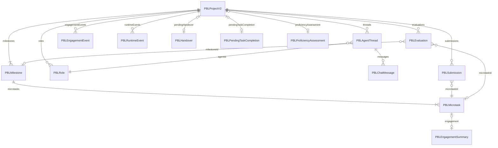
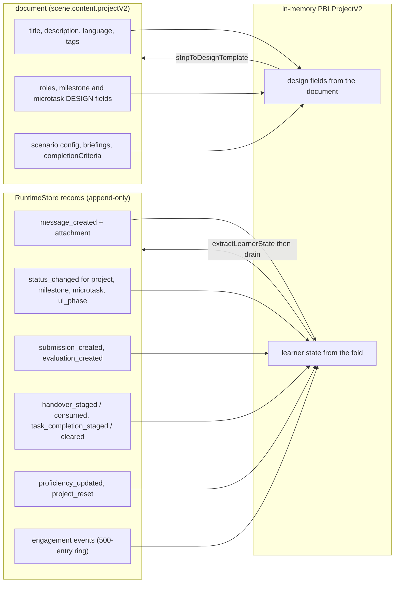

# Interfaces (b) — PBL v2 wire types and scene-host types

Continues `02-interfaces.md`. Verbatim from the files cited.

## 1. PBL v2 wire protocol — `lib/pbl/v2/api/sse.ts`

```ts
export type PBLSSEEvent =
  | SSETokenEvent        // { type: 'token'; delta: string }
  | SSEToolCallEvent     // { type: 'tool_call'; toolName; args; toolCallId }
  | SSEProjectPatchEvent
  | SSESimPhaseEvent     // { type: 'sim_phase'; phase: 'narration' | 'character' }
  | SSEResetDraftEvent   // { type: 'reset_draft' }
  | SSEErrorEvent        // { type: 'error'; code: string; message: string }
  | SSEDoneEvent;        // { type: 'done' }

export type PBLProjectPatch = SSEProjectPatchEvent['patch'];
export type PBLAdvanceProjectPatch = Extract<PBLProjectPatch, { kind: 'advance' }>;

export function createSSEResponse(
  generator: AsyncGenerator<PBLSSEEvent, void, void>,
  options: { heartbeatMs?: number; signal?: AbortSignal } = {},
): Response
```

The six patch kinds, with the fields that carry state across the boundary:

```ts
patch:
  | { kind: 'message'; message: PBLChatMessage }
  | {
      kind: 'advance';
      microtaskId: string;
      milestoneCompleted: boolean;
      projectCompleted: boolean;
      nextMicrotaskId?: string;
      completedMicrotask?: PBLMicrotask;
      nextMicrotask?: PBLMicrotask;
      milestone?: PBLMilestone;
      engagementEvents?: PBLEngagementEvent[];
      runtimeEvents?: PBLRuntimeEvent[];
      shouldEvaluateTask?: boolean;
      shouldEvaluateMilestone?: boolean;
      shouldEvaluateFinal?: boolean;
    }
  | {
      kind: 'engagement_event';
      event?: PBLEngagementEvent;
      eventKind: string;
      microtaskId?: string;
      milestoneId?: string;
      ts?: string;
      payload?: Record<string, unknown>;
    }
  | { kind: 'evaluation'; evaluation: PBLEvaluation }
  | { kind: 'handover'; handover: NonNullable<PBLProjectV2['pendingHandover']> }
  | { kind: 'proficiency'; assessment: PBLProficiencyAssessment; tierChanged: boolean };
```

The three `shouldEvaluate*` booleans are the server telling the client *what to do
next* declaratively, because the server "doesn't know the client's stream state"
and running the evaluator inline with the instructor would interleave two LLM
streams (`sse.ts:88-93`).

## 2. Instructor entry point — `lib/pbl/v2/agents/instructor.ts`

```ts
export type InstructorPhase = 'greeting' | 'setup' | 'instructing';

export interface RunInstructorTurnArgs {   // :1282
  project: PBLProjectV2;
  userMessage: string;
  phase: InstructorPhase;
  languageModel: LanguageModel;
  thinkingConfig?: ThinkingConfig;
  /** AbortSignal from the incoming HTTP request. … */
  signal?: AbortSignal;
}

export async function* runInstructorTurn(
  args: RunInstructorTurnArgs,
): AsyncGenerator<PBLSSEEvent, void, void>
```

Notable exported helpers on the same module, all pure and separately testable:
`taskEvaluationStatusForMicrotask` (`:172`), `buildPriorSubmissionsBlock` (`:251`),
`stageSynthesisOwed` (`:366`), `shouldReportEmptyOutput` (`:435`),
`buildScaffoldStateLine` (`:455`), `buildInstructorRuntimeBrief` (`:498`),
`buildFirstTaskWorkspaceOrientationBlock` (`:573`),
`buildScenarioAwarenessBlock` (`:683`), `buildHistoryMessagesForInstructor`
(`:882`), `ensureNonEmptyInstructorMessages` (`:905`), `stripLeakedToolJson`
(`:981`), `cleanInstructorCommitText` (`:997`), `cleanSetupFollowupText` (`:1025`),
`shouldHoldSetupFollowupPreview` (`:1063`), `stripOrphanTrailingQuestion`
(`:1133`), `stripPrematureNextTaskSetup` (`:1191`).

## 3. Client stream hook — `components/scene-renderers/pbl/v2/use-instructor-stream.ts`

```ts
export type StreamStatus = 'idle' | 'instructor' | 'eval-task' | 'eval-milestone' | 'eval-final';

export interface StreamDisplayState {
  readonly status: StreamStatus;
  readonly draftAssistant: string;
  readonly streamCommittedOutput: boolean;
}

export type SimPhase = 'narration' | 'character' | null;

export function useInstructorStream(
  project: PBLProjectV2,
  onProjectChange: (next: PBLProjectV2) => void,
  onStreamingChange?: (active: boolean) => void,
): UseInstructorStream

export interface OneStreamArgs {
  endpoint: string;
  body: Record<string, unknown>;
  startingProject: PBLProjectV2;
  setDraftAssistant: (fn: (prev: string) => string) => void;
  onPatch?: (patch: Extract<PBLSSEEvent, { type: 'project_patch' }>['patch']) => void;
  onProjectUpdated?: (next: PBLProjectV2) => void;
  onSimPhase?: (phase: SimPhase) => void;
}
export async function runOneStream(args: OneStreamArgs): Promise<PBLProjectV2>
export function assertNotStreamError(event: PBLSSEEvent): void
export function isToleratedReactionStreamError(
  streamStatus: StreamStatus,
  event: PBLSSEEvent,
): boolean
export function findMilestoneIdForMicrotask(
  project: PBLProjectV2,
  microtaskId: string,
): string | undefined
```

## 4. Project type — the runtime overlay

```ts
type RuntimeOverlay<Base, Overlay> = Omit<Base, keyof Overlay> & Overlay;   // types.ts:43

export type PBLProjectV2 = RuntimeOverlay<
  ContractPBLProject,
  {
    milestones: PBLMilestone[];
    submissions: PBLSubmission[];
    evaluations: PBLEvaluation[];
    threads: PBLAgentThread[];
    engagementEvents: PBLEngagementEvent[];
    proficiencyAssessment?: PBLProficiencyAssessment;
    runtimeEvents?: PBLRuntimeEvent[];
    runtimeResetEpoch?: number;
    pendingHandover?: PBLHandover;
    pendingTaskCompletion?: PBLPendingTaskCompletion;
    pendingOpenTaskPriorQuizResults?: PriorQuizResult[];
  }
>;
```

Property *replacement*, not intersection — which is what makes nested microtasks
and thread messages the app-widened types at every call site
(`lib/pbl/v2/types.ts:533-538` explains why intersecting the two top-level project
types would leave them untyped).

Structural guards, in increasing strictness:

```ts
export function isPBLProjectV2(value: unknown): value is PBLProjectV2   // :689 — cheap
export function hasPBLProjectV2Containers(value: unknown): boolean       // :625 — every array the renderer dereferences
export function isRunnablePBLProjectV2(value: unknown): boolean          // :658 — + instructor role id/name + non-empty microtasks
```

## 5. Legacy PBL read surface — `lib/pbl/legacy/read.ts`

```ts
export type ResolvedPBLContent =
  | { kind: 'v2'; projectV2: PBLProjectV2 }
  | { kind: 'legacy'; projectConfig: PBLProjectConfig }
  | { kind: 'empty' };

export function resolvePBLContent(content: {
  projectV2?: unknown;
  projectConfig?: unknown;
}): ResolvedPBLContent
export function upgradeLegacyPBLConfigToProjectV2(config: PBLProjectConfig): PBLProjectV2
export function isEmptyLegacyPBLConfig(config: PBLProjectConfig): boolean
export function normalizeLegacyPBLContent<T extends LegacyReadablePBLContent>(
  content: T,
): T | { type: 'pbl'; projectV2: PBLProjectV2 }
```

## 6. Interactive scene host — `InteractiveIframeHost.tsx`, `interactive-iframe-pool.ts`, `logical-viewport.ts`

```ts
/** Validate an untrusted iframe picker message and apply it to host-owned state. */
export function handleInteractivePickerMessage(
  sceneId: string,
  data: InteractivePickerMessage | undefined,
  t: (key: string, options?: Record<string, unknown>) => string,
): boolean

export const IFRAME_POOL_CAP = 3;

export interface IframePoolEntry {
  readonly srcDoc?: string;
  readonly src?: string;
  readonly rect: IframeRect | null;
  readonly clip: IframeRect | null;
  readonly owner: string | null;
  readonly tick: number;
}

// store actions
mount: (sceneId: string, input: MountInput) => void;
setRect: (sceneId: string, rect: IframeRect, clip?: IframeRect) => void;
claim: (sceneId: string, owner: string) => void;
release: (sceneId: string, owner: string) => void;
setActive: (sceneId: string) => void;
evict: (sceneId: string) => void;
reset: () => void;
```

```ts
// lib/interactive/logical-viewport.ts
export const GENUI_LOGICAL_WIDTH = 1280;
export const GENUI_LOGICAL_HEIGHT = 720;
export interface FittedGenUiViewport {
  readonly box: ClientBox;
  readonly scale: number;
}
export function fitGenUiViewport(slot: ClientBox): FittedGenUiViewport
```

```ts
// packages/@openmaic/dsl/src/interactive.ts:51
export type InteractiveContent<TWidgetConfig extends WidgetConfigBase = WidgetConfigBase> = {
  type: 'interactive';
  url?: string;
  html?: string;
  widgetType?: WidgetType;
  widgetConfig?: TWidgetConfig;
};
```

## 7. PBL entity relationships



`PBLRole.type` is one of `user | instructor | evaluator | mentor | collaborator |
simulator | system` (`packages/@openmaic/dsl/src/pbl.ts:6`), but only `instructor`
and `simulator` have a live agent behind them
(`/api/pbl/v2/instructor`, `/api/pbl/v2/simulator`); `evaluator` runs *without* a
role record, through `/api/pbl/v2/evaluate`, and its output lands as a
`PBLEvaluation` rather than a thread message.

## 8. Where each PBL type is persisted



The split is enforced by `lib/pbl/v2/runtime/learner-state.ts`:
`extractLearnerState` (the fields listed under *learner state*) and
`stripToDesignTemplate` (which clears `pendingTaskCompletion`, `:154`, among
others) are the two halves of the same contract.
