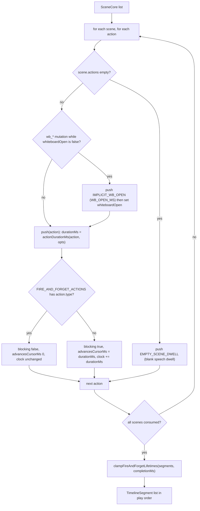

# Interfaces (c) — choreography spec and StreamBuffer

Continues `02-interfaces.md` (playback engine, derived view, navigation) and
`02b-interfaces-pbl-and-scenes.md` (PBL, interactive host). Verbatim from the
files cited.

## 1. Cursor — `lib/choreography/cursor.ts`

```ts
export const EMPTY_SCENE_DWELL: Action = {
  id: '__empty_scene_dwell__',
  type: 'speech',
  text: '',
} as Action;

export interface CursorResult {
  action: Action;
  sceneId: string;
  /** The (possibly advanced) scene cursor the engine should adopt. */
  sceneIndex: number;
  /** The (possibly advanced) action cursor the engine should adopt. */
  actionIndex: number;
}

export function resolvePlaybackCursor(
  scenes: SceneCore[],
  sceneIndex: number,
  actionIndex: number,
): CursorResult | null
```

Pure and non-mutating: the *caller* adopts the returned cursor. Typed against
`SceneCore` (only `id` + `actions` are read) so an app-widened `Scene` with extra
content kinds is accepted without a cast.

## 2. Timing — `lib/choreography/timing.ts`

```ts
export const EFFECT_AUTO_CLEAR_MS = 5000;
export const DISCUSSION_TRIGGER_DELAY_MS = 3000;
export const DISCUSSION_AUTO_SKIP_MS = 5000;
export const MAX_VIDEO_WAIT_MS = 5 * 60 * 1000;

export const WB_OPEN_MS = 2000;
export const WB_DRAW_MS = 800;
export const WB_EDIT_MS = 600;
export const WB_DELETE_MS = 300;
export const WB_CLOSE_MS = 700;
export const WIDGET_MS = 300;

export function wbDrawCodeMs(lineCount: number): number;   // min(800 + 50·lines, 3000)
export function wbClearMs(elementCount: number): number;   // min(380 + 55·elements, 1400)

export interface SpeechEstimateOptions {
  /** Playback speed multiplier; the estimate is divided by it. Default 1. */
  speed?: number;
}
export function estimateSpeechDurationMs(text: string, opts?: SpeechEstimateOptions): number;
```

Module-private constants that define the estimate ([`timing.ts:83-95`](lib/choreography/timing.ts#L83-L95)):
`CJK_REGEX = /[一-鿿㐀-䶿぀-ゟ゠-ヿ가-힯]/g`, `CJK_RATIO_THRESHOLD = 0.3`,
`MIN_READING_MS = 2000`, `CJK_MS_PER_CHAR = 150`, `NON_CJK_MS_PER_WORD = 240`.

## 3. Timeline — `lib/choreography/timeline.ts`

```ts
export const IMPLICIT_WB_OPEN: Action = {
  id: '__implicit_wb_open__',
  type: 'wb_open',
} as Action;

export interface TimelineSegment {
  action: Action;
  sceneId: string;
  sceneIndex: number;
  actionIndex: number;
  /** Wall-clock start (ms) relative to the start of playback. */
  startMs: number;
  /** How long the action is visually present (ms). */
  durationMs: number;
  /** How much the playback cursor advances (ms) before the next action starts. */
  advancesCursorMs: number;
  /** Whether the action blocks the cursor (false only for fire-and-forget). */
  blocking: boolean;
}

export interface ResolveTimelineOptions {
  playbackSpeed?: number;
  getAudioDurationMs?: (action: SpeechAction) => number | null | undefined;
  getVideoDurationMs?: (action: PlayVideoAction) => number | null | undefined;
  onUnresolvedVideoDuration?: 'throw' | 'cap' | 'zero';
  getClearElementCount?: (action: WbClearAction) => number;
  isDiscussionSkipped?: (action: DiscussionAction) => boolean;
  isEditCodeNoop?: (action: WbEditCodeAction) => boolean;
  whiteboardOpen?: boolean;
}

export function resolveActionTimeline(
  scenes: SceneCore[],
  opts: ResolveTimelineOptions = {},
): TimelineSegment[]
```

Every optional callback exists because the pure function cannot see live state:
stored audio length, real video length, live whiteboard element count, the
consumed-discussion set, and whether a `wb_edit_code` target still exists.



`clampFireAndForgetLifetimes` ([`timeline.ts:368`](lib/choreography/timeline.ts#L368)) is the subtle one: an effect's
visual `durationMs` is cut short at the next scene's start or at completion
(because the app tears the engine down per scene), and *extended* when a later
effect in the same scene resets `ActionEngine`'s single shared `effectTimer`
before the earlier one fires. `advancesCursorMs` is never touched.

## 4. Descriptors — `lib/choreography/descriptors/`

```ts
export const AnimationDescriptorSchema = z.object({
  id: z.string(),
  version: z.number(),
  effect: z.enum(['spotlight', 'laser']),
  params: StaticPropsSchema.optional(),
  zIndex: z.number(),
  layers: z.array(LayerSchema),
});

export const LayerSchema = z.object({
  id: z.string(),
  role: LayerRoleSchema.optional(),          // 'content' | 'mask'
  maskedBy: MaskRefSchema.optional(),        // { layerId, mode: 'subtract' | 'intersect' }
  inheritsFrom: InheritRefSchema.optional(), // { parentId, props? }
  tracks: z.array(TrackSchema),
  staticProps: StaticPropsSchema.optional(),
});

export const TrackSchema = z.object({
  property: z.string(),
  from: AnimatableValueSchema,
  to: AnimatableValueSchema,
  durationMs: z.number().optional(),
  delayMs: z.number().optional(),
  easing: EasingSchema.optional(),
  phase: TrackPhaseSchema.optional(),        // 'enter' | 'exit'
  repeat: z.union([z.number(), z.literal('infinite')]).optional(),
  repeatDelayMs: z.number().optional(),
});

export const DESCRIPTORS: Record<string, AnimationDescriptor>;
export function getDescriptor(id: string): AnimationDescriptor | undefined;
```

An `AnimatableValue` is a number, a string (colours, possibly with a `{param}`
placeholder), a `GeometryValue` (`{ref, scale?, offset?}` over
`x|y|w|h|centerX|centerY`), or a `CornerValue`
(`{axis, threshold, whenAbove, whenBelow}` — the laser's
`center > 50 ? 105 : -5` fly-in rule). `role: 'mask'` + `maskedBy` is how the
spotlight's "dim everywhere except the cutout" compositing survives translation
out of SVG, and `inheritsFrom` is how a child layer rides an animated wrapper it
was nested inside in the React source.

## 5. StreamBuffer — `lib/buffer/stream-buffer.ts`

```ts
export interface StreamBufferOptions {
  /** Milliseconds between ticks. Default: 30 */
  tickMs?: number;
  /** Characters revealed per tick. Default: 1  (≈33 chars/s) */
  charsPerTick?: number;
  /** Fixed delay (ms) after a text segment is fully revealed … Default: 0 */
  postTextDelayMs?: number;
  /** Delay (ms) after firing an action callback … Default: 0. */
  actionDelayMs?: number;
}

export type BufferItem =
  | AgentStartItem   // { messageId, agentId, agentName, avatar?, color? }
  | AgentEndItem     // { messageId, agentId }
  | TextItem         // { messageId, agentId, partId, text, sealed }
  | ActionItem       // { messageId, actionId, actionName, params, agentId }
  | ThinkingItem     // { stage, agentId? }
  | CueUserItem      // { fromAgentId?, prompt? }
  | DoneItem         // { totalActions, totalAgents, agentHadContent?, cueUserReceived?, sessionClosed?, endReason?, directorState? }
  | ErrorItem;       // { message }
```

Callback contract (`StreamBufferCallbacks`, `:96`):

```ts
onAgentStart(data: AgentStartItem): void;
onAgentEnd(data: AgentEndItem): void;
onTextReveal(messageId: string, partId: string, revealedText: string, isComplete: boolean): void;
onActionReady(messageId: string, data: ActionItem, signal: AbortSignal): void | Promise<void>;
onLiveSpeech(text: string | null, agentId: string | null): void;
onSpeechProgress(ratio: number | null): void;
onThinking(data: { stage: string; agentId?: string } | null): void;
onCueUser(fromAgentId?: string, prompt?: string): void;
onDone(data: { … }): void;
onError(message: string): void;
onSegmentSealed?: (messageId, partId, fullText, agentId) => void;
shouldHoldAfterReveal?: () => { holding: boolean; segmentDone: number } | boolean;
```

Push surface: `pushAgentStart`, `pushAgentEnd`, `pushText(messageId, delta,
agentId?)`, `sealText(messageId)`, `pushAction`, `pushThinking`, `pushCueUser`,
`pushDone`, `pushError`. Control surface: `start`, `pause`, `resume`,
`waitUntilDrained`, `waitForCurrentAction`, `flush`, `dispose`, `shutdown`, and
the getters `paused` / `disposed`.

`pushAgentStart`, `pushAgentEnd`, `pushAction` and `pushDone` all call
`sealLastText()` first (`:218`, `:224`, `:264`, `:288`) — that ordering is what
makes `onSegmentSealed` fire with the *correct* `currentAgentId` (`:476`).

## 6. Host handle — [`components/edit/PlaybackChromeRoot.tsx:87`](components/edit/PlaybackChromeRoot.tsx#L87)

```ts
export interface PlaybackChromeRootHandle {
  /** Ends any active SSE session, stops the engine, cleans up TTS audio. */
  teardown: () => Promise<void>;
}
```

The only imperative escape hatch out of the playback chrome. `Stage` awaits it
before flipping to edit mode ([`components/stage.tsx:221`](components/stage.tsx#L221)) because unmount cleanup
alone would be fire-and-forget and could not guarantee SSE was aborted first.
