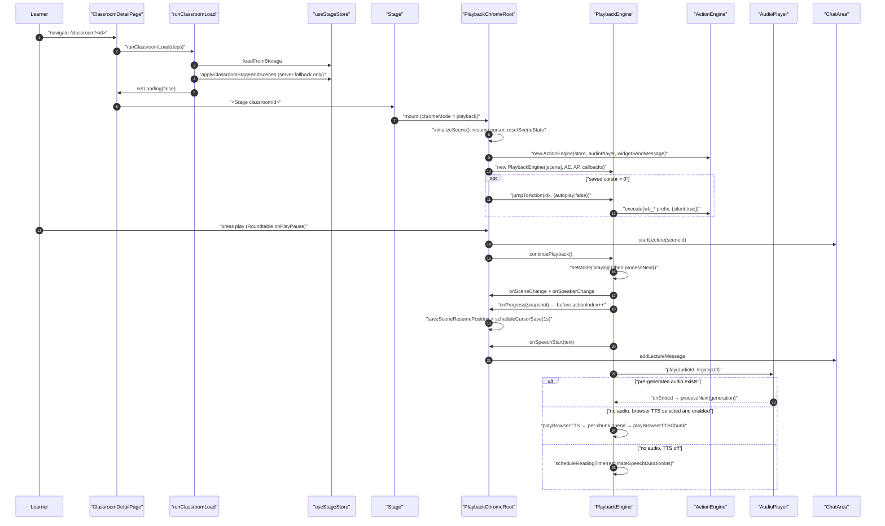
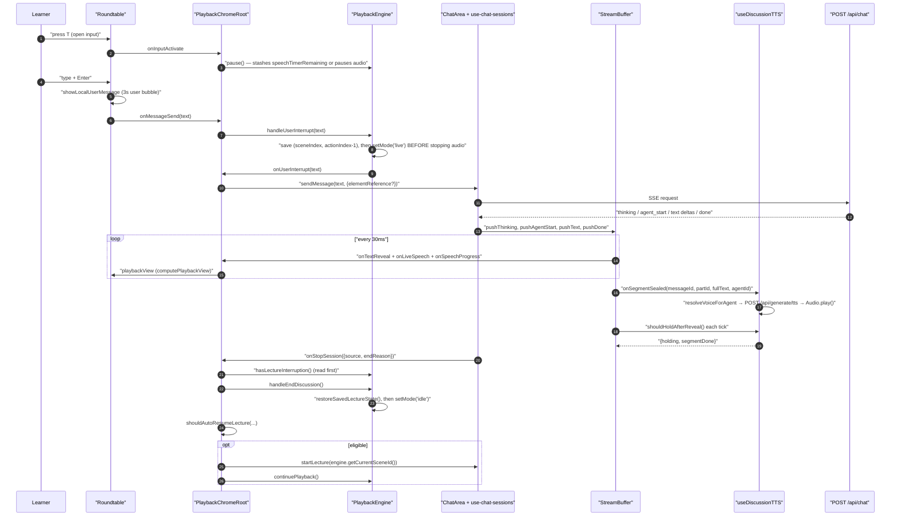
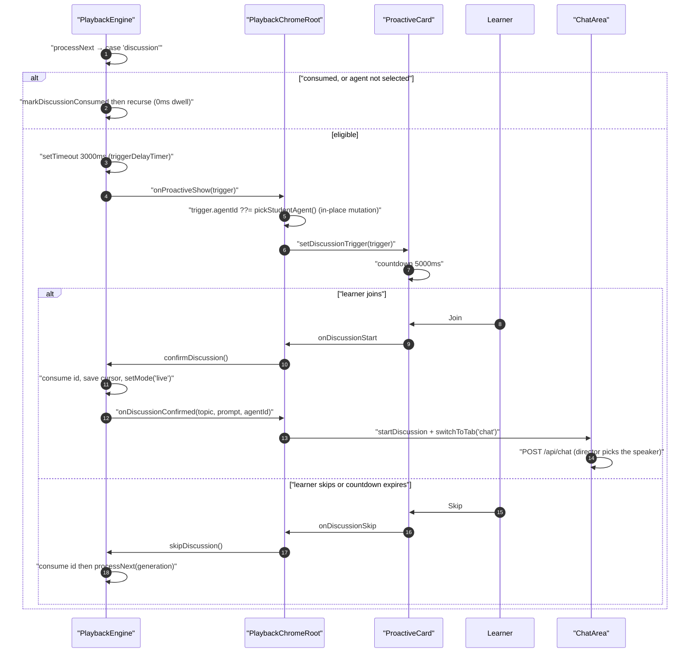

# Traced flows (a) — cold open, learner interrupt, authored discussion

Continued in `03b-flows-scenes-and-pbl.md` (seek/scene switch, PBL task
completion). Every hop names a real function at a real line.

## Flow A — cold open to first narrated line

### Hops

| # | Where | Call |
| --- | --- | --- |
| 1 | [`app/classroom/[id]/page.tsx:112`](app/classroom/[id]/page.tsx#L112) | mount effect: `setLoading(true)`, `mediaStore.revokeObjectUrls()`, `useMediaGenerationStore.setState({tasks:{}})`, `clearHistory()` |
| 2 | [`page.tsx:47`](app/classroom/[id]/page.tsx#L47) / [`ClassroomSurface.tsx:102`](components/classroom/ClassroomSurface.tsx#L102) | `claimStageSceneLoadToken()`; `isCurrent = () => isEffectCurrent() && isCurrentStageSceneLoadToken(loadToken)` |
| 3 | [`load-classroom.ts:133`](lib/classroom/load-classroom.ts#L133) | `await loadFromStorage(classroomId, loadToken)` (IndexedDB) |
| 4 | [`load-classroom.ts:142`](lib/classroom/load-classroom.ts#L142) | only if the store is still empty: `fetchClassroomFromApi` → `GET /api/classroom?id=…` ([`app/api/classroom/route.ts:51`](app/api/classroom/route.ts#L51) → `readClassroom`) |
| 5 | [`pbl-fallback-hydration.ts:58`](lib/classroom/pbl-fallback-hydration.ts#L58) | `applyHydratedClassroomFallbackScenes` → `hydratePBLScenesFromRuntime` + `loadChatSessions` in parallel, then `applyClassroomStageAndScenes` ([`load-classroom.ts:272`](lib/classroom/load-classroom.ts#L272)) |
| 6 | [`load-classroom.ts:164`](lib/classroom/load-classroom.ts#L164) | `await loadRestoredMediaTasksFromDB(classroomId)` — metadata read of `db.mediaFiles`, priority split via `collectPriorityMediaRefs` ([`:335`](lib/classroom/load-classroom.ts#L335)) |
| 7 | [`load-classroom.ts:169`](lib/classroom/load-classroom.ts#L169) | `applyRestoredMediaTasks` → eager `URL.createObjectURL` for the opening scene, background `hydrateDeferredMediaTasks` for the rest |
| 8 | [`load-classroom.ts:194-221`](lib/classroom/load-classroom.ts#L194-L221) | `rosterNeedsLegacyFallback` → optional mirror probe → `applyGeneratedAgentsToRegistry` |
| 9 | [`load-classroom.ts:225`](lib/classroom/load-classroom.ts#L225) | `restoreAgentSelection(...)` → `setAgentMode` / `setSelectedAgentIds` / `setAgentSelectionIsUserSet` |
| 10 | [`load-classroom.ts:251`](lib/classroom/load-classroom.ts#L251) | `setLoading(false)` in `finally` |
| 11 | [`page.tsx:84`](app/classroom/[id]/page.tsx#L84) | fire-and-forget `fetchStageMeta(classroomId)` → `noteStageOwnership` + `setViewerAccess({isOwner})` |
| 12 | [`components/stage.tsx:193`](components/stage.tsx#L193) | `resolveStageChromeMode({storedMode:'playback', …})` → `PlaybackChromeRoot` mounts; `InteractiveIframeHost` mounts beside it ([`:385`](components/stage.tsx#L385)) |
| 13 | [`PlaybackChromeRoot.tsx:655`](components/edit/PlaybackChromeRoot.tsx#L655) | `initializeScene()` effect keyed on `currentScene` |
| 14 | [`PlaybackChromeRoot.tsx:668`](components/edit/PlaybackChromeRoot.tsx#L668) | `await chatAreaRef.current?.endActiveSession({source:'scene_switch'})`, `discussionAbortRef.abort()`, `discussionTTS.cleanup()` |
| 15 | [`PlaybackChromeRoot.tsx:682`](components/edit/PlaybackChromeRoot.tsx#L682) | `getActionResumeRestoreCursor(readActionResumeState(sessionStorage, key), sceneId, actions)` |
| 16 | [`PlaybackChromeRoot.tsx:692`](components/edit/PlaybackChromeRoot.tsx#L692) | only when there is no session position: `await loadCursor(playbackStageId)`, accepted only if `cursor.sceneId === currentScene.id` and `canJumpWithinReconstructablePrefix(actions, 0, cursor.actionIndex)` |
| 17 | [`PlaybackChromeRoot.tsx:712`](components/edit/PlaybackChromeRoot.tsx#L712) | `resetSceneState({actionIndex, lectureSpeech})` |
| 18 | [`PlaybackChromeRoot.tsx:752`](components/edit/PlaybackChromeRoot.tsx#L752) | `new ActionEngine(useStageStore, audioPlayerRef.current, widgetSendMessage)` — `widgetSendMessage` resolves the iframe callback **lazily per send** ([`:748`](components/edit/PlaybackChromeRoot.tsx#L748)) |
| 19 | [`PlaybackChromeRoot.tsx:759`](components/edit/PlaybackChromeRoot.tsx#L759) | `new PlaybackEngine([currentScene], actionEngine, audioPlayer, {14 callbacks})` |
| 20 | [`PlaybackChromeRoot.tsx:941`](components/edit/PlaybackChromeRoot.tsx#L941) | resume-only path: `engine.canJumpToAction(idx)` then `engine.jumpToAction(idx, {autoplay:false})`. Never auto-plays. |
| 21 | Roundtable play button → [`PlaybackChromeRoot.tsx:1127`](components/edit/PlaybackChromeRoot.tsx#L1127) | `handlePlayPause()`: mode is `idle` → `await chatAreaRef.current.startLecture(currentScene.id)` → `engine.continuePlayback()` (or `engine.start()` when `playbackCompleted`) |
| 22 | [`engine.ts:552`](lib/playback/engine.ts#L552) | `processNext(generation)` |
| 23 | [`engine.ts:556`](lib/playback/engine.ts#L556) | `actionIndex === 0` → `actionEngine.clearEffects()`, `onSceneChange(scene.id)`, `onSpeakerChange('teacher')` |
| 24 | [`engine.ts:542`](lib/playback/engine.ts#L542) | `getCurrentAction()` → `resolvePlaybackCursor(scenes, sceneIndex, actionIndex)` |
| 25 | [`engine.ts:579`](lib/playback/engine.ts#L579) | `onProgress(getSnapshot())` **before** `actionIndex++` — the snapshot points at the action about to run |
| 26 | [`engine.ts:586`](lib/playback/engine.ts#L586) | `onSpeechStart(text)` → `setLectureSpeech` + `chatAreaRef.addLectureMessage` + `setActiveBubbleId` ([`PlaybackChromeRoot.tsx:781`](components/edit/PlaybackChromeRoot.tsx#L781)) |
| 27 | [`engine.ts:589`](lib/playback/engine.ts#L589) | `audioPlayer.onEnded(cb)` registers the advance |
| 28 | [`engine.ts:623`](lib/playback/engine.ts#L623) | `audioPlayer.play(speechAction.audioId \|\| '', legacy audioUrl)` |
| 29 | [`engine.ts:630`](lib/playback/engine.ts#L630) | `audioStarted === false` → browser TTS if and only if `ttsEnabled && ttsProviderId === 'browser-native-tts' && isTTSProviderEnabled(...)`; otherwise `scheduleReadingTimer()` |
| 30 | [`PlaybackChromeRoot.tsx:763`](components/edit/PlaybackChromeRoot.tsx#L763) | `onProgress` → `updateCurrentPlaybackActionIndex`, `saveSceneResumePosition` (sessionStorage, sync), `scheduleCursorSave` (KV, 1 s debounce) |

### Sequence

## Flow B — learner interrupts mid-utterance, then auto-resume

### Hops

| # | Where | Call |
| --- | --- | --- |
| 1 | [`roundtable/index.tsx:414`](components/roundtable/index.tsx#L414) | `handleToggleInput()` → `onInputActivate()` |
| 2 | [`PlaybackChromeRoot.tsx:1656`](components/edit/PlaybackChromeRoot.tsx#L1656) | while `chatSessionType` is `qa`/`discussion`: `chatAreaRef.pauseActiveLiveBuffer()`, `discussionTTS.pause()`, `setIsDiscussionPaused(true)`; and when `engineMode` is `playing`/`live`: `engine.pause()` |
| 3 | [`engine.ts:222`](lib/playback/engine.ts#L222) | `pause()`: bump generation; stash `speechTimerRemaining` from `Date.now() - speechTimerStart`; browser TTS → save `browserTTSPausedChunks` + `speechSynthesis.cancel()`; else `audioPlayer.pause()` — **skipped entirely** if `currentTrigger` is set |
| 4 | [`roundtable/index.tsx:403`](components/roundtable/index.tsx#L403) | `handleSendMessage()` → `showLocalUserMessage(text)` (3 s bubble, [`:298`](components/roundtable/index.tsx#L298)) → `onMessageSend(text)` |
| 5 | [`PlaybackChromeRoot.tsx:1587`](components/edit/PlaybackChromeRoot.tsx#L1587) | `setIsDiscussionPaused(false)`, `resumeActiveLiveBuffer()`, `discussionTTS.cleanup()`, clear soft-close/topic-pending |
| 6 | [`PlaybackChromeRoot.tsx:1619`](components/edit/PlaybackChromeRoot.tsx#L1619) | `engineMode ∈ {playing, live, paused}` → `engine.handleUserInterrupt(msg)`; otherwise `sendMessageWithElementReference(msg, snapshot)` directly. `paused` is included deliberately, because step 2 already paused the engine while the learner typed |
| 7 | [`engine.ts:440`](lib/playback/engine.ts#L440) | `handleUserInterrupt`: bump generation → save `savedSceneIndex` and `savedActionIndex = max(0, actionIndex - 1)` **only if not already saved** → clear `triggerDelayTimer` → `currentTopicState='active'` → `setMode('live')` **before** `audioPlayer.stop()` / `cancelBrowserTTS()` → `onUserInterrupt(text)` |
| 8 | [`PlaybackChromeRoot.tsx:860`](components/edit/PlaybackChromeRoot.tsx#L860) | `onUserInterrupt` → `sendMessageWithElementReference(text, pendingInterruptElementReferenceRef.current)` → `ChatArea.sendMessage` → `POST /api/chat` ([`use-chat-sessions.ts:1307`](components/chat/use-chat-sessions.ts#L1307)) |
| 9 | [`stream-buffer.ts:216-295`](lib/buffer/stream-buffer.ts#L216-L295) | SSE events land as `pushThinking` / `pushAgentStart` / `pushText` / `pushAction` / `pushDone` |
| 10 | [`stream-buffer.ts:493`](lib/buffer/stream-buffer.ts#L493) | `tick()` every 30 ms reveals 1 char, firing `onTextReveal`, `onLiveSpeech`, `onSpeechProgress` |
| 11 | [`PlaybackChromeRoot.tsx:1744`](components/edit/PlaybackChromeRoot.tsx#L1744) | `onLiveSpeech` → `queueMicrotask` guarded by `sceneEpochRef` → `setLiveSpeech`, `setSpeakingAgentId`, `setChatIsStreaming` |
| 12 | [`derived-state.ts:77`](lib/playback/derived-state.ts#L77) | `computePlaybackView` → `phase='discussionActive'`, `bubbleRole='agent'` when the speaker is not the teacher |
| 13 | [`stream-buffer.ts:471`](lib/buffer/stream-buffer.ts#L471) | `sealLastText()` → `onSegmentSealed(messageId, partId, fullText, currentAgentId)` |
| 14 | [`use-discussion-tts.ts:351`](lib/hooks/use-discussion-tts.ts#L351) | `handleSegmentSealed` → `resolveVoiceForAgent(agentId)` → queue push → `processQueue` |
| 15 | [`use-discussion-tts.ts:241`](lib/hooks/use-discussion-tts.ts#L241) | `POST /api/generate/tts` → `data:audio/…;base64,…` → `new Audio(url)`, `playbackRate = playbackSpeed`, `volume = ttsMuted ? 0 : ttsVolume` |
| 16 | [`stream-buffer.ts:509`](lib/buffer/stream-buffer.ts#L509) | buffer holds on the segment while `shouldHold()` reports `holding` and an unchanged `segmentDone` |
| 17 | [`PlaybackChromeRoot.tsx:1794`](components/edit/PlaybackChromeRoot.tsx#L1794) | session end → `onStopSession(payload)` → `handleSessionStop` |
| 18 | [`PlaybackChromeRoot.tsx:495`](components/edit/PlaybackChromeRoot.tsx#L495) | `engine.hasLectureInterruption()` is read **before** cleanup, because `handleEndDiscussion` clears the saved position |
| 19 | [`PlaybackChromeRoot.tsx:451`](components/edit/PlaybackChromeRoot.tsx#L451) | `doSessionCleanup()`: `manualStopRef=true` → `engine.handleEndDiscussion()` → flash → `discussionTTS.cleanup()` → `resetLiveState()` |
| 20 | [`engine.ts:399`](lib/playback/engine.ts#L399) | `handleEndDiscussion`: bump generation, `clearEffects()`, `currentTopicState='closed'`, `setWhiteboardOpen(false)`, `restoreSavedLectureState()`, `onDiscussionEnd()`, `setMode('idle')` |
| 21 | [`auto-resume.ts:37`](lib/playback/auto-resume.ts#L37) | `shouldAutoResumeLecture({source, endReason, hadLectureInterruption, engineMode, isExhausted, playbackCompleted})` |
| 22 | [`PlaybackChromeRoot.tsx:519`](components/edit/PlaybackChromeRoot.tsx#L519) | eligible → `await chatAreaRef.startLecture(engine.getCurrentSceneId())`, then re-check `engineRef.current === engine` **and** `engine.getMode() === 'idle'`; on either failure `endSession(sessionId)` |
| 23 | [`PlaybackChromeRoot.tsx:532`](components/edit/PlaybackChromeRoot.tsx#L532) | `engine.continuePlayback()` — replays the interrupted line from `actionIndex - 1` |

### Sequence

## Flow C — authored `discussion` action becomes a live agent turn

### Hops

| # | Where | Call |
| --- | --- | --- |
| 1 | [`engine.ts:680`](lib/playback/engine.ts#L680) | `processNext` hits `case 'discussion'` |
| 2 | [`engine.ts:683`](lib/playback/engine.ts#L683) | already in `consumedDiscussions` → recurse immediately, no dwell |
| 3 | [`engine.ts:688`](lib/playback/engine.ts#L688) | `discussionAction.agentId && !isAgentSelected(agentId)` → `markDiscussionConsumed` then recurse |
| 4 | [`engine.ts:706`](lib/playback/engine.ts#L706) | `setTimeout(…, DISCUSSION_TRIGGER_DELAY_MS)` = 3 000 ms; the callback re-checks generation **and** `mode === 'playing'` |
| 5 | [`engine.ts:710`](lib/playback/engine.ts#L710) | `currentTrigger = trigger`; `onProactiveShow(trigger)`. The engine now idles — it has no timer running |
| 6 | [`PlaybackChromeRoot.tsx:822`](components/edit/PlaybackChromeRoot.tsx#L822) | `onProactiveShow`: when `trigger.agentId` is absent, **mutate it in place** with `pickStudentAgent()` so `confirmDiscussion` reads the same object; `setDiscussionTrigger` |
| 7 | [`PlaybackChromeRoot.tsx:254`](components/edit/PlaybackChromeRoot.tsx#L254) | `pickStudentAgent()`: random among `role === 'student'`, else random among non-teachers, else `agents[0]?.id \|\| 'default-1'` |
| 8 | `roundtable/index.tsx` → [`components/chat/proactive-card.tsx:96`](components/chat/proactive-card.tsx#L96) | card counts down `DISCUSSION_AUTO_SKIP_MS` = 5 000 ms in 50 ms steps ([`:205`](components/chat/proactive-card.tsx#L205) renders the remaining seconds) and calls `onSkip()` at zero ([`:114`](components/chat/proactive-card.tsx#L114)). Both the countdown and the auto-skip are gated on `mode === 'playback'`; in `autonomous` mode the card waits indefinitely |
| 9a | Join → [`PlaybackChromeRoot.tsx:1643`](components/edit/PlaybackChromeRoot.tsx#L1643) | `engine.confirmDiscussion()` |
| 10a | [`engine.ts:354`](lib/playback/engine.ts#L354) | bump generation → `markDiscussionConsumed(id)` (which emits `onProgress` immediately, `:348`) → save `savedSceneIndex/savedActionIndex` **as-is** (past the discussion, because discussions are placed after their speech) → `currentTopicState='active'` → `setMode('live')` → `onProactiveHide()` → `onDiscussionConfirmed(question, prompt, agentId)` |
| 11a | [`PlaybackChromeRoot.tsx:1010`](components/edit/PlaybackChromeRoot.tsx#L1010) | `handleDiscussionSSE`: `startDiscussion({topic, prompt, agentId ?? 'default-1'})`, `switchToTab('chat')`, `setChatIsStreaming(true)`, `setChatSessionType('discussion')`, optimistic `setThinkingState({stage:'director'})` |
| 12a | — | continues at Flow B hop 9 |
| 9b | Skip / countdown → [`PlaybackChromeRoot.tsx:1647`](components/edit/PlaybackChromeRoot.tsx#L1647) | `engine.skipDiscussion()` → `markDiscussionConsumed` → `onProactiveHide` → `processNext(generation)` when still `playing` ([`engine.ts:385`](lib/playback/engine.ts#L385)) |

The exporter's model of the same beat is
`DISCUSSION_TRIGGER_DELAY_MS + DISCUSSION_AUTO_SKIP_MS` = 8 000 ms of dwell
([`lib/choreography/timeline.ts:210`](lib/choreography/timeline.ts#L210)), which is exactly the unattended path
9b takes.

### Sequence

