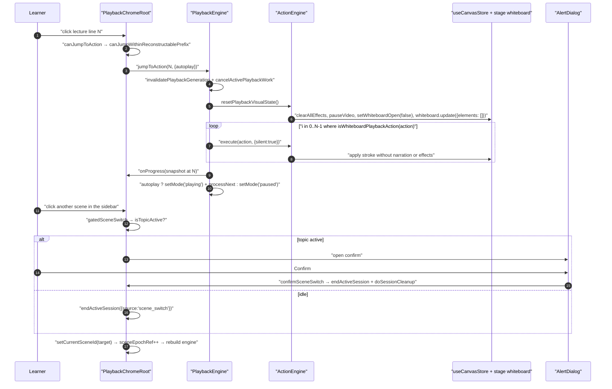
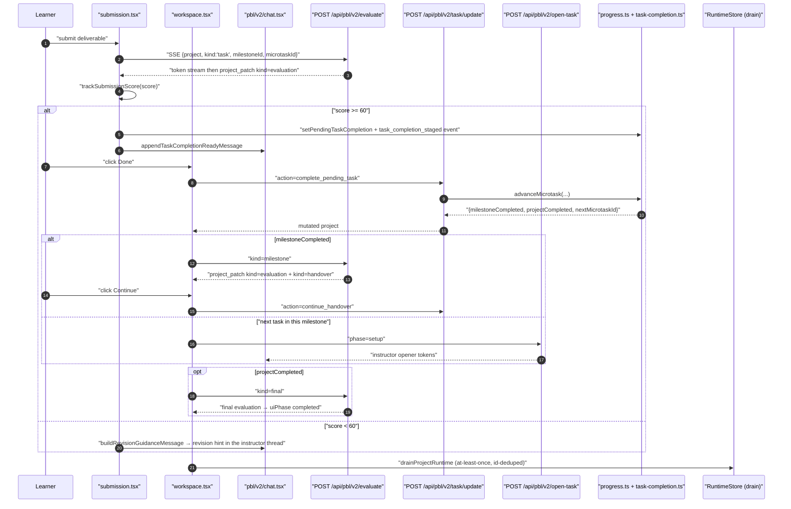
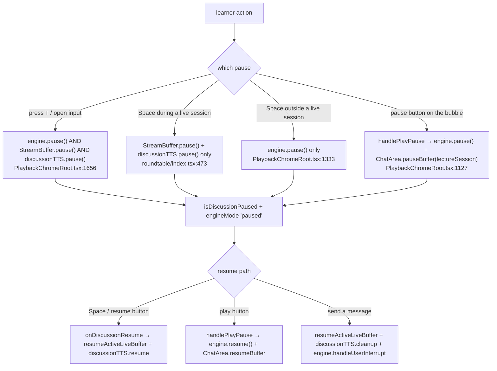

# Traced flows (b) — seek, gated scene switch, PBL task completion

Continues `03a-flows-playback.md`.

## Flow D — seek to an earlier line, and the gated scene switch

Two related paths share the same safety predicate.

### D1 — in-scene seek (`jumpToAction`)

| # | Where | Call |
| --- | --- | --- |
| 1 | `PlaybackChromeRoot.tsx:1741` | `ChatArea` lecture-note click → `onJumpToAction(sceneId, actionIndex)` |
| 2 | `PlaybackChromeRoot.tsx:1259` | `canJumpToAction(sceneId, idx)`: same scene, then `canJumpWithinReconstructablePrefix(actions, currentPlaybackActionIndex, idx)` |
| 3 | `action-navigation.ts:65` | target must be a `speech` action **and** neither the target prefix nor the current prefix may contain a `play_video`, `discussion`, or `widget_*` action |
| 4 | `PlaybackChromeRoot.tsx:1271` | `handleJumpToAction`: `autoplay = engine.getMode() === 'playing'` |
| 5 | `engine.ts:182` | `jumpToAction`: `invalidatePlaybackGeneration()` → `cancelActivePlaybackWork()` (stop audio, cancel browser TTS, `clearEffects`, `pauseVideo`, kill both timers, `onProactiveHide`) |
| 6 | `engine.ts:189` | reset cursor to `(0, 0)`, drop saved lecture state, drop topic state and trigger, `actionEngine.resetPlaybackVisualState()` (closes the board and empties its elements, `lib/action/engine.ts:296`) |
| 7 | `engine.ts:197` | replay loop `for i in [0, actionIndex)`: `isWhiteboardPlaybackAction(action)` → `await actionEngine.execute(action, {silent: true})`; the generation is re-checked **before every step** |
| 8 | `lib/action/engine.ts:215` | `{silent:true}` short-circuits `speech`, `spotlight`, `laser`, `discussion`, `play_video` and every `widget_*` — only whiteboard mutations actually run |
| 9 | `engine.ts:206` | `clearEffects()`, adopt the cursor, `onProgress(getSnapshot())` |
| 10 | `engine.ts:211` | `autoplay` → `setMode('playing')` + `processNext(generation)`; otherwise, if the mode was `playing`/`live`, drop to `paused` |
| 11 | `PlaybackChromeRoot.tsx:1278` | on success: `setPlaybackCompleted(false)`, `updateCurrentPlaybackActionIndex(idx)`, and `setLectureSpeech(action.text)` so the bubble matches the new position |

### D2 — scene switch, gated on live activity

| # | Where | Call |
| --- | --- | --- |
| 1 | `SceneSidebar` / toolbar / `handleNextScene` → `PlaybackChromeRoot.tsx:1084` | `gatedSceneSwitch(targetSceneId)`; `requestId = ++sceneSwitchRequestRef.current` |
| 2 | `PlaybackChromeRoot.tsx:1091` | `isTopicActive` (from `computePlaybackView`: `chatIsStreaming \|\| isTopicPending \|\| isCueUser \|\| engineMode === 'live' \|\| !!discussionTrigger`) → show the confirm dialog and return `false` |
| 3 | `PlaybackChromeRoot.tsx:1095` | otherwise `await endActiveSession({source:'scene_switch'})`, then bail if `requestId !== sceneSwitchRequestRef.current` (a newer request won) |
| 4 | `PlaybackChromeRoot.tsx:1104` | on confirm: `confirmSceneSwitch()` → `endActiveSession` → `doSessionCleanup()` → `setCurrentSceneId(target)` |
| 5 | `PlaybackChromeRoot.tsx:655` | the `currentScene` effect re-runs: `saveSceneResumePosition(previousSceneId, …)` → `sceneEpochRef.current++` → full teardown → new `ActionEngine` + `PlaybackEngine` |
| 6 | `PlaybackChromeRoot.tsx:1745` | the epoch bump is what discards stale `onLiveSpeech` / `onThinking` / `onSpeechProgress` microtasks from the previous scene's buffer |

Auto-play advance takes the *ungated* path: `onComplete` (`engine.ts:871`) waits
1 500 ms, re-reads `autoPlayLecture`, refuses to advance off a `quiz` /
`interactive` / `pbl` scene, sets `autoStartRef.current = true`, and calls
`setCurrentSceneId` directly — so the next `initializeScene` auto-starts
(`:929`).

## Flow E — PBL v2: submission to next task

### Hops

| # | Where | Call |
| --- | --- | --- |
| 1 | `scene-renderer.tsx:41` | `pbl` scene → `PBLRenderer` |
| 2 | `pbl-renderer.tsx:44` | `resolvePBLContent(content)` → `v2` \| upgrade `legacy` \| `null` |
| 3 | `pbl-renderer.tsx:138` | `structuredClone(projectV2)` then `normalizeProjectRuntime(next)`; if it mutated anything, publish it back through `onProjectV2Change` (`:146`) |
| 4 | `pbl-renderer.tsx:224` | `uiPhase` `hero`/`generating` → `PBLV2Hero`; `workspace`/`completed` → portaled `PBLV2WorkspaceLayer` (`:241`) |
| 5 | `pbl/v2/chat.tsx:395` | empty instructor thread → `run({endpoint:'/api/pbl/v2/open-task', body:{phase:'greeting'}})` |
| 6 | `app/api/pbl/v2/open-task/route.ts:71` | `phase === 'greeting'` with `priorQuizResults` → `applyQuizSignalsToProject` (pre-play proficiency recalibration) |
| 7 | `open-task/route.ts:82` | `createSSEResponse(runInstructorTurn({project, userMessage:'', phase, model, thinkingConfig, signal}), {signal})` |
| 8 | `instructor.ts:1306` | `normalizeProjectRuntime(project)`; `currentMicrotask(project)`; no active microtask → `error NO_ACTIVE_MICROTASK` + `done` |
| 9 | `instructor.ts:1500` | `streamLLM({model, system, messages, …})`; tools attached **only** when `phase === 'instructing' && !scenarioPrepStage` |
| 10 | `use-instructor-stream.ts:288` | `runOneStream`: `fetch` with `x-model` / `x-api-key` / `x-base-url` / `x-provider-type` / `x-user-locale` headers, split frames on `\n\n`, `parseSSEFrame`, `applyInstructorEvent` |
| 11 | `pbl/v2/submission.tsx` | learner submits text/file/link; a PDF first goes through `POST /api/parse-pdf` (`:1051`) |
| 12 | `submission.tsx:509` | `runStream('/api/pbl/v2/evaluate', {project, kind:'task', milestoneId, microtaskId}, 'eval-task')` |
| 13 | `app/api/pbl/v2/evaluate/route.ts:94` | `runTaskEvaluation({…, hasVision: !!modelInfo?.capabilities?.vision, signal})` — `hasVision` computed at `:90` so an image submission can be fed to a vision model |
| 14 | `submission.tsx:520` | `latestTaskEvaluation(workingProject, microtaskId)`; `trackSubmissionScore(score)` feeds the proficiency EWMA |
| 15 | `submission.tsx:536` | `taskEvaluationCanAdvance(evaluation)` → `taskEvaluationCanComplete`: `kind==='task' && score >= TASK_EVAL_PASS_SCORE (60)` (`task-completion.ts:20`) |
| 16 | `submission.tsx:550` | pass → `recordPendingTaskCompletionEvidence` + `setPendingTaskCompletion(...)` (`task-completion.ts:53`, which appends a `task_completion_staged` runtime event) + `appendTaskCompletionReadyMessage` |
| 17 | `submission.tsx:580` | fail → `buildRevisionGuidanceMessage({evaluation, instructorId, microtaskId, language, revisionAttempt})` pushed into the instructor thread with a `message_created` runtime event |
| 18 | `pbl/v2/sidebar.tsx:382` | `showComplete={pendingTaskCompletionId === task.id}` → the Done button appears |
| 19 | `workspace.tsx:229` | `handleCompleteTask` → `POST /api/pbl/v2/task/update {action:'complete_pending_task'}` |
| 20 | `app/api/pbl/v2/task/update/route.ts:76` | `currentMicrotask` → `currentPendingTaskCompletion` → `advanceMicrotask(project, id, pending.reason, pending.assessment ?? {})` → `appendTaskDividerMessage` |
| 21 | `progress.ts:463` | `advanceMicrotask`: refuse `already_terminal`; `clearPendingTaskCompletion`; status → `completed`; `status_changed` + `microtask_completed` events; **freeze** `microtask.engagement`; activate the next `todo`/`in_progress` microtask, else complete the milestone and stage a `PBLHandover` |
| 22 | `workspace.tsx:246` | `milestoneCompleted` → `runEvaluationPhase(kind:'milestone')`; `projectCompleted` → `runEvaluationPhase(kind:'final')`; otherwise `runTaskOpenerPhase` → `/open-task` with `phase:'setup'` |
| 23 | `workspace.tsx:169` | milestone boundary: learner clicks Continue → `runSceneAction('continue_handover')` → `continueAfterHandover` (`progress.ts:761`) unlocks the next milestone |
| 24 | `runtime/drain.ts` | the mutated project's `runtimeEvents` + `engagementEvents` outboxes drain into the `RuntimeStore` behind two device-scoped watermarks |
| 25 | `runtime/document-persistence.ts:14` | before a document save: `synchronizePBLProjectRuntime` then `stripToDesignTemplate` — learner state is removed from `scene.content.projectV2` |

### Sequence

## Cross-cutting observation from the traces

Three different components each own a *different* pause semantic, and all three
can be active at once:

The `livePausedRef` sticky flag inside `use-chat-sessions` is inherited by newly
created buffers, which is why `onMessageSend` must call
`resumeActiveLiveBuffer()` *before* `sendMessage` creates the next one
(`PlaybackChromeRoot.tsx:1599-1602`).
