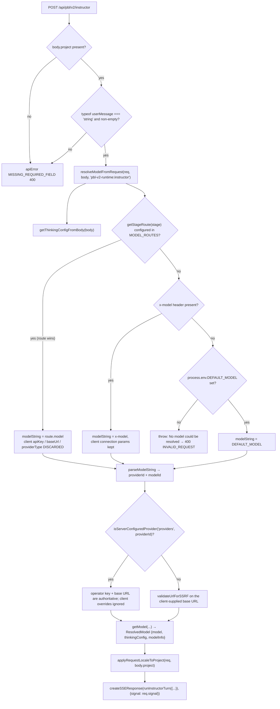
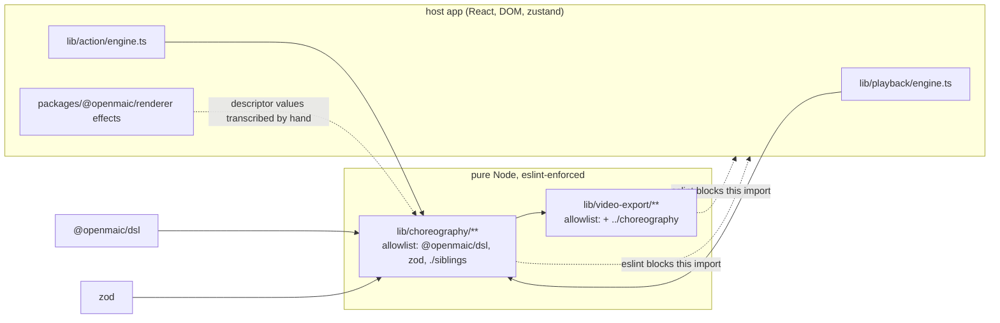

# Dependencies and configuration

## 1. npm packages actually imported in scope

Counted by grepping `from '<pkg>'` across every in-scope path plus
`components/edit/PlaybackChromeRoot.tsx` and `lib/hooks/use-discussion-tts.ts`
(command in `06-quality-and-metrics.md`).

| Package | Import sites | Used for |
| --- | --- | --- |
| `lucide-react` | 24 | icons throughout roundtable / stage / scene renderers |
| `@openmaic/generation` | 13 | the PBL task-engine kernel; `lib/pbl/v2/operations/kernel/*` are five 2-line re-export barrels |
| `motion/react` | 9 | chrome cross-fade, PBL workspace expand, roundtable bubble and waveform |
| `@openmaic/dsl` | 9 | `Action`, `SceneCore`, `Scene`, `Slide`, `PPTElement`, `FIRE_AND_FORGET_ACTIONS`, all PBL contract types |
| `next/server` | 8 | `NextRequest` / `NextResponse` in the five API routes |
| `ai` | 6 | Vercel AI SDK — `tool()`, `stepCountIs()`, `LanguageModel` in the PBL agents |
| `zod` | 3 | descriptor schema (`choreography/descriptors/types.ts`) and PBL tool input schemas |
| `@openmaic/storage` | 3 | `BrowserKVStore`, `KVStore`, `RuntimeStore` for cursor + PBL ledger persistence |
| `sonner` | 2 | toasts (ASR errors, Qwen clone-voice fallback notice) |
| `react-dom` | 2 | `createPortal` for `InteractiveIframeHost` and the PBL workspace layer |
| `next/navigation` | 2 | `useParams`, `useRouter` |
| `radix-ui` | 1 | `VisuallyHidden` for the scene-switch dialog title |
| `next/link` | 1 | the not-found "back to home" link |
| `lodash` | 1 | `isEqual` in `lib/pbl/v2/runtime/hydration.ts` — the only lodash use in the subsystem |
| `zustand` | (via `lib/store/*`) | `interactive-iframe-pool`, `widget-iframe`, `canvas`, `stage`, `settings`, `media-generation`, `scene-runtime-errors` |

`dexie` is reached only indirectly, through dynamic `import('@/lib/utils/database')`
(`load-classroom.ts:361`, `:654`, `playback/cursor.ts:84`) so importing these
modules never opens IndexedDB.

## 2. Browser platform APIs the subsystem depends on

| API | Where | Degradation if absent |
| --- | --- | --- |
| `window.speechSynthesis` (Web Speech) | `engine.ts:641`, `use-browser-tts.ts` | falls through to `scheduleReadingTimer` |
| `SpeechSynthesisVoice` async load | `engine.ts:862` `ensureVoicesLoaded` | 2 s timeout then whatever `getVoices()` returns |
| `HTMLAudioElement` | `use-discussion-tts.ts:271`, `lib/utils/audio-player` | queue advances on the `error` listener (`:284`) |
| `requestIdleCallback` | `load-classroom.ts:501` | falls back to `setTimeout(resolve, 0)` |
| `ResizeObserver` | `pbl-renderer.tsx:349` | guarded by `typeof ResizeObserver !== 'undefined'`; the rAF poll still tracks the rect |
| `requestAnimationFrame` polling | `interactive-renderer.tsx:56`, `pbl-renderer.tsx:363`, `proactive-card.tsx:85` | none — hard dependency |
| Fullscreen API | `PlaybackChromeRoot.tsx:589`, `InteractiveIframeHost.tsx:99` | `catch` logs "Fullscreen request denied — browser policy" (`:596`) |
| `navigator.keyboard.lock(['Escape'])` | `PlaybackChromeRoot.tsx:593` | optional-chained + `.catch(() => {})` |
| `sessionStorage` | `action-resume.ts:61` | every write is `try`/`catch`; resume is best-effort |
| `localStorage` | `use-instructor-stream.ts:306` (`x-user-locale`) | `catch` and skip |
| `postMessage` | `InteractiveIframeHost.tsx:177`, iframe shims | none — the only parent↔iframe channel |
| `structuredClone` | `pbl-renderer.tsx:139`, `use-instructor-stream.ts:138`, `submission.tsx:526` | none — hard dependency |
| `document.fullscreenElement` | portal-host selection in two places | portals to `document.body` |

## 3. HTTP surfaces

### Consumed by this subsystem

| Endpoint | Caller | Notes |
| --- | --- | --- |
| `GET /api/classroom?id=` | `load-classroom.ts:261` | server fallback when IndexedDB is empty |
| `GET /api/stage-meta/:stageId` | `stage-meta-client.ts:42` | `credentials: 'include'`, `cache: 'no-store'`; three outcomes |
| `GET /api/agent/runtime` | `components/stage.tsx:76` | decides whether the Pro Switch enters the workspace |
| `POST /api/chat` | `use-chat-sessions.ts:1307` | the live discussion / Q&A SSE stream |
| `POST /api/generate/tts` | `use-discussion-tts.ts:241` | returns `{base64, format}`; the client builds a `data:` URL |
| `POST /api/pbl/v2/open-task` | `chat.tsx:396`, `workspace.tsx:186` | greeting / setup opener |
| `POST /api/pbl/v2/instructor` | `chat.tsx:506` | teaching turn |
| `POST /api/pbl/v2/simulator` | `chat.tsx:385`, `:499` | scenario roleplay turn |
| `POST /api/pbl/v2/evaluate` | `use-instructor-stream.ts:184`, `submission.tsx:510`, `workspace.tsx:186` | task / milestone / final |
| `POST /api/pbl/v2/task/update` | `workspace.tsx:148`, `:234`, `chat.tsx:218` | stateless mutation |
| `POST /api/parse-pdf` | `submission.tsx:1051` | PDF submission → text |
| `PATCH /api/stages/:id` | `lib/live/server-api.ts:34` | course rename (misfiled under `lib/live/`) |

### Served by this subsystem

| Route | File | Behaviour |
| --- | --- | --- |
| `POST /api/classroom` | `app/api/classroom/route.ts:14` | `persistClassroom({id, stage, scenes}, baseUrl)`; id defaults to `randomUUID()` |
| `GET /api/classroom` | `:51` | requires `id`, `isValidClassroomId(id)` (`/^[a-zA-Z0-9_-]+$/`), 404 when absent |
| `GET /api/classroom-media/:classroomId/*path` | `app/api/classroom-media/.../route.ts:40` | static media with HTTP range support |
| `POST /api/pbl/v2/{instructor,open-task,evaluate,simulator}` | see §5 | SSE, `maxDuration = 300` |
| `POST /api/pbl/v2/task/update` | `task/update/route.ts:20` | JSON, `maxDuration = 60` |

The media route's defence-in-depth is worth quoting because it is unusually
thorough for this codebase (`route.ts:47-76`): `isValidClassroomId`, reject
`..` and NUL in path segments, allowlist the first segment to `media` or `audio`,
then `fs.realpath` and verify the resolved path is still under
`path.resolve(CLASSROOMS_DIR, classroomId)` — so a symlink planted inside the
classroom directory cannot escape. `Cache-Control: public, max-age=86400,
immutable` on 200/206, but explicitly `no-store` on a 416 so an unsatisfiable
range cannot poison shared caches (`:88`).

`CLASSROOMS_DIR = path.join(process.cwd(), 'data', 'classrooms')`
(`lib/server/classroom-storage.ts:6`) — plain filesystem, one `<id>.json` per
classroom.

## 4. Environment variables

| Name | Required | Effect | Evidence |
| --- | --- | --- | --- |
| `ALLOWED_FRAME_ANCESTORS` | no | appended to the CSP `frame-ancestors` directive; when set, `X-Frame-Options` is omitted entirely (XFO cannot express an allowlist) | `next.config.ts:39-51` |
| `NEXT_PUBLIC_PRO_WORKBENCH_ENABLED` | no | gates the workspace pane host and, with `/api/agent/runtime`, the Pro Switch destination | `lib/config/feature-flags.ts:33`, `components/stage.tsx:68` |
| `NEXT_PUBLIC_MAIC_EDITOR_ENABLED` | no | enables the edit chrome; implied true when the Pro workbench flag is on | `feature-flags.ts:48` |
| `NEXT_PUBLIC_PI_CHAT_ENABLED` | no | enables slide-element references in playback mode (`showElementReference`) | `feature-flags.ts:73`, `PlaybackChromeRoot.tsx:1211` |
| `DEFAULT_MODEL` | effectively yes for PBL | last fallback in model resolution; with nothing resolvable, the PBL routes 400 with "No model could be resolved" | `lib/server/resolve-model.ts:65` |
| `MODEL_ROUTES` | no | JSON map; `pbl-v2-runtime` plus `pbl-v2-runtime:{instructor,open-task,evaluate,simulator}` are routable keys, and a route **wins over the client's `x-model`** | `lib/server/model-routes.ts:142-146`, `resolve-model.ts:56-78` |
| `PBL_V2_DEV_PROFICIENCY_BADGE` | no | surfaces the internal proficiency tier in the UI; the learner never sees it otherwise | `lib/pbl/v2/api/sse.ts:122` |
| `NODE_ENV` | — | read twice in `lib/pbl/v2/runtime/hydration.ts` (`:283`, `:363`) — the **only** `process.env` reads inside the whole in-scope tree |
| `VERCEL` | no | switches the Next build off `output: 'standalone'` | `next.config.ts:4` |

Everything else the runtime needs (TTS provider keys, base URLs, model, locale)
travels **per request**, not per environment: `useDiscussionTTS` sends
`ttsApiKey` / `ttsBaseUrl` from the client settings store
(`use-discussion-tts.ts:251-254`), and the PBL streams send
`x-model` / `x-api-key` / `x-base-url` / `x-provider-type` / `x-user-locale`
headers (`use-instructor-stream.ts:292-310`).

## 5. Config resolution for a PBL LLM call

Two consequences a reader should internalise:

1. An operator-configured `MODEL_ROUTES` entry silently overrides whatever model
   the learner's browser has saved, *and* drops the browser's API key/base URL so
   a routed Anthropic model is never built with the client's OpenAI credentials
   (`resolve-model.ts:73-81`).
2. `thinkingConfig` is never forced by the PBL agents themselves — the instructor
   comment at `instructor.ts:1519` says the runtime "holds no opinion of its own"
   and points operators at pinning `thinking` off on the `pbl-v2-runtime` route
   when they want cheap, snappy turns.

## 6. Client-side settings that change playback behaviour

All from `useSettingsStore` (persisted to `localStorage`):

| Setting | Read at | Effect |
| --- | --- | --- |
| `ttsEnabled`, `ttsProviderId`, `ttsProvidersConfig` | `engine.ts:632`, `use-discussion-tts.ts:47` | whether narration is synthesised at all, and by whom |
| `ttsMuted`, `ttsVolume` | `PlaybackChromeRoot.tsx:990`, `:997`; `use-discussion-tts.ts:456` | applied live to the current audio element |
| `ttsSpeed` | `engine.ts:802`, `use-discussion-tts.ts:250` | browser-TTS `utterance.rate` and the server TTS request |
| `playbackSpeed` (`PLAYBACK_SPEEDS`) | `PlaybackChromeRoot.tsx:1004`, `engine.ts:801`, `timeline.ts:187` | divides every dwell; also multiplies `utterance.rate` |
| `autoPlayLecture` | `engine.ts:885` | 1.5 s later advance to the next scene, never off an activity scene |
| `selectedAgentIds`, `agentMode` | `PlaybackChromeRoot.tsx:221`, `engine.ts:866` | the roundtable cast **and** whether a `discussion` action fires at all |
| `agentVoiceOverrides` | `use-discussion-tts.ts:55` | per-agent voice binding |
| `sidebarCollapsed`, `chatAreaCollapsed`, `chatAreaWidth` | `PlaybackChromeRoot.tsx:160-165` | layout; presentation mode force-collapses both (`:594`) |
| `asrEnabled` | `roundtable/index.tsx:214` | whether the `V` shortcut and mic button exist |

## 7. The choreography purity boundary

`eslint.config.mjs` applies a dedicated rule block to
`lib/choreography/**/*.{ts,tsx,js,jsx,mjs,cjs}` (`:255`) that forbids:

- any `@/…` host-app path, including inside template literals (`:262`, `:267`);
- any import or re-export that is not `@openmaic/dsl`, `zod`, or a `./…` sibling
  (`:279`, `:285`, `:291`);
- `import()` and `require()` (`:298`, `:303`) — they would bypass the allowlist;
- any React / DOM / GSAP / framer-motion reference (`:323`).

`lib/video-export/**` gets a mirrored block whose allowlist additionally permits
`../choreography` (`:346-379`). That is the enforced direction of the dependency:
exporter → choreography, never the reverse.

