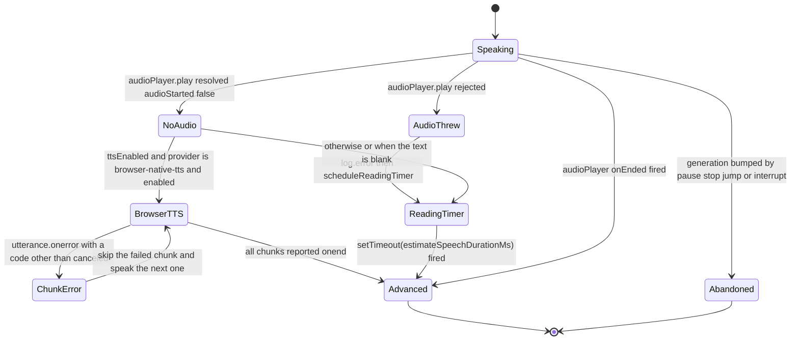
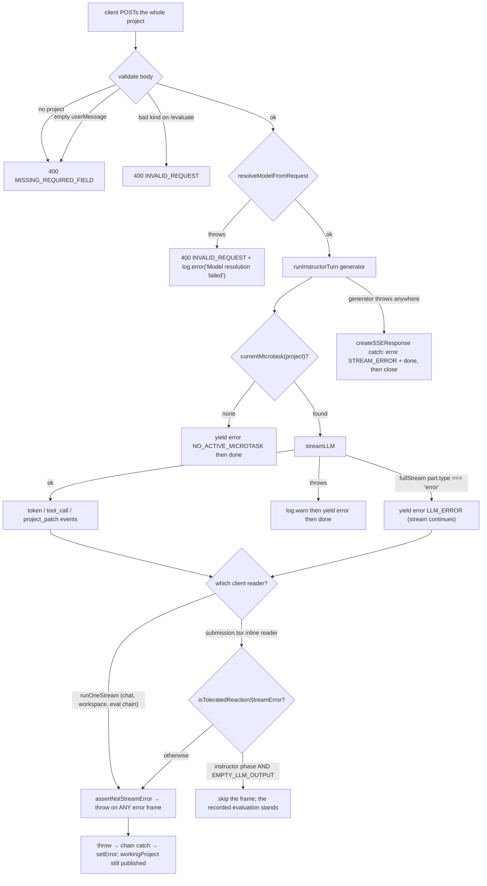

# Failure modes

Ordered by what the learner sees. Every row is an actual code path, not a
hypothetical.

## 1. Load-path failures

| Failure | Detection | Result |
| --- | --- | --- |
| IndexedDB read throws | `try` around the whole `runClassroomLoad` body ([`load-classroom.ts:244`](lib/classroom/load-classroom.ts#L244)) | `setError(message)`, retry button rendered ([`page.tsx:237`](app/classroom/[id]/page.tsx#L237)) |
| `GET /api/classroom` non-2xx or `success !== true` | `fetchClassroomFromApi` returns `null` ([`load-classroom.ts:262`](lib/classroom/load-classroom.ts#L262), [`:268`](lib/classroom/load-classroom.ts#L268)) | load continues; store keeps whatever IndexedDB had |
| Load resolved but no stage in the store | `useStageStore.getState().stage?.id !== classroomId` ([`ClassroomSurface.tsx:141`](components/classroom/ClassroomSurface.tsx#L141)) | `variant='page'` → terminal `notFound` (no retry, same copy for deleted and never-existed); `variant='pane'` → `outcome='unavailable'` |
| Course not yet committed (pane) | `paneAvailabilityRetryDelay(attempt)` = `[1s, 2s, 4s, 8s, 16s]` then `null` ([`progressive-load-policy.ts:2`](lib/classroom/progressive-load-policy.ts#L2)) | five bounded retries, then `setError(t('classroom.notFound'))`; `loading` is deliberately not re-raised so a mounted classroom never flashes away |
| `loadRestoredMediaTasksFromDB` throws | bare `catch` ([`load-classroom.ts:395`](lib/classroom/load-classroom.ts#L395)) | returns `{tasks:{}, deferred:[]}` — media silently missing, no user-visible error |
| Legacy roster mirror read throws | `catch` → `return null` (`:673`) | distinguished from "empty mirror"; the probe memo is **not** set, so the next load retries |
| Deferred media hydration rejects | `.catch` → `moduleLog.warn` (`:478`) | already-hydrated media still shows; the rest stays pending |
| Corrupt legacy playback timestamp | `Number.isFinite(new Date(legacy.updatedAt).getTime())` ([`cursor.ts:122`](lib/playback/cursor.ts#L122)) | falls back to `new Date()` rather than throwing, which would otherwise re-throw on every load and permanently disable resume |
| `/api/stage-meta` 5xx / network error | `fetchStageMeta` returns `'unavailable'` ([`stage-meta-client.ts:57`](lib/classroom/stage-meta-client.ts#L57), [`:66`](lib/classroom/stage-meta-client.ts#L66)) | `noteStageOwnership(id, false, null)` — ownership recorded as *unknown*, edit gate keeps upstream defaults |

## 2. Playback failures

| Failure | Detection | Result |
| --- | --- | --- |
| No pre-generated audio for a `speech` action | `audioPlayer.play(...)` resolves `false` ([`engine.ts:628`](lib/playback/engine.ts#L628)) | browser TTS when it is the selected *and* enabled provider, else a reading timer sized by `estimateSpeechDurationMs` |
| `audioPlayer.play` rejects | `.catch` → `log.error('TTS error:', err)` then `scheduleReadingTimer()` ([`engine.ts:650`](lib/playback/engine.ts#L650)) | the line still dwells; playback does not stall |
| Blank / whitespace `speech.text` | `hasText` ([`engine.ts:621`](lib/playback/engine.ts#L621)); `splitIntoChunks` returns `[]` for blank text (`:767`) | routed to the reading timer. Explicit reason: an empty `SpeechSynthesisUtterance` does not reliably fire `onend` in Chromium and would hang the slide |
| Chrome silently truncating long utterances | sentence-level chunking ([`engine.ts:757`](lib/playback/engine.ts#L757)) | each chunk stays under the ~15 s cutoff |
| Firefox `speechSynthesis.pause()` broken | cancel + re-speak from the current chunk ([`engine.ts:246`](lib/playback/engine.ts#L246), `:280`) | pause loses at most one sentence of position |
| Chrome garbled synthesis state | `speechSynthesis.cancel()` immediately before every `speak()` ([`engine.ts:853`](lib/playback/engine.ts#L853)) | — |
| Voices not loaded yet (Chrome loads async) | `ensureVoicesLoaded` waits for `voiceschanged` with a 2 s timeout ([`engine.ts:874`](lib/playback/engine.ts#L874)) | proceeds with whatever `getVoices()` returns |
| Stale async continuation after pause/stop/seek | 20 `isCurrentGeneration(generation)` guards | the continuation returns silently |
| Synchronous `onend` from `speechSynthesis.cancel()` | mode is set **before** stopping audio ([`engine.ts:319`](lib/playback/engine.ts#L319), `:459`) | prevents a spurious `processNext` that would skip past the interrupted line |
| Deep run of consecutive `spotlight`/`laser` | `queueMicrotask` instead of direct recursion ([`engine.ts:672`](lib/playback/engine.ts#L672)) | avoids stack overflow |
| Unknown action type | `default:` arm calls `processNext(generation)` ([`engine.ts:743`](lib/playback/engine.ts#L743)) | skipped silently — no log, no counter |
| `start()`/`continuePlayback()` called when not idle | `log.warn` and return ([`engine.ts:152`](lib/playback/engine.ts#L152), `:166`) | no-op |
| `pause()` in `idle` | `log.warn('Cannot pause: mode is', mode)` ([`engine.ts:259`](lib/playback/engine.ts#L259)) | no-op |
| `confirmDiscussion()` with no trigger | `log.warn('confirmDiscussion called but no trigger')` ([`engine.ts:356`](lib/playback/engine.ts#L356)) | no-op |
| Live SSE request failure | `onLiveSessionError` → `handleLiveSessionError` → `engine.handleDiscussionError()` ([`PlaybackChromeRoot.tsx:441`](components/edit/PlaybackChromeRoot.tsx#L441)) | engine returns to `idle` **without** an end flash, and the chat session stays retryable ([`engine.ts:421`](lib/playback/engine.ts#L421)) |
| Scene switch races an async resume | engine identity guard in `onProgress` ([`PlaybackChromeRoot.tsx:767`](components/edit/PlaybackChromeRoot.tsx#L767)) and after `jumpToAction` ([`:945`](components/edit/PlaybackChromeRoot.tsx#L945)) | a superseded engine cannot publish its old scene's cursor |
| Auto-resume races a scene switch | after the awaited `startLecture`, both `engineRef.current !== engine` and `getMode() !== 'idle'` are re-checked, and the just-created session is torn down ([`PlaybackChromeRoot.tsx:520`](components/edit/PlaybackChromeRoot.tsx#L520), [`:524`](components/edit/PlaybackChromeRoot.tsx#L524)) | no orphan lecture session |
| Fullscreen request denied (Firefox / F11) | `catch` → `console.warn('[Presentation] Fullscreen request denied — browser policy')` ([`PlaybackChromeRoot.tsx:596`](components/edit/PlaybackChromeRoot.tsx#L596)) | stays windowed |
| KV cursor save rejects | `.catch` → `console.warn` ([`PlaybackChromeRoot.tsx:319`](components/edit/PlaybackChromeRoot.tsx#L319)) | resume falls back to `sessionStorage` |
| Unmount with a debounced cursor pending | the pending cursor is flushed synchronously in the unmount cleanup ([`PlaybackChromeRoot.tsx:970-972`](components/edit/PlaybackChromeRoot.tsx#L970-L972)) | position is not lost |

### Known stall: a `discussion` action with no viewer

If `processNext` schedules the `triggerDelayTimer` and the learner never
interacts, the engine sits at `currentTrigger` with **no timer of its own** — the
only thing that resumes it is `ProactiveCard`'s countdown, and that countdown is
gated on `mode === 'playback'` ([`proactive-card.tsx:94`](components/chat/proactive-card.tsx#L94), [`:115`](components/chat/proactive-card.tsx#L115)). In
`autonomous` mode the card renders with no countdown, so playback waits
indefinitely. The exporter models the playback-mode behaviour
([`timeline.ts:210`](lib/choreography/timeline.ts#L210): 3 000 + 5 000 ms), not the autonomous one.

## 3. StreamBuffer failures

| Failure | Detection | Result |
| --- | --- | --- |
| `onActionReady` throws synchronously | `try` in `trackAction` ([`stream-buffer.ts:729`](lib/buffer/stream-buffer.ts#L729)) | `onError('Action <name> failed: <msg>')`, `completion` resolved so the queue continues |
| `onActionReady` rejects | `.catch(reportActionError)` (`:735`) | same |
| Buffer disposed mid-flush | `if (this._disposed) return;` after **every** callback in `flushRemaining` (`:372`-`:421`) | no callback fires after disposal |
| `waitUntilDrained()` on a disposed buffer | immediate `Promise.reject(new Error('Buffer already disposed'))` (`:330`) | caller sees a rejection, not a hang |
| `dispose()` / `shutdown()` while awaited | `_drainReject` invoked with `'Buffer disposed'` / `'Buffer shutdown'` (`:441`, `:463`) | awaiting code unblocks |
| **Paused buffer** | `tick()` returns immediately when `_paused` (`:494`) | `waitUntilDrained()` **never settles** — documented as by design (`:320`) |
| Text fully revealed but never sealed | `isComplete = fullyRevealed && item.sealed` (`:548`) | the buffer waits for more deltas; if the stream dies without `sealText`/`pushDone` the bubble freezes on the partial line |
| Concurrent `flush()` calls | `_flushPromise` memoised (`:357`) | one flush |
| Stale `item.agentId` when SSE outruns the tick | the tick uses `this.currentAgentId` (set when it *processes* `agent_start`), not `item.agentId` (`:556`) | the bubble never attributes text to the previous speaker |

## 4. PBL v2 failures

Note the asymmetry the diagram exposes: there are **two** SSE readers.
`runOneStream` ([`use-instructor-stream.ts:288`](components/scene-renderers/pbl/v2/use-instructor-stream.ts#L288)) calls `assertNotStreamError`
unconditionally at `:337`, so an `EMPTY_LLM_OUTPUT` aborts its chain.
`submission.tsx` has its own inline reader (`:479`) and is the only caller that
consults `isToleratedReactionStreamError` (`:492`) — even though the tolerance
helper lives in `use-instructor-stream.ts`.

| Failure | Detection | Result |
| --- | --- | --- |
| No active microtask | [`instructor.ts:1308`](lib/pbl/v2/agents/instructor.ts#L1308) | SSE `error NO_ACTIVE_MICROTASK` + `done`; the client surfaces the message |
| Model unresolvable | `resolveModelFromRequest` throws ([`resolve-model.ts:67`](lib/server/resolve-model.ts#L67)) | `400 INVALID_REQUEST` before any stream opens |
| LLM stream emits an `error` part | [`instructor.ts:1560`](lib/pbl/v2/agents/instructor.ts#L1560) | `error LLM_ERROR` yielded; the generator keeps running |
| LLM call throws | `catch` at [`instructor.ts:1578`](lib/pbl/v2/agents/instructor.ts#L1578) → `log.warn` + `error` event | stream closes cleanly with a `done` |
| Generator throws | `createSSEResponse` catch ([`sse.ts:265`](lib/pbl/v2/api/sse.ts#L265)) | `STREAM_ERROR` + `done` are still written to the wire |
| Client disconnects | `req.signal` → `onAbort` → `safeClose()`, heartbeat cleared, listener removed ([`sse.ts:225-246`](lib/pbl/v2/api/sse.ts#L225-L246)) | server stops burning compute |
| Proxy idles the connection out | `: keepalive\n\n` every 15 s + `X-Accel-Buffering: no` ([`sse.ts:192`](lib/pbl/v2/api/sse.ts#L192), [`:286`](lib/pbl/v2/api/sse.ts#L286)) | — |
| Instructor produced nothing this turn | `shouldReportEmptyOutput` ([`instructor.ts:435`](lib/pbl/v2/agents/instructor.ts#L435)) → `error EMPTY_LLM_OUTPUT` ([`:1663`](lib/pbl/v2/agents/instructor.ts#L1663)) | tolerated **only** by `submission.tsx`'s inline reader on the post-evaluation reaction turn (`isToleratedReactionStreamError`, [`use-instructor-stream.ts:377`](components/scene-renderers/pbl/v2/use-instructor-stream.ts#L377), called at [`submission.tsx:492`](components/scene-renderers/pbl/v2/submission.tsx#L492)); in `runOneStream` it aborts the chain |
| Any error on an eval stream | never tolerated | the chain aborts and `error` is surfaced |
| Chain fails midway | `catch` in `run` sets `ok=false` and `error`; the `finally` still calls `onProjectChange(workingProject)` ([`use-instructor-stream.ts:244-257`](components/scene-renderers/pbl/v2/use-instructor-stream.ts#L244-L257)) | patches applied before the failure are kept |
| Two openers fire in one effect flush | synchronous `runningRef` ([`use-instructor-stream.ts:124`](components/scene-renderers/pbl/v2/use-instructor-stream.ts#L124)) | the second call is rejected |
| `task/update` with no pending completion | `400 INVALID_REQUEST 'No pending task completion to confirm.'` ([`task/update/route.ts:83`](app/api/pbl/v2/task/update/route.ts#L83)) | the Done button stays available |
| `advanceMicrotask` on a terminal microtask | `{ok:false, error:'already_terminal'}` ([`progress.ts:483`](packages/@openmaic/generation/src/pbl/operations/kernel/progress.ts#L483)) → `400` | — |
| `enter_scenario` / `complete_act` on a non-scenario project | explicit `400 'Not a scenario project.'` ([`route.ts:121`](app/api/pbl/v2/task/update/route.ts#L121), `:151`) | ordinary projects can never be affected |
| `task/update` fetch non-2xx | `if (!res.ok) return;` ([`workspace.tsx:239`](components/scene-renderers/pbl/v2/workspace.tsx#L239), [`:153`](components/scene-renderers/pbl/v2/workspace.tsx#L153)) — **silent** | the button re-enables in `finally`; the learner gets no message |
| Runtime-ledger record missing its required attachment | recorded as a `PBLFoldGap` ([`fold.ts:27`](lib/pbl/v2/runtime/fold.ts#L27)) | fold continues; the gap is observable in diagnostics |
| Fold cannot reconstruct current state | the persistence boundary appends a full snapshot before stripping ([`drain.ts:12`](lib/pbl/v2/runtime/drain.ts#L12)) | learner state survives a ring-buffer overflow |
| Drain exceeds its budget | `PBL_DRAIN_TIMEOUT_MS = 10_000`, chain cap `20_000` ([`drain.ts:29`](lib/pbl/v2/runtime/drain.ts#L29)) | bounded, at-least-once |
| Hydration disagrees with the document | `HydratePBLProjectResult { source, diagnostics, diff, selfHealed }` ([`hydration.ts:38`](lib/pbl/v2/runtime/hydration.ts#L38)) | divergence is reported, not silently preferred |
| Legacy-upgraded project's progress | `preparePBLScenesForDocumentPersistence` skips non-`v2` scenes ([`document-persistence.ts:22`](lib/pbl/v2/runtime/document-persistence.ts#L22)) | progress on an upgraded v1 project is **not** written back to the document |

## 5. Interactive scene failures

| Failure | Detection | Result |
| --- | --- | --- |
| Generated page throws during `srcDoc` parse | `ERROR_CAPTURE_SHIM` posts out and buffers up to 50 entries ([`lib/utils/iframe.ts:57`](lib/utils/iframe.ts#L57)) | the parent asks for a replay after subscribing ([`InteractiveIframeHost.tsx:223`](components/scene-renderers/InteractiveIframeHost.tsx#L223)), so pre-subscription errors are not lost; errors land in `useSceneRuntimeErrors` for the editor agent |
| Page touches `localStorage` in a null origin (throws `SecurityError`) | `STORAGE_SHIM` probes with `getItem('__probe__')` and swaps in an in-memory store ([`iframe.ts:28`](lib/utils/iframe.ts#L28)) | the page renders instead of dying blank |
| Slot not laid out yet (`rect` null or zero-size) | `shown` requires a real measured box and positive intersection ([`InteractiveIframeHost.tsx:240`](components/scene-renderers/InteractiveIframeHost.tsx#L240)) | `visibility: hidden` rather than a 0×0 iframe pinned at the viewport origin |
| Placeholder unmount races a newer mount during the chrome cross-fade | `release(sceneId, owner)` no-ops unless `owner` still matches ([`interactive-iframe-pool.ts:159`](lib/store/interactive-iframe-pool.ts#L159)) | the live iframe is not hidden by a stale cleanup |
| Widget action fires before the host registers its callback | `widgetSendMessage` resolves the callback lazily per send ([`PlaybackChromeRoot.tsx:748`](components/edit/PlaybackChromeRoot.tsx#L748)) | first-visit widget actions are not dropped |
| Presentation fullscreen | portal target follows `document.fullscreenElement` ([`InteractiveIframeHost.tsx:99`](components/scene-renderers/InteractiveIframeHost.tsx#L99)) | the iframe stays inside the painted subtree |
| Hostile / malformed picker message | `e.source` identity, `__maicInteractive === true`, three `typeof === 'string'` checks, length truncation, and an `ownerSessionId` match ([`InteractiveIframeHost.tsx:36-65`](components/scene-renderers/InteractiveIframeHost.tsx#L36-L65)) | dropped, `handleInteractivePickerMessage` returns `false` |
| Content change | `mount()` rebuilds the entry only when `srcDoc`/`src` differ by value ([`interactive-iframe-pool.ts:111`](lib/store/interactive-iframe-pool.ts#L111)) | the single intended reload path |
| More than 3 interactive scenes visited | LRU eviction, active scene exempt (`:79`) | the evicted scene reloads from scratch on its next visit |

### What is *not* defended

- No CSP is applied to the interactive document on the live-classroom path (see
  `01b-modules-pbl-interactive.md` §3.3). The sandbox attribute is the whole
  isolation boundary in the browser: `allow-scripts allow-forms allow-popups`,
  no `allow-same-origin`. Consequences: no access to app cookies / storage / DOM,
  but unrestricted outbound `fetch` and remote script loading.
- `InteractiveContent.url` is loaded into the same iframe via `src` when no inline
  HTML exists ([`InteractiveIframeHost.tsx:278`](components/scene-renderers/InteractiveIframeHost.tsx#L278)), with no allowlist on the URL
  anywhere in the render path.
- The error shim's own `message` listener does not check `event.source`
  ([`iframe.ts:73`](lib/utils/iframe.ts#L73)), so any frame that can reach it may trigger a buffer replay.
  The replay only re-posts to `window.parent`, so the blast radius is duplicate
  error entries, which the parent dedupes.
