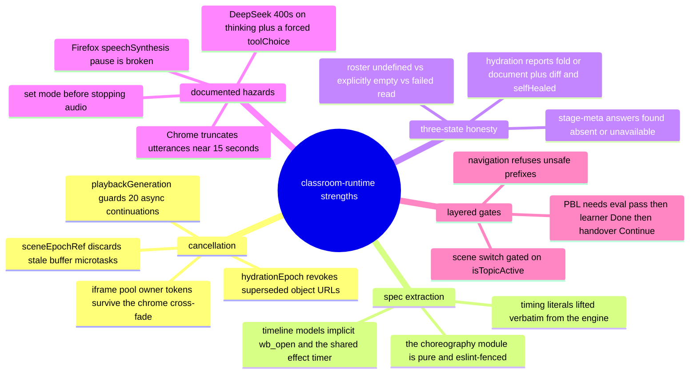
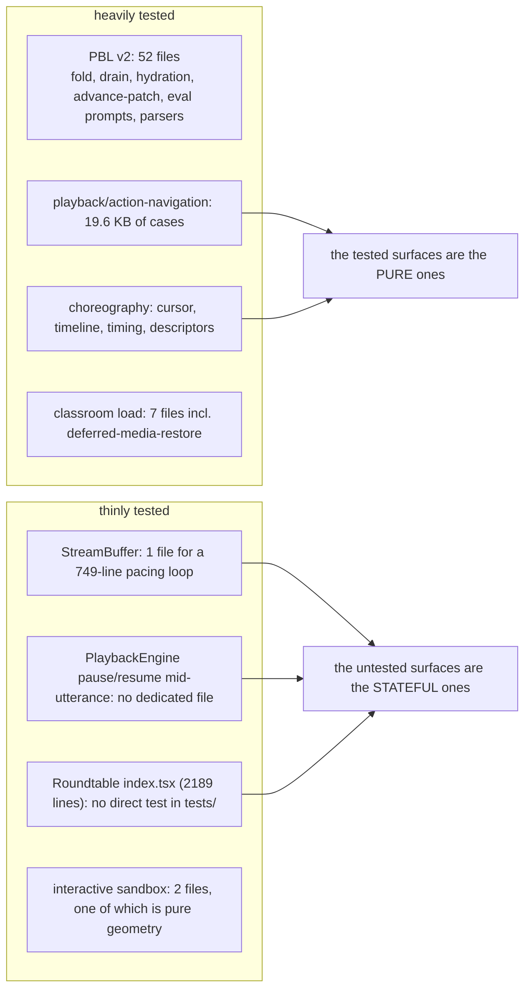

# Quality observations and measured metrics

## 1. Measurements, with the command that produced each

All commands run from the repo root, `/local/home/cajias/Projects/OpenMAIC`.

### Size

```bash
for d in lib/classroom lib/choreography lib/playback lib/buffer lib/live \
         lib/interactive lib/pbl lib/hooks components/roundtable \
         components/classroom components/stage components/scene-renderers \
         app/classroom app/api/classroom app/api/classroom-media app/api/pbl; do
  printf "%-32s files=%-4s lines=%s\n" "$d" \
    "$(find $d -type f \( -name '*.ts' -o -name '*.tsx' \) | wc -l)" \
    "$(find $d -type f \( -name '*.ts' -o -name '*.tsx' \) -exec cat {} + | wc -l)"
done
```

| Metric | Value |
| --- | --- |
| Files, all declared paths | **126** |
| Lines, all declared paths | **33 687** |
| Files, excluding `lib/hooks/` | **110** |
| Lines, excluding `lib/hooks/` | **29 835** |
| Largest single file | `components/roundtable/index.tsx` — 2 189 |
| Files over 800 lines | 6 |

```bash
find lib/classroom lib/choreography lib/playback lib/buffer lib/live \
     lib/interactive lib/pbl components/roundtable components/classroom \
     components/stage components/scene-renderers app/classroom app/api \
     -type f \( -name '*.ts' -o -name '*.tsx' \) -exec wc -l {} + \
  | sort -rn | awk '$1>800 && $2!="total"'
```

```
2189 components/roundtable/index.tsx
1864 lib/pbl/v2/agents/instructor.ts
1553 components/scene-renderers/pbl/v2/chat.tsx
1398 components/scene-renderers/pbl/v2/submission.tsx
1116 components/scene-renderers/quiz-view.tsx
 902 lib/playback/engine.ts
```

Plus two out-of-scope-but-central files:
`components/edit/PlaybackChromeRoot.tsx` 1 848 and `lib/action/engine.ts` 902
(`wc -l components/edit/PlaybackChromeRoot.tsx lib/action/engine.ts`).

### Tests

```bash
ls tests/playback/*.ts tests/lib/playback/*.ts tests/lib/choreography/*.ts \
   tests/lib/buffer/*.ts tests/classroom/*.ts tests/pbl/v2/*.ts \
   tests/pbl/legacy/*.ts tests/scene-renderers/*.ts | wc -l
grep -rhoE "^[[:space:]]*(it|test)\(" tests/playback tests/lib/playback \
   tests/lib/choreography tests/lib/buffer tests/classroom tests/pbl \
   tests/scene-renderers | wc -l
```

| Metric | Value |
| --- | --- |
| In-scope test files | **72** |
| In-scope `it(` / `test(` cases | **891** |
| PBL v2 test files | 52 (`ls tests/pbl/v2/*.ts \| wc -l`) |
| Playback engine test files | 4 (`tests/playback/`: `action-navigation` 19.6 K, `cursor`, `discussion-consumption`, `stage-delete`) |
| Choreography test files | 4 (`cursor`, `descriptors`, `timeline`, `timing`) |
| StreamBuffer test files | 1 (`tests/lib/buffer/stream-buffer.test.ts`) |
| Interactive sandbox test files | 2 (`tests/scene-renderers/interactive-iframe-picker.test.ts`, `genui-logical-viewport.test.ts`) |

**The suite could not be executed in this workspace.** `node_modules` is empty
(`ls node_modules | wc -l` → `0`), so `pnpm vitest run …` fails with
`Command "vitest" not found` and `npx vitest run …` fails with
`Cannot find module 'vitest/config'`. Every number above is static; no pass/fail
claim is made anywhere in this pack.

### Code-health counters

```bash
grep -rn "eslint-disable" lib/classroom lib/choreography lib/playback lib/buffer \
  lib/pbl components/roundtable components/classroom components/stage \
  components/scene-renderers app/classroom app/api/pbl | wc -l          # 7
grep -rn "as any\|@ts-ignore\|@ts-expect-error" lib/classroom lib/choreography \
  lib/playback lib/buffer lib/pbl components/roundtable components/classroom \
  components/stage components/scene-renderers | wc -l                   # 0
grep -rn "console\.\(log\|warn\|error\)" lib/classroom lib/choreography \
  lib/playback lib/buffer lib/pbl components/roundtable components/classroom \
  components/stage components/scene-renderers | wc -l                   # 9
grep -rln "createLogger" lib/classroom lib/choreography lib/playback lib/buffer \
  lib/pbl components/roundtable components/stage components/scene-renderers \
  app/api/classroom app/api/pbl | wc -l                                 # 15
grep -rn "setTimeout(\|setInterval(" lib/classroom lib/playback lib/buffer \
  lib/pbl components/roundtable components/scene-renderers \
  components/edit/PlaybackChromeRoot.tsx | wc -l                        # 21
grep -rn "requestAnimationFrame(" lib components | wc -l                # 29
```

| Metric | Value | Reading |
| --- | --- | --- |
| `eslint-disable` comments | 7 | each carries a written justification |
| `as any` / `@ts-ignore` / `@ts-expect-error` | **0** | genuinely clean; narrowing is done with `as unknown as {…}` shapes instead |
| raw `console.*` calls | 9 | against 15 files using `createLogger`; the 9 are all in React components (`PlaybackChromeRoot`, `pbl-fallback-hydration`, `stage-meta-client`, `use-discussion-tts`) |
| `setTimeout` / `setInterval` sites | 21 | the timing surface a reader has to keep in their head |
| `requestAnimationFrame(` sites (whole `lib` + `components`) | 29 | three of them are *permanent* per-frame polls in this subsystem |

### Behaviour-defining constants

| Constant | Value | Where |
| --- | --- | --- |
| `StreamBuffer` tick | 30 ms, 1 char/tick (≈33 chars/s) | [`stream-buffer.ts:208`](lib/buffer/stream-buffer.ts#L208) |
| `EFFECT_AUTO_CLEAR_MS` | 5 000 | [`choreography/timing.ts:18`](lib/choreography/timing.ts#L18) |
| `DISCUSSION_TRIGGER_DELAY_MS` | 3 000 | [`timing.ts:21`](lib/choreography/timing.ts#L21) |
| `DISCUSSION_AUTO_SKIP_MS` | 5 000 | [`timing.ts:31`](lib/choreography/timing.ts#L31) |
| `MAX_VIDEO_WAIT_MS` | 300 000 | [`timing.ts:34`](lib/choreography/timing.ts#L34) |
| whiteboard dwells | open 2 000, draw 800, edit 600, delete 300, close 700, widget 300 | [`timing.ts:43-58`](lib/choreography/timing.ts#L43-L58) |
| `wbDrawCodeMs` | `min(800 + 50·lines, 3000)` | [`timing.ts:64`](lib/choreography/timing.ts#L64) |
| `wbClearMs` | `min(380 + 55·elements, 1400)` | [`timing.ts:72`](lib/choreography/timing.ts#L72) |
| speech estimate | CJK >30 % → 150 ms/char, else 240 ms/word, floor 2 000 ms, ÷ speed | [`timing.ts:113`](lib/choreography/timing.ts#L113) |
| cursor-save debounce | 1 000 ms | [`PlaybackChromeRoot.tsx:335`](components/edit/PlaybackChromeRoot.tsx#L335) |
| auto-play scene gap | 1 500 ms | [`PlaybackChromeRoot.tsx:920`](components/edit/PlaybackChromeRoot.tsx#L920) |
| presentation controls idle hide | 3 000 ms | [`PlaybackChromeRoot.tsx:571`](components/edit/PlaybackChromeRoot.tsx#L571) |
| end flash | 1 800 ms (three separate literals) | [`PlaybackChromeRoot.tsx:463`](components/edit/PlaybackChromeRoot.tsx#L463), [`:852`](components/edit/PlaybackChromeRoot.tsx#L852); [`roundtable/index.tsx:344`](components/roundtable/index.tsx#L344) |
| local user bubble | 3 000 ms | [`roundtable/index.tsx:303`](components/roundtable/index.tsx#L303) |
| media hydration | 4 records per idle slice, 1 000 ms idle timeout | [`load-classroom.ts:494`](lib/classroom/load-classroom.ts#L494) |
| pane availability retries | 1 s, 2 s, 4 s, 8 s, 16 s | [`progressive-load-policy.ts:2`](lib/classroom/progressive-load-policy.ts#L2) |
| `IFRAME_POOL_CAP` | 3 | [`interactive-iframe-pool.ts:21`](lib/store/interactive-iframe-pool.ts#L21) |
| GenUI logical viewport | 1280 × 720 | [`logical-viewport.ts:4`](lib/interactive/logical-viewport.ts#L4) |
| `MAX_INSTRUCTOR_STEPS` / `MAX_HISTORY_MESSAGES` | 7 / 24 | [`instructor.ts:61`](lib/pbl/v2/agents/instructor.ts#L61) |
| `MAX_ENGAGEMENT_EVENTS` | 500 | [`@openmaic/generation/src/pbl/operations/kernel/engagement.ts:28`](packages/@openmaic/generation/src/pbl/operations/kernel/engagement.ts#L28) |
| `TASK_EVAL_PASS_SCORE` | 60 | [`…/kernel/task-completion.ts:18`](packages/@openmaic/generation/src/pbl/operations/kernel/task-completion.ts#L18) |
| PBL SSE heartbeat | 15 000 ms | [`pbl/v2/api/sse.ts:215`](lib/pbl/v2/api/sse.ts#L215) |
| `PBL_DRAIN_TIMEOUT_MS` / chain cap | 10 000 / 20 000 | [`runtime/drain.ts:29`](lib/pbl/v2/runtime/drain.ts#L29) |
| route `maxDuration` | 300 s (instructor, open-task, evaluate, simulator), 60 s (task/update) | the five route files |
| proficiency tiering | buckets at ±0.33, hysteresis ±0.20, confidence gate 0.4, 50-signal history | [`lib/pbl/v2/types.ts:400-428`](lib/pbl/v2/types.ts#L400-L428) |

## 2. What is genuinely well built



Specific things worth calling out:

1. **Cancellation is designed, not patched.** Four independent epoch/generation
   mechanisms (`playbackGeneration`, `sceneEpochRef`, `hydrationEpoch`,
   the iframe-pool `owner` token) each cover a real race, and each has a comment
   naming the race. `jumpToAction` re-checks its generation *inside* the replay
   loop ([`engine.ts:198`](lib/playback/engine.ts#L198)), which is the hard case.
2. **The choreography extraction is real.** Not a "shared constants" file — a
   machine-enforced pure module with its own eslint allowlist
   ([`eslint.config.mjs:255-323`](eslint.config.mjs#L255-L323)) that a Node-only exporter can interpret. The
   `clampFireAndForgetLifetimes` function ([`timeline.ts:368`](lib/choreography/timeline.ts#L368)) reproduces a
   *shared-timer* side effect of `ActionEngine.scheduleEffectClear`, including the
   case where an earlier effect is **extended** rather than cleared. That is a
   level of fidelity most codebases never reach.
3. **Ordering hazards are documented at the call site.** `mode` before
   `audioPlayer.stop()` (twice), `hasLectureInterruption()` before
   `doSessionCleanup()`, `sealLastText()` before `pushAgentEnd`, `resumeActiveLiveBuffer()`
   before `sendMessage`. Each of these would be an invisible bug on rediscovery.
4. **Three-state honesty.** Three separate places refuse to collapse "no" and
   "we don't know" into a boolean. `stage-ownership-signal.ts` exists purely to
   preserve that distinction.
5. **Zero `as any` / `@ts-ignore`** across ~30 k lines.
6. **The interactive sandbox reasoning is written down** and the validation
   function is exported specifically to be testable
   ([`InteractiveIframeHost.tsx:35`](components/scene-renderers/InteractiveIframeHost.tsx#L35)).
7. **The media route is properly paranoid**: id validation, traversal rejection,
   subdirectory allowlist, `realpath` containment check, and `no-store` on 416.

## 3. What is fragile

| # | Observation | Evidence | Severity |
| --- | --- | --- | --- |
| 1 | `app/classroom/[id]/page.tsx` duplicates the whole load body instead of using `ClassroomSurface`, and the copies have **already diverged**: the route lacks `notFound`, `resetCanvasState()`, the `outlineProducer === 'server-job'` guard and `shouldResumeClassroomGeneration` | [`page.tsx:28-221`](app/classroom/[id]/page.tsx#L28-L221) vs [`ClassroomSurface.tsx:62-317`](components/classroom/ClassroomSurface.tsx#L62-L317); [`ClassroomSurface.tsx:4`](components/classroom/ClassroomSurface.tsx#L4) claims to be the single copy | high |
| 2 | Animation descriptors are hand-transcribed from the React overlays with nothing enforcing agreement; a tweak to `SpotlightOverlay.tsx` silently desyncs every exported video | [`descriptors/spotlight.ts:8`](lib/choreography/descriptors/spotlight.ts#L8); only consumers are [`video-export/passes/timeline.ts:67`](lib/video-export/passes/timeline.ts#L67) and a schema test | medium |
| 3 | `PlaybackChromeRoot.tsx` is a 1 848-line component with **28** `useState`, **22** `useRef`, 11 `useEffect` and 31 `useCallback` occurrences (`grep -c` each), holding the engine, the audio player, the TTS hook, the chat ref and every keyboard handler. Its scene-init effect is ~300 lines and carries an `exhaustive-deps` disable | [`PlaybackChromeRoot.tsx:655-961`](components/edit/PlaybackChromeRoot.tsx#L655-L961), [`:960`](components/edit/PlaybackChromeRoot.tsx#L960) | medium |
| 4 | Pause is split across three owners (engine, `StreamBuffer`, `useDiscussionTTS`) with four entry points and a sticky `livePausedRef` that new buffers inherit; keeping them consistent is manual | see the pause flowchart in `03b-flows-scenes-and-pbl.md` | medium |
| 5 | `bubbleRole` / `activeRole` are derived twice — once purely in `computePlaybackView`, once again inline in the roundtable with `?? <fallback>` chains, then re-published as `enrichedPlaybackView` | [`derived-state.ts:146-182`](lib/playback/derived-state.ts#L146-L182) vs [`roundtable/index.tsx:542-608`](components/roundtable/index.tsx#L542-L608) | medium |
| 6 | Dead public surface on `PlaybackEngine`: four callbacks have **zero** call sites (`onTextDelta`, `onTopicStart`, `onTopicAppend`, `onTopicEnd`), `onSpeakerChange` has one and is not wired, and `restoreFromSnapshot()` has zero call sites anywhere including tests | `grep -o "callbacks\.[a-zA-Z]*" lib/playback/engine.ts \| sort \| uniq -c`; `grep -rn "restoreFromSnapshot" lib components app tests` | low |
| 7 | Two SSE readers with different error tolerance: `runOneStream` aborts on any `error` frame, `submission.tsx`'s inline reader tolerates `EMPTY_LLM_OUTPUT` — and the helper that decides lives in the *other* file | [`use-instructor-stream.ts:337`](components/scene-renderers/pbl/v2/use-instructor-stream.ts#L337) vs [`submission.tsx:492`](components/scene-renderers/pbl/v2/submission.tsx#L492) | medium |
| 8 | Three permanent `requestAnimationFrame` polls run whenever their component is mounted: the interactive slot rect ([`interactive-renderer.tsx:56`](components/scene-renderers/interactive-renderer.tsx#L56)), the PBL docked frame while not expanded ([`pbl-renderer.tsx:363`](components/scene-renderers/pbl-renderer.tsx#L363)), and the `ProactiveCard` anchor ([`proactive-card.tsx:85`](components/chat/proactive-card.tsx#L85)). Two are dirty-checked; the interactive one calls `setRect` on every frame and relies on the store's own equality check | cited files | medium |
| 9 | `task/update` failures are swallowed: `if (!res.ok) return;` with an empty `catch` in both `runSceneAction` and `handleCompleteTask` — the learner clicks Done, nothing happens, no message | [`workspace.tsx:153`](components/scene-renderers/pbl/v2/workspace.tsx#L153), [`:239`](components/scene-renderers/pbl/v2/workspace.tsx#L239), [`:262`](components/scene-renderers/pbl/v2/workspace.tsx#L262) | medium |
| 10 | Progress on a **legacy-upgraded** PBL project is rendered but never persisted, because `preparePBLScenesForDocumentPersistence` skips non-`v2` scenes | [`document-persistence.ts:22`](lib/pbl/v2/runtime/document-persistence.ts#L22) | medium |
| 11 | Unknown action types are skipped with no log and no counter, so a document produced by a newer DSL degrades invisibly | [`engine.ts:743`](lib/playback/engine.ts#L743) | low |
| 12 | The `1800 ms` end-flash duration is written out three times in two files rather than shared | [`PlaybackChromeRoot.tsx:463`](components/edit/PlaybackChromeRoot.tsx#L463), [`:852`](components/edit/PlaybackChromeRoot.tsx#L852); [`roundtable/index.tsx:344`](components/roundtable/index.tsx#L344) |
| 13 | `lib/live/server-api.ts` has nothing to do with live playback (it renames courses) — a directory name that will mislead every new reader | [`lib/live/server-api.ts:33`](lib/live/server-api.ts#L33) | low |
| 14 | `lib/pbl/v2/operations/kernel/*` are five two-line `export *` barrels over `@openmaic/generation`, so "where does `advanceMicrotask` live?" needs two hops and the barrels re-export the package's *entire* surface, not the named primitive | the five files | low |
| 15 | `instructor.ts`'s own header says "the three teaching tools" while listing (and implementing) two — stale prose on a 1 864-line file | [`instructor.ts:7`](lib/pbl/v2/agents/instructor.ts#L7) vs [`:1422`](lib/pbl/v2/agents/instructor.ts#L1422) | low |
| 16 | `CJK_LANG_THRESHOLD = 0.3` is declared in [`engine.ts:60`](lib/playback/engine.ts#L60) and `CJK_RATIO_THRESHOLD = 0.3` in [`timing.ts:86`](lib/choreography/timing.ts#L86), with different CJK character classes, for two related purposes | both files | low |

## 4. Coverage shape



The pattern is consistent: pure functions (`resolvePlaybackCursor`,
`resolveActionTimeline`, `estimateSpeechDurationMs`, `shouldAutoResumeLecture`,
`canJumpWithinReconstructablePrefix`, `computePlaybackView`,
`handleInteractivePickerMessage`, the whole PBL kernel and fold) are extracted
*and* tested. The stateful glue — `PlaybackChromeRoot`, `Roundtable`, the
`StreamBuffer` tick loop's TTS-hold protocol — is where the behaviour lives and
where the tests thin out. The extraction discipline is the reason that is
tolerable; the residue is where a regression will land.
