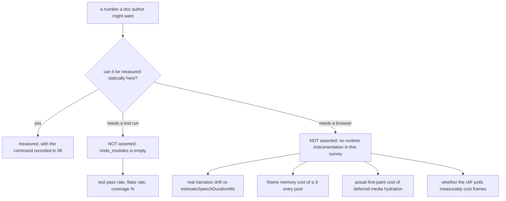

# Open questions

Things this survey could **not** determine from the code in the workspace. Each
entry names why, and where an answer would come from.

## 1. Cannot verify because the workspace has no installed dependencies

`ls node_modules | wc -l` → `0`. `pnpm vitest run …` reports
`Command "vitest" not found`; `npx vitest run …` reports
`Cannot find module 'vitest/config'`.

- Whether the 891 in-scope test cases currently pass.
- Whether any of the 72 in-scope test files are skipped (`it.skip` / `describe.skip`
  counts were not gathered because a static count without a run is misleading).
- Real timing behaviour of the `StreamBuffer` TTS-hold protocol — the interaction
  between `postTextDelayTicks`, `_holdingForTTS` and the `segmentDone` counter is
  the kind of thing only a fake-timer test settles.

## 2. Behaviour that depends on code outside the survey scope

- **Who decides which agent speaks in a live discussion.** The roundtable only
  reflects `speakingAgentId`. The decision is made behind `POST /api/chat`
  (`components/chat/use-chat-sessions.ts:1307`) and in `lib/orchestration/**` —
  the "director". Turn-taking policy, the soft-close grace window (`~15 s`
  according to `RoundtableProps.isSoftClosing`, `roundtable/index.tsx:64`), the
  `cue_user` decision and `endReason` values (`user_done`, `back_to_lesson`) are
  all set there, not here.
- **`AudioPlayer` semantics.** `lib/utils/audio-player.ts` was not read. The
  engine relies on `play(audioId, legacyUrl) → Promise<boolean>`, `onEnded`,
  `pause`, `resume`, `stop`, `isPlaying`, `hasActiveAudio`, `setMuted`,
  `setVolume`, `setPlaybackRate`, `destroy`. Whether `hasActiveAudio()` stays true
  after a completed clip — which decides the `resume()` branch at `engine.ts:287`
  vs `:298` — is not established here.
- **What `audioId` resolves to.** `SpeechAction.audioId` is "an asset reference"
  (`packages/@openmaic/dsl/src/action.ts:50`) resolved through the asset pool with
  legacy fallbacks. The resolution chain lives in `lib/media/**` and
  `lib/persistence/**`.
- **`ChatArea`'s imperative surface.** `ChatAreaRef`
  (`components/chat/chat-area.tsx:61`) declares 19 methods; `PlaybackChromeRoot`
  drives the classroom through most of them (`startLecture`,
  `addLectureMessage`, `getLectureMessageId`, `endSession`, `endActiveSession`,
  `startDiscussion`, `switchToTab`, `sendMessage`, `stopActiveSession`,
  `continueActiveSoftClosingSession`, `resumeActiveSession`, `pauseBuffer`,
  `resumeBuffer`, `pauseActiveLiveBuffer`, `resumeActiveLiveBuffer`,
  `getActiveSessionType`). Their contracts — particularly what
  `endActiveSession({source})` awaits, and what `softPauseActiveSession` does that
  `pauseActiveLiveBuffer` does not — were not read.
- **`SlideEditor` as playback renderer.** The `slide` arm of `SceneRenderer`
  renders `SlideEditor` from `components/slide-renderer/Editor` with only a `mode`
  prop; it reads the scene from the store. How it consumes whiteboard state and
  effect state is the slide/whiteboard subsystem's concern.

## 3. Genuinely unresolved design questions

- **Is `app/classroom/[id]/page.tsx`'s duplicate load body intentional or
  abandoned?** `ClassroomSurface.tsx:4` says it *is* the classroom "wherever it is
  mounted" and that it moved out of the route file — but the route file still has
  its own copy and does not import it. Nothing in either file explains the
  duplication. Only the commit history or the author can say whether the route is
  meant to be deleted, or whether the split is deliberate.
- **Why `sceneIndex` exists in the app engine at all.** The only production
  constructor passes `[currentScene]` (`PlaybackChromeRoot.tsx:759`), so the
  multi-scene walk in `resolvePlaybackCursor` is dead in the app and live only in
  the exporter. Whether the engine is *intended* to become multi-scene is not
  recorded.
- **Whether the `autonomous` stage mode is reachable in the classroom.**
  `resolveStageChromeMode` accepts it, `PlaybackChromeRoot` renders without the
  roundtable when `mode !== 'playback'` (`:1550`), and `ProactiveCard`'s auto-skip
  is disabled in that mode (`proactive-card.tsx:94`) — which would stall playback
  on a `discussion` action. No entry point that sets `mode: 'autonomous'` was
  found in the surveyed paths, so it may be dead or driven from elsewhere.
- **The intended fate of the four dead `PlaybackEngineCallbacks`.**
  `onTextDelta`, `onTopicStart`, `onTopicAppend`, `onTopicEnd` have zero call
  sites. They read like an abandoned transcript feature, but nothing says so.
- **Whether `InteractiveContent.url` is supposed to be allowlisted.** The DSL
  documents `url` as "a `src` fallback used only when `html` is absent"
  (`packages/@openmaic/dsl/src/interactive.ts:45`). Whether an authored or
  imported document may point it at an arbitrary third-party origin is a policy
  question with no answer in code.
- **Whether the live classroom is *meant* to have no CSP on the interactive
  document.** The exporter deliberately injects
  `default-src 'none'; … connect-src 'none'`
  (`lib/video-export-app/prepare-interactive-html.ts:35`). The live path injects
  no CSP at all. That asymmetry could be a deliberate capability difference (a
  live widget may legitimately want to fetch) or an oversight; the code does not
  say.
- **Whether `PBLProficiencyAssessment` is ever surfaced to a human.** The only
  consumer named in code is a dev badge behind `PBL_V2_DEV_PROFICIENCY_BADGE`
  (`lib/pbl/v2/api/sse.ts:122`), and the comment says the learner never sees the
  tier. Whether any operator dashboard reads it was not established.
- **What happens to learner progress on an upgraded legacy PBL project.**
  `preparePBLScenesForDocumentPersistence` skips non-`v2` scenes, so the
  in-session upgrade is never persisted. Whether the runtime ledger nonetheless
  retains that progress (the drain path is keyed by `(stageId, sceneId,
  learnerKey)` and does not care about `resolvePBLContent`) was not traced end to
  end.

## 4. Numbers deliberately not asserted

Specifically, this pack makes **no** claim about: coverage percentages; whether
the reading-timer estimate matches real TTS duration in practice; the memory or
CPU cost of the iframe pool or the three permanent rAF polls; SSE latency; or how
often the `EMPTY_LLM_OUTPUT` path fires in production. Each needs instrumentation
this survey did not have.

## 5. Naming that will confuse a reader and has no explanation

- `lib/live/` contains one file that renames courses (`server-api.ts`). Nothing
  live, nothing playback.
- `components/edit/PlaybackChromeRoot.tsx` — the *playback* root lives under
  `components/edit/`, beside `EditChromeRoot`.
- "stage" means both the course document and the top-level React container.
- `lib/pbl/v2/operations/kernel/*` are barrels; the kernel is in
  `packages/@openmaic/generation/src/pbl/operations/kernel/*`.
- `PBLProjectV2.uiPhase` has a `'generating'` member that `pbl-renderer.tsx:220`
  routes to the same branch as `'hero'`, so the distinction is invisible in the
  renderer. Where (and whether) `'generating'` is set was not traced.
