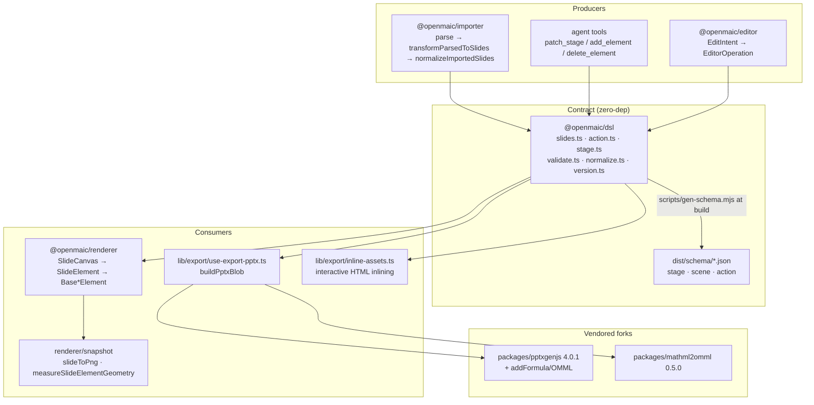

# 00 — Overview: Slide DSL, renderer, editor, importer, export

Survey date: 2026-09-03. Repo root `/local/home/cajias/Projects/OpenMAIC`, branch `main` at
`c2c9553a`.

## Charter

This subsystem owns the **slide document**: the serialized contract that describes a page of a
classroom, everything that turns that contract into pixels, everything that mutates it (human
gesture or AI tool call), and the two bridges to PowerPoint.

Five concerns, five homes:

| Concern | Home | Nature |
| --- | --- | --- |
| The contract itself | `packages/@openmaic/dsl` | pure types + JSON Schema + validators + normalizers + migration ladder, zero runtime deps ([`packages/@openmaic/dsl/src/index.ts:10`](packages/@openmaic/dsl/src/index.ts#L10)) |
| Read-only paint | `packages/@openmaic/renderer` | React components, `Slide` in → DOM out, plus an off-screen PNG/geometry snapshot path |
| Mutation | `packages/@openmaic/editor` | pure op/transaction/history core (`src/core/index.ts`) + a React gesture surface (`src/react/`) + optional UI chrome (`src/ui/`) |
| `.pptx` → DSL | `packages/@openmaic/importer` | OOXML unzip → model → serializer → `Slide[]`, then the DSL's own normalize pass |
| DSL → `.pptx` / HTML | `lib/export/` + vendored `packages/pptxgenjs` + `packages/mathml2omml` | browser-side deck writer, LaTeX→OMML, HTML asset inlining |

The app layer (`components/slide-renderer/`, `components/edit/`, `components/canvas/`,
`lib/prosemirror/`, `lib/edit/`) is the *legacy in-app* implementation of renderer + editor that
still ships by default; the two `@openmaic/*` packages are behind feature flags
([`lib/config/feature-flags.ts:56`](lib/config/feature-flags.ts#L56), [`:65`](lib/config/feature-flags.ts#L65)). Both live in scope because both consume the same DSL.

## Internal parts

The dependency arrows are declared and kept acyclic by fiat in
[`packages/@openmaic/dsl/src/index.ts:4`](packages/@openmaic/dsl/src/index.ts#L4): `dsl -> (nothing)`, `renderer -> dsl`, `importer -> dsl`,
and `editor -> {dsl, renderer}` ([`scripts/openmaic-packages.mjs:37`](scripts/openmaic-packages.mjs#L37)).

## Layered view of one slide edit

```mermaid
flowchart LR
  U["pointer / keystroke"] --> G["useEditGesture<br/>(editor/src/react)"]
  G -->|"EditIntent[]"| C["compileEditorEditIntents<br/>(editor/src/core/index.ts:162)"]
  C -->|"EditorOperation[]"| T["createEditorTransaction<br/>(:143)"]
  T --> A["applyEditorTransaction<br/>(:293)"]
  A -->|"SlideContent"| H["EditorHistory<br/>past/present/future"]
  H --> W["writeThrough → useStageStore<br/>(components/edit/surfaces/slide/slide-edit-session.ts:79)"]
  W --> R["SlideCanvas re-render"]
```

## File inventory

Measured with `find <dir> -type f \( -name '*.ts' -o -name '*.tsx' -o -name '*.js' -o -name '*.mjs' \)`
piped to `wc -l` (see `06-quality-and-metrics.md` for the exact command).

| Path | Files | LOC | Role |
| --- | --- | --- | --- |
| `packages/@openmaic/dsl/src` | 16 | 4 847 | the contract |
| `packages/@openmaic/renderer/src` | 48 | 5 003 | read-only canvas + snapshot |
| `packages/@openmaic/editor/src` | 113 | 16 302 | op core + gesture surface + UI |
| `packages/@openmaic/importer/src` | 51 | 22 133 | pptx parser + DSL transform |
| `packages/pptxgenjs/src` | 10 | 10 244 | vendored deck writer |
| `packages/mathml2omml/src` | 31 | 2 025 | vendored MathML→OMML |
| `lib/prosemirror` | 16 | 1 152 | legacy app ProseMirror schema/plugins/commands |
| `lib/edit` | 24 | 2 417 | legacy app op kernel + element factories + html-edit |
| `lib/export` | 23 | 4 872 | pptx / classroom-zip / html-asset export |
| `components/slide-renderer` | 84 | 12 097 | legacy in-app renderer + editor canvas |
| `components/edit` | 66 | 11 909 | edit chrome (shell, dock, surfaces) |
| `components/canvas` | 3 | 1 203 | canvas toolbar + element pick overlay |

Largest single modules, in descending order (same command, per file):

| File | LOC | Why it is big |
| --- | --- | --- |
| `packages/@openmaic/importer/src/shapes/presets.ts` | 6 574 | 154 OOXML preset geometry generators + 44 multi-path presets |
| `packages/@openmaic/importer/src/serializer/textSerializer.ts` | 1 794 | OOXML `TextBody` → HTML rich text |
| `components/edit/PlaybackChromeRoot.tsx` | 1 848 | playback chrome (adjacent, mostly out of scope) |
| `lib/export/use-export-pptx.ts` | 1 443 | one branch per DSL element type → pptxgenjs |
| `packages/@openmaic/importer/src/import-pipeline/transformParsedToSlides.ts` | 1 376 | parsed JSON → `Slide[]`, one branch per parsed element type |
| `packages/@openmaic/importer/src/serializer/shapeSerializer.ts` | 1 271 | shape/text discrimination, preset paths, autofit |
| `packages/@openmaic/editor/src/ui/styles.ts` | 1 109 | inline CSS for the packaged UI chrome |
| `packages/@openmaic/dsl/src/slides.ts` | 995 | the 10-variant element union |
| `lib/server/agent-runtime/dsl-tools.ts` | 994 | the agent's `read_stage` / `patch_stage` tool surface |
| `packages/@openmaic/editor/src/react/EditableSlideCanvas.tsx` | 840 | the editing surface |

## Version surface

| Thing | Value | Source |
| --- | --- | --- |
| `DSL_VERSION` (serialized document shape) | `0.3.0` | [`packages/@openmaic/dsl/src/version.ts:61`](packages/@openmaic/dsl/src/version.ts#L61) |
| `RUNTIME_DSL_VERSION` (learner runtime shape) | `0.1.0` | [`packages/@openmaic/dsl/src/version.ts:276`](packages/@openmaic/dsl/src/version.ts#L276) |
| `CURRENT_SLIDE_CONTENT_SCHEMA_VERSION` (app-side `SlideContent.schemaVersion`) | `1` | [`lib/edit/slide-schema.ts:24`](lib/edit/slide-schema.ts#L24) |
| `@openmaic/dsl` npm version | `0.11.1` | [`packages/@openmaic/dsl/package.json:3`](packages/@openmaic/dsl/package.json#L3) |
| `@openmaic/renderer` | `0.1.6` | [`packages/@openmaic/renderer/package.json:2`](packages/@openmaic/renderer/package.json#L2) |
| `@openmaic/editor` | `0.0.5` | [`packages/@openmaic/editor/package.json:3`](packages/@openmaic/editor/package.json#L3) |
| `@openmaic/importer` | `0.1.3` | [`packages/@openmaic/importer/package.json:3`](packages/@openmaic/importer/package.json#L3) |
| vendored `pptxgenjs` | `4.0.1` | `packages/pptxgenjs/package.json` |
| vendored `mathml2omml` | `0.5.0` | `packages/mathml2omml/package.json` |

Three independent version lines coexist and are deliberately not merged: the DSL document line
(`dslVersion`), the DSL runtime line (`runtimeDslVersion`), and the app's `SlideContent.schemaVersion`.
The first two are mechanically kept apart by a cross-line guard
([`packages/@openmaic/dsl/src/version.ts:597`](packages/@openmaic/dsl/src/version.ts#L597)); the third predates the package split and is applied
by `migrateSlideContent` at every SlideContent read boundary ([`lib/edit/slide-schema.ts:26`](lib/edit/slide-schema.ts#L26)).

## Index of this pack

Eleven files. Every row links, so this table is the pack's navigation as well as its
manifest.

| File | Contents |
| --- | --- |
| `00-overview.md` | this file |
| [`01a-modules.md`](docs/appendix/research/dsl-renderer-editor/01a-modules.md) | module-by-module: DSL and renderer |
| [`01b-modules.md`](docs/appendix/research/dsl-renderer-editor/01b-modules.md) | module-by-module: editor, importer, export, vendored forks, app glue |
| [`02a-interfaces.md`](docs/appendix/research/dsl-renderer-editor/02a-interfaces.md) | verbatim signatures: element model + lesson skeleton (classDiagram, erDiagram) |
| [`02b-interfaces.md`](docs/appendix/research/dsl-renderer-editor/02b-interfaces.md) | verbatim signatures: actions, validation, normalization, versioning, asset seam |
| [`02c-interfaces.md`](docs/appendix/research/dsl-renderer-editor/02c-interfaces.md) | verbatim signatures: renderer, editor, importer, export, agent ops, minimal example |
| [`03-flows.md`](docs/appendix/research/dsl-renderer-editor/03-flows.md) | four traced end-to-end flows |
| [`04-dependencies-and-config.md`](docs/appendix/research/dsl-renderer-editor/04-dependencies-and-config.md) | external deps, env vars, build/config resolution |
| [`05-failure-modes.md`](docs/appendix/research/dsl-renderer-editor/05-failure-modes.md) | error handling and degradation per boundary |
| [`06-quality-and-metrics.md`](docs/appendix/research/dsl-renderer-editor/06-quality-and-metrics.md) | strengths, fragilities, every measured number + its command |
| [`07-open-questions.md`](docs/appendix/research/dsl-renderer-editor/07-open-questions.md) | what could not be determined |

No file is omitted; every section of the requested pack has real content. Pack→topic
mapping: [`../index.md`](docs/appendix/research/index.md).
