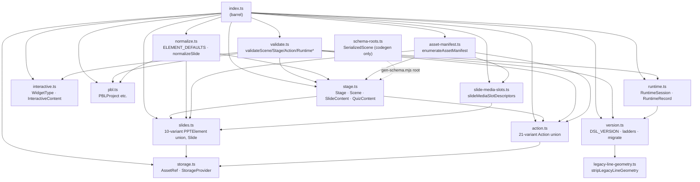
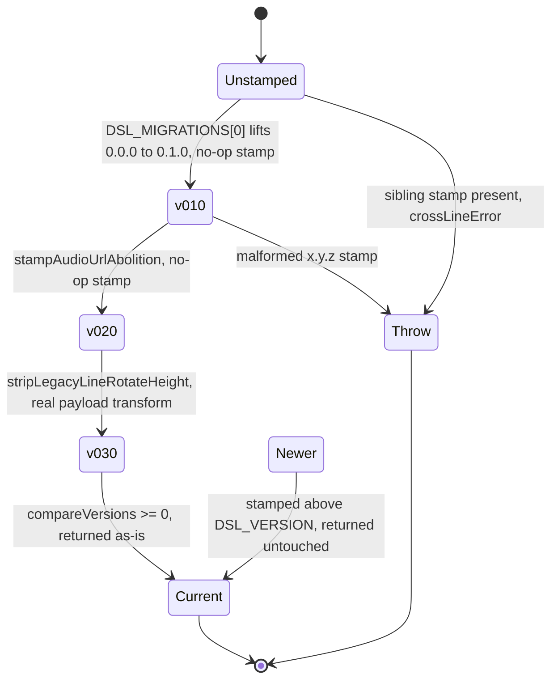
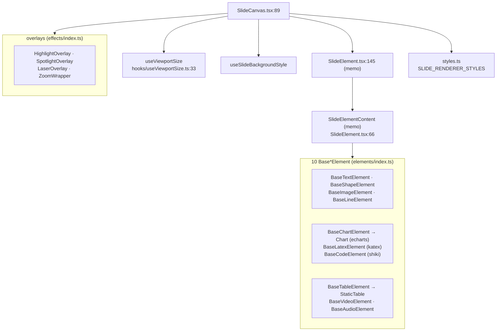

# 01a — Modules: the DSL contract and the renderer

Companion: `01b-modules.md` (editor, importer, export, vendored forks, app glue).

## 1. `@openmaic/dsl` — the contract keystone

Barrel: [`packages/@openmaic/dsl/src/index.ts:25`](packages/@openmaic/dsl/src/index.ts#L25). Eleven modules re-exported flat; `schema-roots.ts`
is deliberately **not** re-exported ([`packages/@openmaic/dsl/src/schema-roots.ts:8`](packages/@openmaic/dsl/src/schema-roots.ts#L8)) because it exists
only to give the JSON-Schema generator a concrete non-generic root.



### 1.1 `slides.ts` (995 lines) — the element model

Two runtime enums, deliberately not string-literal unions: `ShapePathFormulasKeys`
(`:27`, 21 members) and `ElementTypes` (`:51`, 10 members). The comment at `:21` explains why —
consumers compile with `isolatedModules`, under which a cross-package ambient `const enum` is TS2748,
so a *regular* enum is used to get both a value and a type.

`PPTBaseElement` (`:156`) carries `id / left / top / width / height / rotate` plus optional
`lock / groupId / link / name`. Ten variants extend it; **`PPTLineElement` is the exception**
(`:480`): `extends Omit<PPTBaseElement, 'height' | 'rotate'>`. A line's geometry is
`left/top/width` + local `start`/`end`, and `width` doubles as the SVG **stroke width** — see
[`packages/@openmaic/renderer/src/elements/line/BaseLineElement.tsx:119`](packages/@openmaic/renderer/src/elements/line/BaseLineElement.tsx#L119) (`strokeWidth={elementInfo.width}`)
and `:33` (dash array derived from `elementInfo.width`). That double duty is a real, undocumented
invariant of the contract.

Per-variant notable fields:

| Variant | Discriminant | Required beyond base | Notes |
| --- | --- | --- | --- |
| `PPTTextElement` `:210` | `'text'` | `content` (HTML string), `defaultFontName`, `defaultColor` | `vAlign?: top\|middle\|bottom` added by the merge (`:233`) |
| `PPTImageElement` `:332` | `'image'` | `fixedRatio`, `src: AssetRef` | `clip.range` is a `[[x,y],[x,y]]` percentage pair (`:289`); `softEdge` from `a:softEdge@rad` (`:356`) |
| `PPTShapeElement` `:432` | `'shape'` | `viewBox: [number,number]`, `path`, `fixedRatio`, `fill` | `pathFormula?` selects a recompute-on-resize formula; `special?` marks a path the pptx exporter must rasterize (`:422`) |
| `PPTLineElement` `:480` | `'line'` | `start`, `end`, `style`, `color`, `points` | no `height`, no `rotate`; `broken`/`broken2`/`curve`/`cubic` are mutually-exclusive control points |
| `PPTChartElement` `:531` | `'chart'` | `chartType`, `data`, `themeColors` | `ChartType` has 8 members (`:497`) |
| `PPTTableElement` `:674` | `'table'` | `outline`, `colWidths`, `cellMinHeight`, `data` | `rowHeights?` is a min-height (`:686`); `TableCell.vAlign` must be normalized from the importer's PPTist aliases `up\|mid\|down` (`:619`) |
| `PPTLatexElement` `:711` | `'latex'` | `latex` | `html` = KaTeX snapshot (new path); `path`/`color`/`strokeWidth`/`viewBox` = legacy SVG path |
| `PPTVideoElement` `:736` | `'video'` | `autoplay` | both `src?` and `mediaRef?` are `AssetRef`; merging them is explicitly out of scope (`:752`) |
| `PPTAudioElement` `:774` | `'audio'` | `fixedRatio`, `color`, `loop`, `autoplay`, `src` | `src` is a plain `string`, **not** `AssetRef` (`:780`) |
| `PPTCodeElement` `:811` | `'code'` | `language`, `lines: CodeLine[]` | lines carry stable ids `L1`, `L2`… (`:787`) so `wb_edit_code` can address them |

`Slide` (`:953`) requires `id / viewportSize / viewportRatio / theme / elements`; optional
`background / animations / turningMode / sectionTag / type / script`. `script` is the imported
speaker note (`:968`). `SlideData` (`:982`) is marked `@deprecated` and kept only for legacy payloads.

### 1.2 `stage.ts` (311 lines) — the lesson skeleton

`SceneType = 'slide' | 'quiz' | 'interactive' | 'pbl'` (`:22`) plus a frozen `SCENE_TYPES` tuple with
a **compile-time exhaustiveness pair**: `satisfies` proves every entry is valid, and the
`_SceneTypesExhaustive` conditional type at `:35` proves the converse. The same two-sided pattern is
repeated for `ACTION_TYPES` ([`action.ts:318`](packages/@openmaic/dsl/src/action.ts#L318)), `WIDGET_TYPES` ([`interactive.ts:24`](packages/@openmaic/dsl/src/interactive.ts#L24)) and
`RUNTIME_SESSION_STATUSES` ([`runtime.ts:70`](packages/@openmaic/dsl/src/runtime.ts#L70)). This is the single most load-bearing safety device in
the package: it makes "validator silently rejects a newly added variant" a build failure.

`Scene` (`:278`) is a **distributive conditional type** that binds the scene-level `type` to its
`content`:

```ts
export type Scene<
  TAction = Action,
  TContent extends { type: SceneType } = SlideContent | QuizContent,
> = TContent extends unknown
  ? SceneCore<TAction> & { type: TContent['type']; content: TContent }
  : never;
```

so `Scene` defaults to `({type:'slide';content:SlideContent} | {type:'quiz';content:QuizContent}) & SceneCore`.
`validateScene` re-checks the same binding at runtime ([`validate.ts:266`](packages/@openmaic/dsl/src/validate.ts#L266)).

`Whiteboard = Omit<Slide, 'theme'|'turningMode'|'sectionTag'|'type'>` (`:51`) — whiteboards are
slides minus the primary-canvas-only fields.

### 1.3 `action.ts` (340 lines) — the playback verb set

21 variants (measured: `ACTION_TYPES` has 21 entries, the union has 21 members). Grouped by
blocking semantics:

- `FIRE_AND_FORGET_ACTIONS` (`:261`) = `['spotlight','laser']` — also `SLIDE_ONLY_ACTIONS` (`:264`).
- `SYNC_ACTIONS` (`:267`) = the other 19; each must finish before the next runs.

Whiteboard verbs (`wb_open`, `wb_draw_{text,shape,chart,latex,table,line,code}`, `wb_edit_code`,
`wb_clear`, `wb_delete`, `wb_close`) address a whiteboard in a **1000×562 coordinate space**
(documented on `WbDrawLineAction` `:141`). `wb_edit_code` (`:180`) is line-addressed via the
`CodeLine.id`s on `PPTCodeElement`.

`SpeechAction.audioId?: AssetRef` (`:57`) plus `audioInvalidated?: boolean` (`:59`) — the latter
suppresses the legacy derived-id fallback after an edit invalidates old narration.

### 1.4 `validate.ts` (474 lines) — the structural boundary

Zero-dep, presence + discriminant + kind checks only. Deliberately a **subset** of the shipped JSON
Schema, which additionally checks value shapes (`:11`).

`ACTION_REQUIRED_FIELDS` (`:43`) is a `Record<ActionType, Record<field, FieldKind>>`, and the header
comment states it is kept in lockstep with the generated `action.schema.json` **by a test** — the
schema, derived from the TS types, is the source of truth.

Exports: `validateStage` `:299`, `validateScene` `:311`, `validateInteractiveContent` `:318`,
`validatePBLContent` `:325`, `validateAction` `:332`, `validateRuntimeSession` `:353`,
`validateRuntimeRecord` `:435`. All return `{valid:true} | {valid:false; errors: ValidationIssue[]}`
with JSON-pointer-ish paths (`:27`).

Two rules worth calling out because they are *stricter* than "structural":

- `validateRuntimeSession` rejects a stray document-line `dslVersion` on a session (`:405`) — the one
  deliberate exception to "unknown fields ignored", because a doubly-stamped envelope makes the
  cross-line guard ambiguous.
- `validateRuntimeRecord` narrows `seq` to a non-negative integer (`:447`), since `typeof x ==='number'`
  would accept `NaN`/`Infinity`/fractional and silently corrupt replay order.

### 1.5 `normalize.ts` (690 lines) — the repair pass

`ELEMENT_DEFAULTS` (`:79`) is the single source of truth for static defaults and is mirrored onto the
generated schema via `@default` JSDoc on the type fields; a test pins the two together (`:72`).

| Kind | Defaults |
| --- | --- |
| `text` | `defaultFontName: 'Microsoft YaHei'`, `defaultColor: '#333333'`, `content: ''` |
| `image` | `fixedRatio: true` |
| `shape` | `fill: '#5b9bd5'`, `fixedRatio: false` |
| `shapeText` | `content: ''`, font/colour as text, `align: 'middle'` |
| `line` | `style: 'solid'`, `color: '#333333'`, `points: ['','']` |

Semantics (`:29`): missing → default, present-but-wrong-typed → **throw**, present-and-well-formed →
untouched. Pure, non-mutating, idempotent.

Geometry-derived defaults have no static value: a shape's `viewBox` defaults to `[width, height]` and
`path` to `rectPath(width, height)` (`:472`); a line's `start` defaults to `[0,0]` and `end` to
`[width, height]` — **local** to the element origin, with a long comment at `:517` explaining that
absolute coordinates there would offset the line twice.

`strKeepEmpty` (`:406`) exists for one field: a shape's `fill`, where `''` means "no solid fill" and
the renderer maps it to `none` (`:476`). Everywhere else `''` is treated as absent.

`normalizeSlideWith({onInvalid:'drop', onDropped})` (`:632`) is the degrade-per-element policy the
importer uses; plain `normalizeSlide` (`:616`) throws. Both are unary so `slides.map(fn)` stays valid
(`:614`) — an options parameter would collide with `map`'s index argument.

### 1.6 `version.ts` (679 lines) — two independent version ladders



Key mechanics:

- `versionOf(doc, key, otherKey, legacyVersion)` (`:379`) is the single reader behind all runners,
  predicates and plain readers, so none of them can disagree on an envelope.
- **Cross-line guard**, `runLadder` case (3) (`:589`): own stamp absent + sibling stamp present →
  throw. Neither silent answer is safe (walking the ladder mangles a misrouted session; returning it
  unchanged orphans a stray-stamped document forever).
- The runtime line has **no unversioned epoch**: `RUNTIME_DSL_MIGRATIONS` ships empty (`:314`) and an
  unstamped object throws `noRuntimeEpochError` (`:488`).
- Forward compatibility: a document stamped newer than `DSL_VERSION` is returned untouched (`:617`).
- Loop-safety: `runLadder` iterates `ladder.length + 1` times and then throws "did not reach"
  (`:632`), so a cyclic registry cannot spin.
- The 0.2.0→0.3.0 step is the ladder's only real payload transform. It strips stray `rotate`/`height`
  off `line` elements ([`legacy-line-geometry.ts:64`](packages/@openmaic/dsl/src/legacy-line-geometry.ts#L64)) because the app's closed canvas schema
  (`additionalProperties: false`) rejects them, which made every agent edit to an old classroom fail
  ([`version.ts:196`](packages/@openmaic/dsl/src/version.ts#L196)).

`stripLegacyLineGeometry` returns the input **by identity** when nothing needed stripping
([`legacy-line-geometry.ts:19`](packages/@openmaic/dsl/src/legacy-line-geometry.ts#L19)) and shares every untouched subtree by reference — a cheap no-op detector.

### 1.7 Asset seam: `storage.ts`, `slide-media-slots.ts`, `asset-manifest.ts`

`AssetRef = string` ([`storage.ts:41`](packages/@openmaic/dsl/src/storage.ts#L41)), **allocated** not derived: the docstring at `:77` states that
`put` must return a *new* ref every call, because returning an existing ref for repeated bytes would
be an existence oracle over data the caller never stored. `StorageProvider` is `put`/`resolve`/`remove`
only (`:86`).

`slideMediaSlotDescriptors` ([`slide-media-slots.ts:29`](packages/@openmaic/dsl/src/slide-media-slots.ts#L29)) is a generator over the six media slot kinds
(`background-image`, `image-src`, `audio-src`, `video-src`, `video-media-ref`, `video-poster`). It
yields optional slots **even when empty** (`:17`) so writers and enumerators share one role definition.

`enumerateAssetManifest` ([`asset-manifest.ts:119`](packages/@openmaic/dsl/src/asset-manifest.ts#L119)) walks stage whiteboards → each scene (canvas,
whiteboards, speech actions) → stage `videoManifest` keys, emitting one entry per distinct
`(ref, kind)` pair in document order. Owners are keyed by **structural position**
(`scene:3:element:7`) not by user-controlled ids (`:150`), so documents with duplicate ids still
account correctly. `referenceCounts` counts logical owners, which is what byte-replacement eligibility
is decided on (`:70`).

### 1.8 Schema codegen

`packages/@openmaic/dsl/scripts/gen-schema.mjs` runs `ts-json-schema-generator` (a devDependency) over
the TS program and emits three artifacts (`:15`): `stage.schema.json`, `scene.schema.json` (root
`SerializedScene`), `action.schema.json`. `jsDoc: 'extended'` is pinned (`:36`) because the contract
now depends on `@default` tags reaching the schema. Four PBL definitions are re-opened to
`additionalProperties: true` after generation (`:24`) because historical stored PBL documents carry
app-owned runtime fields.

Consequence spelled out in [`stage.ts:104`](packages/@openmaic/dsl/src/stage.ts#L104): because every other definition is
`additionalProperties: false`, **additive fields ARE a breaking change for schema-validating
consumers** even though they do not bump `DSL_VERSION`.

## 2. `@openmaic/renderer` — read-only paint

Public surface: `packages/@openmaic/renderer/src/index.ts`. Four export paths in
[`package.json:9`](packages/@openmaic/renderer/package.json#L9): `.`, `./elements`, `./types`, `./snapshot`, plus a static `./fonts.css`.
`./types` re-exports the whole DSL ([`src/types/index.ts:4`](packages/@openmaic/renderer/src/types/index.ts#L4)) so the historical
`@openmaic/renderer/types` surface still resolves.



### 2.1 The canvas contract

`SlideCanvasProps` ([`SlideCanvas.tsx:27`](packages/@openmaic/renderer/src/SlideCanvas.tsx#L27)) — `slide` may come from the prop *or* from
`SlideRendererProvider`; if neither, the component **throws** (`:92`). Every optional prop falls back
to the context value (`:98`–`:107`), so a host can drive one canvas from either direction.

Determinism levers:

| Lever | Behaviour |
| --- | --- |
| `scale` omitted | auto-fit: `useViewportSize` measures the container and computes `fitScale`; `onScaleChange` is called only in this mode (`:128`) |
| `scale` given | fit math is bypassed; the canvas renders at `viewportSize × scale` |
| `chrome` (default `true`) | drop shadow + 0.5rem radius; snapshot pipelines pass `false` so html2canvas does not bake a 1px border into the PNG (`:78`) |
| `hiddenElementIds` | filtered out of both rendering and effect targeting (`:114`) |
| `dragOffsets` | compositor-only `translate3d` per element ([`SlideElement.tsx:181`](packages/@openmaic/renderer/src/SlideElement.tsx#L181)), never written to the document |

Stacking order is positional: `elementIndexById` maps element id → `index + 1` over the **unfiltered**
list (`:119`) and that becomes `zIndex` ([`SlideElement.tsx:170`](packages/@openmaic/renderer/src/SlideElement.tsx#L170)). So array order *is* z-order, and
hiding an element does not renumber its siblings.

### 2.2 Fit math ([`hooks/useViewportSize.ts:68`](packages/@openmaic/renderer/src/hooks/useViewportSize.ts#L68))

```
if (containerH / containerW > viewportRatio)   # container is taller than the slide
    actualW = containerW * canvasPercentage/100
    scale   = actualW / viewportSize
else
    actualH = containerH * canvasPercentage/100
    scale   = actualH / (viewportSize * viewportRatio)
```

Defaults `viewportSize = 1000`, `viewportRatio = 0.5625`, `canvasPercentage = 100` (`:38`).
Re-runs on container resize via a `ResizeObserver` (`:95`). `updateFitScale` de-dupes with
`Object.is` (`:52`) so an unchanged scale does not re-notify.

### 2.3 Geometry: authored box vs rendered box

Two coordinate helpers coexist and they do **not** agree:

- [`utils/geometry.ts:16`](packages/@openmaic/renderer/src/utils/geometry.ts#L16) `getElementPercentageGeometry` — pure, reads the *authored*
  `left/top/width/height` against `viewportSize × viewportSize*viewportRatio`, returns 0–100 space.
- [`snapshot/measure.ts:73`](packages/@openmaic/renderer/src/snapshot/measure.ts#L73) `measureSlideElementGeometry` — mounts the slide off-screen, waits for
  fonts, then reads `.element-content`'s `getBoundingClientRect()` normalized against the canvas
  container.

The divergence is real and documented at [`snapshot/measure.ts:11`](packages/@openmaic/renderer/src/snapshot/measure.ts#L11): auto-sized text has
`height: auto` plus 10px content padding ([`elements/text/BaseTextElement.tsx:63`](packages/@openmaic/renderer/src/elements/text/BaseTextElement.tsx#L63)), so a spotlight
placed on the authored box sits offset from the rendered text. The video-export compiler consumes the
measured geometry as a `GeometryProbe` and falls back to the authored box for anything unmeasured.

`utils/element.ts` holds the shared bounding-box math: `getRectRotatedRange` (`:12`) for rotated
boxes, `getElementRange` (`:43`) which special-cases lines as
`left + max(start[0], end[0])`, and `getLineElementPath` (`:72`) which turns
`broken`/`broken2`/`curve`/`cubic` into an SVG `d`.

### 2.4 Layout/measurement determinism, honestly

What is deterministic: element boxes, z-order, fit scale, path geometry, the CSS reset in
[`styles.ts:18`](packages/@openmaic/renderer/src/styles.ts#L18) (`createTextProseStyles`, shared verbatim by the static renderer and the ProseMirror
editor so both obey one layout contract).

What is **not**: anything whose height is `auto`. `BaseTextElement` renders
`height: elementInfo.vertical ? '100%' : 'auto'` on `.element-content` (`:66`), so text extent depends
on the loaded font faces. [`snapshot/measure.ts:117`](packages/@openmaic/renderer/src/snapshot/measure.ts#L117) force-loads every `(style, weight, family)` triple
actually used before awaiting `document.fonts.ready`, with a comment (`:110`) that `fonts.ready` alone
is racy — it can resolve before the off-screen render triggers a self-hosted woff2 fetch, leaving a
fallback face whose advances differ. Two `requestAnimationFrame` waits bracket the read on each side
(`:115`, `:138`) to let KaTeX's re-fit commit.

`BaseShapeElement` grows the SVG viewport to the path's coordinate bbox and offsets it back
([`elements/shape/BaseShapeElement.tsx:173`](packages/@openmaic/renderer/src/elements/shape/BaseShapeElement.tsx#L173)), capped at 4000px ([`:185`](packages/@openmaic/renderer/src/elements/shape/BaseShapeElement.tsx#L185)), because html2canvas-pro clips
SVG overflow and turned connector arcs into stubs in exported PNGs.

### 2.5 Snapshot path (`snapshot/index.ts`)

`slideToPng(slide, options)` (`:90`) mounts the slide in an off-screen `position:absolute; left:-99999px`
container sized exactly to the slide so the fit math collapses to 1:1 (`:107`), then rasterizes.
Strategy is native-paint-first (`:11`): `html-to-image` serializes into an SVG `<foreignObject>` that
the same Chrome engine paints, with web fonts inlined up front via `getFontEmbedCSS` plus a
pre-generated `KATEX_FONT_EMBED_CSS`; html2canvas-pro is the fallback when the embed misses KaTeX faces
or a cross-origin image taints the canvas.
