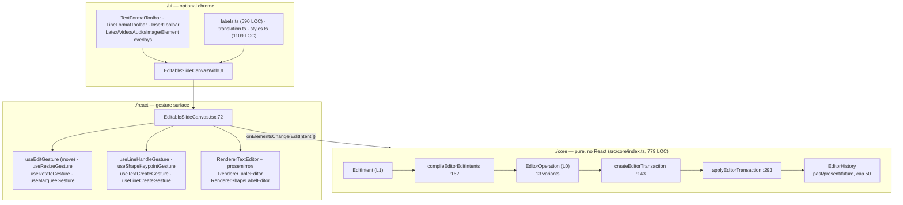
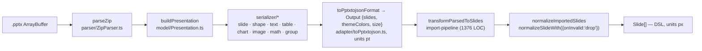
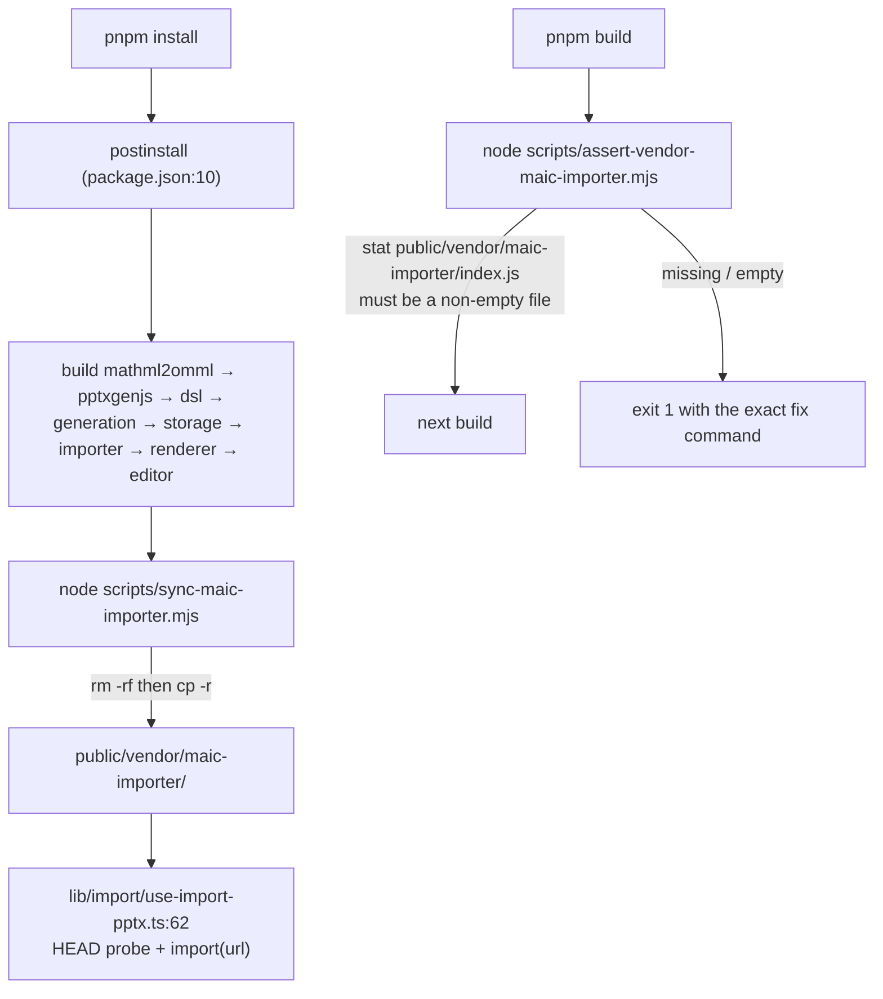

# 01b — Modules: editor, importer, export, vendored forks, app glue

Companion: `01a-modules.md` (DSL, renderer).

## 3. `@openmaic/editor` — mutation

Three export paths ([`packages/@openmaic/editor/package.json:8`](packages/@openmaic/editor/package.json#L8)): `./core` (also the default `.`),
`./react`, `./ui`. The split is a hard layering rule stated in
[`packages/@openmaic/editor/src/react/types.ts:18`](packages/@openmaic/editor/src/react/types.ts#L18):

- **L0** — the canonical change representation, which "belongs in `@openmaic/dsl`" (today it lives in
  `editor/src/core`).
- **L1** — `EditIntent`, the bounded UI gesture vocabulary the canvas emits.
- **L2** — the agent tool surface, which "is expected to churn and lives outside this package"
  (it does: `lib/server/agent-runtime/`).

### 3.1 The op kernel (`src/core/index.ts`)

`EditorOperation` (`:88`) — 13 variants: `slide.update`, `element.add`, `element.update`,
`element.updateMany`, `element.delete`, `element.deleteMany`, `element.reorder`, `element.duplicate`,
`element.align`, `element.removeProps`, `text.updateContent`, `shape.updateTextContent`,
`table.updateCell`.

`EditIntent` (`:119`) — 10 variants, a *coarser* vocabulary. `compileEditorEditIntents` (`:162`) is the
only translation point. Notable behaviour:

- It advances a **private working snapshot** between intents (`:167`, `append` at `:169`), so a batch
  is deterministic: intent *n+1* is compiled against the document as intent *n* left it.
- Intents naming a nonexistent element are **silently dropped** (`:185`, `:191`, `:200`, `:210`).
- `element.delete` with a list always compiles to `element.deleteMany` (`:201`).
- `element.reorder` translates `'front'|'back'|'forward'|'backward'` into an absolute index
  (`resolveReorderIndex`, `:404`).
- `element.align`'s `'center'`/`'middle'` are renamed to `'horizontal'`/`'vertical'` (`:217`).
- `text.updateContent` routes to `text.updateContent` or `shape.updateTextContent` by the element's
  actual type (`:233`).

The op layer, unlike the intent layer, is **strict**: `applyOperation` (`:424`) throws on a missing
element (`missingElement`, `:661`), a duplicate id on add (`:434`), an idMap gap or collision on
duplicate (`:477`), a non-text/non-shape/non-table target, and a missing cell (`:544`).

Three validation tables guard patches:

| Table | Line | Enforces |
| --- | --- | --- |
| `IMMUTABLE_ELEMENT_PROPERTIES = {id, type}` | `:9` | no patch may set or remove them (`:554`, `:501`) |
| `IMMUTABLE_SLIDE_PROPERTIES = {id}` + explicit `elements`/`animations` ban | `:10`, `:567` | `slide.update` is metadata-only |
| `REQUIRED_ELEMENT_FIELD_KINDS` per type | `:27` | a required field cannot be set to `undefined` or a wrong kind (`:604`), nor removed (`:506`) |

`REQUIRED_ELEMENT_FIELD_KINDS.line` (`:45`) omits `height` and `rotate`, matching the DSL's
`Omit<PPTBaseElement, 'height'|'rotate'>`. `matchesFieldKind` narrows `'number'` to
`Number.isFinite` (`:636`), so `NaN` geometry is rejected.

Atomicity: `applyToContent` (`:393`) clones, applies every op to the clone, and returns the **original
reference** when a `JSON.stringify` comparison shows no change (`:401`). A throw happens before the
clone is returned, so callers never see a partially committed document (`:397`). `structuredClone` is
the clone primitive (`:777`).

### 3.2 Undo/redo

`EditorHistory = {past, present, future}` over whole `SlideContent` snapshots (`:137`), capped at
`MAX_EDITOR_HISTORY = 50` (`:3`, `capHistory` `:773`). Three history modes (`:78`):

| Mode | Effect |
| --- | --- |
| `'record'` | push `present` onto `past`, clear `future` (`:326`) |
| `'neutral'` | replace `present`, clear `future`, **no** new undo step (`:325`) |
| `'navigate'` | search `past` then `future` for a snapshot matching the target and *move the cursor* instead of branching (`:300`–`:322`) |

`'navigate'` exists for text/table/shape-label content edits: `matchesNavigationTarget` (`:346`) says a
snapshot matches when it deep-equals the target *or* when every operation's post-state is already
present in it. That is what lets ProseMirror's own undo and the document history stay in step instead
of each generating a separate entry.

### 3.3 The React surface

`EditableSlideCanvasProps` ([`src/react/types.ts:86`](packages/@openmaic/editor/src/react/types.ts#L86)) is a **controlled** contract: the host owns
`slide`, `selection`, and undo. Selection is id-based, not position-based, "so it survives document
edits" (`:47`). `EMPTY_SELECTION` is `Object.freeze`d (`:72`).

`EditableSlideCanvas` renders the read-only v1 `SlideCanvas` untouched and layers a sibling overlay at
the same origin ([`EditableSlideCanvas.tsx:60`](packages/@openmaic/editor/src/react/EditableSlideCanvas.tsx#L60)); both read the **same** `fitScale` so overlay and
elements stay aligned at auto-fit (`:63`). The hit layer is only mounted when a mutation or selection
callback is supplied — with neither, the canvas is inert (`:68`).

Gesture → intent contract: one completed gesture emits **exactly one** intent (or one batch), never one
per animation frame, so it maps 1:1 onto one host undo entry ([`src/react/types.ts:36`](packages/@openmaic/editor/src/react/types.ts#L36)). Multi-element
moves collapse into a single `element.updateMany` ([`src/react/core/intent.ts:38`](packages/@openmaic/editor/src/react/core/intent.ts#L38)); single-element moves
stay on `element.update` for host backward compatibility.

`resizeIntent` ([`src/react/core/intent.ts:19`](packages/@openmaic/editor/src/react/core/intent.ts#L19)) deliberately emits **box props only**. Kind-specific
content that must track the box — a shape's `path`/`viewBox`, a table's `cellMinHeight`, an image's
clip — is explicitly *not* recomputed; the host post-processes. That is a documented seam, not an
oversight, and it is where a shape resized in the packaged editor can diverge from the same shape
resized in the legacy canvas.

### 3.4 ProseMirror integration (packaged)

`packages/@openmaic/editor/src/react/text/prosemirror/` — schema (`schema/nodes.ts`, `schema/marks.ts`),
plugins (`inputrules`, `keymap`, `placeholder`), commands (`replaceText`, `setListStyle`, `setTextAlign`,
`setTextIndent`, `toggleList`), plus `document.ts` and `utils.ts`.

`initTextEditor(element, content, options)` ([`prosemirror/index.ts:9`](packages/@openmaic/editor/src/react/text/prosemirror/index.ts#L9)) builds an `EditorState` from
`createTextDocument(content)` and `buildPlugins(textSchema, options)`.

`createTextDocument` ([`prosemirror/document.ts:10`](packages/@openmaic/editor/src/react/text/prosemirror/document.ts#L10)) has a two-branch parse keyed on
`HTML_MARKUP_PATTERN = /<\/?[a-z][^>]*>|<![^>]*>/i` (`:8`): markup present → `template.innerHTML = html`
and parse normally; markup absent → decode entities, split on `/\r\n?|\n/`, insert explicit ` `
between lines. That mirrors the renderer's `preservesPlainTextLineBreaks`
([`renderer/src/utils/richText.ts:8`](packages/@openmaic/renderer/src/utils/richText.ts#L8)), so a plain-text `content` round-trips the same way in the static
paint and in the editor. `serializeTextDocument` (`:29`) is the inverse via `DOMSerializer`.

`TextEditCommand` ([`react/text/types.ts:3`](packages/@openmaic/editor/src/react/text/types.ts#L3)) is a 3-arm union — no-value marks
(`bold|em|underline|strikethrough|subscript|superscript|blockquote|code|clear`), required-value commands
(`fontname|fontsize|forecolor|backcolor|align|indent|textIndent|insert|replace`), and optional-value
commands (`fontsize-add|fontsize-reduce|bulletList|orderedList|link`). `executeTextCommand`
([`react/text/commandExecutor.ts:82`](packages/@openmaic/editor/src/react/text/commandExecutor.ts#L82)) dispatches them onto a ProseMirror `EditorView`.

Two behaviours worth naming: `applyMark` calls `autoSelectAll(view)` first (`:22`), so a font/colour
change with a collapsed cursor applies to the whole box; and `fontsize`/`forecolor` additionally call
`setListStyle` (`:107`, `:121`) so list markers inherit the size/colour.

`TextEditorController` ([`react/text/types.ts:53`](packages/@openmaic/editor/src/react/text/types.ts#L53)) is the imperative handle the host gets:
`focus / flush / discard / execute / getHTML`, with `kind?: 'element' | 'table-cell'` distinguishing a
cell editor from an element-body editor.

## 4. `@openmaic/importer` — `.pptx` → DSL

Two stacked pipelines. The lower one is the vendored `pptxtojson` fork (`parse()`); the upper one is
OpenMAIC's addition (`importPptx` / `parsedToSlides`).

Layer responsibilities are stated in [`packages/@openmaic/importer/DESIGN.md:23`](packages/@openmaic/importer/DESIGN.md#分层职责): `parser` does zip +
XML + rels + units and no OOXML semantics; `model` resolves geometry/structure and **no visual style**;
`serializer` combines theme/master/layout context into JSON elements and never touches the zip;
`adapter` owns the outward JSON type. Dependency direction is one-way
`adapter → serializer → model → parser`.

### 4.1 Units

`parser/units.ts` — `emuToPx` (÷914400 ×96), `emuToPt` (÷12700), `angleToDeg` (÷60000),
`pctToDecimal` (÷100000), `hundredthPtToPt` (÷100), `ptToPx` (×96/72). The outward `Output` is in **pt**
([`DESIGN.md:105`](packages/@openmaic/importer/DESIGN.md#单位约定)); the DSL transform multiplies by `ctx.ratio = 96/72` to get px
(`import-pipeline/mockContext.ts`, [`transformParsedToSlides.ts:459`](packages/@openmaic/importer/src/import-pipeline/transformParsedToSlides.ts#L459)).

`detectUnit` ([`units.ts:47`](packages/@openmaic/importer/src/parser/units.ts#L47)) is a heuristic: `|value| > 20000` → EMU, and `smartToPx` uses it. Right on
real decks, silently wrong on a pathological one, with no provenance flag to consult instead.

### 4.2 `transformParsedToSlides` (1 376 lines)

Signature at `:367`. Per-deck setup: `ratio`, `theme`, `shapeList` and `viewportWidth` come from
`ImportContext`; `slideViewportRatio = size.height / size.width` with a `0.5625` fallback (`:381`); one
`SlideTheme` is resolved once for the whole deck (`:382`), preferring the parsed `themeColors` over the
context theme.

Per element the transform mutates the parsed element's box into px in place (`:459`) and then branches
on `el.type`: `text` (`:463`), `image` (`:619`), `math` (`:719`), `audio` (`:780`), `video` (`:819`),
`shape` (`:875`), `table` (`:1018`), `chart` (`:1248`), `group` (`:1326`), `diagram` (`:1358`).

Shape handling is the interesting part (`:875`):

1. `shapType === 'line'` or `/Connector/` → `parseLineElement` → a `PPTLineElement` (`:876`).
2. Otherwise look up `shapeList.find(item => item.pptxShapeType === el.shapType)` (`:880`) — the
   OpenMAIC shape pool, 26 entries with a `pptxShapeType` mapping
   ([`src/openmaic/configs/shapes.ts:278`](packages/@openmaic/importer/src/openmaic/configs/shapes.ts#L278), `SHAPE_LIST`).
3. If the pool entry has a `pathFormula`, prefer the **parser's** already-computed path when it has no
   `NaN` (`:961`), because the formula's `defaultValue` would discard non-default `adj` values — the
   comment names `roundRect@adj=50%` rendering as a square instead of a circle (`:959`). `viewBox` is
   then pinned to `[originWidth, originHeight]` (the pt values) so the path fills the CSS box (`:970`).
4. `shapType === 'custom'` → `special = true` and the raw path, with `viewBox` from
   `getSvgPathRange` (`:985`). `NaN` in the path is patched to `0` and zero dimensions bumped to `0.1`
   (`:986`).

Preset machinery, measured (`grep -c`):

| Registry | Count | File |
| --- | --- | --- |
| `presetShapes.set(...)` — OOXML preset geometry generators | 154 | [`src/shapes/presets.ts:149`](packages/@openmaic/importer/src/shapes/presets.ts#L149) |
| `multiPathPresets.set(...)` — multi-sub-path presets | 44 | same file, registry at `:4497` |
| `presetOverlays.set(...)` — 3D top faces etc. | 1 (`can`) | same file, registry at `:4430`, entry at `:4432` |
| `SHAPE_PATH_FORMULAS` — resize-time recompute formulas | 21 | [`src/openmaic/configs/shapes.ts:30`](packages/@openmaic/importer/src/openmaic/configs/shapes.ts#L30) |
| `SHAPE_LIST` entries carrying `pptxShapeType` | 26 | [`src/openmaic/configs/shapes.ts:278`](packages/@openmaic/importer/src/openmaic/configs/shapes.ts#L278) |

`getPresetShapePath` ([`presets.ts:6557`](packages/@openmaic/importer/src/shapes/presets.ts#L6557)) lower-cases the OOXML `prst` name for lookup, special-cases
`textNoShape` → `''`, and **falls back to a rectangle with a `console.warn`** for an unknown preset.
That warn is the only signal a shape silently became a box.

### 4.3 Known fidelity loss (from the code, not speculation)

| Loss | Evidence |
| --- | --- |
| Unknown OOXML preset → rectangle | [`presets.ts:6572`](packages/@openmaic/importer/src/shapes/presets.ts#L6572) `console.warn('Unknown preset shape: ...')` then `M0,0 L…Z` |
| `custom` geometry with unsupported path commands → flagged `special`, exported later as an image | DSL [`slides.ts:422`](packages/@openmaic/dsl/src/slides.ts#L422) describes `special`; importer sets it at [`transformParsedToSlides.ts:991`](packages/@openmaic/importer/src/import-pipeline/transformParsedToSlides.ts#L991) |
| An element the DSL cannot normalize is **dropped** | [`import-pipeline/index.ts:101`](packages/@openmaic/importer/src/import-pipeline/index.ts#L101) `normalizeSlideWith({onInvalid:'drop'})`, warning at [`:104`](packages/@openmaic/importer/src/import-pipeline/index.ts#L104) |
| Group transforms are baked, not preserved | [`DESIGN.md:96`](packages/@openmaic/importer/DESIGN.md#group-坐标烘焙) — `flip`/`rotation` folded into children, emitted group is always `rotate:0, isFlipH/V:false` |
| Curved connectors approximated to a single cubic Bézier | [`transformParsedToSlides.ts:119`](packages/@openmaic/importer/src/import-pipeline/transformParsedToSlides.ts#L119) docstring for `parseCubicFromPath` |
| Arrow heads inferred from path shape, not from OOXML attributes | `detectArrowsFromPath` `:168`; the comments at `:178` and `:193` describe two classes of arrow the earlier version missed |
| Media without an `upload` callback stays base64 (images) or a tab-scoped `blob:` URL (a/v) | [`import-pipeline/index.ts:41`](packages/@openmaic/importer/src/import-pipeline/index.ts#L41) |
| Failed media upload leaves the original base64 in place, silently | [`transformParsedToSlides.ts:416`](packages/@openmaic/importer/src/import-pipeline/transformParsedToSlides.ts#L416) `console.error('背景图片上传失败:', error)` |
| Chart types collapse to the DSL's 8 `ChartType`s; 3-D variants map to their 2-D peers | [`transformParsedToSlides.ts:1269`](packages/@openmaic/importer/src/import-pipeline/transformParsedToSlides.ts#L1269)–[`:1302`](packages/@openmaic/importer/src/import-pipeline/transformParsedToSlides.ts#L1302) (`bar3DChart`, `line3DChart`, `area3DChart`, `pie3DChart`, `bubbleChart`) |

Server-side import caps: `MAX_IMPORT_SLIDES = 80`, `MAX_IMPORT_BYTES = 8 MiB`,
`PARSE_PPTX_TIMEOUT_MS = 90_000` ([`lib/server/agent-runtime/import-pptx.ts:41`](lib/server/agent-runtime/import-pptx.ts#L41)).

## 5. Export

### 5.1 DSL → `.pptx` (`lib/export/use-export-pptx.ts`, 1 443 lines)

`buildPptxBlob` (`:497`) walks slides and branches per element type, mirroring the importer in reverse:
`text` `:583`, `image` `:623`, `shape` `:690`, `line` `:815`, `chart` `:842`, `table` `:942`,
`latex` `:1036`, `video`/`audio` `:1101`. Helper layer: `formatColor` (`:50`, tinycolor →
`{alpha, color}`), `formatHTML` (`:64`, the slide's HTML `content` → `pptxgen.TextProps[]` via the
local `html-parser`), `formatPoints` (`:223`), `getShadowOption` (`:267`), `getOutlineOption` (`:328`),
`getLinkOption` (`:340`).

LaTeX is the one place with a two-tier strategy (`:1036`): try native OMML via `latexToOmml`, which
gives an **editable** PowerPoint formula through the vendored `addFormula`; on failure fall back to
rasterizing `el.path` as an inline SVG image (`:1056`), which is not editable. Font size is estimated
from `\\` line-break count: `fontSize = round(boxHeightPt / (lines * 3))` (`:1043`).

Media embedding: everything is fetched and converted to base64 (`:1119`) because `blob:` and remote
URLs do not work in an offline `.pptx`. Extension resolution order is URL suffix → `el.ext` →
`mp4`/`mp3` (`:1139`).

Reference-parity guards, unusual and worth knowing: `derivePptxMediaReferenceSet` (`:437`),
`isPptxManifestForeignRef` (`:460`), `assertPptxMediaReferenceParity` (`:473`) — the PPTX path walks
slide elements directly rather than the asset manifest, so these assert the two enumerations agree.

`buildResourcePackZip` (`:1243`) is the sidecar archive; `useExportPPTX` (`:1300`) is the React hook.

### 5.2 LaTeX → OMML (`lib/export/latex-to-omml.ts`)

`latexToOmml(latex, fontSize?)` (`:70`): `temml.renderToString` → `stripUnsupportedMathML` → `mml2omml`
→ `postProcessOmml`. Three post-processing steps (`:41`), all regex-based on the OMML string:
(1) strip `xmlns:w` (DOCX-only, invalid in PPTX) and redundant `xmlns:m`; (2) inject `<a:rPr>` with
`Cambria Math` before every `<m:t>` inside `<m:r>`; (3) fill empty `<m:ctrlPr/>` with the same `<a:rPr>`.
`stripUnsupportedMathML` (`:11`) removes exactly one tag today — `mpadded` — by deleting the open and
close tags and keeping the inner content. Returns `null` on any throw, logged as a warning (`:78`).

### 5.3 HTML side

`lib/export/html-parser/` is a 5-file TypeScript rewrite of himalaya ([`index.ts:1`](lib/export/html-parser/index.ts#L1)):
`lexer.ts` (274) → `parser.ts` (136) → `format.ts` (47) → `stringify.ts` (30), types in `types.ts`.
`toAST(str)` ([`index.ts:9`](lib/export/html-parser/index.ts#L9)) is the only entry the pptx exporter uses; `toHTML` is the inverse.

The "DSL → HTML" export is **not** a slide-to-HTML renderer. It is two things:
`inlineSceneContent` ([`lib/export/use-export-classroom.ts:44`](lib/export/use-export-classroom.ts#L44)), which for `interactive` scenes only
rewrites the scene's `html` with every external asset inlined (`inlineHtmlAssets`,
`lib/export/inline-assets.ts`, 727 LOC; inventory in `html-asset-inventory.ts`, importmap handling in
`inline-assets-importmap.ts`, CSS in `css-asset-parser.ts`); and `buildClassroomExportZip` (`:80`), the
classroom archive (`classroom-zip-types.ts` / `classroom-zip-utils.ts`) serializing stage + scenes + a
media index derived from `enumerateAssetManifest`. It drops `Stage.whiteboard` refs deliberately
(`:110`) because archiving their bytes would create an unreconstructable orphan.

`lib/edit/html-edit.ts` is a **vendored** copy of the pi coding agent's `edit` tool apply core
(`:5`), used for exact-text edits on interactive HTML. Vendored rather than imported because the
upstream package only exports its root index and pulling the `edit` tool would drag in a terminal UI
plus a CLI tree (`:8`). Matching is exact-first then fuzzy (NFKC, smart quotes, Unicode dashes,
trailing whitespace) against the **original** content, not after earlier edits (`:14`).

## 6. Vendored forks

| Fork | Version | Why vendored | Local delta |
| --- | --- | --- | --- |
| `packages/pptxgenjs` | 4.0.1 | needs an OMML formula primitive upstream does not have | `addFormulaDefinition` ([`src/gen-objects.ts:669`](packages/pptxgenjs/src/gen-objects.ts#L669)), `Slide.addFormula` ([`src/slide.ts:253`](packages/pptxgenjs/src/slide.ts#L253)), `SLIDE_OBJECT_TYPES.formula`, `FormulaProps` in [`types/index.d.ts:2664`](packages/pptxgenjs/types/index.d.ts#L2664) |
| `packages/mathml2omml` | 0.5.0 | upstream bug in the text-container check | `a3f88d53` — `textContainerNames.includes[arr[level].name]` → `.includes(...)` in [`src/parse-stringify/parse.js:79`](packages/mathml2omml/src/parse-stringify/parse.js#L79) |
| `packages/@openmaic/importer` | 0.1.3 | a fork of `pptxtojson` that grew the whole DSL transform | the entire `src/import-pipeline/` and `src/openmaic/` trees; still lists npm `pptxtojson@^1.11.0` as a dependency for the parsed-JSON **types** ([`src/import-pipeline/transformParsedToSlides.ts:1`](packages/@openmaic/importer/src/import-pipeline/transformParsedToSlides.ts#L1)) |

The first two are wired as `"workspace:*"` in the root `package.json` (`:114`, `:129`) and built by the
root `postinstall` before anything else ([`package.json:10`](package.json#L10)).

### 6.1 The vendor guard scripts

The importer's built bundle cannot be bundled by Turbopack: `pdfjs-dist` (a transitive dependency) uses
dynamic `require()` patterns Turbopack rejects with a hard "Module not found: Can't resolve `<dynamic>`"
([`scripts/sync-maic-importer.mjs:6`](scripts/sync-maic-importer.mjs#L6)). So the app loads it from a **static URL** instead.

`sync-maic-importer.mjs` refuses to run if `packages/@openmaic/importer/dist` is absent (`:20`) and
prints the build command. `assert-vendor-maic-importer.mjs` requires the entry to be a **non-empty
file** (`:22`) — it exists because a skipped sync makes the URL 404, the 404 HTML gets parsed as JS,
and the user sees an opaque `SyntaxError` (`:8`). The client repeats the same check at runtime with a
`HEAD` probe so it can raise `PARSER_NOT_DEPLOYED` instead ([`lib/import/use-import-pptx.ts:70`](lib/import/use-import-pptx.ts#L70)).

## 7. App glue (the legacy, currently-default path)

| Module | Role | Note |
| --- | --- | --- |
| `components/slide-renderer/` (84 files, 12 097 LOC) | the in-app renderer + editable canvas | `Editor/RendererScreenCanvas.tsx` is the packaged-renderer adapter; `Editor/Canvas/` is the legacy editable canvas (`useScaleElement.ts` 695 LOC, `useDragElement.ts` 404 LOC) |
| `components/slide-renderer/components/element/ProsemirrorEditor.tsx` (554 LOC) | the legacy live text editor | drives `lib/prosemirror/` |
| `components/slide-renderer/use-resolved-slide.ts` (234 LOC) | resolves every media slot to a renderable URL **before** paint | `resolveSlideMediaState` returns a *new* `Slide` whose image/video `src` are lease-resolved URLs |
| `lib/prosemirror/` (16 files, 1 152 LOC) | the app's ProseMirror schema/plugins/commands | near-duplicate of the packaged one; [`active-editor-registry.ts:28`](lib/prosemirror/active-editor-registry.ts#L28) is the additive bridge letting chrome run text commands without importing renderer internals |
| `lib/edit/slide-ops.ts` (359 LOC) | the app's op kernel | immer-based, 11 op variants, `MAX_HISTORY = 50`; **less strict** than the package (missing ids are silent no-ops at `:184`, `:198`) |
| `lib/edit/slide-edit-elements.ts` (231 LOC) | element factories + `renderLatexElementHtml` (`:154`) | KaTeX `displayMode`, `throwOnError: false`, returns `null` only on an unexpected throw |
| `lib/edit/slide-schema.ts` | `migrateSlideContent` / `migrateScene` | the third version line; forward-compatible (`:31`) |
| `components/edit/surfaces/slide/slide-edit-session.ts` (186 LOC) | zustand session holding one `EditorHistory` | `writeThrough` (`:79`) is the single point where an edit reaches `useStageStore` |
| `components/canvas/` (3 files, 1 203 LOC) | canvas toolbar + element-pick overlay | `slide-element-pick-overlay.tsx` (358 LOC) is the agent element-reference picker |

[`lib/server/agent-runtime/course-edit/apply.ts:122`](lib/server/agent-runtime/course-edit/apply.ts#L122) states the server agent op union and the browser
editor surface are independent on purpose — but that covers the *server* split, not the two
browser-side kernels or the two ProseMirror stacks. See `06-quality-and-metrics.md` §3.
