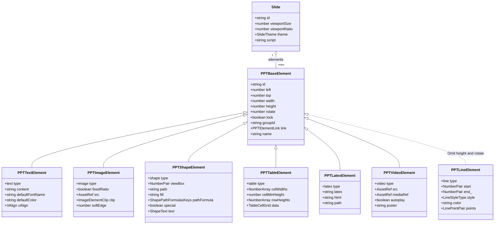
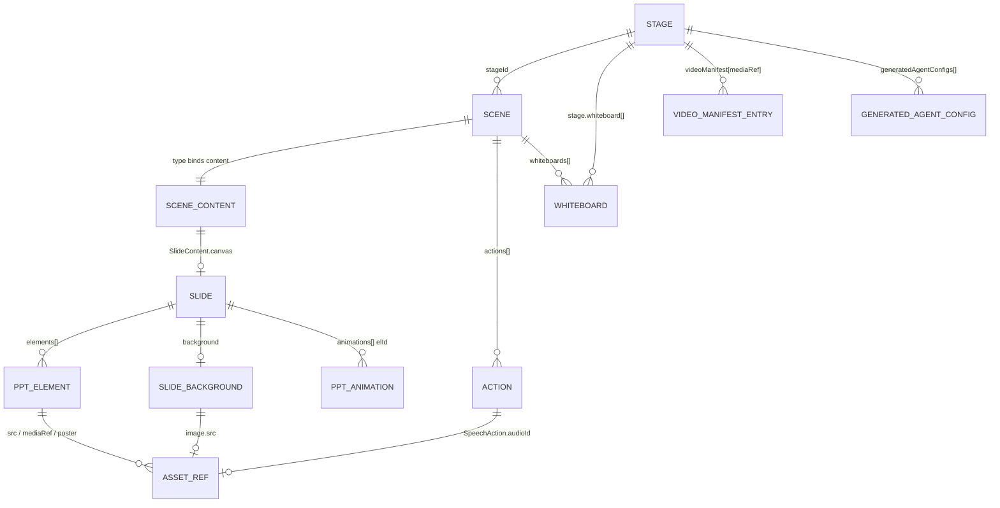

# 02a — Interfaces: the element model and the lesson skeleton

Everything below is copied from the source at the cited line. Elisions inside a quoted block are
marked `// …`; nothing is paraphrased.

Continued in `02b-interfaces.md` (actions, validation, versioning, the asset seam) and
`02c-interfaces.md` (renderer, editor, importer, export, agent ops).

## 1. The element model

[`packages/@openmaic/dsl/src/slides.ts:156`](packages/@openmaic/dsl/src/slides.ts#L156)

```ts
export interface PPTBaseElement {
  id: string;
  left: number;
  top: number;
  lock?: boolean;
  groupId?: string;
  width: number;
  height: number;
  rotate: number;
  link?: PPTElementLink;
  name?: string;
}
```

[`packages/@openmaic/dsl/src/slides.ts:480`](packages/@openmaic/dsl/src/slides.ts#L480) — the one variant that drops base fields:

```ts
export interface PPTLineElement extends Omit<PPTBaseElement, 'height' | 'rotate'> {
  type: 'line';
  start: [number, number];
  end: [number, number];
  /** @default "solid" */
  style: LineStyleType;
  /** @default "#333333" */
  color: string;
  /** @default ["", ""] */
  points: [LinePoint, LinePoint];
  shadow?: PPTElementShadow;
  broken?: [number, number];
  broken2?: [number, number];
  curve?: [number, number];
  cubic?: [[number, number], [number, number]];
}
```

[`packages/@openmaic/dsl/src/slides.ts:820`](packages/@openmaic/dsl/src/slides.ts#L820)

```ts
export type PPTElement =
  | PPTTextElement
  | PPTImageElement
  | PPTShapeElement
  | PPTLineElement
  | PPTChartElement
  | PPTTableElement
  | PPTLatexElement
  | PPTVideoElement
  | PPTAudioElement
  | PPTCodeElement;
```

[`packages/@openmaic/dsl/src/slides.ts:953`](packages/@openmaic/dsl/src/slides.ts#L953)

```ts
export interface Slide {
  id: string;
  viewportSize: number;
  viewportRatio: number;
  theme: SlideTheme;
  elements: PPTElement[];
  background?: SlideBackground;
  animations?: PPTAnimation[];
  turningMode?: TurningMode;
  sectionTag?: SectionTag;
  type?: SlideType;
  /** @since-merge importer  Speaker notes carried over from the source .pptx. */
  script?: string;
}
```

Supporting shapes referenced above, all in the same file: `Gradient` (`:78`),
`PPTElementShadow` (`:97`), `PPTElementOutline` (`:113`), `PPTElementLink` (`:128`),
`ShapeText` (`:380`), `ImageElementFilters` (`:277`), `ImageElementClip` (`:298`),
`TableCellStyle` (`:566`), `TableCellBorder` (`:582`), `TableCell` (`:601`), `TableTheme` (`:651`),
`ChartData` (`:504`), `ChartOptions` (`:499`), `CodeLine` (`:791`), `PPTAnimation` (`:850`),
`SlideBackground` (`:877`), `SlideTheme` (`:916`).



Diagram reading notes: each variant's first member is written `+<literal> type`, i.e. the member named
`type` whose value is that string literal. `NumberPair` = `[number, number]`, `NumberArray` =
`number[]`, `LinePointPair` = `[LinePoint, LinePoint]`, `TableCellGrid` = `TableCell[][]`, `VAlign` =
`'top' | 'middle' | 'bottom'`. `end_` is `PPTLineElement.end` (renamed only to keep the member list
unambiguous). The dashed inheritance arrow on `PPTLineElement` marks the `Omit`, not a different
relationship kind. `PPTChartElement`, `PPTAudioElement` and `PPTCodeElement` are omitted from the
diagram for space; their signatures are at [`slides.ts:531`](packages/@openmaic/dsl/src/slides.ts#L531), [`:774`](packages/@openmaic/dsl/src/slides.ts#L774) and [`:811`](packages/@openmaic/dsl/src/slides.ts#L811).

## 2. Lesson skeleton

[`packages/@openmaic/dsl/src/stage.ts:228`](packages/@openmaic/dsl/src/stage.ts#L228) and [`:278`](packages/@openmaic/dsl/src/stage.ts#L278)

```ts
export interface SceneCore<TAction = Action> {
  id: string;
  stageId: string; // ID of the parent stage (for data integrity checks)
  title: string;
  order: number; // Display order
  actions?: TAction[];
  whiteboards?: Slide[];
  multiAgent?: MultiAgentConfig;
  createdAt?: number;
  updatedAt?: number;
}

export type Scene<
  TAction = Action,
  TContent extends { type: SceneType } = SlideContent | QuizContent,
> = TContent extends unknown
  ? SceneCore<TAction> & { type: TContent['type']; content: TContent }
  : never;
```

[`packages/@openmaic/dsl/src/stage.ts:184`](packages/@openmaic/dsl/src/stage.ts#L184), [`:211`](packages/@openmaic/dsl/src/stage.ts#L211), [`:22`](packages/@openmaic/dsl/src/stage.ts#L22), [`:51`](packages/@openmaic/dsl/src/stage.ts#L51)

```ts
export interface SlideContent {
  type: 'slide';
  schemaVersion?: number;
  canvas: Slide;
}
export interface QuizContent {
  type: 'quiz';
  questions: QuizQuestion[];
}
export type SceneType = 'slide' | 'quiz' | 'interactive' | 'pbl';
export type Whiteboard = Omit<Slide, 'theme' | 'turningMode' | 'sectionTag' | 'type'>;
```

[`packages/@openmaic/dsl/src/stage.ts:141`](packages/@openmaic/dsl/src/stage.ts#L141) — the top-level container:

```ts
export interface Stage {
  id: string;
  name: string;
  description?: string;
  createdAt: number;
  updatedAt: number;
  languageDirective?: string;
  style?: string;
  whiteboard?: Whiteboard[];
  videoManifest?: VideoManifest;
  agentIds?: string[];
  generatedAgentConfigs?: GeneratedAgentConfig[];
  interactiveMode?: boolean;
  taskEngineMode?: boolean;
}
```

[`packages/@openmaic/dsl/src/interactive.ts:51`](packages/@openmaic/dsl/src/interactive.ts#L51)

```ts
export type InteractiveContent<TWidgetConfig extends WidgetConfigBase = WidgetConfigBase> = {
  type: 'interactive';
  url?: string;
  html?: string;
  widgetType?: WidgetType;
  widgetConfig?: TWidgetConfig;
};
```

[`packages/@openmaic/dsl/src/schema-roots.ts:23`](packages/@openmaic/dsl/src/schema-roots.ts#L23) — the codegen-only root, intentionally not exported
from `index.ts`:

```ts
export type SerializedScene =
  | Scene<Action, SlideContent>
  | Scene<Action, QuizContent>
  | Scene<Action, InteractiveContent>
  | Scene<Action, PBLContent>;
```



The `SCENE ||--|| SCENE_CONTENT` edge is the invariant `Scene`'s distributive conditional enforces at
the type level and `validateScene` re-checks at runtime ([`validate.ts:266`](packages/@openmaic/dsl/src/validate.ts#L266)): a `slide`-typed scene must
carry `SlideContent`, a `quiz`-typed scene `QuizContent`, and so on for all four kinds.
