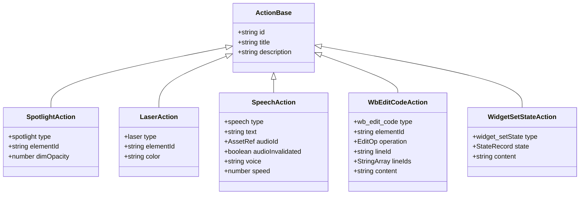
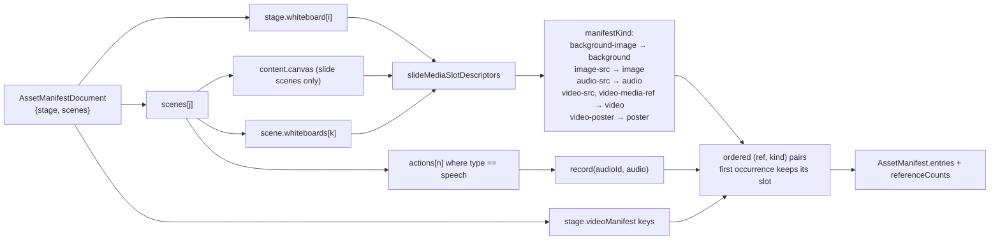

# 02b — Interfaces: actions, validation, versioning, asset seam

Continues `02a-interfaces.md`. Same rule: everything is copied verbatim from the source at the cited
line; elisions inside a quoted block are marked `// …`.

## 1. The action union

`packages/@openmaic/dsl/src/action.ts:22`, `:235`, `:258`

```ts
export interface ActionBase {
  id: string;
  title?: string;
  description?: string;
}

export type Action =
  | SpotlightAction | LaserAction | PlayVideoAction | SpeechAction
  | WbOpenAction | WbDrawTextAction | WbDrawShapeAction | WbDrawChartAction
  | WbDrawLatexAction | WbDrawTableAction | WbDrawLineAction | WbClearAction
  | WbDeleteAction | WbCloseAction | WbDrawCodeAction | WbEditCodeAction
  | DiscussionAction | WidgetHighlightAction | WidgetSetStateAction
  | WidgetAnnotationAction | WidgetRevealAction;

export type ActionType = Action['type'];
```

The union is spelled one member per line in the source; wrapped here for width. 21 members, matching
the 21-entry `ACTION_TYPES` tuple.

`packages/@openmaic/dsl/src/action.ts:47`, `:180`, `:333`

```ts
export interface SpeechAction extends ActionBase {
  type: 'speech';
  text: string;
  audioId?: AssetRef;
  /** Prevent legacy derived-id fallback after an edit invalidates old narration. */
  audioInvalidated?: boolean;
  voice?: string;
  speed?: number; // default 1.0
}

export interface WbEditCodeAction extends ActionBase {
  type: 'wb_edit_code';
  elementId: string; // Target code block ID
  operation: 'insert_after' | 'insert_before' | 'delete_lines' | 'replace_lines';
  lineId?: string; // Reference line ID for insert operations
  lineIds?: string[]; // Target line IDs for delete/replace operations
  content?: string; // New content for insert/replace, lines separated by \n
}
```

`PercentageGeometry` (`action.ts:333`) also lives in this module despite not being an action: `x/y/w/h`
plus `centerX/centerY`, all 0–100, used by the spotlight and laser overlays for responsive positioning.

Scheduling classification (`action.ts:261`, `:264`, `:267`, `:290`, `:323`):

```ts
export const FIRE_AND_FORGET_ACTIONS: ActionType[] = ['spotlight', 'laser'];
export const SLIDE_ONLY_ACTIONS: ActionType[] = ['spotlight', 'laser'];
export const SYNC_ACTIONS: ActionType[] = [ /* the other 19 */ ];
export const ACTION_TYPES = [ /* all 21 */ ] as const satisfies readonly ActionType[];
export function isActionType(value: unknown): value is ActionType;
```



Five of the 21 variants are shown; the other 16 follow the same `extends ActionBase` shape.
`EditOp` is the four-member operation literal union, `StateRecord` = `Record<string, unknown>`,
`StringArray` = `string[]`.

## 2. Validation

`packages/@openmaic/dsl/src/validate.ts:26`

```ts
export interface ValidationIssue {
  /** JSON-pointer-ish path to the offending value, e.g. `/actions/0/elementId`. */
  path: string;
  message: string;
}

export type ValidationResult = { valid: true } | { valid: false; errors: ValidationIssue[] };
```

Exported validators (one line each, from `validate.ts`):

```ts
export function validateStage(doc: unknown): ValidationResult              // :299
export function validateScene(doc: unknown): ValidationResult              // :311
export function validateInteractiveContent(doc: unknown): ValidationResult // :318
export function validatePBLContent(doc: unknown): ValidationResult         // :325
export function validateAction(doc: unknown): ValidationResult             // :332
export function validateRuntimeSession(doc: unknown): ValidationResult     // :353
export function validateRuntimeRecord(doc: unknown): ValidationResult      // :435
```

Type guards exported from the contract (`guards.ts:38`–`:79`, `stage.ts:40`, `:295`, `:307`,
`interactive.ts:29`, `:60`, `runtime.ts:79`):

```ts
export function isPPTElementType(value: unknown): value is PPTElementType
export function isTextElement(el: PPTElement): el is PPTTextElement   // + 9 siblings
export function isSceneType(value: unknown): value is SceneType
export function isSlideContent<T extends { type: SceneType }>(content: T): content is T & SlideContent
export function isQuizContent<T extends { type: SceneType }>(content: T): content is T & QuizContent
export function isWidgetType(value: unknown): value is WidgetType
export function isInteractiveContent(value: unknown): value is InteractiveContent
export function isRuntimeSessionStatus(value: unknown): value is RuntimeSessionStatus
```

## 3. Normalization

`packages/@openmaic/dsl/src/normalize.ts:79`, `:601`, `:616`, `:632`, `:656`, `:687`, `:560`, `:245`

```ts
export const ELEMENT_DEFAULTS = {
  text:      { defaultFontName: 'Microsoft YaHei', defaultColor: '#333333', content: '' },
  image:     { fixedRatio: true },
  shape:     { fill: '#5b9bd5', fixedRatio: false },
  shapeText: { content: '', defaultFontName: 'Microsoft YaHei',
               defaultColor: '#333333', align: 'middle' },
  line:      { style: 'solid', color: '#333333', points: ['', ''] },
} as const;

export interface NormalizeSlideOptions {
  onInvalid?: 'throw' | 'drop';
  onDropped?: (element: unknown, error: unknown) => void;
}

export function normalizeElement(el: unknown): PPTElement;
export function normalizeSlide<T extends { elements: PPTElement[] }>(slide: T): T;
export function normalizeSlideWith(
  options: NormalizeSlideOptions,
): <T extends { elements: PPTElement[] }>(slide: T) => T;
export function normalizeScene<TAction, TContent extends { type: SceneType }>(
  scene: Scene<TAction, TContent>,
): Scene<TAction, TContent>;
export function normalizeStage(stage: Stage): Stage;
export function normalizePBLProject(project: unknown): PBLProject;
```

## 4. Versioning

`packages/@openmaic/dsl/src/version.ts:61`, `:76`, `:85`, `:91`, `:108`, `:153`, `:276`, `:291`, `:314`

```ts
export const DSL_VERSION = '0.3.0' as const;
export const UNVERSIONED_DSL_VERSION = '0.0.0' as const;
export const INITIAL_DSL_VERSION = '0.1.0' as const;
export const DSL_VERSION_KEY = 'dslVersion' as const;
export const RUNTIME_DSL_VERSION_KEY = 'runtimeDslVersion' as const;

export interface DslMigration {
  from: string;
  to: string;
  migrate: (doc: unknown) => unknown;
}

export const RUNTIME_DSL_VERSION = '0.1.0' as const;
export const INITIAL_RUNTIME_DSL_VERSION = '0.1.0' as const;
export const RUNTIME_DSL_MIGRATIONS: readonly DslMigration[] = [];
```

`packages/@openmaic/dsl/src/version.ts:235`

```ts
export const DSL_MIGRATIONS: readonly DslMigration[] = [
  { from: UNVERSIONED_DSL_VERSION, to: INITIAL_DSL_VERSION, migrate: (doc) => doc },
  { from: INITIAL_DSL_VERSION, to: '0.2.0', migrate: stampAudioUrlAbolition },
  { from: '0.2.0', to: '0.3.0', migrate: stripLegacyLineRotateHeight },
];
```

Runner / reader / predicate surface (`version.ts:330`, `:407`, `:423`, `:507`, `:532`, `:640`, `:670`),
plus the two envelope views (`:115`, `:138`) and the legacy cleanup (`legacy-line-geometry.ts:64`):

```ts
export function isWellFormedDslVersion(v: string): boolean
export function dslVersionOf(doc: unknown): string
export function runtimeDslVersionOf(doc: unknown): string
export function needsMigration(doc: unknown): boolean
export function needsRuntimeMigration(doc: unknown): boolean
export function migrate(doc: unknown): unknown
export function migrateRuntime(doc: unknown): unknown

export interface DslVersioned { dslVersion?: string }
export interface RuntimeVersioned { runtimeDslVersion?: string }

export function stripLegacyLineGeometry(doc: unknown): unknown
```

## 5. Runtime layer

`packages/@openmaic/dsl/src/runtime.ts:58`, `:61`, `:79`

```ts
export type RuntimeSessionStatus = 'active' | 'completed' | 'archived';
export const RUNTIME_SESSION_STATUSES = [
  'active', 'completed', 'archived',
] as const satisfies readonly RuntimeSessionStatus[];
export function isRuntimeSessionStatus(value: unknown): value is RuntimeSessionStatus;
```

The envelope fields the validators enforce, as private tables in `validate.ts`:
`RUNTIME_SESSION_REQUIRED_FIELDS` (`:339`) = `id, kind, stageId, learnerKey, status, createdAt,
updatedAt`, all `'string'`; `RUNTIME_RECORD_REQUIRED_FIELDS` (`:416`) = `id: 'string'`,
`sessionId: 'string'`, `seq: 'number'`, `createdAt: 'string'`; `RUNTIME_RECORD_OPTIONAL_FIELDS`
(`:424`) = `sceneId: 'string'`, `actionIndex: 'number'`, `subAnchor: 'string'`. A required `'string'`
must additionally be **non-empty** (`checkFields`, `:145`); optional anchors stay lax on emptiness.

## 6. Asset seam

`packages/@openmaic/dsl/src/storage.ts:41`, `:49`, `:61`, `:86`

```ts
export type AssetRef = string;

export interface AssetMeta {
  contentType?: string;
  [key: string]: unknown;
}

export interface BinaryBlob {
  readonly size: number;
  readonly type: string;
  arrayBuffer(): Promise<ArrayBuffer>;
}

export interface StorageProvider {
  put: (data: BinaryBlob, meta?: AssetMeta) => Promise<AssetRef>;
  resolve: (ref: AssetRef) => Promise<string | null>;
  remove: (ref: AssetRef) => Promise<void>;
}
```

`packages/@openmaic/dsl/src/slide-media-slots.ts:4`, `:21`, `:29`

```ts
export type SlideMediaSlotKind =
  | 'background-image' | 'image-src' | 'audio-src'
  | 'video-src' | 'video-media-ref' | 'video-poster';

export interface SlideMediaSlotDescriptor {
  readonly kind: SlideMediaSlotKind;
  readonly elementIndex?: number;
  readonly property: SlideMediaSlotProperty;   // 'src' | 'mediaRef' | 'poster'
  readonly ref: string | undefined;
}

export function* slideMediaSlotDescriptors(
  slide: Pick<Slide, 'background' | 'elements'>,
): Generator<SlideMediaSlotDescriptor>;
```

`packages/@openmaic/dsl/src/asset-manifest.ts:56`, `:62`, `:80`, `:119`

```ts
export interface AssetManifestEntry extends AssetManifestMetadata {
  readonly ref: string;
  readonly kind: AssetKind;   // 'image'|'video'|'audio'|'poster'|'background'
}

export interface AssetManifest {
  readonly entries: readonly AssetManifestEntry[];
  readonly referenceCounts: ReadonlyMap<string, number>;
}

export interface AssetManifestDocument {
  readonly stage: Pick<Stage, 'whiteboard' | 'videoManifest'>;
  readonly scenes: readonly Scene<Action, { type: SceneType }>[];
}

export function enumerateAssetManifest(
  document: AssetManifestDocument,
  options: EnumerateAssetManifestOptions = {},
): AssetManifest;
```



Owner keys are structural positions (`scene:3:element:7`, `scene:3:speech:2`,
`stage-whiteboard:1:background`), not user-controlled ids, so documents with repeated ids still account
correctly (`asset-manifest.ts:150`). A video element repeating one ref in both `src` and `mediaRef`
counts as **one** owner; its poster counts separately (`asset-manifest.ts:70`, `:157`). A
`videoManifest`-only ref is enumerated but has no provable owner, so it correctly cannot qualify for
in-place byte replacement (`asset-manifest.ts:184`).
