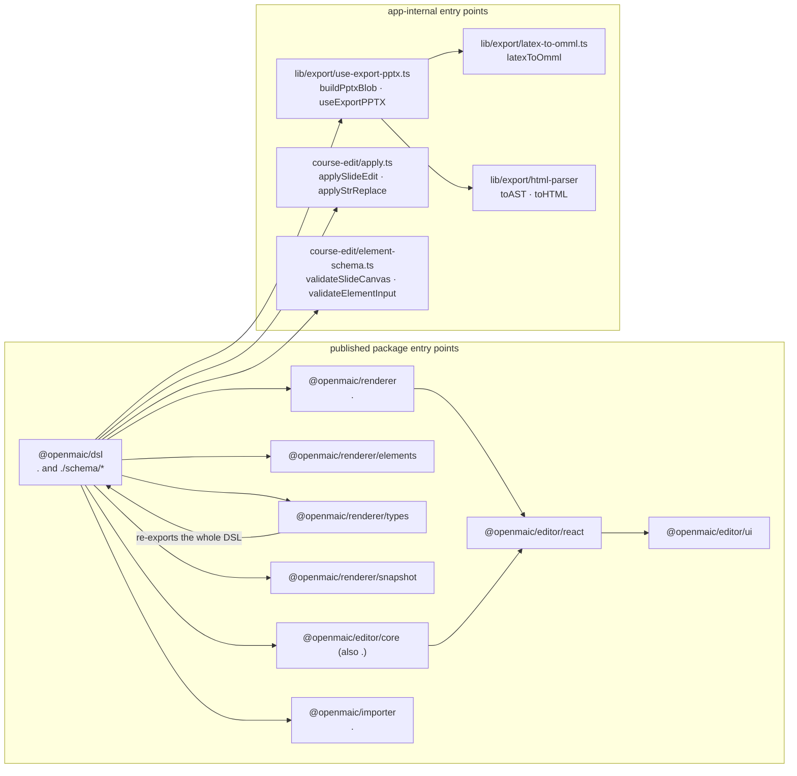

# 02c — Interfaces: consumer and producer surfaces

Continues `02a-interfaces.md` and `02b-interfaces.md` (the DSL contract types). Same rule: everything
is copied verbatim from the source at the cited line; elisions inside a quoted block are marked `// …`.

## 0. Where each public entry point lives



`@openmaic/renderer/types` is a pure re-export of `@openmaic/dsl` plus the renderer's own `effects`
types (`renderer/src/types/index.ts:4`), which is why the arrow points back at the contract.

## 1. Renderer

`packages/@openmaic/renderer/src/SlideCanvas.tsx:27` (abridged — 15 of 18 props shown):

```ts
export interface SlideCanvasProps {
  slide?: Slide;
  scale?: number;
  canvasPercentage?: number;
  onScaleChange?: (scale: number) => void;
  background?: SlideBackground;
  effects?: SlideEffects;
  renderImage?: (element: PPTImageElement, resolvedSrc: string,
                 defaultContent: ReactNode) => ReactNode;
  renderVideo?: (element: PPTVideoElement) => ReactNode;
  renderText?: (element: PPTTextElement, defaultContent: ReactNode) => ReactNode;
  renderShapeLabel?: (element: PPTShapeElement, defaultContent: ReactNode) => ReactNode;
  renderTable?: (element: PPTTableElement, defaultContent: ReactNode) => ReactNode;
  videoInteractive?: boolean;
  onElementClick?: (element: PPTElement, event: React.MouseEvent) => void;
  elementIdPrefix?: string;
  // …
  dragOffsets?: ReadonlyMap<string, { x: number; y: number }>;
  hiddenElementIds?: readonly string[];
  chrome?: boolean;
}
```

`packages/@openmaic/renderer/src/hooks/useViewportSize.ts:3`, `:10`, `:33`

```ts
export interface ViewportStyles { width: number; height: number; left: number; top: number }
export interface UseViewportSizeResult { viewportStyles: ViewportStyles; fitScale: number }

export function useViewportSize(
  canvasRef: RefObject<HTMLElement | null>,
  options: UseViewportSizeOptions = {},
): UseViewportSizeResult;
```

`packages/@openmaic/renderer/src/snapshot/index.ts:90`, `snapshot/measure.ts:73`

```ts
export async function slideToPng(
  slide: Slide,
  options: SlideToPngOptions = {},
): Promise<Blob | string>;

export async function measureSlideElementGeometry(
  slide: Slide,
  elementIds: readonly string[],
  options: MeasureOptions = {},
): Promise<Map<string, MeasuredGeometry>>;
```

## 2. Editor core

`packages/@openmaic/editor/src/core/index.ts:88`, `:119`, `:131`, `:137`

```ts
export type EditorOperation =
  | { type: 'slide.update'; patch: Omit<Partial<Slide>, 'id' | 'elements' | 'animations'> }
  | { type: 'element.add'; element: PPTElement; index?: number }
  | { type: 'element.update'; elementId: string; patch: ElementPatch }
  | { type: 'element.updateMany';
      updates: ReadonlyArray<{ readonly elementId: string; readonly patch: ElementPatch }> }
  | { type: 'element.delete'; elementId: string }
  | { type: 'element.deleteMany'; elementIds: readonly string[] }
  | { type: 'element.reorder'; elementId: string; index: number }
  | { type: 'element.duplicate'; elementIds: readonly string[];
      idMap: Readonly<Record<string, string>>;
      offset?: { readonly x: number; readonly y: number } }
  | { type: 'element.align'; elementIds: readonly string[]; command: SlideElementAlignCommand }
  | { type: 'element.removeProps'; elementId: string; propNames: readonly string[] }
  | { type: 'text.updateContent'; elementId: string; content: string }
  | { type: 'shape.updateTextContent'; elementId: string; content: string }
  | { type: 'table.updateCell'; elementId: string; cellId: string; text: string };

export type EditIntent =
  | { type: 'slide.update'; props: Omit<Partial<Slide>, 'id' | 'elements' | 'animations'> }
  | { type: 'element.update'; id: string; props: Partial<PPTElement> }
  | { type: 'element.updateMany'; updates: Array<{ id: string; props: Partial<PPTElement> }> }
  | { type: 'element.add'; element: PPTElement; index?: number }
  | { type: 'element.delete'; ids: string[] }
  | { type: 'element.reorder'; id: string; command: ReorderCommand }
  | { type: 'element.align'; ids: string[]; command: AlignCommand }
  | { type: 'element.removeProps'; id: string; props: string[] }
  | { type: 'text.updateContent'; id: string; content: string; target: 'text' | 'shape' }
  | { type: 'table.updateCell'; id: string; cellId: string; text: string };

export interface EditorTransaction {
  readonly origin: EditorTransactionOrigin;   // 'canvas'|'toolbar'|'agent'|'system'
  readonly history: EditorHistoryMode;        // 'record'|'neutral'|'navigate'
  readonly operations: readonly EditorOperation[];
}

export interface EditorHistory {
  readonly past: readonly SlideContent[];
  readonly present: SlideContent;
  readonly future: readonly SlideContent[];
}
```

Apply/undo surface (`:143`, `:162`, `:266`, `:281`, `:288`, `:291`, `:375`, `:384`, `:583`):

```ts
export function createEditorTransaction(args): EditorTransaction
export function compileEditorEditIntents(content: SlideContent,
                                         intents: readonly EditIntent[]): EditorOperation[]
export function createEditorTransactionFromIntents(args): EditorTransaction | null
export function createEditorHistory(content: SlideContent): EditorHistory
export function applyEditorTransaction(content: SlideContent, t: EditorTransaction): SlideContent
export function applyEditorTransaction(history: EditorHistory, t: EditorTransaction): EditorHistory
export function undoEditorTransaction(history: EditorHistory): EditorHistory
export function redoEditorTransaction(history: EditorHistory): EditorHistory
export function isValidEditorElement(value: unknown): value is PPTElement
export const MAX_EDITOR_HISTORY = 50;
```

`packages/@openmaic/editor/src/react/text/types.ts:53`

```ts
export interface TextEditorController {
  readonly elementId: string;
  readonly kind?: 'element' | 'table-cell';
  focus(): void;
  flush(): void;
  discard(): void;
  execute(command: TextEditCommand | readonly TextEditCommand[]): void;
  getHTML(): string;
}
```

## 3. Importer

`packages/@openmaic/importer/src/index.ts:12`, `:24`; `src/import-pipeline/index.ts:36`, `:38`, `:56`,
`:112`, `:123`; `src/import-pipeline/types.ts:4`, `:17`

```ts
export interface ParseOptions { mediaMode?: MediaMode }        // 'base64' | 'blob'
export async function parse(buffer: ArrayBuffer, options?: ParseOptions): Promise<Output>;

export type OssUpload = (blob: Blob, filename: string, dir?: string) => Promise<string>;
export interface ImportPptxOptions { upload?: OssUpload }

export async function parsedToSlides(json: Output, options?: ImportPptxOptions): Promise<Slide[]>;
export function normalizeImportedSlides(slides: Slide[]): Slide[];
export async function importPptx(input: File | Blob | ArrayBuffer,
                                 options?: ImportPptxOptions): Promise<Slide[]>;

export interface ImportContext {
  ratio: number;
  fixedViewport: boolean;
  viewportWidth: number;
  theme: SlideTheme;
  shapeList: ShapePoolItem[];
  uploadBase64Image: (base64: string, filename: string, dir: string) => Promise<string>;
  uploadBlobMedia: (blob: Blob, filename: string, dir: string) => Promise<string>;
  extractVideoFirstFrame: (videoUrl: string) => Promise<string | null>;
}
export interface TransformResult { slides: Slide[]; uploadTasks: Promise<unknown>[] }
```

`packages/@openmaic/importer/src/openmaic/configs/shapes.ts:5`, `:21`

```ts
export interface ShapePoolItem {
  viewBox: [number, number];
  path: string;
  special?: boolean;
  pathFormula?: ShapePathFormulasKeys;
  outlined?: boolean;
  pptxShapeType?: string;
  title?: string;
  withborder?: boolean;
}

export interface ShapePathFormula {
  editable?: boolean;
  defaultValue?: number[];
  range?: [number, number][];
  relative?: string[];
  getBaseSize?: ((width: number, height: number) => number)[];
  formula: (width: number, height: number, values?: number[]) => string;
}
```

## 4. Export

`lib/export/use-export-pptx.ts:437`, `:460`, `:473`, `:497`; `lib/export/latex-to-omml.ts:70`;
`lib/export/html-parser/index.ts:9`

```ts
export function derivePptxMediaReferenceSet(slides: readonly Slide[]): ReadonlySet<string>;
export function isPptxManifestForeignRef(ref: string | undefined,
                                         manifestRefs: ReadonlySet<string>,
                                         task: MediaTaskState | undefined): boolean;
export function assertPptxMediaReferenceParity(slides: readonly Slide[],
                                               manifestRefs: ReadonlySet<string>): void;
export async function buildPptxBlob(
  slides: Slide[],
  slideScenes: Scene[],
  viewportRatio: number,
  viewportSize: number,
  ratioPx2Inch: number,
  ratioPx2Pt: number,
  stageId?: string,
): Promise<Blob>;

export function latexToOmml(latex: string, fontSize?: number): string | null;
export const toAST = (str: string) => AST[];
```

Vendored pptxgenjs fork additions (`packages/pptxgenjs/src/slide.ts:253`,
`packages/pptxgenjs/src/gen-objects.ts:669`):

```ts
addFormula(options: FormulaProps): Slide
export function addFormulaDefinition(target: PresSlide, opts: FormulaProps): void
```

## 5. Agent-facing DSL op surface

`lib/server/agent-runtime/course-edit/apply.ts:127`, `:227`, `:286`, `:423`;
`lib/server/agent-runtime/course-edit/element-schema.ts:673`, `:681`, `:689`

```ts
export type SlideEditOp =
  | { op: 'patch'; action: 'set' | 'remove'; path: string; value?: unknown }
  | { op: 'add_element'; element: Record<string, unknown>; afterId?: string; index?: number }
  | { op: 'delete_element'; elementId: string };

export type ApplyResult<T> = { ok: true; value: T } | { ok: false; error: string };

export function applyJsonPointerEdit<T>(
  root: T,
  input: { action: 'set' | 'remove'; path: string; value?: unknown },
): ApplyResult<T>;
export function applyStrReplace<T>(root: T, input: StrReplaceInput): StrReplaceResult<T>;
export function applySlideEdit(content: SlideContent, input: SlideEditOp): ApplyResult<SlideContent>;

export function validateElementPatch(type: string, patch: Record<string, unknown>): string[];
export function validateElementInput(element: unknown): string[];
export function validateSlideCanvas(canvas: unknown): string[];
```

## 6. Minimal real example

From `packages/@openmaic/dsl/test/schema.test.ts:96` — the smallest scene the generated
`scene.schema.json` accepts, verbatim:

```ts
const slideScene = {
  id: 'sc',
  stageId: 'st',
  type: 'slide',
  title: 't',
  order: 0,
  content: {
    type: 'slide',
    canvas: {
      id: 'c',
      viewportSize: 1920,
      viewportRatio: 0.5625,
      theme: { themeColors: [], fontColor: '#000', fontName: 'Arial', backgroundColor: '#fff' },
      elements: [],
    },
  },
};
```

And the smallest valid action, from the same file (`:86`): `{ id: 'a', type: 'spotlight', elementId: 'e' }`
— dropping `elementId` makes the schema reject it (`:89`).

The app's own blank slide factory, for comparison
(`lib/server/agent-runtime/course-edit/apply.ts:505`):

```ts
export function emptySlideContent(): SlideContent {
  return {
    type: 'slide',
    canvas: {
      id: `slide-${nanoid(8)}`,
      viewportSize: 1000,
      viewportRatio: 0.5625,
      theme: { backgroundColor: '#ffffff', themeColors: ['#2563eb'],
               fontColor: '#111827', fontName: 'Inter' },
      elements: [],
    },
  };
}
```

Note the two different `viewportSize` conventions in the codebase: `1000` for app-authored slides,
`1280` for imported 16:9 decks (`packages/@openmaic/importer/src/import-pipeline/index.ts:34`
`FALLBACK_VIEWPORT_SIZE`, and `json.size.width * ratio` for real decks at `:64`).
