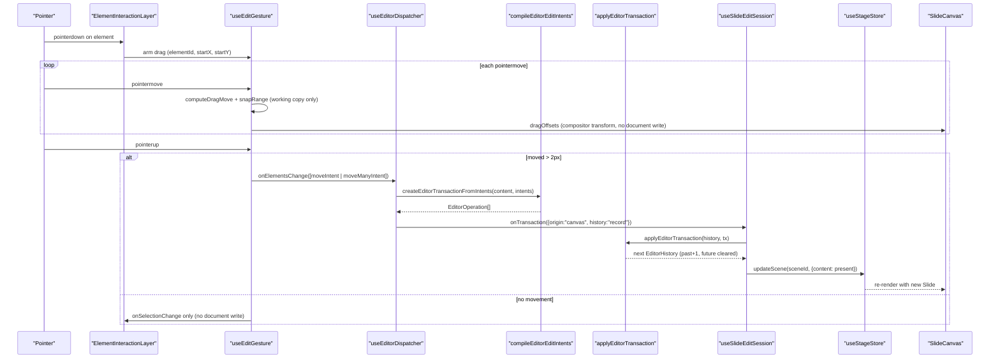
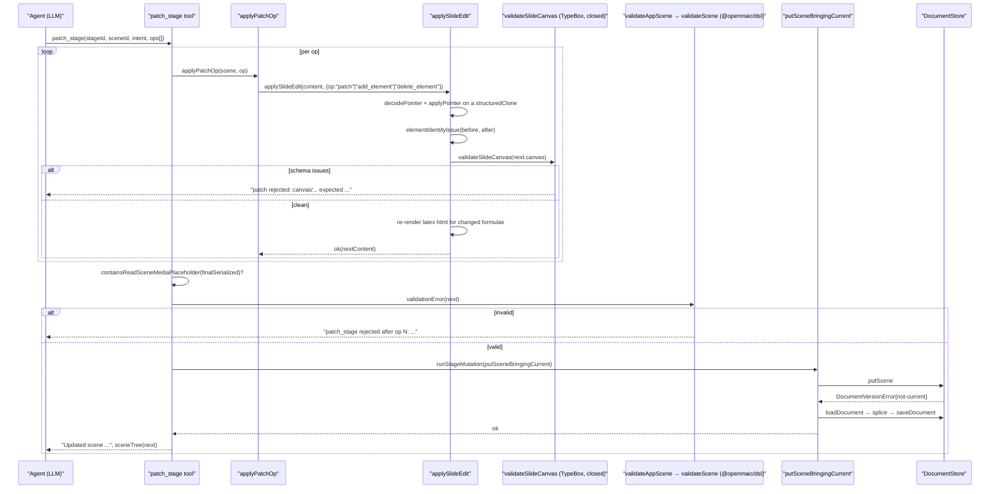
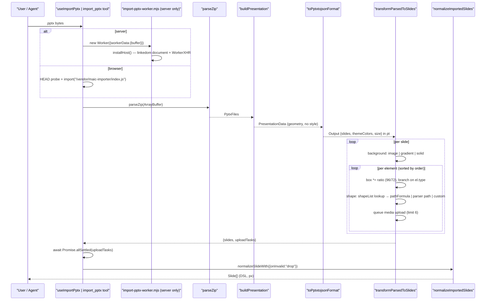
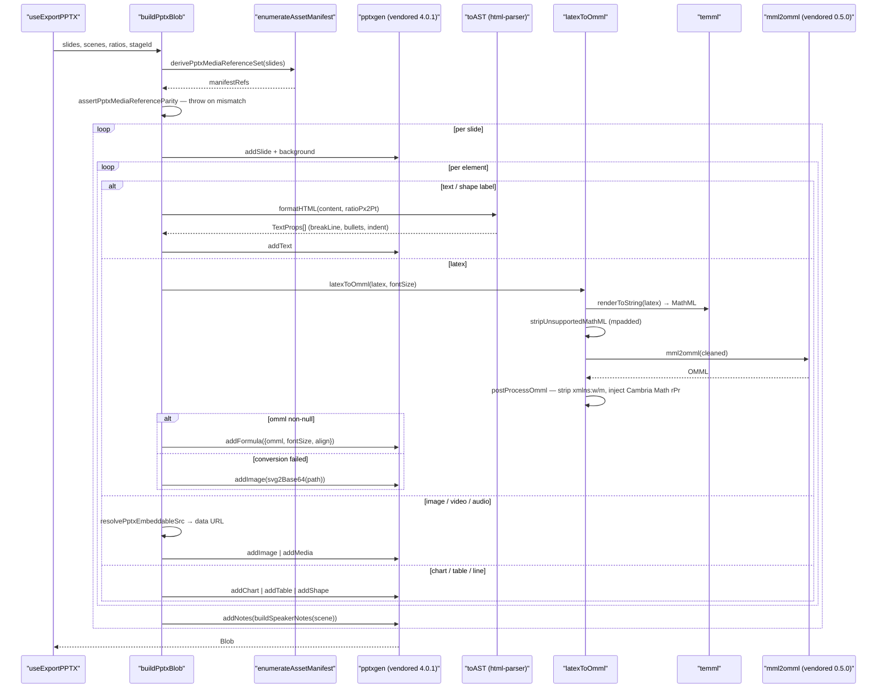

# 03 — Traced end-to-end flows

Four flows, each traced by reading the code and naming real functions in call order.

- **Flow A** — human gesture → DSL mutation → repaint (the packaged editor path).
- **Flow B** — AI agent `patch_stage` → validated DSL write.
- **Flow C** — `.pptx` file → `Slide[]` (both the browser and the server variant).
- **Flow D** — `Slide[]` → `.pptx` bytes.

---

## Flow A — a drag gesture becomes one undo entry

Entry: a pointer-down inside `ElementInteractionLayer`, with the packaged editor enabled
(`NEXT_PUBLIC_MAIC_EDITOR_RENDERER_ENABLED`, [`lib/config/feature-flags.ts:65`](lib/config/feature-flags.ts#L65)).

| # | Hop | Location |
| --- | --- | --- |
| 1 | `RendererEditorCanvas` resolves media slots, then renders the packaged surface | [`components/edit/surfaces/slide/RendererEditorCanvas.tsx:24`](components/edit/surfaces/slide/RendererEditorCanvas.tsx#L24) (`useResolvedSlide`), [`:82`](components/edit/surfaces/slide/RendererEditorCanvas.tsx#L82) |
| 2 | `EditableSlideCanvasWithUI` builds `content = {type:'slide', canvas: documentSlide}` and a `dispatch` | [`packages/@openmaic/editor/src/ui/EditableSlideCanvasWithUI.tsx:55`](packages/@openmaic/editor/src/ui/EditableSlideCanvasWithUI.tsx#L55) → [`ui/runtime/useEditorDispatcher.ts:25`](packages/@openmaic/editor/src/ui/runtime/useEditorDispatcher.ts#L25) |
| 3 | `EditableSlideCanvas` mounts `ElementInteractionLayer` + gesture hooks | [`packages/@openmaic/editor/src/react/EditableSlideCanvas.tsx:72`](packages/@openmaic/editor/src/react/EditableSlideCanvas.tsx#L72), [`:23`](packages/@openmaic/editor/src/react/EditableSlideCanvas.tsx#L23)–[`:31`](packages/@openmaic/editor/src/react/EditableSlideCanvas.tsx#L31) |
| 4 | `useEditGesture` captures pointer-down, builds a live working copy for 60 fps feedback | [`react/useEditGesture.ts:73`](packages/@openmaic/editor/src/react/useEditGesture.ts#L73) |
| 5 | `prepareSnapping` / `computeDragMove` (or `computeMultiDragMove`) run per pointer-move | [`react/core/drag.ts:57`](packages/@openmaic/editor/src/react/core/drag.ts#L57), [`:79`](packages/@openmaic/editor/src/react/core/drag.ts#L79), [`:170`](packages/@openmaic/editor/src/react/core/drag.ts#L170); guides from [`react/core/snapping.ts:47`](packages/@openmaic/editor/src/react/core/snapping.ts#L47) `buildAlignLines`, [`:125`](packages/@openmaic/editor/src/react/core/snapping.ts#L125) `snapRange` |
| 6 | pointer-up: movement > `DRAG_THRESHOLD_PX = 2` decides commit vs select-only | [`react/useEditGesture.ts:17`](packages/@openmaic/editor/src/react/useEditGesture.ts#L17), [`:289`](packages/@openmaic/editor/src/react/useEditGesture.ts#L289) |
| 7 | one intent is emitted: `moveIntent` for 1 element, `moveManyIntent` for N | [`react/core/intent.ts:8`](packages/@openmaic/editor/src/react/core/intent.ts#L8), [`:38`](packages/@openmaic/editor/src/react/core/intent.ts#L38); call site [`react/useEditGesture.ts:297`](packages/@openmaic/editor/src/react/useEditGesture.ts#L297) |
| 8 | `dispatch(intents)` → `createEditorTransactionFromIntents({content, intents})` | [`ui/runtime/useEditorDispatcher.ts:31`](packages/@openmaic/editor/src/ui/runtime/useEditorDispatcher.ts#L31) → [`core/index.ts:266`](packages/@openmaic/editor/src/core/index.ts#L266) |
| 9 | `compileEditorEditIntents` walks the intents against a private advancing snapshot → `EditorOperation[]` | [`core/index.ts:162`](packages/@openmaic/editor/src/core/index.ts#L162) |
| 10 | `createEditorTransaction` freezes `{origin:'canvas', history:'record', operations}` | [`core/index.ts:143`](packages/@openmaic/editor/src/core/index.ts#L143) |
| 11 | host callback `onTransaction` → `applyTransactionForScene(sceneId, tx)` (drops the tx if the scene changed) | [`RendererEditorCanvas.tsx:57`](components/edit/surfaces/slide/RendererEditorCanvas.tsx#L57) → [`slide-edit-session.ts:138`](components/edit/surfaces/slide/slide-edit-session.ts#L138) |
| 12 | `applyEditorTransaction(history, tx)` → `applyToContent` clones, applies each op, returns the original ref if unchanged | [`core/index.ts:293`](packages/@openmaic/editor/src/core/index.ts#L293), [`:393`](packages/@openmaic/editor/src/core/index.ts#L393) |
| 13 | history mode `'record'` pushes `present` onto `past` (capped at 50) and clears `future` | [`core/index.ts:326`](packages/@openmaic/editor/src/core/index.ts#L326), [`:773`](packages/@openmaic/editor/src/core/index.ts#L773) |
| 14 | `replace(history)` → `writeThrough(history.present)` → `useStageStore.updateScene(sceneId, {content})` | [`slide-edit-session.ts:85`](components/edit/surfaces/slide/slide-edit-session.ts#L85), [`:79`](components/edit/surfaces/slide/slide-edit-session.ts#L79) |
| 15 | store subscribers re-render; `SlideCanvas` repaints from the new `Slide` | [`packages/@openmaic/renderer/src/SlideCanvas.tsx:216`](packages/@openmaic/renderer/src/SlideCanvas.tsx#L216) |

Undo path: `undo()` → `undoEditorTransaction(history)` ([`core/index.ts:375`](packages/@openmaic/editor/src/core/index.ts#L375)) → `replace` →
`writeThrough`. Redo is symmetric (`:384`). A *non-user* commit — the ResizeObserver text auto-height
normalization — goes through `commitContent(next, false)` and updates `present` **without** touching
`past`, but does clear `future` ([`slide-edit-session.ts:147`](components/edit/surfaces/slide/slide-edit-session.ts#L147), reasoning at [`:50`](components/edit/surfaces/slide/slide-edit-session.ts#L50)).

---

## Flow B — the AI editor issues DSL operations, not free text

The agent never writes slide prose into the document. It calls `patch_stage` with a list of typed ops,
each of which is a JSON Pointer edit, an exact-text replace, or an element add/delete. Every op is
validated against a **closed** schema before it can be persisted.

| # | Hop | Location |
| --- | --- | --- |
| 1 | agent reads the scene: `read_stage` returns `inventoryScene` / `textSlide` projections | [`lib/server/agent-runtime/course-edit/apply.ts:582`](lib/server/agent-runtime/course-edit/apply.ts#L582), [`:74`](lib/server/agent-runtime/course-edit/apply.ts#L74) |
| 2 | agent calls `patch_stage` with `{stageId, sceneId, intent, ops[]}` | tool declared at [`lib/server/agent-runtime/dsl-tools.ts:772`](lib/server/agent-runtime/dsl-tools.ts#L772) |
| 3 | per op, `applyPatchOp` dispatches by `op.op` | [`dsl-tools.ts:571`](lib/server/agent-runtime/dsl-tools.ts#L571) |
| 4a | `set`/`remove` on a slide scene: path must start `/content/canvas/`, prefix stripped, → `applySlideEdit({op:'patch'})` | [`dsl-tools.ts:556`](lib/server/agent-runtime/dsl-tools.ts#L556), [`:562`](lib/server/agent-runtime/dsl-tools.ts#L562), [`:626`](lib/server/agent-runtime/dsl-tools.ts#L626) |
| 4b | `add_element` / `delete_element`: slide scenes only | [`dsl-tools.ts:572`](lib/server/agent-runtime/dsl-tools.ts#L572), [`:577`](lib/server/agent-runtime/dsl-tools.ts#L577) |
| 4c | `str_replace`: path must start `/content/` or `/actions/`; → `applyStrReplace` | [`dsl-tools.ts:587`](lib/server/agent-runtime/dsl-tools.ts#L587), [`:597`](lib/server/agent-runtime/dsl-tools.ts#L597) |
| 4d | non-slide content (`quiz`/`interactive`/`pbl`): generic `applyJsonPointerEdit` on the whole scene | [`dsl-tools.ts:631`](lib/server/agent-runtime/dsl-tools.ts#L631) |
| 5 | `applyJsonPointerPatch` decodes the pointer (`~0`/`~1` escapes checked), rejects out-of-bounds array indices and non-canonical indices | [`course-edit/apply.ts:377`](lib/server/agent-runtime/course-edit/apply.ts#L377), [`:146`](lib/server/agent-runtime/course-edit/apply.ts#L146), [`:161`](lib/server/agent-runtime/course-edit/apply.ts#L161) |
| 6 | identity guard: canvas id, element id set, and per-element `type` must be unchanged | [`course-edit/apply.ts:361`](lib/server/agent-runtime/course-edit/apply.ts#L361), [`:405`](lib/server/agent-runtime/course-edit/apply.ts#L405) |
| 7 | **whole-canvas** schema validation against `SlideCanvasSchema` (`additionalProperties: false` at every level) | [`course-edit/apply.ts:407`](lib/server/agent-runtime/course-edit/apply.ts#L407) → [`course-edit/element-schema.ts:689`](lib/server/agent-runtime/course-edit/element-schema.ts#L689) |
| 8 | LaTeX side-effect: any element whose `latex` changed gets its `html` KaTeX snapshot re-rendered or deleted | [`course-edit/apply.ts:414`](lib/server/agent-runtime/course-edit/apply.ts#L414) → [`lib/edit/slide-edit-elements.ts:154`](lib/edit/slide-edit-elements.ts#L154) |
| 9 | `add_element` extras: `id` must be absent, `validateElementInput` must pass, `afterId` XOR `index`, server assigns `el-<nanoid(8)>` | [`course-edit/apply.ts:431`](lib/server/agent-runtime/course-edit/apply.ts#L431)–[`:463`](lib/server/agent-runtime/course-edit/apply.ts#L463) |
| 10 | read-time media placeholders are rejected in values, anchors and replacements | [`course-edit/apply.ts:218`](lib/server/agent-runtime/course-edit/apply.ts#L218), [`:237`](lib/server/agent-runtime/course-edit/apply.ts#L237), [`:327`](lib/server/agent-runtime/course-edit/apply.ts#L327), [`:332`](lib/server/agent-runtime/course-edit/apply.ts#L332) |
| 11 | after the last op, the serialized scene is re-scanned for placeholders assembled across ops | [`dsl-tools.ts:820`](lib/server/agent-runtime/dsl-tools.ts#L820) |
| 12 | `validationError(next)` → `validateAppScene` (which delegates to the DSL `validateScene` for slide/quiz) | [`dsl-tools.ts:827`](lib/server/agent-runtime/dsl-tools.ts#L827), [`:431`](lib/server/agent-runtime/dsl-tools.ts#L431); [`lib/document-store/validators.ts:27`](lib/document-store/validators.ts#L27) |
| 13 | `runStageMutation(signal, () => putSceneBringingCurrent(store, stageId, next))` | [`dsl-tools.ts:836`](lib/server/agent-runtime/dsl-tools.ts#L836) |
| 14 | `putScene`; on `DocumentVersionError{kind:'not-current'}` reload → splice → `saveDocument` | [`lib/server/agent-runtime/document-writes.ts:32`](lib/server/agent-runtime/document-writes.ts#L32), [`:41`](lib/server/agent-runtime/document-writes.ts#L41) |
| 15 | `deps.onCheckpoint({tool:'patch_stage', …})` records the edit for the session timeline | [`dsl-tools.ts:846`](lib/server/agent-runtime/dsl-tools.ts#L846) |

Two independent schema layers guard the same write, on purpose:

- **TypeBox, closed** (`course-edit/element-schema.ts`) — per-element partial patches with
  `additionalProperties: false` at every level (`:5`), one `*ElementPatch` per DSL variant, plus
  `SlideElementInputSchema` (`:535`) for complete id-less elements and `SlideCanvasSchema` (`:626`) for
  the whole canvas. The header states the field sets "mirror `@openmaic/dsl` `slides.ts` exactly"
  (`:15`) — a hand-maintained mirror, which is the fragility noted in `06`.
- **DSL structural validators** (`@openmaic/dsl/validate.ts`) — the scene/action level, reached through
  `validateAppScene`.

`patch` cannot change identity at all: `elementIdentityIssue` ([`course-edit/apply.ts:361`](lib/server/agent-runtime/course-edit/apply.ts#L361)) rejects a
changed canvas id, duplicate element ids, an added/removed/renamed element id, and a changed element
`type`, with the message "use add_element/delete_element".

---

## Flow C — `.pptx` → `Slide[]`

Two callers with the same core, differing only in how they get around bundler/runtime constraints.

### C1 — browser

| # | Hop | Location |
| --- | --- | --- |
| 1 | user picks a file; `useImportPptx.handleFileChange` | [`lib/import/use-import-pptx.ts:48`](lib/import/use-import-pptx.ts#L48) |
| 2 | `HEAD /vendor/maic-importer/index.js` probe → `PARSER_NOT_DEPLOYED` if not ok | `:70`, `:75` |
| 3 | `import(url)` with `webpackIgnore` / `turbopackIgnore` / `@vite-ignore` so no bundler sees the target | `:78` |
| 4 | `mod.importPptx(file, {upload})` | `:85` |
| 5 | `toArrayBuffer` → `parseZip(buffer)` | [`import-pipeline/index.ts:127`](packages/@openmaic/importer/src/import-pipeline/index.ts#L127), `parser/ZipParser.ts` |
| 6 | `buildPresentation(files)` — theme → master → layout → slide chain | `model/Presentation.ts` |
| 7 | `toPptxtojsonFormat(presentation, files, 'base64')` → `Output` in **pt** | `adapter/toPptxtojson.ts` |
| 8 | `parsedToSlides(json, options)`: `createMockImportContext` + deck-width override | [`import-pipeline/index.ts:56`](packages/@openmaic/importer/src/import-pipeline/index.ts#L56), [`:60`](packages/@openmaic/importer/src/import-pipeline/index.ts#L60), [`:65`](packages/@openmaic/importer/src/import-pipeline/index.ts#L65) |
| 9 | `transformParsedToSlides(json, ctx)` — per-slide background, per-element branch, px conversion via `ratio = 96/72` | [`import-pipeline/transformParsedToSlides.ts:367`](packages/@openmaic/importer/src/import-pipeline/transformParsedToSlides.ts#L367), [`:459`](packages/@openmaic/importer/src/import-pipeline/transformParsedToSlides.ts#L459) |
| 10 | media uploads queued through a 6-way concurrency limiter | `:393` (`createConcurrencyLimiter(6)`), `:42` |
| 11 | `await Promise.allSettled(uploadTasks)` — an inner missing `.catch` cannot fail the import | [`import-pipeline/index.ts:76`](packages/@openmaic/importer/src/import-pipeline/index.ts#L76), rationale at [`:13`](packages/@openmaic/importer/src/import-pipeline/index.ts#L13) |
| 12 | `normalizeImportedSlides(slides)` = `normalizeSlideWith({onInvalid:'drop', onDropped: console.warn})` | [`import-pipeline/index.ts:101`](packages/@openmaic/importer/src/import-pipeline/index.ts#L101), [`:112`](packages/@openmaic/importer/src/import-pipeline/index.ts#L112) |
| 13 | `onImported(slides)` → app writes scenes | [`lib/import/use-import-pptx.ts:89`](lib/import/use-import-pptx.ts#L89) |

### C2 — server (`import_pptx` agent tool)

Same `importPptx`, but inside a **worker thread** so the DOM shims never touch the request process
([`lib/server/agent-runtime/import-pptx-worker.mjs:1`](lib/server/agent-runtime/import-pptx-worker.mjs#L1)). `installHost()` ([`:93`](lib/server/agent-runtime/import-pptx-worker.mjs#L93)) installs a `linkedom`
document plus a `fetch`-backed `WorkerXHR` (`:9`) and a fake `location`; the worker's `upload`
callback returns a `data:` URL (`:116`). The parent enforces
`PARSE_PPTX_TIMEOUT_MS = 90_000`, `MAX_IMPORT_BYTES = 8 MiB`, `MAX_IMPORT_SLIDES = 80`
([`lib/server/agent-runtime/import-pptx.ts:41`](lib/server/agent-runtime/import-pptx.ts#L41)) and refuses to run if the worker file is absent
(`:268`).

Coordinate/unit summary for this flow: OOXML EMU → px/pt in `model` (`parser/units.ts`), `Output` in
**pt**, DSL in **px** (`× 96/72`). Deck viewport width is `json.size.width * ratio`, falling back to
`FALLBACK_VIEWPORT_SIZE = 1280` when `size.width <= 0` ([`import-pipeline/index.ts:34`](packages/@openmaic/importer/src/import-pipeline/index.ts#L34), [`:64`](packages/@openmaic/importer/src/import-pipeline/index.ts#L64)), so a
16:9 deck (960 pt) lands at 1280 px and a 4:3 deck at 960 px without any caller override.

---

## Flow D — `Slide[]` → `.pptx`

| # | Hop | Location |
| --- | --- | --- |
| 1 | `useExportPPTX()` collects stage + scenes + viewport ratios | [`lib/export/use-export-pptx.ts:1300`](lib/export/use-export-pptx.ts#L1300) |
| 2 | `buildPptxBlob(slides, slideScenes, viewportRatio, viewportSize, ratioPx2Inch, ratioPx2Pt, stageId)` | `:497` |
| 3 | `new pptxgen()` — the **vendored** fork | `:506`; `packages/pptxgenjs` |
| 4 | `derivePptxMediaReferenceSet(slides)` builds synthetic scenes and runs `enumerateAssetManifest` | `:437` → [`packages/@openmaic/dsl/src/asset-manifest.ts:119`](packages/@openmaic/dsl/src/asset-manifest.ts#L119) |
| 5 | `assertPptxMediaReferenceParity(slides, manifestRefs)` — throws if the manifest walk and the `slideMediaSlotDescriptors` walk disagree | `:473` |
| 6 | per slide: background, then `addNotes(buildSpeakerNotes(scene))`, then a per-element type branch | `:535`, `:536`; `:583` text … `:1101` video/audio |
| 7 | text: `formatHTML(html, ratioPx2Pt)` → `toAST` (local himalaya port) → `pptxgen.TextProps[]` | `:64`, [`lib/export/html-parser/index.ts:9`](lib/export/html-parser/index.ts#L9) |
| 8 | shape: `toPoints(el.path)` + `formatPoints(...)` → `addShape('custGeom', …)`; `special`/pattern shapes fall back to `addImage` | `:732`, `:734`, `:768`, `:726`, `:810`; `lib/export/svg-path-parser.ts` |
| 9 | latex: `latexToOmml(latex, fontSize)` → `pptxSlide.addFormula({omml, …})` (fork-only API) | `:1044`, `:1047`; [`packages/pptxgenjs/src/slide.ts:253`](packages/pptxgenjs/src/slide.ts#L253) |
| 10 | latex fallback: build an inline `<svg>` from `el.path`, `svg2Base64`, `addImage` | `:1056`–`:1096` |
| 11 | media: `resolvePptxEmbeddableSrc` → `resolveStoredBytes` (pool-first) → base64 data URL | `:410` |
| 12 | line: `formatPoints(toPoints(path))` → `addShape('custGeom', …)`; chart → `addChart`; table → `addTable` | `:817`, `:838`, `:938`, `:1032` |
| 13 | `saveAs(blob, fileName)` | `file-saver`, imported at `:5` |

### What the export drops

| Dropped / degraded | Evidence |
| --- | --- |
| LaTeX becomes a **static image** when `temml`/`mathml2omml` throws | [`use-export-pptx.ts:1056`](lib/export/use-export-pptx.ts#L1056); [`latex-to-omml.ts:77`](lib/export/latex-to-omml.ts#L77) returns `null` and warns |
| MathML `<mpadded>` spacing is discarded before OMML conversion | [`latex-to-omml.ts:11`](lib/export/latex-to-omml.ts#L11) |
| LaTeX font size is *estimated* from `\\` count, not measured | [`use-export-pptx.ts:1040`](lib/export/use-export-pptx.ts#L1040)–[`:1043`](lib/export/use-export-pptx.ts#L1043) |
| `special` shapes (paths using commands beyond L/Q/C/A) become images | DSL [`slides.ts:422`](packages/@openmaic/dsl/src/slides.ts#L422); importer sets the flag at [`transformParsedToSlides.ts:991`](packages/@openmaic/importer/src/import-pipeline/transformParsedToSlides.ts#L991) |
| An unresolvable media ref makes the element **skipped entirely** (`continue`) | [`use-export-pptx.ts:1114`](lib/export/use-export-pptx.ts#L1114), [`:1082`](lib/export/use-export-pptx.ts#L1082) |
| `blob:`/remote URLs cannot survive; everything is re-fetched to base64, so an offline or CORS-blocked asset is lost | [`use-export-pptx.ts:1116`](lib/export/use-export-pptx.ts#L1116)–[`:1127`](lib/export/use-export-pptx.ts#L1127) |
| Extension guessing falls back to `mp4`/`mp3` when neither the URL nor `el.ext` says otherwise | [`use-export-pptx.ts:1142`](lib/export/use-export-pptx.ts#L1142) |
| Interactive (`html`) scenes have no `.pptx` representation at all — the exporter only walks slide scenes | `buildPptxBlob` takes `slides: Slide[]`; the classroom ZIP is the path for interactive content |

### What the classroom ZIP / HTML export drops

| Dropped | Evidence |
| --- | --- |
| `Stage.whiteboard` asset bytes are deliberately excluded from the archive | [`lib/export/use-export-classroom.ts:110`](lib/export/use-export-classroom.ts#L110) |
| Assets that fail to inline are reported, not fatal: `InlineReport.failed` rides out with the ZIP | [`use-export-classroom.ts:56`](lib/export/use-export-classroom.ts#L56) (`inlineFailures`), aggregate at [`:96`](lib/export/use-export-classroom.ts#L96) |
| Reference conversion is best-effort: on failure it rolls back fresh allocations and falls back to the accessed document snapshot | [`use-export-classroom.ts:71`](lib/export/use-export-classroom.ts#L71) |
