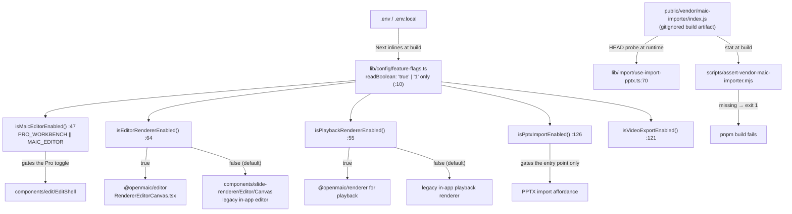
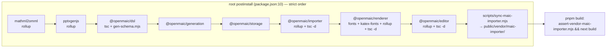
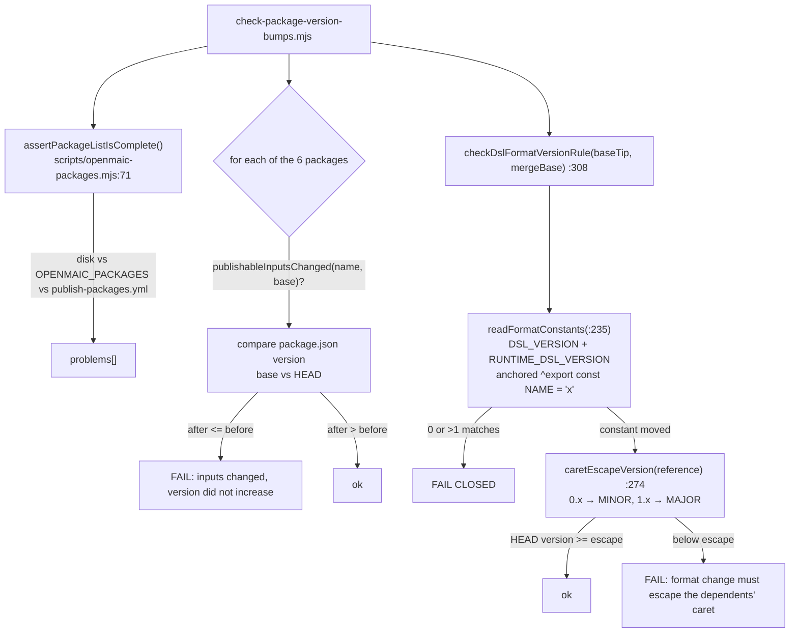

# 04 — Dependencies and configuration

## 1. Configuration resolution

There is no runtime configuration file for this subsystem. Behaviour is selected by four
`NEXT_PUBLIC_*` build-time flags and by which build artifacts exist on disk.

`readBoolean` accepts only the exact strings `'true'` and `'1'`; anything else, including unset, is
disabled ([`lib/config/feature-flags.ts:10`](lib/config/feature-flags.ts#L10)). [`.env.example:304`](.env.example#L304) states the consequence explicitly:
`NEXT_PUBLIC_*` values are compiled into the browser bundle, so changing one requires a rebuild.

### Env vars

| Var | Required | Effect | Evidence |
| --- | --- | --- | --- |
| `NEXT_PUBLIC_MAIC_EDITOR_ENABLED` | no | gates the Pro-mode editor toggle in the header; implied by the workbench flag | [`lib/config/feature-flags.ts:47`](lib/config/feature-flags.ts#L47), [`.env.example:315`](.env.example#L315) |
| `NEXT_PUBLIC_PRO_WORKBENCH_ENABLED` | no | implies the editor gate above | [`lib/config/feature-flags.ts:32`](lib/config/feature-flags.ts#L32), [`.env.example:310`](.env.example#L310) |
| `NEXT_PUBLIC_MAIC_EDITOR_RENDERER_ENABLED` | no | selects `@openmaic/editor` inside Pro mode instead of the legacy in-app canvas; **does not** enable Pro mode by itself | [`lib/config/feature-flags.ts:64`](lib/config/feature-flags.ts#L64), [`.env.example:318`](.env.example#L318) |
| `NEXT_PUBLIC_MAIC_PLAYBACK_RENDERER_ENABLED` | no | selects `@openmaic/renderer` for the classroom playback canvas | [`lib/config/feature-flags.ts:55`](lib/config/feature-flags.ts#L55), [`.env.example:321`](.env.example#L321) |
| `NEXT_PUBLIC_ENABLE_PPTX_IMPORT` | no | shows the PPTX import entry point (the pipeline itself is unaffected) | [`lib/config/feature-flags.ts:126`](lib/config/feature-flags.ts#L126), [`.env.example:334`](.env.example#L334) |
| `NEXT_PUBLIC_ENABLE_VIDEO_EXPORT` | no | shows the video-export entry point; the renderer's `snapshot/measure.ts` geometry probe feeds that compiler | [`lib/config/feature-flags.ts:121`](lib/config/feature-flags.ts#L121), [`.env.example:333`](.env.example#L333) |

No env var configures the DSL, the importer, or the pptx exporter. Their knobs are function
parameters: `ParseOptions.mediaMode` ([`packages/@openmaic/importer/src/index.ts:12`](packages/@openmaic/importer/src/index.ts#L12)),
`ImportPptxOptions.upload` ([`import-pipeline/index.ts:38`](packages/@openmaic/importer/src/import-pipeline/index.ts#L38)), `SlideToPngOptions`
([`packages/@openmaic/renderer/src/snapshot/index.ts:42`](packages/@openmaic/renderer/src/snapshot/index.ts#L42)), `MeasureOptions`
([`snapshot/measure.ts:42`](packages/@openmaic/renderer/src/snapshot/measure.ts#L42)), and `NormalizeSlideOptions`
([`packages/@openmaic/dsl/src/normalize.ts:601`](packages/@openmaic/dsl/src/normalize.ts#L601)).

### Hard-coded defaults that behave like configuration

| Constant | Value | Location |
| --- | --- | --- |
| `useViewportSize` defaults | `viewportSize 1000`, `viewportRatio 0.5625`, `canvasPercentage 100` | [`renderer/src/hooks/useViewportSize.ts:38`](packages/@openmaic/renderer/src/hooks/useViewportSize.ts#L38) |
| snapshot / measure defaults | `DEFAULT_VIEWPORT_RATIO 0.5625`, `DEFAULT_TIMEOUT_MS 5000` | [`renderer/src/snapshot/index.ts:80`](packages/@openmaic/renderer/src/snapshot/index.ts#L80), [`measure.ts:54`](packages/@openmaic/renderer/src/snapshot/measure.ts#L54) |
| `slideToPng` pixel ratio | `window.devicePixelRatio ?? 1` | [`renderer/src/snapshot/index.ts:102`](packages/@openmaic/renderer/src/snapshot/index.ts#L102) |
| shape SVG overflow pad cap | `CAP = 4000` px | [`renderer/src/elements/shape/BaseShapeElement.tsx:185`](packages/@openmaic/renderer/src/elements/shape/BaseShapeElement.tsx#L185) |
| line draw animation | `DRAW_ANIMATION_MS = 600` | [`renderer/src/elements/line/BaseLineElement.tsx:14`](packages/@openmaic/renderer/src/elements/line/BaseLineElement.tsx#L14) |
| drag commit threshold | `DRAG_THRESHOLD_PX = 2` | [`editor/src/react/useEditGesture.ts:17`](packages/@openmaic/editor/src/react/useEditGesture.ts#L17) |
| undo depth | `MAX_EDITOR_HISTORY = 50` (package), `MAX_HISTORY = 50` (app) | [`editor/src/core/index.ts:3`](packages/@openmaic/editor/src/core/index.ts#L3), [`lib/edit/slide-ops.ts:10`](lib/edit/slide-ops.ts#L10) |
| import concurrency | `createConcurrencyLimiter(6)` | [`importer/src/import-pipeline/transformParsedToSlides.ts:393`](packages/@openmaic/importer/src/import-pipeline/transformParsedToSlides.ts#L393) |
| import fallback viewport | `FALLBACK_VIEWPORT_SIZE = 1280` | [`importer/src/import-pipeline/index.ts:34`](packages/@openmaic/importer/src/import-pipeline/index.ts#L34) |
| import context ratio | `ratio = 96 / 72`, `viewportWidth = 960` | `importer/src/import-pipeline/mockContext.ts` |
| server import caps | `MAX_IMPORT_SLIDES 80`, `MAX_IMPORT_BYTES 8 MiB`, `PARSE_PPTX_TIMEOUT_MS 90 000` | [`lib/server/agent-runtime/import-pptx.ts:41`](lib/server/agent-runtime/import-pptx.ts#L41) |
| pptx export text defaults | `DEFAULT_FONT_SIZE = 16`, `DEFAULT_FONT_FAMILY = 'Microsoft YaHei'` | [`lib/export/use-export-pptx.ts:44`](lib/export/use-export-pptx.ts#L44) |

## 2. Build-time dependency graph

The order is not incidental: `@openmaic/dsl` must be built before its three dependents, and the
importer must be built before the sync step can copy its `dist`.

Workspace globs: `packages/*` and `packages/@openmaic/*`, with `packages/docs` excluded as a
standalone sub-app ([`pnpm-workspace.yaml:4`](pnpm-workspace.yaml#L4)).

### Per-package build commands

| Package | Build | Output |
| --- | --- | --- |
| `@openmaic/dsl` | `tsc -p tsconfig.json && node scripts/gen-schema.mjs` ([`package.json:24`](packages/@openmaic/dsl/package.json#L24)) | `dist/*.js`, `dist/*.d.ts`, `dist/schema/{stage,scene,action}.schema.json` |
| `@openmaic/renderer` | `generate-fonts-css.mjs && generate-katex-fonts.mjs && rollup -c && tsc --emitDeclarationOnly` ([`package.json:41`](packages/@openmaic/renderer/package.json#L41)) | `dist/`, plus a generated `fonts.css` shipped as an export |
| `@openmaic/editor` | `rollup -c && tsc --emitDeclarationOnly` ([`package.json:37`](packages/@openmaic/editor/package.json#L37)) | `dist/{core,react,ui}` |
| `@openmaic/importer` | `rollup -c && tsc --emitDeclarationOnly` ([`package.json:24`](packages/@openmaic/importer/package.json#L24)) | `dist/index.js`, `dist/index.cjs`, `dist/index.d.ts` |
| `pptxgenjs` (vendored) | `rollup -c --bundleConfigAsCjs` | `dist/pptxgen.{es,cjs}.js` |
| `mathml2omml` (vendored) | `rollup -c` + a node one-liner copying `src/index.d.ts` | `dist/index.{js,cjs,d.ts}` |

The DSL's `tsconfig.json` pins `lib: ["ES2022"]` — **no DOM**. That is what forces `storage.ts` to
declare its own `BinaryBlob` structural type instead of referencing `Blob`
([`packages/@openmaic/dsl/src/storage.ts:55`](packages/@openmaic/dsl/src/storage.ts#L55)).

The renderer and editor use `rollup-plugin-preserve-directives` (both `package.json` devDeps) because
23 renderer files and 38 editor files carry `'use client'` (measured with
`grep -rl "'use client'"`), and Next.js needs those directives to survive bundling.

## 3. External dependencies

### Runtime, in the browser bundle

| Package | Version | Used for | Evidence |
| --- | --- | --- | --- |
| `react` / `react-dom` | `>=18` peer | everything | [`renderer/package.json:64`](packages/@openmaic/renderer/package.json#L64), [`editor/package.json:61`](packages/@openmaic/editor/package.json#L61) |
| `motion` | `^12.27.5` (root); `>=11` peer | `AnimatePresence` around the laser overlay | [`renderer/src/SlideCanvas.tsx:4`](packages/@openmaic/renderer/src/SlideCanvas.tsx#L4) |
| `katex` | `^0.16.33` | LaTeX element rendering, and the persisted `html` snapshot | [`renderer/package.json:85`](packages/@openmaic/renderer/package.json#L85), [`lib/edit/slide-edit-elements.ts:154`](lib/edit/slide-edit-elements.ts#L154) |
| `echarts` | `^6.0.0`; optional peer | chart element | [`renderer/package.json:65`](packages/@openmaic/renderer/package.json#L65), [`:73`](packages/@openmaic/renderer/package.json#L73) |
| `shiki` | `^3.21.0`; optional peer | code element syntax highlighting | [`renderer/package.json:69`](packages/@openmaic/renderer/package.json#L69), [`:76`](packages/@openmaic/renderer/package.json#L76) |
| `tinycolor2` | `^1.6.0` | table sub-theme colours, pptx colour formatting | [`renderer/src/utils/element.ts:1`](packages/@openmaic/renderer/src/utils/element.ts#L1), [`lib/export/use-export-pptx.ts:4`](lib/export/use-export-pptx.ts#L4) |
| `clsx` + `tailwind-merge` | `^2.1.1` / `^3.4.0` | the renderer's `cn` helper | [`renderer/package.json:82`](packages/@openmaic/renderer/package.json#L82), [`:87`](packages/@openmaic/renderer/package.json#L87) |
| `lucide-react` | `^0.562.0` | audio/video element chrome, editor toolbars | [`renderer/package.json:86`](packages/@openmaic/renderer/package.json#L86) |
| `html-to-image` | `^1.11.13` (renderer dep) | primary snapshot rasterizer (foreignObject SVG) | [`renderer/package.json:83`](packages/@openmaic/renderer/package.json#L83), [`snapshot/index.ts:35`](packages/@openmaic/renderer/src/snapshot/index.ts#L35) |
| `html2canvas-pro` | `^2.0.4` (renderer dep) | snapshot fallback rasterizer | [`renderer/package.json:84`](packages/@openmaic/renderer/package.json#L84), [`snapshot/index.ts:34`](packages/@openmaic/renderer/src/snapshot/index.ts#L34) |
| `prosemirror-*` (11 packages) | `^1.x` | rich-text editing, in both the packaged editor and `lib/prosemirror` | [`editor/package.json:48`](packages/@openmaic/editor/package.json#L48)–[`:58`](packages/@openmaic/editor/package.json#L58); root `package.json` |
| `immer` | `^11.1.3` | app-side op kernel ([`lib/edit/slide-ops.ts:1`](lib/edit/slide-ops.ts#L1)), and an editor dependency | root + [`editor/package.json:45`](packages/@openmaic/editor/package.json#L45) |
| `react-colorful` | `^5.7.0` | the packaged editor's colour picker | [`editor/package.json:59`](packages/@openmaic/editor/package.json#L59) |
| `temml` | `^0.13.1` | LaTeX → MathML for the pptx formula path | [`lib/export/latex-to-omml.ts:1`](lib/export/latex-to-omml.ts#L1) |
| `jszip` | `^3.10.1` | classroom ZIP, resource pack, and inside pptxgenjs | [`lib/export/use-export-classroom.ts:81`](lib/export/use-export-classroom.ts#L81) |
| `file-saver` | `^2.0.5` | download the produced Blob | [`lib/export/use-export-pptx.ts:5`](lib/export/use-export-pptx.ts#L5) |
| `nanoid` | `5.1.16` | element/slide id generation in the importer and agent tools | [`importer/package.json:55`](packages/@openmaic/importer/package.json#L55) |
| `parse-srcset`, `svg-arc-to-cubic-bezier` | `^1.0.2`, `^3.2.0` | HTML asset inlining, SVG path → cubic conversion | root `package.json`; `lib/export/svg-arc-to-cubic-bezier.d.ts` |

### Vendored (workspace) rather than installed

| Package | Version | Why | Evidence |
| --- | --- | --- | --- |
| `pptxgenjs` | `workspace:*` → 4.0.1 | fork adds `addFormula`/OMML support | root [`package.json:129`](package.json#L129); [`packages/pptxgenjs/src/slide.ts:253`](packages/pptxgenjs/src/slide.ts#L253) |
| `mathml2omml` | `workspace:*` → 0.5.0 | fork fixes `.includes[...]` → `.includes(...)` | root [`package.json:114`](package.json#L114); commit `a3f88d53` |
| `@openmaic/importer` | `workspace:*` → 0.1.3 | fork of `pptxtojson` carrying the entire DSL transform | root [`package.json:77`](package.json#L77) |

### Importer's own tree (server/browser, heavy)

[`packages/@openmaic/importer/package.json:48`](packages/@openmaic/importer/package.json#L48): `@xmldom/xmldom ^0.9.9`, `jpegxr ^0.3.0`, `jszip`,
`katex`, `mathml-to-latex 1.5.0`, `nanoid`, `omml2mathml ^1.3.0`, **`pdfjs-dist 4.8.69`** (pinned),
`pptxtojson ^1.11.0`, `tinycolor2 1.6.0`, `utif ^3.1.0`.

`pdfjs-dist` is the reason for the whole vendor-bundle dance: its dynamic `require()` patterns are
rejected outright by Turbopack ([`scripts/sync-maic-importer.mjs:6`](scripts/sync-maic-importer.mjs#L6)). `pptxtojson` is listed even though
the package *is* a fork of it — it is imported purely for the parsed-JSON types
([`src/import-pipeline/transformParsedToSlides.ts:1`](packages/@openmaic/importer/src/import-pipeline/transformParsedToSlides.ts#L1), and `ParsedPptxJson` at [`:34`](packages/@openmaic/importer/src/import-pipeline/transformParsedToSlides.ts#L34) is
`Awaited<ReturnType<typeof parsePptxDefault>>`).

Optional media converters are shimmed rather than typed upstream: `utif`, `pngjs`, `jpegxr`, `canvas`
all get local `declare module` blocks in `src/types/vendor-shims.d.ts`.

### Server-only

| Package | Version | Used for | Evidence |
| --- | --- | --- | --- |
| `typebox` | `^1.1.39` | the closed agent-facing element/canvas schemas | [`lib/server/agent-runtime/course-edit/element-schema.ts:17`](lib/server/agent-runtime/course-edit/element-schema.ts#L17) |
| `linkedom` | `^0.18.13` | a DOM for the pptx parse worker (`linkedom/worker`) | [`lib/server/agent-runtime/import-pptx-worker.mjs:7`](lib/server/agent-runtime/import-pptx-worker.mjs#L7) |
| `@earendil-works/pi-agent-core` | `0.78.0` | the `AgentTool` type the DSL tools implement | [`lib/server/agent-runtime/import-pptx.ts:19`](lib/server/agent-runtime/import-pptx.ts#L19) |

### Build-only

| Package | Where | Purpose |
| --- | --- | --- |
| `ts-json-schema-generator ~2.4.0` | [`packages/@openmaic/dsl/package.json:51`](packages/@openmaic/dsl/package.json#L51) | emits the three JSON Schema artifacts; explicitly build-only so the package keeps zero runtime deps ([`scripts/gen-schema.mjs:5`](packages/@openmaic/dsl/scripts/gen-schema.mjs#L5)) |
| `ajv ^8.17.1` | same, devDep | compiles the generated schemas in `test/schema.test.ts` |
| `rollup` + `@rollup/plugin-{typescript,node-resolve,commonjs}` + `rollup-plugin-preserve-directives` | renderer / editor / importer | bundling |
| `jsdom ^29.1.1`, `@testing-library/{react,dom}` | renderer / editor | component tests |
| `vitest ^4.1.8` | all four packages | unit tests |

## 4. The version-bump gate

`scripts/check-package-version-bumps.mjs` (686 lines) runs in two modes:
`<base-ref>` (diff mode, merge-time) and `--release` (pre-publish). Wired into CI at
[`.github/workflows/ci.yml:61`](.github/workflows/ci.yml#L61) and [`:79`](.github/workflows/ci.yml#L79), and into the release workflow at
[`.github/workflows/publish-packages.yml:115`](.github/workflows/publish-packages.yml#L115) and [`:375`](.github/workflows/publish-packages.yml#L375).

The rule the whole gate exists for is stated at [`packages/@openmaic/dsl/src/version.ts:25`](packages/@openmaic/dsl/src/version.ts#L25): changing
`DSL_VERSION` or `RUNTIME_DSL_VERSION` requires an npm version increase the **dependents' caret range
will not admit** — a MINOR while dsl is `0.x`, a MAJOR once it reaches `1.0.0`. The failure it prevents
is spelled out at [`scripts/check-package-version-bumps.mjs:290`](scripts/check-package-version-bumps.mjs#L290): one published `@openmaic/storage`
version resolving two different admitted dsl versions would write rows it then refuses to read.

Three deliberately conservative behaviours:

- The caret to escape comes from the **highest dsl version on the base branch**, not the merge base
  (`:386`) — because that is what already-published dependents carry.
- Two candidate files both declaring the constants is an **error**, not a "take the first"
  (`:342`), so a half-finished rename cannot pass.
- If the constants cannot be located at either revision *while dsl changed at all*, the check fails
  (`:351`) rather than defaulting to pass.

A known limitation is written into the script (`:14`): "publishable input" means "file under the
package directory", which under-approximates. All six packages bundle or emit through the lockfile's
toolchain, so a dependency bump can change a tarball with no diff under the package directory. Diff
mode is described as "a merge-time guard against the common case, not a proof of byte equality".

[`scripts/openmaic-packages.mjs:17`](scripts/openmaic-packages.mjs#L17) also carries an explicit threat model: the gates are configuration
in the same repo as the code they check, so anyone who can merge can weaken them; they exist to catch
**mistakes**, not deliberate subversion.
