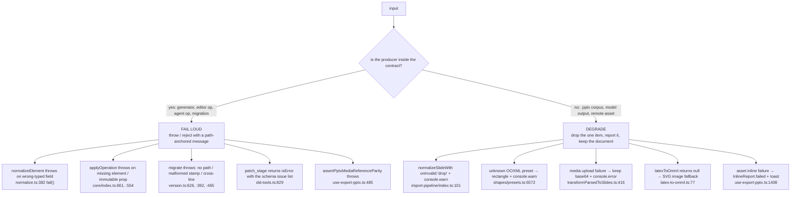
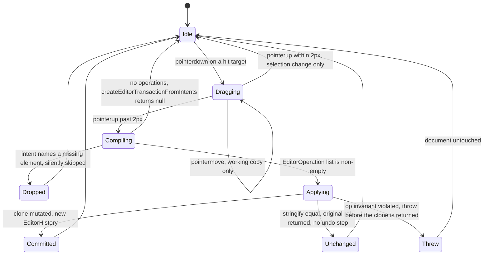

# 05 — Failure modes and error handling

The subsystem has a consistent, deliberate split: **contract boundaries fail loud**, **wild-world input
boundaries degrade with a report**. This file lists each boundary, what it does on failure, and where
that is decided.

## 1. The two policies

## 2. Per-boundary table

### `@openmaic/dsl`

| Boundary | On failure | Evidence |
| --- | --- | --- |
| `normalizeElement` on a non-object | `throw` "expected an object, got …" | [`normalize.ts:562`](packages/@openmaic/dsl/src/normalize.ts#L562) |
| `normalizeElement` on an unknown `type` | `throw` "unknown element type …" | [`normalize.ts:582`](packages/@openmaic/dsl/src/normalize.ts#L582) |
| a required content field present with the wrong type | `throw` via `fail()` naming element type, id, field and expectation | [`normalize.ts:382`](packages/@openmaic/dsl/src/normalize.ts#L382) |
| a shape's `text` present but not an object | `throw` "must be an object (ShapeText)" | [`normalize.ts:496`](packages/@openmaic/dsl/src/normalize.ts#L496) |
| `normalizeSlideWith({onInvalid:'drop'})` | element dropped, `onDropped(element, error)` invoked; the slide survives | [`normalize.ts:636`](packages/@openmaic/dsl/src/normalize.ts#L636) |
| `normalizePBLProject` with mixed milestone/microtask status presence | `throw` "present on every item or absent from every item" | [`normalize.ts:183`](packages/@openmaic/dsl/src/normalize.ts#L183) |
| `migrate` with no contiguous ladder path | `throw` `no migration path from "x" to "y"` | [`version.ts:626`](packages/@openmaic/dsl/src/version.ts#L626) |
| ladder that does not advance (cyclic registry) | loop bounded at `ladder.length + 1`, then `throw` "did not reach" | [`version.ts:622`](packages/@openmaic/dsl/src/version.ts#L622), [`:632`](packages/@openmaic/dsl/src/version.ts#L632) |
| malformed `x.y.z` stamp | `throw` `invalid <key> stamp …` | [`version.ts:392`](packages/@openmaic/dsl/src/version.ts#L392) |
| own stamp absent + sibling stamp present | `throw` `crossLineError` | [`version.ts:388`](packages/@openmaic/dsl/src/version.ts#L388), [`:465`](packages/@openmaic/dsl/src/version.ts#L465) |
| runtime-line function handed an unstamped object | `throw` `noRuntimeEpochError` | [`version.ts:389`](packages/@openmaic/dsl/src/version.ts#L389), [`:488`](packages/@openmaic/dsl/src/version.ts#L488) |
| document stamped **newer** than `DSL_VERSION` | returned untouched; on-disk shape preserved for the next compatible reader | [`version.ts:617`](packages/@openmaic/dsl/src/version.ts#L617) |
| a non-object handed to `migrate` / `needsMigration` | returned as-is / `false` — not an error | [`version.ts:605`](packages/@openmaic/dsl/src/version.ts#L605), [`:447`](packages/@openmaic/dsl/src/version.ts#L447) |
| any `validate*` on bad input | never throws; returns `{valid:false, errors:[{path,message}]}` | [`validate.ts:104`](packages/@openmaic/dsl/src/validate.ts#L104) |

The migration ladder's *idempotence* and *purity* are contract requirements, not conventions
([`version.ts:152`](packages/@openmaic/dsl/src/version.ts#L152)): a migration must not have side effects and must not depend on a runtime library.
`stripLegacyLineGeometry` is documented as never throwing and never inventing shape
([`legacy-line-geometry.ts:38`](packages/@openmaic/dsl/src/legacy-line-geometry.ts#L38)) — it is a targeted cleanup, not a validator.

### `@openmaic/renderer`

| Boundary | On failure | Evidence |
| --- | --- | --- |
| `<SlideCanvas>` with no `slide` prop and no provider | `throw` "requires `slide` either as a prop or via `<SlideRendererProvider>`" | [`SlideCanvas.tsx:92`](packages/@openmaic/renderer/src/SlideCanvas.tsx#L92) |
| `slideToPng` outside a browser | `throw` "requires a browser environment" | [`snapshot/index.ts:94`](packages/@openmaic/renderer/src/snapshot/index.ts#L94) |
| `slideToPng` with a CORS-tainted canvas or a missing KaTeX embed | falls back from `html-to-image` to `html2canvas-pro` rather than shipping broken output | [`snapshot/index.ts:22`](packages/@openmaic/renderer/src/snapshot/index.ts#L22) |
| `measureSlideElementGeometry` outside a browser | `throw` | [`snapshot/measure.ts:79`](packages/@openmaic/renderer/src/snapshot/measure.ts#L79) |
| `measureSlideElementGeometry` for an element id that is not in the DOM | id **absent from the result map**; the caller falls back to the authored box. Never throws | [`snapshot/measure.ts:65`](packages/@openmaic/renderer/src/snapshot/measure.ts#L65), [`:151`](packages/@openmaic/renderer/src/snapshot/measure.ts#L151) |
| container measured as zero-sized | returns the (possibly empty) map early | [`snapshot/measure.ts:147`](packages/@openmaic/renderer/src/snapshot/measure.ts#L147) |
| font loading | each `document.fonts.load` is `.catch(() => undefined)`; the whole wait is `Promise.race`d against `timeoutMs` (default 5000) | [`snapshot/measure.ts:126`](packages/@openmaic/renderer/src/snapshot/measure.ts#L126) |
| an element whose rect is 0×0 | skipped (`continue`) | [`snapshot/measure.ts:155`](packages/@openmaic/renderer/src/snapshot/measure.ts#L155) |
| unrecoverable SVG path token in `pathCoordBBox` | unknown token skipped to avoid an infinite loop; non-finite bbox → `null` → no padding | [`elements/shape/BaseShapeElement.tsx:82`](packages/@openmaic/renderer/src/elements/shape/BaseShapeElement.tsx#L82), [`:85`](packages/@openmaic/renderer/src/elements/shape/BaseShapeElement.tsx#L85) |
| an element `type` the renderer does not know | `SlideElementContent` returns `null` — the element silently does not paint | [`SlideElement.tsx:99`](packages/@openmaic/renderer/src/SlideElement.tsx#L99), [`:103`](packages/@openmaic/renderer/src/SlideElement.tsx#L103) |

That last row is a real silent-failure surface: the renderer's switch has no default warning, so a
future DSL element type renders as nothing until someone notices.

### `@openmaic/editor`

| Boundary | On failure | Evidence |
| --- | --- | --- |
| `createEditorTransaction` with zero operations | `throw` "must contain at least one operation" | [`core/index.ts:152`](packages/@openmaic/editor/src/core/index.ts#L152) |
| `createEditorTransactionFromIntents` compiling to zero operations | returns `null`; the host does nothing | [`core/index.ts:278`](packages/@openmaic/editor/src/core/index.ts#L278) |
| an `EditIntent` naming a nonexistent element | **silently dropped** at compile time | [`core/index.ts:185`](packages/@openmaic/editor/src/core/index.ts#L185), [`:191`](packages/@openmaic/editor/src/core/index.ts#L191), [`:200`](packages/@openmaic/editor/src/core/index.ts#L200), [`:210`](packages/@openmaic/editor/src/core/index.ts#L210), [`:227`](packages/@openmaic/editor/src/core/index.ts#L227) |
| an `EditorOperation` naming a nonexistent element | `throw` `<op>: element "<id>" does not exist` | [`core/index.ts:661`](packages/@openmaic/editor/src/core/index.ts#L661) |
| `element.add` with a duplicate id | `throw` `id "<id>" already exists` | [`core/index.ts:434`](packages/@openmaic/editor/src/core/index.ts#L434) |
| `element.duplicate` with an `idMap` gap or a colliding new id | `throw` | [`core/index.ts:477`](packages/@openmaic/editor/src/core/index.ts#L477), [`:478`](packages/@openmaic/editor/src/core/index.ts#L478) |
| patch touching `id`/`type` | `throw` "cannot mutate immutable property" | [`core/index.ts:554`](packages/@openmaic/editor/src/core/index.ts#L554) |
| `slide.update` touching `elements`/`animations` | `throw` "cannot mutate elements or animations" | [`core/index.ts:568`](packages/@openmaic/editor/src/core/index.ts#L568) |
| a required field set to `undefined` or a wrong kind | `throw` naming the property and the expected kind | [`core/index.ts:612`](packages/@openmaic/editor/src/core/index.ts#L612), [`:617`](packages/@openmaic/editor/src/core/index.ts#L617) |
| removing a required property | `throw` "cannot remove required property … from <type> elements" | [`core/index.ts:507`](packages/@openmaic/editor/src/core/index.ts#L507) |
| partial application | impossible: every op runs against an isolated clone, and a throw happens before it is returned | [`core/index.ts:397`](packages/@openmaic/editor/src/core/index.ts#L397) |
| a no-op transaction | original `SlideContent` reference returned → `applyEditorTransaction` returns the original history → no undo step | [`core/index.ts:401`](packages/@openmaic/editor/src/core/index.ts#L401), [`:299`](packages/@openmaic/editor/src/core/index.ts#L299) |
| a transaction arriving after the user switched scenes | `applyTransactionForScene` drops it | [`components/edit/surfaces/slide/slide-edit-session.ts:138`](components/edit/surfaces/slide/slide-edit-session.ts#L138) |
| a legacy toolbar op whose element was already deleted | deliberately a **silent no-op**, unlike explicit transactions which stay strict | [`slide-edit-session.ts:117`](components/edit/surfaces/slide/slide-edit-session.ts#L117) |
| ResizeObserver auto-height commit | `present` replaced and written through, `past` untouched, `future` cleared | [`slide-edit-session.ts:147`](components/edit/surfaces/slide/slide-edit-session.ts#L147), rationale [`:50`](components/edit/surfaces/slide/slide-edit-session.ts#L50) |

### Importer

| Boundary | On failure | Evidence |
| --- | --- | --- |
| the vendored bundle is missing at build time | `pnpm build` exits 1 with the exact repair command | [`scripts/assert-vendor-maic-importer.mjs:25`](scripts/assert-vendor-maic-importer.mjs#L25) |
| the vendored bundle is missing at runtime | `HEAD` probe → `PARSER_NOT_DEPLOYED` → a distinct toast (`import.error.parserUnavailable`) instead of an opaque `SyntaxError` | [`lib/import/use-import-pptx.ts:74`](lib/import/use-import-pptx.ts#L74), [`:96`](lib/import/use-import-pptx.ts#L96) |
| `sync-maic-importer.mjs` run before the importer is built | exits 1 telling you to build first | [`scripts/sync-maic-importer.mjs:22`](scripts/sync-maic-importer.mjs#L22) |
| unknown OOXML preset geometry | `console.warn` + rectangle fallback | [`packages/@openmaic/importer/src/shapes/presets.ts:6572`](packages/@openmaic/importer/src/shapes/presets.ts#L6572) |
| `prst="textNoShape"` | empty path (text-only shape), by design | [`presets.ts:6564`](packages/@openmaic/importer/src/shapes/presets.ts#L6564) |
| a parsed path containing `NaN` | `NaN` → `0`, zero dimensions bumped to `0.1` | [`transformParsedToSlides.ts:986`](packages/@openmaic/importer/src/import-pipeline/transformParsedToSlides.ts#L986) |
| background-image upload failure | `console.error('背景图片上传失败:', …)`, base64 stays in the document | [`transformParsedToSlides.ts:416`](packages/@openmaic/importer/src/import-pipeline/transformParsedToSlides.ts#L416) |
| shape pattern-fill upload failure | `console.error('形状填充图片上传失败:', …)`, base64 stays | [`transformParsedToSlides.ts:1011`](packages/@openmaic/importer/src/import-pipeline/transformParsedToSlides.ts#L1011) |
| any upload with a missing inner `.catch` | `Promise.allSettled` at the pipeline level means it cannot fail the whole import | [`import-pipeline/index.ts:76`](packages/@openmaic/importer/src/import-pipeline/index.ts#L76), rationale [`:13`](packages/@openmaic/importer/src/import-pipeline/index.ts#L13) |
| an element the DSL cannot normalize | dropped with a `console.warn` naming the normalization error | [`import-pipeline/index.ts:101`](packages/@openmaic/importer/src/import-pipeline/index.ts#L101)–[`:110`](packages/@openmaic/importer/src/import-pipeline/index.ts#L110) |
| any parse failure (browser) | caught, logged, `import.error.invalidPptx` toast | [`lib/import/use-import-pptx.ts:92`](lib/import/use-import-pptx.ts#L92)–[`:99`](lib/import/use-import-pptx.ts#L99) |
| server parse: worker file absent | `throw` "PPTX import worker is missing from the deployment." | [`lib/server/agent-runtime/import-pptx.ts:268`](lib/server/agent-runtime/import-pptx.ts#L268) |
| server parse: exceeds 90 s | worker terminated | [`lib/server/agent-runtime/import-pptx.ts:288`](lib/server/agent-runtime/import-pptx.ts#L288), deadline [`:42`](lib/server/agent-runtime/import-pptx.ts#L42) |
| server parse: worker throws | posts `{error: message}` to the parent instead of crashing | [`lib/server/agent-runtime/import-pptx-worker.mjs:128`](lib/server/agent-runtime/import-pptx-worker.mjs#L128) |
| `WorkerXHR` fetch failure | `readyState = 4` then `onerror(error)`; aborts are swallowed | [`import-pptx-worker.mjs:84`](lib/server/agent-runtime/import-pptx-worker.mjs#L84) |

The importer's failure philosophy is stated once, in [`import-pipeline/index.ts:13`](packages/@openmaic/importer/src/import-pipeline/index.ts#L13): "every upload site
inside `transformParsedToSlides` already swallows individual errors and leaves the original base64 in
place; we use `Promise.allSettled` here so a missing inner `.catch` cannot fail the whole import
either." That is defence in depth, and it is why an import never partially fails — it just quietly
carries larger payloads.

### Agent DSL ops

| Boundary | On failure | Evidence |
| --- | --- | --- |
| pointer not starting `/canvas/` (slide) | `fail` "slide patch path must start with /canvas/ after removing the scene /content prefix" | [`course-edit/apply.ts:381`](lib/server/agent-runtime/course-edit/apply.ts#L381) |
| `set` with no `value` / `remove` with a `value` | `fail` with the corrective hint | [`course-edit/apply.ts:386`](lib/server/agent-runtime/course-edit/apply.ts#L386), [`:389`](lib/server/agent-runtime/course-edit/apply.ts#L389) |
| bad `~0`/`~1` escape | `fail` "bad JSON pointer escape in path …" | [`course-edit/apply.ts:153`](lib/server/agent-runtime/course-edit/apply.ts#L153) |
| non-canonical or out-of-bounds array index | `fail` naming the index and the length | [`course-edit/apply.ts:162`](lib/server/agent-runtime/course-edit/apply.ts#L162), [`:166`](lib/server/agent-runtime/course-edit/apply.ts#L166) |
| path crossing a non-container or a missing key | `fail` naming the token | [`course-edit/apply.ts:184`](lib/server/agent-runtime/course-edit/apply.ts#L184), [`:187`](lib/server/agent-runtime/course-edit/apply.ts#L187) |
| patch changing identity | `fail` "patch cannot add, remove, or change element ids; use add_element/delete_element" | [`course-edit/apply.ts:366`](lib/server/agent-runtime/course-edit/apply.ts#L366) |
| patch producing an out-of-contract canvas | `fail` `patch rejected: <canvas/... : message>; …` from the closed TypeBox schema | [`course-edit/apply.ts:408`](lib/server/agent-runtime/course-edit/apply.ts#L408) → [`element-schema.ts:689`](lib/server/agent-runtime/course-edit/element-schema.ts#L689) |
| `add_element` including an `id` | `fail` "the server assigns element identity" | [`course-edit/apply.ts:432`](lib/server/agent-runtime/course-edit/apply.ts#L432) |
| `add_element` with both `afterId` and `index` | `fail` "accepts either afterId or index, not both" | [`course-edit/apply.ts:439`](lib/server/agent-runtime/course-edit/apply.ts#L439) |
| `str_replace` anchor not found / ambiguous | `fail` "0 occurrences" / "occurs N times; extend the anchor or set replaceAll" | [`course-edit/apply.ts:344`](lib/server/agent-runtime/course-edit/apply.ts#L344), [`:347`](lib/server/agent-runtime/course-edit/apply.ts#L347) |
| `str_replace` on a non-string field | `fail` naming the actual type | [`course-edit/apply.ts:323`](lib/server/agent-runtime/course-edit/apply.ts#L323) |
| a read-time media placeholder written back | `fail` with `READ_PLACEHOLDER_REJECTION` (value, anchor, and replacement all checked) | [`course-edit/apply.ts:218`](lib/server/agent-runtime/course-edit/apply.ts#L218), [`:237`](lib/server/agent-runtime/course-edit/apply.ts#L237), [`:327`](lib/server/agent-runtime/course-edit/apply.ts#L327), [`:332`](lib/server/agent-runtime/course-edit/apply.ts#L332) |
| a placeholder assembled **across** ops | caught after the last op by re-scanning the serialized scene | [`dsl-tools.ts:820`](lib/server/agent-runtime/dsl-tools.ts#L820) |
| resulting scene failing structural validation | `patch_stage rejected after op N: …` | [`dsl-tools.ts:829`](lib/server/agent-runtime/dsl-tools.ts#L829) |
| the scene cannot be persisted | `patch_stage could not persist the scene: <message>` | [`dsl-tools.ts:840`](lib/server/agent-runtime/dsl-tools.ts#L840) |
| `putScene` hitting `DocumentVersionError{not-current}` | recovered: reload the migrated aggregate, splice, `saveDocument` | [`lib/server/agent-runtime/document-writes.ts:41`](lib/server/agent-runtime/document-writes.ts#L41) |
| any other store error | rethrown untouched | [`document-writes.ts:41`](lib/server/agent-runtime/document-writes.ts#L41) |

The `not-current` recovery has a documented accepted limitation ([`document-writes.ts:22`](lib/server/agent-runtime/document-writes.ts#L22)): the
reload → splice → save spans two transactions, so a concurrent browser autosave inside that window is
pruned. It is one-shot per document.

### Export

| Boundary | On failure | Evidence |
| --- | --- | --- |
| manifest walk and layout walk disagree | `throw` `PPTX media manifest/layout mismatch: manifest-only=…, layout-only=…` | [`use-export-pptx.ts:485`](lib/export/use-export-pptx.ts#L485) |
| layout resolving a ref outside the manifest (and not task-owned) | `throw` `PPTX layout attempted to resolve a ref outside the asset manifest: <ref>` | [`use-export-pptx.ts:518`](lib/export/use-export-pptx.ts#L518) |
| a media ref that resolves to nothing | element **skipped** (`continue`) | [`use-export-pptx.ts:1114`](lib/export/use-export-pptx.ts#L1114) |
| a media fetch returning non-2xx | `throw` inside the per-element `try`, caught by the element's own handler | [`use-export-pptx.ts:1123`](lib/export/use-export-pptx.ts#L1123) |
| `latexToOmml` throwing anywhere in the chain | returns `null`, logs `Failed to convert: "<latex>"` | [`latex-to-omml.ts:77`](lib/export/latex-to-omml.ts#L77) |
| LaTeX with no OMML **and** no legacy `path` | the formula is silently omitted (neither branch taken) | [`use-export-pptx.ts:1046`](lib/export/use-export-pptx.ts#L1046), [`:1056`](lib/export/use-export-pptx.ts#L1056) |
| `svg2Base64` returning falsy | element skipped (`continue`) | [`use-export-pptx.ts:1082`](lib/export/use-export-pptx.ts#L1082) |
| PPTX export with zero slide scenes | `toast.warning(export.noSlides)`, no export attempted | [`use-export-pptx.ts:1323`](lib/export/use-export-pptx.ts#L1323) |
| a second export while one is running | ignored via `exportingRef` | [`use-export-pptx.ts:1322`](lib/export/use-export-pptx.ts#L1322) |
| any export throw | `log.error` + `toast.error(export.exportFailed)`, `exporting` reset in `finally` | [`use-export-pptx.ts:1332`](lib/export/use-export-pptx.ts#L1332)–[`:1338`](lib/export/use-export-pptx.ts#L1338) |
| resource pack with nothing exportable | `toast.warning(export.nothingToExport)` | [`use-export-pptx.ts:1399`](lib/export/use-export-pptx.ts#L1399) |
| resource pack with interactive scenes only | PPTX skipped, `toast.info(export.noSlidesSkipped)` | [`use-export-pptx.ts:1403`](lib/export/use-export-pptx.ts#L1403) |
| assets that could not be inlined | `log.warn` + `toast.warning(export.inlinePartial)` with the distinct hosts listed | [`use-export-pptx.ts:1408`](lib/export/use-export-pptx.ts#L1408)–[`:1426`](lib/export/use-export-pptx.ts#L1426) |
| classroom ZIP: reference conversion failure | fresh allocations rolled back, falls back to the accessed document snapshot | [`use-export-classroom.ts:71`](lib/export/use-export-classroom.ts#L71) |
| `html-edit.ts` anchor not unique / not found | `throw` with a model-actionable message so the agent can retry with a longer anchor | [`lib/edit/html-edit.ts:17`](lib/edit/html-edit.ts#L17) |

## 3. Silent-failure inventory

These are the places where something can go wrong and nothing surfaces to a user. Listed because they
are the ones a documentation reader will trip over.

| Silent failure | Location | Why it is silent |
| --- | --- | --- |
| An unrecognised element `type` paints nothing | [`renderer/src/SlideElement.tsx:99`](packages/@openmaic/renderer/src/SlideElement.tsx#L99) | `switch` returns `null` with no default branch or warning |
| An `EditIntent` naming a deleted element vanishes | [`editor/src/core/index.ts:185`](packages/@openmaic/editor/src/core/index.ts#L185) | intents are the *lenient* layer by design; ops are the strict one |
| A legacy-toolbar op on a deleted element vanishes | [`slide-edit-session.ts:117`](components/edit/surfaces/slide/slide-edit-session.ts#L117) | explicit compatibility behaviour |
| An unknown OOXML preset becomes a rectangle | [`importer/src/shapes/presets.ts:6572`](packages/@openmaic/importer/src/shapes/presets.ts#L6572) | `console.warn` only; nothing reaches the UI |
| A failed media upload leaves base64 in the document | [`transformParsedToSlides.ts:416`](packages/@openmaic/importer/src/import-pipeline/transformParsedToSlides.ts#L416), [`:1011`](packages/@openmaic/importer/src/import-pipeline/transformParsedToSlides.ts#L1011) | `console.error` only; the import still reports success |
| A dropped element during import | [`import-pipeline/index.ts:104`](packages/@openmaic/importer/src/import-pipeline/index.ts#L104) | `console.warn` only; the success toast reports the slide count, not the drop count |
| LaTeX with neither OMML nor a legacy `path` is omitted from the `.pptx` | [`use-export-pptx.ts:1046`](lib/export/use-export-pptx.ts#L1046) | no `else` branch; the export still succeeds |
| A skipped media element in the `.pptx` | [`use-export-pptx.ts:1114`](lib/export/use-export-pptx.ts#L1114) | bare `continue`, no counter, no toast |
| `detectUnit`'s `> 20000` EMU heuristic misclassifying a value | [`importer/src/parser/units.ts:47`](packages/@openmaic/importer/src/parser/units.ts#L47) | no provenance flag to check against |

## 4. What is genuinely well guarded

- **No partial writes anywhere.** The editor clones before applying ([`core/index.ts:397`](packages/@openmaic/editor/src/core/index.ts#L397)), the agent op
  layer clones per op ([`course-edit/apply.ts:242`](lib/server/agent-runtime/course-edit/apply.ts#L242), [`:290`](lib/server/agent-runtime/course-edit/apply.ts#L290), [`:397`](lib/server/agent-runtime/course-edit/apply.ts#L397)), and the migration ladder returns
  fresh objects per step ([`version.ts:628`](packages/@openmaic/dsl/src/version.ts#L628)).
- **Ambiguity is an error, not a guess.** The cross-line version guard ([`version.ts:589`](packages/@openmaic/dsl/src/version.ts#L589)), the
  duplicate-schema-source check in the version gate ([`check-package-version-bumps.mjs:342`](scripts/check-package-version-bumps.mjs#L342)), and the
  `str_replace` multi-occurrence rejection ([`course-edit/apply.ts:347`](lib/server/agent-runtime/course-edit/apply.ts#L347)) all refuse to pick.
- **Fail-closed gates.** The version gate errors rather than passes when it cannot read the constants
  ([`check-package-version-bumps.mjs:351`](scripts/check-package-version-bumps.mjs#L351)); the vendor assert errors rather than lets a 404 through
  ([`assert-vendor-maic-importer.mjs:22`](scripts/assert-vendor-maic-importer.mjs#L22)).
- **Loop bounds on data-driven iteration.** The migration ladder ([`version.ts:622`](packages/@openmaic/dsl/src/version.ts#L622)) and the SVG path
  tokenizer ([`BaseShapeElement.tsx:82`](packages/@openmaic/renderer/src/elements/shape/BaseShapeElement.tsx#L82)) both have explicit escape hatches.
