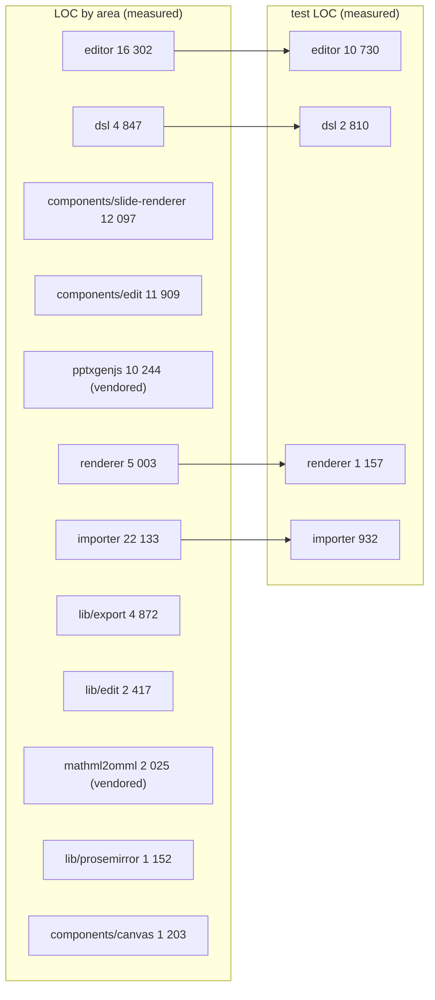

# 06 — Quality observations and measured metrics

## 1. Measured metrics

Every number below was produced by the command next to it, run from the repo root on 2026-09-03 at
`c2c9553a`. `$SCOPE` means the ten in-scope source directories, written to a file list first because
the sandbox shell does not word-split an unquoted variable:

```sh
find packages/@openmaic/dsl/src packages/@openmaic/renderer/src \
     packages/@openmaic/editor/src packages/@openmaic/importer/src \
     lib/prosemirror lib/edit lib/export \
     components/slide-renderer components/edit components/canvas \
     -type f -name '*.ts' -o -type f -name '*.tsx' > /tmp/scope.txt
```

| Metric | Value | Command |
| --- | --- | --- |
| in-scope source files | 444 | `wc -l < /tmp/scope.txt` |
| in-scope source LOC | 81 935 | `xargs cat < /tmp/scope.txt \| wc -l` |
| files over the 800-line house limit | 12 | `xargs wc -l < /tmp/scope.txt \| awk '$1>800 && $2!="total"'` |
| `TODO`/`FIXME`/`HACK` markers | 8 | `xargs grep -n "TODO\|FIXME\|HACK" < /tmp/scope.txt \| wc -l` |
| `: any` / `as any` occurrences | 18 | `xargs grep -n ": any\|as any" < /tmp/scope.txt \| wc -l` |
| `console.*` calls | 26 | `xargs grep -n "console\." < /tmp/scope.txt \| wc -l` |
| `@ts-expect-error` / `@ts-ignore` | 6 | `xargs grep -n "@ts-expect-error\|@ts-ignore" < /tmp/scope.txt \| wc -l` |
| `as unknown as` casts | 26 | `xargs grep -n "as unknown as" < /tmp/scope.txt \| wc -l` |

Per-directory LOC (same `find … -exec cat {} + \| wc -l` per directory, including
`.js`/`.mjs` — which is why vendored `mathml2omml/src` reads 31 files, 30 of them
`.js`). Note the two scopes differ: this table lists **12** directories, while the
81 935 in-scope total above covers only the **10 non-vendored** ones — the ten rows
below excluding `pptxgenjs/src` and `mathml2omml/src` sum to exactly 81 935:

| Directory | Files | LOC |
| --- | --- | --- |
| `packages/@openmaic/dsl/src` | 16 | 4 847 |
| `packages/@openmaic/renderer/src` | 48 | 5 003 |
| `packages/@openmaic/editor/src` | 113 | 16 302 |
| `packages/@openmaic/importer/src` | 51 | 22 133 |
| `packages/pptxgenjs/src` (vendored) | 10 | 10 244 |
| `packages/mathml2omml/src` (vendored) | 31 | 2 025 |
| `lib/prosemirror` | 16 | 1 152 |
| `lib/edit` | 24 | 2 417 |
| `lib/export` | 23 | 4 872 |
| `components/slide-renderer` | 84 | 12 097 |
| `components/edit` | 66 | 11 909 |
| `components/canvas` | 3 | 1 203 |

Files over 800 lines, from `xargs wc -l < /tmp/scope.txt | awk '$1>800 && $2!="total" {print}' | sort -rn`:

```
6574 packages/@openmaic/importer/src/shapes/presets.ts
1848 components/edit/PlaybackChromeRoot.tsx
1794 packages/@openmaic/importer/src/serializer/textSerializer.ts
1480 components/edit/ActionsBar/ActionsBar.tsx
1443 lib/export/use-export-pptx.ts
1376 packages/@openmaic/importer/src/import-pipeline/transformParsedToSlides.ts
1271 packages/@openmaic/importer/src/serializer/shapeSerializer.ts
1109 packages/@openmaic/editor/src/ui/styles.ts
1031 packages/@openmaic/importer/src/openmaic/configs/shapes.ts
 995 packages/@openmaic/dsl/src/slides.ts
 840 packages/@openmaic/editor/src/react/EditableSlideCanvas.tsx
 835 packages/@openmaic/importer/src/serializer/StyleResolver.ts
```

### Test surface

`find <dir> -type f -name '*.test.ts*' | wc -l` for the file count, `-exec cat {} + | wc -l` for LOC,
and `grep -rhoE "\b(it|test)(\.each|\.skip|\.only)?\(" <dir> | wc -l` for the approximate case count:

| Suite | Test files | Test LOC | Cases ≈ |
| --- | --- | --- | --- |
| `packages/@openmaic/dsl/test` | 7 | 2 810 | 200 |
| `packages/@openmaic/renderer/test` | 14 | 1 157 | 45 |
| `packages/@openmaic/editor/test` | 49 | 10 730 | 432 |
| `packages/@openmaic/importer/test` | 12 | 932 | 36 |
| `tests/edit` | 51 | — | 364 |
| `tests/export` | 14 | — | 171 |
| `tests/slide-renderer` | 7 | — | 44 |
| `tests/import` | 1 | — | 14 |
| `tests/scene-renderers` | 2 | — | — |
| `tests/prosemirror` | 1 | — | 2 |
| `tests/packages` | 1 | — | — |

Test-to-source ratio by LOC, per package: dsl 2 810 / 4 847 = **0.58**, editor 10 730 / 16 302 =
**0.66**, renderer 1 157 / 5 003 = **0.23**, importer 932 / 22 133 = **0.04**.

**The suites could not be executed.** `ls -d node_modules` returns nothing at the repo root and in
every package, and `packages/@openmaic/dsl/dist` and `public/vendor/maic-importer` are both absent, so
`npx vitest run` fails at config load (`Cannot find package 'vitest'`). Every number above is a static
measurement. Nothing here should be read as "tests pass".

### Contract surface counts

| Metric | Value | Command |
| --- | --- | --- |
| `PPTElement` union members | 10 | `grep -c "^  \| PPT" packages/@openmaic/dsl/src/slides.ts` |
| `PPT_ELEMENT_TYPES` entries | 10 | node regex over `guards.ts` for `^  '\w+',$` |
| `Action` union members | 21 | node regex over the `export type Action =` block counting `\|` |
| `ACTION_TYPES` entries | 21 | node regex over the `ACTION_TYPES` tuple counting quote pairs / 2 |
| `SceneType` members | 4 | `stage.ts:22` |
| `WidgetType` members | 6 | `interactive.ts:4` |
| `EditorOperation` variants | 13 | read from `editor/src/core/index.ts:88` |
| `EditIntent` variants | 10 | read from `editor/src/core/index.ts:119` |
| `lib/edit/slide-ops.ts` op variants | 11 | `grep -c "^      type: '" lib/edit/slide-ops.ts` |
| `presetShapes.set(...)` | 154 | `grep -c 'presetShapes.set(' .../shapes/presets.ts` |
| `multiPathPresets.set(...)` | 44 | `grep -c 'multiPathPresets.set(' .../shapes/presets.ts` |
| `presetOverlays.set(...)` | 1 | `grep -c 'presetOverlays.set(' .../shapes/presets.ts` |
| `SHAPE_PATH_FORMULAS` keys | 21 | `grep -c '^  \[ShapePathFormulasKeys\.' .../openmaic/configs/shapes.ts` |
| `SHAPE_LIST` entries with `pptxShapeType` | 26 | `grep -c 'pptxShapeType' .../openmaic/configs/shapes.ts` |
| files carrying `'use client'` — renderer / editor | 23 / 38 | `grep -rl "'use client'" <pkg>/src \| wc -l` |



The visual point of that diagram: the importer is the largest module in the subsystem and has the
thinnest test cover of the four packages, by an order of magnitude.

## 2. What is genuinely well built

| Observation | Evidence | Severity |
| --- | --- | --- |
| **Two-sided exhaustiveness on eight enumerated unions.** `satisfies readonly T[]` proves each tuple entry is valid; a companion conditional type proves the tuple covers the union. Adding a variant without extending the tuple is a build failure, so a validator can never silently reject a new valid variant. Eight `as const satisfies readonly T[]` sites carry it: scene types, action types, element types, widget types, runtime session statuses, core runtime kinds, chat runtime roles and quiz attempt phases. Whether this covers *every* enumerated union in the DSL was not proven — that is a negative over all string-literal unions, and only these eight were enumerated. | `stage.ts:30`, `action.ts:312`, `guards.ts:36`, `interactive.ts:20`, `runtime.ts:65`/`:166`/`:289`/`:339` | strength |
| **The version design refuses to guess.** Disjoint stamp fields are recognised as *necessary but not sufficient*, and the cross-line guard closes the residual hole by throwing on an undecidable envelope. Both silent alternatives are named and rejected in a comment, with the specific corruption each would cause. | `version.ts:99`, `:465`, `:589` | strength |
| **Migration endpoints are pinned literals, never the moving constant.** So appending a step cannot retroactively re-target an existing one. | `version.ts:78`, `:235` | strength |
| **One source of truth for element defaults, mirrored into the schema and pinned by a test.** `ELEMENT_DEFAULTS` and the `@default` JSDoc tags cannot drift. | `normalize.ts:69`, `gen-schema.mjs:36` | strength |
| **Atomicity is structural, not conventional.** Every mutating path clones first and throws before returning, so a partially applied transaction is not expressible. | `editor/src/core/index.ts:397`; `course-edit/apply.ts:242`, `:290`, `:397` | strength |
| **Comments explain the *rejected* alternative, not the chosen one.** Repeatedly: why `normalizeSlide` is unary (`normalize.ts:614`), why `Date.parse` cannot validate ISO (`runtime.ts:114`), why the parser path beats the preset formula (`transformParsedToSlides.ts:958`), why the SVG viewport is grown (`BaseShapeElement.tsx:174`), why `fonts.ready` alone is racy (`measure.ts:110`). This is unusually high-value documentation. | many | strength |
| **The gates carry their own threat model and limitations.** The version-bump script states what it under-approximates and why closing it is a different decision; the package list states that config-in-repo cannot stop deliberate subversion. | `check-package-version-bumps.mjs:14`; `openmaic-packages.mjs:17` | strength |
| **Degrade-vs-fail is a policy, not an accident.** `NormalizeSlideOptions.onInvalid` makes the choice explicit at the call site, and the importer's reasoning for choosing `'drop'` is written down. | `normalize.ts:589`; `import-pipeline/index.ts:85` | strength |
| **The editor's controlled-component contract is honest.** Id-based selection survives edits, `EMPTY_SELECTION` is frozen, the canvas is inert without callbacks, and one gesture is documented to equal one undo entry. | `editor/src/react/types.ts:36`, `:47`, `:72` | strength |
| **The asset seam is designed against an information leak.** `put` must allocate a fresh ref every call, with the existence-oracle reasoning spelled out, and the residual channels (quota, metering) are named as out of scope rather than ignored. | `storage.ts:77` | strength |

## 3. Fragilities

| Observation | Evidence | Severity |
| --- | --- | --- |
| **The agent-facing TypeBox schemas are a hand-maintained mirror of `slides.ts`.** `element-schema.ts:15` says the field sets "mirror `@openmaic/dsl` `slides.ts` exactly" — 694 lines of hand-written duplication of a 995-line type file, with no generated cross-check in that file. The DSL already emits `scene.schema.json` from the same types; nothing forces the TypeBox copy to track it. Adding a DSL field means editing two files, and forgetting the second makes every `patch_stage` touching that field fail with "unknown property". | `lib/server/agent-runtime/course-edit/element-schema.ts:15` vs `packages/@openmaic/dsl/src/slides.ts` and `dist/schema/scene.schema.json` | high |
| **Two near-duplicate op kernels with different strictness.** `@openmaic/editor/src/core/index.ts` (779 LOC, strict: throws on a missing element) and `lib/edit/slide-ops.ts` (359 LOC, immer, lenient: silent no-op). Both are live — the packaged one behind a flag, the app one on the default path. The divergence is documented as deliberate for the *server* surface (`course-edit/apply.ts:122`) but the browser-vs-browser duplication is not. A behaviour fix has to land twice. | `editor/src/core/index.ts:661` vs `lib/edit/slide-ops.ts:184` | high |
| **Two near-duplicate ProseMirror stacks.** `lib/prosemirror/` (1 152 LOC) and `packages/@openmaic/editor/src/react/text/prosemirror/` — same schema shape, same command names, same plugin set, different `createDocument`/`createTextDocument` implementations. The packaged one has the markup-detection two-branch parse (`document.ts:12`); the app one does not (`lib/prosemirror/index.ts:12` always wraps in `<div>`). So a plain-text `content` with newlines round-trips differently depending on which editor is enabled. | `lib/prosemirror/index.ts:12` vs `editor/src/react/text/prosemirror/document.ts:12` | high |
| **`presets.ts` is 6 574 lines with 154 registry entries and one shared fallback.** Nothing in the file structure prevents a wrong path formula from silently shipping; the only signal for an *unregistered* shape is a `console.warn` that never reaches the UI, and there is no signal at all for a registered-but-wrong one. The importer has 932 test LOC against 22 133 source LOC. | `presets.ts:6572`; test ratio measured above | high |
| **Line elements overload `width` as stroke width.** The DSL documents `width` on `PPTBaseElement` as the element width and `PPTLineElement` inherits it, but the renderer uses it as `strokeWidth` and as the dash-array base. Nothing in the type or the validators says so; the only evidence is the renderer. A caller that resizes a line by setting `width` changes its thickness. | `slides.ts:480` vs `renderer/src/elements/line/BaseLineElement.tsx:34`, `:119` | medium |
| **The renderer silently paints nothing for an unknown element type.** No default branch, no warning. | `renderer/src/SlideElement.tsx:99` | medium |
| **`resizeIntent` emits box props only, by design.** A shape's `path`/`viewBox`, a table's `cellMinHeight`, and an image's clip mode are explicitly not recomputed and left to the host. The legacy canvas *does* recompute them (`components/slide-renderer/Editor/Canvas/hooks/useScaleElement.ts`, 695 LOC). So resizing the same shape produces different documents depending on the flag. | `editor/src/react/core/intent.ts:19` | medium |
| **Three version lines, one of them undocumented in the package.** `dslVersion`, `runtimeDslVersion` and the app-only `SlideContent.schemaVersion` (still `1`, with no migration bodies). The DSL's `stage.ts:184` calls it "Optional for backward compatibility" and points at the app's migrator; nothing connects it to the ladder mechanics in `version.ts`. | `lib/edit/slide-schema.ts:24`; `stage.ts:184` | medium |
| **The importer's `detectUnit` heuristic has no provenance fallback.** `|value| > 20000 → EMU`. Right on real decks, silently wrong on a pathological one, with nothing to cross-check. | `packages/@openmaic/importer/src/parser/units.ts:47` | medium |
| **LaTeX size in the pptx export is estimated, not measured.** `fontSize = round(boxHeightPt / (lines * 3))` where `lines` counts `\\` occurrences. Any formula whose visual height is not proportional to its line count exports at the wrong size. | `lib/export/use-export-pptx.ts:1040`–`:1043` | medium |
| **`postProcessOmml` edits XML with regexes.** Stripping `xmlns:w`/`xmlns:m` and injecting `<a:rPr>` via `String.replace` on OMML output. Works for the shapes `mathml2omml` emits today; a change upstream in whitespace or nesting silently breaks font application rather than failing. | `lib/export/latex-to-omml.ts:41`–`:56` | medium |
| **`stripUnsupportedMathML` strips exactly one tag.** `['mpadded']`, by deleting open and close tags. Any other element `mathml2omml` cannot handle makes the whole conversion throw and fall back to a raster image. | `lib/export/latex-to-omml.ts:12` | low |
| **The vendored `pptxtojson` fork still depends on the npm `pptxtojson`.** For types only (`ParsedPptxJson = Awaited<ReturnType<typeof parsePptxDefault>>`), but it is a *value* import, so the two versions must stay structurally compatible with nothing enforcing it. The comment at `import-pipeline/index.ts:68` calls the bridge a cast. | `transformParsedToSlides.ts:1`, `:34`; `importer/package.json:58` | medium |
| **`sameContent` / `applyToContent` compare documents with `JSON.stringify`.** Correct only because key insertion order is stable through `structuredClone` + `Object.assign`; an op that rebuilt an object with different key order would register as a change and push a spurious undo step. | `editor/src/core/index.ts:336`, `:401` | low |
| **Snapshot determinism depends on a 5 s timeout.** `measureSlideElementGeometry` and `slideToPng` both race font settling against `DEFAULT_TIMEOUT_MS = 5000`. On a cold cache or a slow link the measurement silently proceeds with fallback faces, producing geometry that differs from the live canvas — exactly the drift the module exists to prevent. | `snapshot/measure.ts:55`, `:127`; `snapshot/index.ts:81` | medium |
| **`components/edit/PlaybackChromeRoot.tsx` (1 848) and `ActionsBar.tsx` (1 480) exceed the house 800-line limit by 2×.** Both are edit-chrome, adjacent to but entangled with this subsystem. | measured above | low |
| **`@openmaic/editor` is at `0.0.5`.** Its `./ui` barrel alone exports ~108 identifiers (measured by regex over `src/ui/index.ts`), and `EditableSlideCanvasProps` still carries props documented as "no-ops until Part A" (`snapping`, `grid`, `ruler`). Consumers cannot tell which props do anything, and a pre-0.1 package with a 108-symbol public surface is difficult to change without breaking. | `editor/package.json:3`; `editor/src/ui/index.ts`; `editor/src/react/types.ts:150` | medium |

## 4. Coverage gaps worth naming

- **The round-trip suite that exists is edit → export, not import → export.**
  `tests/edit/round-trip/` (8 files: `background`, `geometry`, `image-data-url`, `image-flip`,
  `insert`, `text-content`, `text-format`, `z-order`) applies a `SlideEditOperation` and asserts the
  result lands as specific PPTX XML (`<a:off>`, `<a:ext>`, `rot=`), with an explicit anti-tautology
  guard that the un-edited fixture does *not* already match
  (`tests/edit/round-trip/geometry.test.ts:52`). `buildPptxBlob` is exported for exactly this harness
  (`lib/export/use-export-pptx.ts:494`). There is no `.pptx` → DSL → `.pptx` fidelity suite:
  `tests/import` contains one file, `import-media-assets.test.ts`.
- **The importer's 154 preset generators have no per-preset geometry assertions.**
  `packages/@openmaic/importer/test` (12 `*.test.ts` files plus `helpers.ts`) covers `chartSerializer`, `mathSerializer`,
  `normalizeImportedSlides`, `shapeSerializer.{groupLocal,grpFill}`, `tableSerializer`,
  `textSerializer.{bullet,emptyParagraph,fill,tabStop}` and
  `transformParsedToSlides.{text,viewport}` — nothing that walks `presetShapes`.
- **`lib/export/latex-to-omml.ts` regex post-processing** is 82 lines of string surgery; the measured
  `tests/export` count does not tell us whether any case pins the OMML output shape.
- **The two ProseMirror stacks** have `tests/prosemirror` (2 cases) on the app side; the packaged one
  is covered indirectly through `packages/@openmaic/editor/test/react/EditableSlideCanvas.text.test.tsx`
  (331 LOC).
